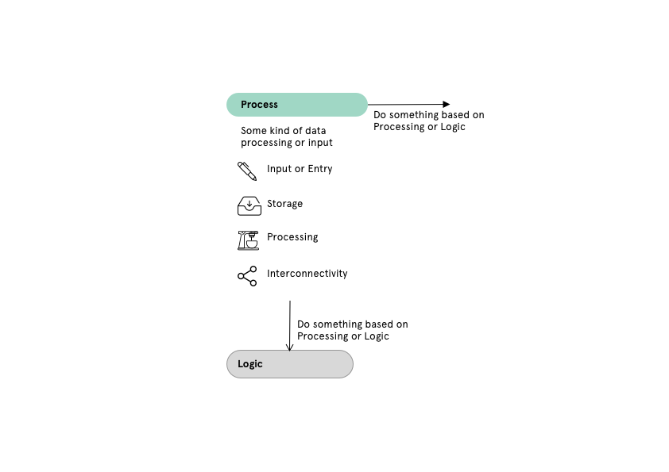

This is a continuation of the previous post — [thinking through research automation](https://andrewlb.com/thinking-through-automation/) — which deals more with a framework on how to approach automation tasks. This time, we’re going to dig into a specific example: how to automate a recruiting process.

Let’s say I’m recruiting from an existing and engaged user base, and I want to leverage some of the relationships that my customer support colleagues have in order to increase the likelihood of response. Instead of engaging in a back and forth with customers, I can instead provide the customer support team with some tools that automate intake — meaning that I can focus on preparing the moderator guides and answering any questions that might come up.

To do that, I want to break down the different facets of that recruitment process into steps that might be automated.

It might look something like:

- **Contact**: A CS rep sends a potential participant a mostly form email requesting participation in a user study (including timing, expectation setting, and gratuity amount)
- **Screen**: The potential participant fills out a screener form
- **Schedule and Consent**: If that participant isn’t screened out, then send them a scheduling link and a consent form
- **Remind and Confirm**: If they schedule successfully, then remind then send them a reminder the day before the interview. Also remind them if the consent form hasn’t been filled.
- **Interview Followup**: If they complete the interview, send them a gratuity and a thank you email.

Each of these steps can be automated to a greater or lesser extent, but what actually constitutes a step?

A step might look something like this:

Basically a point where an input is enters (data, interaction), is processed, and is then moved to another step (exported in some way. That individual process might have different features to it as well:

If we were to break the above list down into a more linear process flow, we might end up with something like this:

This flow helps us interrogate a broader system, and figure out what individual steps in the overall task we might seek to automate. But we need the right tools to facilitate that automation/

## **The tools**

There’s many, many different tools out there that range in complexity to setting up small web services (maybe using a scheduler and python) to connecting automation functionality on our desktops (eg. OSX’s Automator or IOS’ Shortcuts), to orchestrating various web services to get the job done. For our purposes, we’re going to start at this “easy” side of web service orchestration to implement this example.

[**Airtable**](https://airtable.com/)

A simple relational spreadsheet tool, Airtable has a useful data structure for facilitating different human and automated “fusion” tasks.

By using its concept of filtered views, you can create different dashboards to react to and respond to data, as well as automate those views. In fact, [this newsletter](https://divergeweekly.com) is substantially automated through Airtable — combining data intake and specific views that give me a “todo list” of curation and creation that I can power through each week.

Additionally, one of the Airtable views is form input, giving us a simple survey tool that we can automate.

(If you want to give Airtable a try, [I would appreciate your using this referral link!](https://airtable.com/invite/r/7cLYgvsO))

[**Calendly**](https://calendly.com)

Calendly is a simple scheduling tool. I use it for my [office hours](https://calendly.com/alb/officehours) as well has research recruiting. It can be set up to send out reminders and combine with other systems. An example of this is that when you sign up for office hours, for example, I receive a new todo item in my Omnifocus todo list.

[**Knowsi**](https://knowsi.com)

Knowsi is a consent management platform for research that I created. To collect consent, you can include your project’s form link directly in the email, and the researcher will be notified when that form has been filled. While knowsi currently it doesn’t integrate with other platforms, but we’ll be adding Zapier and IFTTT integration this year.

[**Tremendous**](https://www.tremendous.com/)

A simple gratuity management platform. You can create projects and budgets, and then feed a list of names and emails in to dispense gratuities. It will normally send a gift card as well, so there is a greater degree of flexibility in terms of who can accept the gratuity.

So far, I just automate this by feeding a CSV of spreadsheets and names into the tool at the conclusion of the study.

[**Zapier**](https://zapier.com)

Zapier is a glue between different tools. It’s an easy way to, for example, connect an RSS feed to Airtable, or automatically check that data exists and update a list, or delay receiving a notification until you’re ready for it. Zapier makes a lot possible that would otherwise require complicated and custom integrations.

## **Bringing it together**

Looking at each of these tools and the role they play in input, storage, processing, and connecting, we can start to create a picture of an orchestrated and automated flow.

### **Contact**

This is a situation that we can’t really automate because it requires a degree of human connection and problem solving. But we can create information that helps start the process.

Generally, you’d want to create a description of the study, how long the interview will take, timing, gratuity, etc. And then a link to the screener. [I have a good primer on writing these here.](https://andrewlb.com/the-anatomy-of-a-research-recruitment-email/)

For our purposes, we’d list our potential participants in Zapier first, and then automate the introduction email either through Zapier or Airtable. If there’s no response, we’ll generally want to automatically remove them as well using a scheduled task from either of those tools.

### **Screen**

When creating the screener, this can be done easily in airtable. Here, I would create an intake spreadsheet with a form field, and then create two views: a “form” view and an additional grid view that has a filter. Edit the form in the visual editor to fit what you like, and then fill it out.

In the second grid view, add a filter (like above) that will only show those respondents that fit the criteria you’re looking for.

From here, we want to create a new spreadsheet which will be filled in as our screened and ready participants filter in. We do this by creating an empty table, then reflecting the data that we want in that new table through an automation. It’ll look something like this.

Finally, from where, we can set up a new email to send out when records are “Created” in this participant table. This allows us to divide the records between consenting participants in the study, and our list of potential participants.

### **Schedule**

Scheduling can be both incredibly easy and incredibly hard. I’d suggest using an automated scheduler like Calendly whenever possible — but provide an option to reach out with different times if none of the Calendly times work.

You can then integrate Calendly with Airtable through Zapier, and update the participant records directly with the time and place of the interview, and a flag saying they’ve moved onto the next step.

### **Consent**

Consent forms, like scheduling, should be automated wherever possible using tools like [Knowsi](https://knowsi.com) and Zapier. Privacy regimes like the GDPR in the EU and PIPEDA in Canada mandate progressive informed consent practices.

This step can be pretty simple — just send the consent form via the initial email or when the participant has completed scheduling, and the researcher will get a notification on when the participant has signed the form.

### **Remind**

Content-specific reminders can be sent out to participants who have stalled anywhere in the process.

In zapier, you can set up zaps to do multiple checks on things — though I personally prefer to set up unique views in Airtable so that I can both visualize and automate that reminder process.

One example might be passing a screener but failing to schedule. Zapier and Airtable can be used to send a reminder once or twice before removing that person from the list of screened participants.

### **Followup**

Finally, upon completion of the study, the gratuity can be (mostly) automated as well by creating an automated export of participants and their emails for upload into a gratuity management platform like Tremendous.

Tremendous doesn’t have great automation tools, but you can bulk upload a CSV to their platform. So you can set an automation up to send you a weekly CSV of participants who have completed the study, and simply drop that CSV into the Tremendous platform. This is still a little bit of a manual process, but it turns what might be a half hour or hours worth of work into a three minute task.

## **Many Small Experiments**

Ultimately, working with these tools takes time — both in learning how to use the tools in question and in setting up the automation. While I’ve used a couple of examples here that I’m familiar with, I’d encourage you to set these up with whatever format you feel most comfortable.

Generally though, get started with what you know, and try to do small but structured automation experiments to build up to a larger automation workflow. **Automate one step first**, and then look before and after that step to see what you might do next.

In the end, Automation frees up time and energy better research and can turn the frustrating time-sinks into interesting problems to solve

Also, Automation — when it fails — can reveal the real points of complexity and value in our process that can become things we double down on.

So. This is a concrete example of something that you can automate and how you might go about doing it. Last week we looked at [some tools or ways of thinking about automation as a concept](https://andrewlb.com/thinking-through-automation/). Next, we'll take a look at judging what should and shouldn't be automated.
