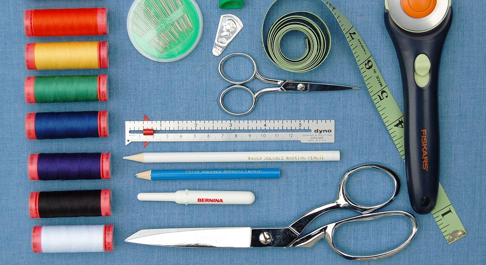
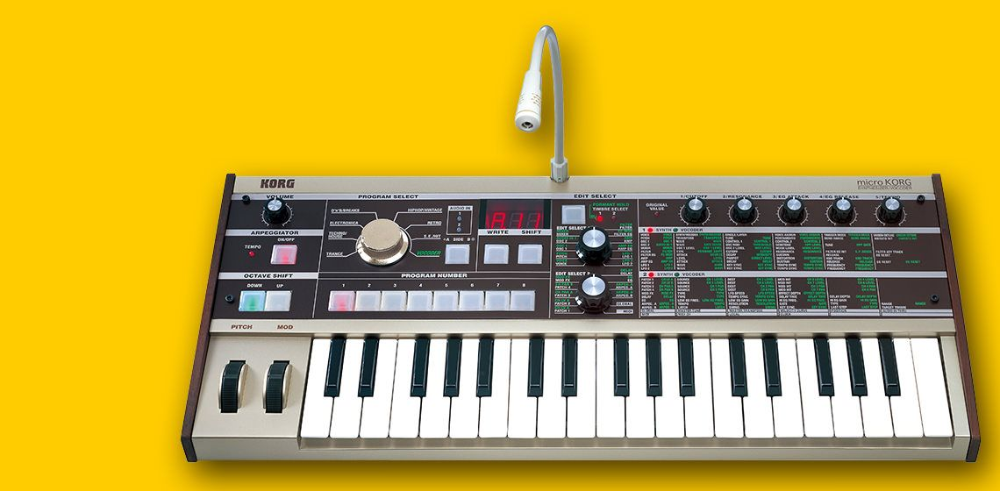
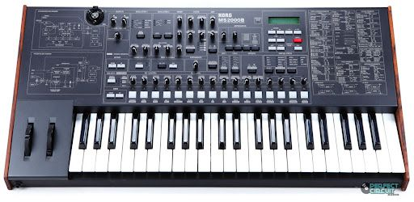

I am often “getting started.” Part of the theory of Diverge, to be honest, is being in that frequent state of beginning something new as past explorations manifest in new curiosity. Usually, these things end up being related. For much of this year, I’ve gone back and forth in 3D printing, modelling, and some rudimentary game development. That’s included a few (maybe helpful) diversions, like getting a bit too interested in flight simulators.

In each of these things there’s the necessity of having the basic things in place to get started, and transition from curious to amateur. I’m writing a bit about the nature of being amateur next week, but that space before being amateur — the state of becoming amateur — is something that I think is somewhat unnecessarily fraught thanks to the nature of the internet and its dominant business model.

Most hobbies and skills require some kind of infrastructure. It might be a book, it might be paints, it might be a machine, it might just be space. A fundamental part of navigating any new hobby then becomes navigating the infrastructure that makes that hobby possible. Take sewing. In theory, you can sew with a needle and thread. Some artisans even make a point of primarily working in that mode ([Mutsu is an example of that](https://www.youtube.com/c/MUTSUBYPROSPECTIVEFLOW)), but really you need a sewing machine to make a diverse array of things. But then which sewing machine? An industrial Juki can do a lot more than a home sewing machine. A [Sailrite walking foot machine](https://www.quiltersreview.com/sailrite-lsz-1/) (like what I have) works great for thick materials and allows me to make bags and accessories, but then working with thinner or stretchier materials becomes a hassle. Then you start getting into overlocking, coverstitches, etc. etc. etc. — it spirals quickly.

When you’re first learning about something, there’s a fairly dangerous period between your desire to get enmeshed in the thing and acquiring enough knowledge to understand how different tools act together. During this period, you might be tempted to get cheaper equipment or, worse yet, find a getting started kit.

Never, ever buy a getting started kit.

Or, maybe reframed, never ever buy into the getting started kit.

Getting started kits are everywhere, and have an obvious value proposition: to the individual seeking to acquire new knowledge and skill, all the things one needs to get started are arrayed before you for some middling price. A fashion designer getting started kit might include a cheap sewing machine, pattern paper, measuring tape, pins, bobbins, etc. An electronic music starter pack (which would result in pain and horror) might include a Microkorg, an audio interface, Ableton lite, and some shutter shades. Neither of these kits really get you started.

The getting started kit is a commoditization of the journey towards having skill around a practice. It provides you with the artefacts of that practice, but not the points of reference around which those artefacts take on meaning and contribute to the practice itself. Take the electronic music example: the microkorg is objectively an awesome tool for getting started in electronic music. It’s also awful for it, depending on your need.

Equipped with a vocoder, a mini sequencer/arpeggiator, 37 mini keys that are fiddly af, and a grid-based modulation section, it’s a really handy mini tool for performance and a fun tool for exploration early on. You also very, very quickly can get frustrated with it, and outgrow it — or at least on the surface.

The Microkorg’s synthesis engine is borrowed from the Korg MS2000, and they basically have the same overall capacity for audio synthesis. Except, ya know, the MS2000 is huge.

If I could repeat my synthesizer journey, I probably would have bought the MS2000 first and the Microkorg second. But in the language of getting started, the MS2000 is framed as being inaccessible, whereas the microkorg is more easily set as something commodified.

Part of my journey with synthesizers and music was getting utterly obsessed with the sound design of it. The microkorg is a great tool for performance and play — it’s small, easy, and approachable. The MS2000 has a bajillion knobs and settings and is seen as unapproachable as a result. Yet the transparency and access to those settings unlock a whole range of new possibilities with the tool.

Getting Started is a journey, not a package. Getting started in sewing for me was learning to make bags and backpacks, and then accidentally getting interested in garment making (which I’m terrible at). Getting started in synthesizers and music for me was being drawn in by bands I liked (using synths), and then falling down the Max/MSP and DSP rabbit hole. The few shows that I had the opportunity to play were done with monome, Ableton, and home-brewed VJ or audio software. What getting started pack would contain that?

The problem with the commodification of the Getting Started pack is that it locks you into a popularized and predictable model for getting into a hobby or domain — and maybe not one that reflects your needs as a creator. Had I grabbed the “getting started kit” for sewing, I never would have been able to make the cordura backpack that my wife often uses for travel, or the quilted magnetic wrap scarf I made for a friend. Picking my own machine and taking the time to orient the tools to my interests paid off in capability and low frustration. While it HAS proven frustrating from the garment making front, it’s also reframed how I think about making those garments: reinforcing stitches, thinking in terms of stress points, leveraging barracking, etc. My vision of garment making comes from bag making.

Choosing your own adventure when it comes to your own, personalized Getting Started arsenal makes for the interesting set of constraints that shapes your own experience. Of course, you won’t get everything right the first time. And you definitely shouldn’t get the “best” of everything as described by wirecutter and YouTubers. But establishing your own personal constraints early on — and codifying those constraints in the tools that you choose to get started with — becomes the earliest seed of originality in what might become an incredibly fruitful hobby or path to skill development.

All of this said, sometimes a getting started kit is totally okay. Arduino and Adafruit make really good getting started kits. [Take this one by Adafruit for building your own computer with a raspberry pi.](https://www.adafruit.com/product/4796) These kits come with everything you need to build skill in a hobby and are “consumed” in the process of acquiring knowledge. Usually, a getting started kit consists of core tools you’ll be using over an extended period of time, and consequently, your constraints are dictated by those tools. But in these cases, the kit gets you started on a path to knowledge, where you end up being better equipped to make decisions on your next project based on that knowledge.

Just to wrap this up and give a bit of a TL;DR: we are shaped by our introduction to skills in rather nefarious ways. The getting started kit is the worst way to get into something because it takes us down a path of likely mediocrity, and doesn’t encourage us to pick up the tools that fit our skills and interests as we discover what those skills and interests are. They construct an artificial set of constraints around us that maybe don’t reflect the intrinsic qualities that got us interested in this thing in the first place.

Instead, it’s perhaps better to learn through doing small and easily discarded projects that don’t lock us into one tool path. We’ll accrue tools and knowledge along the way, and those tools will better reflect our interests in the thing itself.
