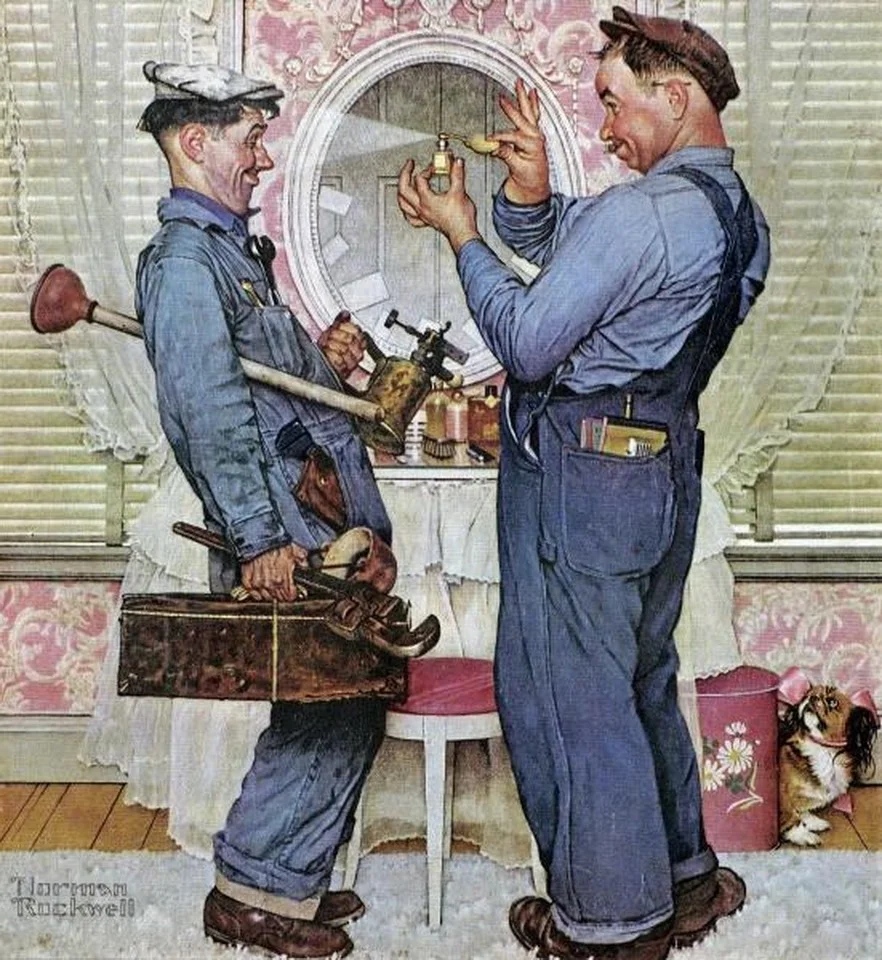

We’re amateurs continuously throughout our lives. For some skills — vital but sporadic skills — we remain that way. And that’s totally fine. Amateurism, over time, is its own skill to develop — and we should endeavour to leave amateur amateurism behind.

I get a personal thrill out of amateurism. It’s something I need to hold in check in favour of getting better at the things that I’ve already invested in, to be honest. For someone who is discovery-oriented (i.e. a person who gets massive dopamine hits from protracted novelty, so not necessarily a good thing), amateurism is an idealized state where the plateaus of a skill are still hidden by the slope of a new skill’s introduction. There’s a compelling challenge ahead, no particular end in sight (because it’s hidden), and it’s just on you to start climbing. Any mountaineer will tell you that this is the perspective of one of those frost-bitten Everest corpses. A search and rescue volunteer will shoot you first to save themselves time.

Amateurism is its own skill that comes with experience, and it's an experience we all have. We’ve all been new to things, and even the most proficient practitioners and savant-like wielders of a skill started with ham fists and missed notes. Usually, when we’re young, amateurism is easier — some combination of excessive time to learn (both structured and unstructured), fluidity of interests and influence, and a more plastic sense of self (both in the more abstract sense of one's identity, and formation of neural connections). As we get older, it’s less so — for a variety of reasons both internal and external. But, when we’re older it’s easier to be a good amateur.

To take a moment to actually describe and define amateurism, we need to define being amateur IN something. I tend to think job and professional skills are a bit different here, so let’s focus on things that are hobbies. I tend to think of a hobby as a communally defined collection mutually reinforcing hard and soft skills that facilitate the creation or modification of something. This covers the range from triathlon to miniature painting to cinematography. Given then, amateurism is the experience of acquiring those skills and gradually shifting from mimicry to ad-hoc application, to true creative application of a given hobby.

This is a bit of an oversimplification, of course. If you look at coding as an example (which can definitely be a hobby), coding skill starts as something specialized in one language around a specific project, then transitions into being multilingual by necessity as the core concepts are internalized, and then further transitions into a structural awareness around how to make something happen. Somewhere in there, one transitions from having the hobby of coding to being a “coder” or a developer, or what have you. And then — just as you start to transition from amateurism into skill — you hit the protracted nightmare of imposter syndrome that comes with navigating skilled communities as a peer. But that’s something different — let’s focus on the first few plateaus of amateurism.

Unfortunately, being a bad amateur is quite easy and can become a hazard to themselves and others. The novice 3D printer hobbyist likely inhales no small quantity of plastic particles or resin fumes, the novice triathlete strains tendons and stresses their immune system unnecessarily, the novice mountaineer damages climbing routes and annoys SAR volunteers. Thankfully, because hobbies tend to be communally (and historically) defined, these early hazards are often pretty well identified by the time most of us follow in their footsteps. The harmful vapours from 3D printing are well known from those involved in plastics professionally, not to mention decades' worth of hobbyists working in resin and plastic for model trains, theatre sets, miniature wargaming, etc. My friend Paul (a mountaineer and sailor in his 70s) put it once — “you avoid the small risks to take the big risks, because the big risks are always more fun.”

Where amateurism becomes a bit problematic is twofold: where one's amateurism compounds risk for others; and where unskilled amateurism serves to erode the communal side of the hobby. 3D printing presents another effective example. If one is learning in a maker space, it’s very easy for an amateur hobbyist to spoil a communal resource simply for lack of experience. Damaging a printer bed, improper calibration, damage to a nozzle, FEP membrane, or UV screen, spoiling a pot of resin, improperly storing filament, etc. These are troubleshooting steps which are non-obvious to the neophyte, but critical to the maintenance of the communal resource. For the amateur climber, improperly set up anchors, gear left behind because of poor placement and insufficient skill to retrieve, and even damage to the rock face through the use of pitons or other kinds of hard gear can at the least diminish the experience for others, and at worst put others’ lives in danger.

Thankfully many (if not most) of these safety concerns can be alleviated through mentorship and “help” from the community surrounding the hobby. But as many of us amateurs have encountered, goodwill towards new initiates into a hobby can be pretty thin at times. Gatekeeping is a pernicious quality in most hobbies for a host of reasons (some understandable, many not). So if we’re getting into a new hobby independently (i.e. not assisted by a mentor or friend), how do we navigate this?

This is where being a good amateur really comes into play. I tend to believe that good amateurism is mostly a pretty simple heuristic: reflective confidence, project orientation, appreciation for history, community participation, mentor empathy, and managing up.

**Reflective Confidence** is the main trick for older amateurs. When you have a lot of experience and identity wrapped up in other hobbies or expertise, it’s hard to start over in something new. Worse yet, getting back into a student mindset while still being motivated by one's past successes can easily lead to burnout as one's expectations of self exceed what’s realistic for new skill acquisition, and mentors (either long term or transactional) become frustrated in turn. Instead, the trick here lies in continual reassessment of skill or self-development through self- and peer-assessment. Many hobbyist communities will have Work-In-Progress or “Get Feedback” forums in place for exactly this reason. But what becomes the source of that feedback?

The answer is **Project Orientation**, which gives you two things: artifacts to present for feedback, and repeatable outcomes that can be returned to time-and-time again while developing a skill. In my last post on [avoiding kits](https://andrewlb.com/avoiding-kits/), I mentioned that consumable kits (like an Arduino Starter Kit) are highly preferable to tool-based starter kits, which saddle the amateur with a preconceived toolkit for entry into a hobby. This is because consumable kits are often oriented around a single project which introduces the user to expertise and provides a specific experience outcome, whereas toolkits are simply normative reflections on what’s required to enter into a hobby. By engaging in project-based learning, we get a few things: a point of being done, a discrete set of tasks that can be divided up (often with assistance from a mentor), the ability to “right size” the task, an artifact that can be used for feedback and comparison to later progress, and finally, a way to “plan” one's progression towards a more abstract and sophisticated goal.

**Appreciation for History** is an under-rated one, but has personally served me well. When I got into building synthesizers and installation art, learning about artists like [Nam June Paik](https://www.tate.org.uk/whats-on/tate-modern/exhibition/nam-june-paik), Delia Derbyshire, and [Wendy Carlos](https://en.wikipedia.org/wiki/Wendy_Carlos), and tool makers like [Miller Puckette](https://en.wikipedia.org/wiki/Miller_Puckette) provided a huge amount of context for the hobby I was entering into, and also provided a point of reference for mentors to understand where I was coming from. Many hobbies are “trendy”, and that’s fine. Getting into DJing in the early 2000s, or pottery in 2018, or whatever, is 100% awesome. You’re learning something new, you’re probably financially supporting existing hobbyists and artists, and you’re introducing others to a hobby through your own endeavours. But each of these endeavours has its own deep history, and so learning about Sugar Hill Records as a neophyte DJ, or exploring the work of local ceramicists (there’s a different tradition everywhere) will act as a primer against which the hobby’s skills and community will better attach.

**Community Participation **should be approached with enthusiasm and caution. Frequently, particularly adept members of a given community serve as marketing for a particular hobby and often make some or all of their livelihood from it. Crossfit and running clubs are a good example of this; Instagram and YouTube craft-folk drive of this. But the gap between those folk and the neophyte is massive, and so how is an amateur to approach getting from A to B? Communities often have FAQs and “getting started” content in place to help saturate the new hobbyist with information, questions, and ideas about where to get started. But beyond this, participation in a hobby community means explicitly participating in the hobby. Sharing one's projects, asking for (and constructively receiving) feedback, and helping to support peers who are also just entering into a community all help build the social capital that in turn builds mentorship networks for your own development.

**Mentor Empathy** means appreciating your mentors as the multifaceted and growing individuals that they are. Often, entering into a new hobby or skill places oneself in an asymmetric relationship to others, from whom you hope to learn. This often sets the relationship as very one-sided and extractive of the mentor. This is rarely intentional, but it’s not always obvious to the mentee how the relationship can be of value and growth to the mentor. A way of addressing this is simply thinking about (and empathizing with) how the mentor grows with the mentee in their own practice, asking how the mentee might contribute, or support the mentor in their own way. The best mentorship relationships are a dialogue

**Managing Up** is the last trick to good amateurism. Taking on a new hobby and the role of amateur is always situating oneself as the junior, but being junior is not a role devoid of power. You are the one with the most agency in how you progress in your new hobby and can shape the way that journey unfolds. By framing things as projects and managing your relationships with the community and your mentors, you’ll have the agency to shape how support manifests for your development through the slopes of amateurism and into competency. Managing up, in this case, means acting to empower the community and your mentors in supporting you (and others) in development.

Hopefully the above is — if not helpful — at least prompts some reflection on one's own approach to amateurism. Personally, I think it’s a wonderful thing. Learning new skills is (at least for me) intrinsically enjoyable, and the bonus is that you end up building a library of skill-based metaphors with which to approach the many unknowns encountered in life. I’d love to hear any additions (or subtractions) to the above heuristic, and I’d be happy to add them to the list with credit. Just reply direct to the newsletter and we’ll chat!
