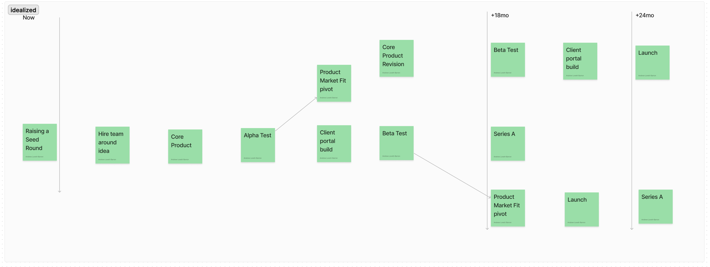
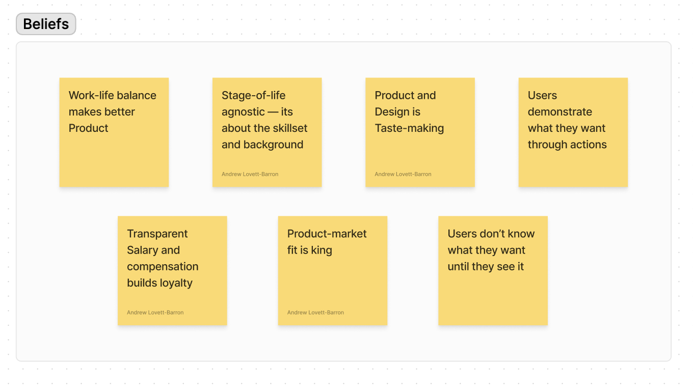
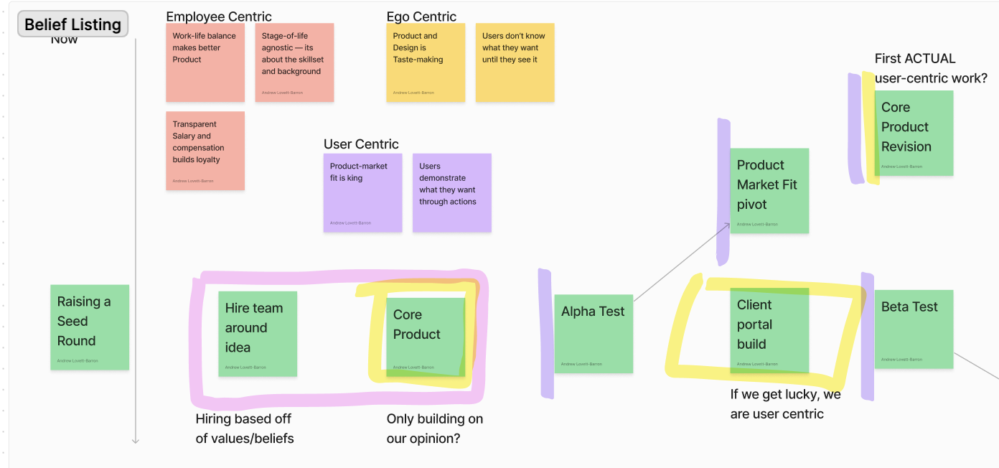
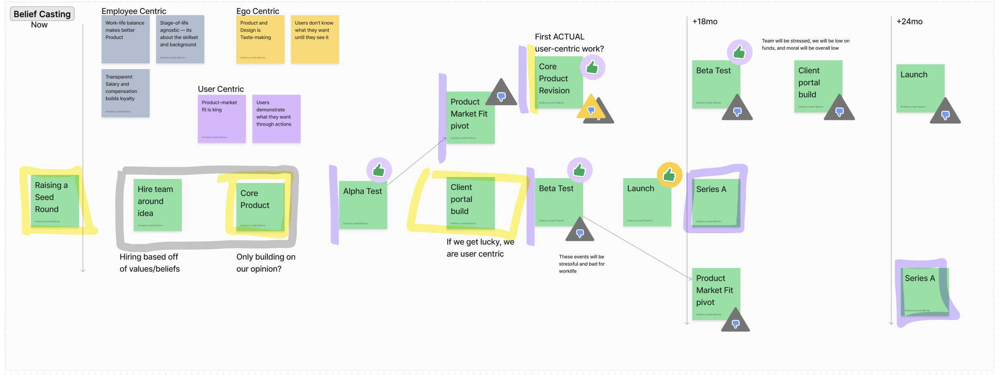
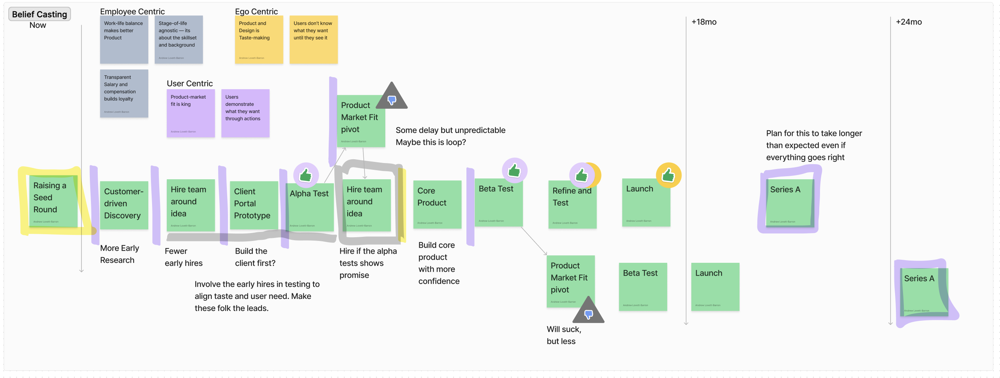

  

## TL;DR
A quick caveat on this post. This is a "thinking document" (i.e. pretty long) for me as I've been working on a workshop tool, Belief-Casting. You can skip the long-winded thinking process by jumping ahead to the "Values vs. Ego. vs. Reality" section, which has some illustrated steps. If you try this planning technique (or need some help with it), [please let me know!](mailto:alb@andrewlb.com)

-
Figuring out how to do something new is hard.

Our own mechanisms to sense the world are rarely consistent: physical, neurological, and experiential differences make themselves known here. Our own sensors are what they are: that physical, neurological, or experiential context that we bring to the table. We can augment this (doctrinal decision making a-la OODA loop; chemical augmentation like adderall, fitness, education in technique and philosophy) but we are our own bricolage.

We have to navigate the realities of structural circumstances (eg. markets), individual circumstances (eg. capital and network), temporal circumstances (eg. interest rates and trends), etc. We have our own internal worlds to navigate: our influences, past ideas, traumas and triumphs. These things construct our beliefs and narratives over time — accumulating and ossifying.

And then the environment and its climates step in to affect us. It shapes not just how we navigate the terrain, but also how we perceive it.

A lot can go on in our little societal troposphere.

- **Economic Systems**: Interest rates are skyrocketing and all the previous patterns simply don't work anymore. The tools you used in the past to see "value" just don't make sense in this environment. A key resource you depended on (cheap debt) is no longer available.

- **Market Dynamic**: Everyone is being laid off, and the supply/demand environment your skillset has existed within simply doesn't apply anymore. Regardless of your own experience, the "map" you used is no longer credible.

- **Global Social Tsunami**: You are constantly bombarded with credible threat and opportunity signals, even though those signals don't apply to you locality or timeline. Your sensory model for stress response is going haywire. Social media carries a lot of water here.

We make a decision based off of what we believe (or want to believe) we sense in front of us — knowing that we are percieving the world through our own sensory limits, our contextual limits, and the heat haze the world spits up.

## The Belief before the Storm

Lacking sensory data, narratives and beliefs become our navigation tools.

Narratives give a structure and a degree of continuity to the experiences we are trying to parse — as well as painting experiences with the nuance of values, social constructs, risk, etc. Narcissus' grim curse puts the negative frame around self obsession; as well as Penelope's cleverness and patience share the values of that culture alongside construct of a gendered heroism.

Beliefs are the interpretation and action that we bring to experience and anticipation. **Systemic beliefs** are macro-effectors on the way that we navigate our world. We might hold a systemic value-driven belief like "gambling is morally wrong and corrupting" or "design thinking results in better product/service outcomes." Systemic beliefs carry across the subject's experiences and world view — such that they usually must be accounted for in your interactions with them.

**Localized beliefs** are trigger-specific beliefs that are basically weird modifiers on our perception: "I got sick when I ate hotpot therefore hotpot is the devil", or "I was weird that one time so Joan thinks I'm weird", or "I was successful in my last project, and so future projects have to create outcomes that LOOK like that project" The trigger for a localized belief can be people, places, experiences, etc. But they tend to be a bit unexpected: an otherwise critical leader with a specific phobia, ritual, or bias.

**Narratives** structure these systemic and localized beliefs into a frame that is legible (though not always reasonable). A common designer trope is the young designer holding a semi-heroic narrative around their role in a process: they structurally believe in individual exceptionalism reinforced through macro-narratives like 21st century software entrepreneurialism and nationalist rhetoric. This systemic belief is reinforced and contextualized by their localized beliefs, such as experiences carrying a group project at school ("I always get the job done, with or without others"), filtered work experiences ("I'm chosen over others for this type of work"), and idiosyncratic expertise ("My experience as a printmaker means I understand process in a unique way"). This bundling of systemic and localized beliefs constructs a specific narrative which serve to obfuscate root cause and rationale — making it all incredibly difficult to untangle.

Because of this tangle, personal narratives and beliefs are excruciating difficult to change. But it's not impossible. The start of of the process is to make internal narratives and beliefs legible. This becomes the baseline for introspecting our interpretation of the environment, and it empowers us to share our newly legible narratives with others.

## Belief Casting

Let's make this legibility useful.

Backcasting (a tool by John Robinson) is my go-to planning tool for making sense of work that needs to exist in the future. You start with where you're currently at, project forward to where you want to be (perhaps with a few variations of where you want to be), and work backwards from that point. What needs to be true? Who needs to be involved? What needs to exist or be eliminated? Backcasting creates todo list to get to the future, with opportunities to "diverge" along unknown continuums.

It's an effective tool because of three qualities: mapping actions across the dimension of time; allowing for forks in the timeline; and that you start from the outcomes.

Belief-casting takes the same core tenant of backcasting, but adds the dimensions of belief and narrative to action and logistics. It directly acknowledge our limits in sensory capacity; our experience-born beliefs; and the narrative entanglements these entail.

This can be used in a simple way to interrogate our known biases around a scenario: If I believe that that serverless is the best approach for a project and I KNOW that I believe this, that belief becomes a pivot point. Then, working backwards from project completion, one lane becomes backcasting along the serverless dimension, another along more traditional infrastructure.

**Belief-casting becomes a lot more interesting if you apply it to your overriding narratives.**  Let's say I adhere to an employee-centric narrative around wellbeing and work-life balance (eg. working hours, location, paternity leave, etc). Does the backcast-ed plan I created align with that narrative? What else must be true for my narrative and my plan to align? What risks are incurred to the plan by my internal narrative?

Let's imagine a startup building in the post-covid world: Its founders share a (laudable) **narrative of worker-centric team culture**, but also buy into the the **systemic beliefs of the venture capital ecosystem** (high pre-revenue capex; intense effort and risk around product-market-fit pivots; high overall risk to both product and employee). These two beliefs aren't exclusive, but there are situations where they come into conflict. For example: what happens when this company encounters the unexpected? What happens when productivity lags, or directions are ambiguous? What happens when a team accustom to being present in the evening with their family hits a series of pre-raise pivot or another unexpected crunch?

Belief-casting generates a structure to interrogate those questions directly by overlaying these conflicts directly overtop of the plan. This creates artefacts that invite iteration as time and work roll onwards.

## Values vs. Ego vs. Reality

Let's do a dead simple example. I'm going to skip a LOT of steps, so if you have any questions [just send me a note](mailto:alb@andrewlb.com) and I'll update this post!

**First step!** The easiest way to run a belief casting activity is to run a backcasting activity first. I've shared some references at the end of this post, so you can view that there. 

Start with the dates and work backwards from there. Map out the current state (now), and then the state you're trying to get to (Series A in this case). You'll get usually get a pretty idealized path like this.

Make sure to take that and break it off into some potential "risk" pathways. **There's never one path.** What are some alternative paths that might occur? In this scenario we are looking at time for an outcome we know, but this might be an opportunity to look at alternative preferable outcomes. In this example, we just have some alternative outcomes from testing that results in a pushed timeline.

  

  

With the basic project skeleton in place, take a step back and try to interrogate some of the core beliefs or values you have about your startup. The best case scenario here is that founders have worked with a coach or therapist, and have a kind of legibility to their own belief system. Worst case, use the startup as a foil for which to embed beliefs and treat this like a brand-building or value-identifying activity. [I'm posting examples of these kinds of activities on instagram, and will link to specifics when they're up.](https://instagram.com/megafauna.cph)

You'll want to sort and categorize these beliefs somehow. This should give you a handful of categories that you can start applying to "points" along your backcast journey. It should be rough, critical, and argumentative at this stage. This is where things will get a bit messy as you highlight, markup, and add notes to the document.

My personal favourite approach is it have postits on a whiteboard, so information can be moved, but also marked up.

  

As you go through this process, you'll start to surface some pretty clear tradeoffs between these beliefs. For our intrepid founders, we're starting to see that the employee-centric and ego-centric values suffer as soon as they come across the user-centric events.

We can see from this example that while the plan and pivot points themselves are logical relative to the structural dogma of this type business, the results are counter to their professed beliefs (employee and ) EVEN when they get lucky.

**In the middle "ideal" scenario**, founder taste-making (ego-centrism) raises an initial round, and magically aligns with user needs (user-centrism). The team is stressed leading into launch, but overall the outcome is good with customer demand leading the next round.

**In the more likely scenario (top),** founder taste-making raises a round and defines the core product, but it doesn't meet the customer need. Testing becomes delayed by the "taste making" belief — and by the time the product meets the user a substantial portion of the company's runway has been utilized. What results is a user-centric win for the product — purchased with a sacrifice of employee-centric and ego-centric initiatives.

This example shows a set of beliefs being front-loaded into the company's inception which don't map onto the real needs of the business. If you hire based on one set of beliefs, but you structurally REQUIRE a different set of beliefs to get to the outcome you describe, then these actibities will come into natural conflict.

  

## Finding Shelter

This kind of belief casting map presents a dilemma. If we're risking this much in venturing out, why do so at all? 

Venturing out also means looking ahead: keeping an eye open for conflict and hypothesizing about opportunity. We can get further along this path by applying a layer of belief-based interrogation. **It brings the subjectivity of our experience into the planning process, and gives us some basis for calculating error.**

Here's one alternative that might emerge from this interrogation of the previous The series A raise is based on some level of customer demand and PMF, so we orient the early activities around that more relevant belief.

  

**We must be able to MIX and ALIGN beliefs to get us to better outcomes.** Early user-centric activities can be mixed with employee-centric activities and ego-centric activities. Instead of aggressively hiring a full team, hire a handful of early employees and involve all of them in customer research while assessing them as future management. This plurality of experience has the opportunity to augment the founders' strongly held opinions (ego-centrism), de-risks future hiring processes, and it gives the early employees clarity around their advancement in the company (employee-centrism).

This redefined map isn't the culmination of this activity however: it will require a lot more interrogation and a return to more detailed back-casting and scenario planning — especially because we default to an idealized single scenario after doing the "refinement." Functionally, we've **converged on a solution through a belief-driven filtering process, and the smart next step is to diverge again and run the new plan through a gauntlet.** 

As a reminder, the categories identified in this example (user-centrism, ego-centrism, employee-centrism) sound generic, but are specific to this example. **Running this kind of activity without doing the work to surface the beliefs that drive the starting plan will result in mush.**

But whatever needs to happen next, **with this approach we've explicitly integrated our beliefs and narratives into our planning activities.** When hard decisions come down the road, we'll be equipped to balance those decisions against the choice and circumstance that got us there. We can't control our environments, but when we do head out into inclement weather, we have agency over our attitudes and our preparedness. Belief-casting is a shortcut to both.

--
*Big thank you to [Justin Pickard](https://www.justinpickard.net) for the feedback,*

*I learned Backcasting when I was at Normative from Matthew Milan. [Here's one of his presentations on the topic](https://www.slideshare.net/mmilan/backcasting-101-final-public)*

One of the original backcasting essays by John Robinson is here: [Future under Glass](https://envr626nov2020.opened.ca/wp-content/uploads/sites/2185/2020/11/Futures-under-glass-A-recipe-for-people-who-hate-to-predict.pdf)