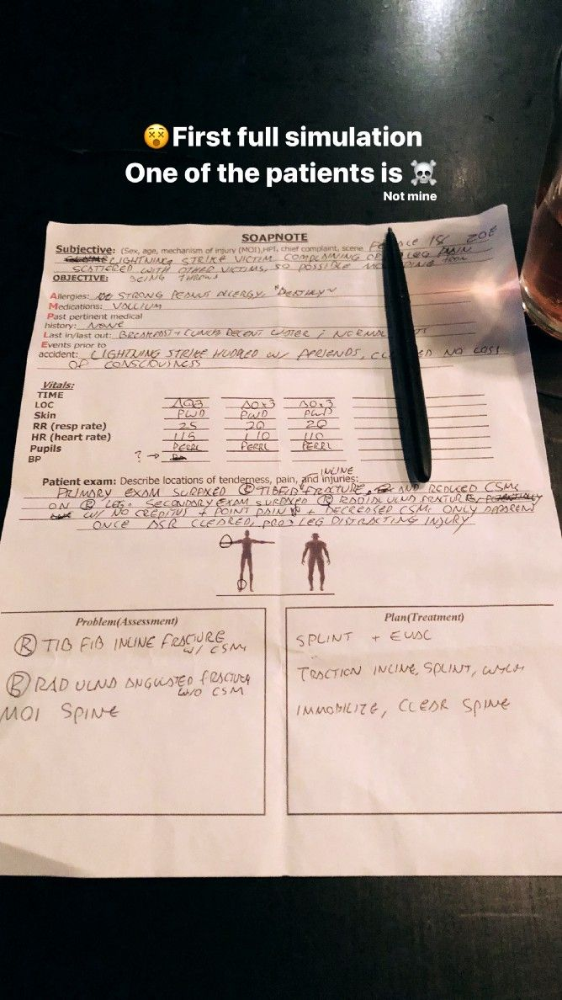

With some luck and a generous vacation policy at my work, I was finally able to do a Wilderness First Responder (WFR) course. WFR is certification and training aimed at those who might need to stabilize a patient and wait for definite care in a setting where evacuation might take twenty-four hours or longer: Folk doing backcountry adventures, distance cyclists, Search and Rescue (SAR) volunteers, outdoor adventure guides, etc. In circumstances where you are over an hour away from care, there are things that you can do as a WFR that other first responders can’t in an urban setting: pulling traction on an angulated fracture to restore circulation and splint the injury, stopping CPR after no response, and ”clearing” a suspected spinal injury to name a few.

I took the course for two reasons.

First, I’ve done a lot of distance cycling, bike camping, and some backpacking. But that fear over “what if” has stopped me from pushing myself beyond a few days in, or too far into back country. With this course, I hoped that I’d feel more confident in pushing myself to explore further.

Second, over the past few years I’ve had a lot of peripheral exposure to disaster management as a set of disciplines. I’ve found my interest steadily growing and the recent climate change exacerbated disasters in 2017 lent a sense of immediacy to that.

Through IDEO, I learned from [work my colleagues did with Team Rubicon](https://www.ideo.com/case-study/designing-a-global-plan-for-disaster-response); had contributed towards the open source development of [City72](http://toolkit.sf72.org/) disaster information hub; helped put together a proposal for a disaster management incident command system; and worked with Planned Parenthood medical staff as we [researched patient experience](https://www.ideo.com/case-study/planned-parenthoods-new-way-forward). Also, my direct boss ran a Search and Rescue team in his spare time (somehow). Since then, I worked at the Pentagon for the US Digital Service, which came with its own variety of experiences and opportunities, including learning from the experience of service members who had served as first responders in the past.

It’s a world that I’d like to be able to contribute more meaningfully to, and so this course, getting [ICS certifications](https://training.fema.gov/is/courseoverview.aspx?code=IS-100.b), and looking for a SAR team is going to be my next step towards developing knowledge in this space.

I had signed up for a session taught at Johns Hopkins University by SOLO Wilderness Medicine about 6mo before the actual course. The class filled quickly: mostly JHU undergrad students taking the certification in order to lead back country trips as guides for their outdoors club. There were two other older students like myself, both of whom were re-certifying their WFR.

The course totaled 80 hours, with a mix of theory and practical scenarios. We had two instructors: Charles Kirland and Samantha Willsey, who had expertise that were different but complementary. Charles had some insane experiences, from remote field medicine in Antarctica to being a street medic in Texas. Sam had worked in conservation and education around the US, and had a list of jaw dropping experiences from lightning strikes to SAR stream crossings. Combined, they had a tale (and often a photo) for almost everything taught in the course.

Over the 9 days, we were learning to recognize signs and symptoms, apply various structured assessment tools to investigate a victim’s ailment, and narrow in on potentials actions. We learned to assess the severity of an ailment as well, and ways to tackle threats to life and limb. What we learned in the classroom was quickly applied outside. One moment we’re learning about the locations of nerves and arteries in the leg, the next we’re pulling traction on and splinting another student’s leg with a simulated femur fracture. As a simulation victim, it often involved screaming, belligerence, and fake blood — our ability to understand and emulate symptoms being as much a component of the grading as understanding how to treat them. As the responders, we had to divide up tasks, watch each other’s backs, and look after our own well-being as much as we did the patient’s.

Reflecting at the end of the course, I was was most stuck on that question of confidence. The skills I learned don’t really make outdoor recreation safer. I still might slip and impale myself on a tree, or get zapped by lightning, or step on the wrong snake or scorpion, or wrap around a tree on my bike. In fact, I spent no small part of this course reflecting on some of the stupid things I’ve done outdoors, from ill-advised bike jumps, to getting lost without map or signal device on a trail, to near-misses while climbing.

Bad things might still happen, but the skills developed as a WFR serve to mitigate the long-term damage a patient might receive from a trauma (eg. loss of a limb from lost circulation or frostbite, a brain injury from hypothermia, or being moved incorrectly when a spinal injury is possible). It should also help you reduce the risk of worst case scenarios by recognizing and addressing warning signs early, having a plan for evacuation, and getting them (or me) to definitive care. Or, best case, knowing what MIGHT happen and just doing things differently.

To paraphrase my friend [Paul Bell](https://paulbelladventures.wordpress.com/) — you can take more interesting risks and ultimately have greater adventures if you cover the quotidian risks upfront. And I suspect that having some Benadryl and parachord in my pack (and a bunch of other things) with the knowledge of when and how to use them is a positive step towards that philosophy.

_This essay was originally published in [**Medium**](https://medium.com/@andrewlb/benadryl-and-parachord-2a0f74d592f5)._
