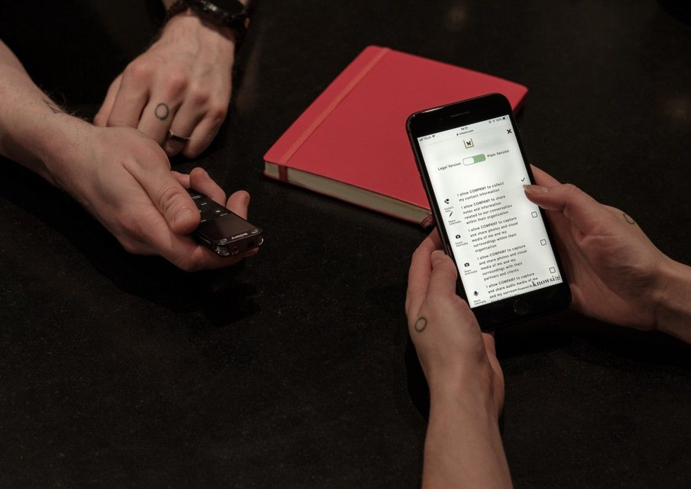

At the heart of great design research is note taking. Our job is to go into new environments, learn from and capture the experiences of others, and transform that knowledge into insight and action. Great notes and references serve as the bedrock of this process: making sure that you can represent your participant’s experiences accurately and not project your own on top.

Here are three fundamentals to keep in mind when starting a research session.

## **1) What is your role?**

What role do you play in this research session? Are you the primary researcher, asking the question and making the introductions? Or are you the note taker, stepping back a bit to capture, observe, and fill gaps?

Being up front about roles is vital for a healthy and smooth research session. Primaries need to be razor focused on asking good and open ended questions, on pursuing potentially fruitful branches in the conversation, and in developing a trust relationship with the research participant.

The note taker should step back and almost be in the background. A good note taker is taking verbatim notes, making sure all the paperwork is covered, photos are taken, and any recording equipment is functioning. Additionally, a good note taker should be keeping a list of questions that the primary missed, and filtering the conversation through their own experience that might differ from that of the primary.

You rarely want more than these two people per session, by the way.

## **2) Always record the session (if the participant consents)**

When setting up a consent forms, I always ask if we can record audio for transcription (i.e. internal) purposes. Why?

First, it helps you fill gaps. Sometimes information will be coming at you faster than you can record, and knowing that you have that fallback will help you relax and absorb the information without worrying about missing it. This is vital for asking the right follow up question.

Second, it helps you validate what you’ve heard. Sometimes, a participant will say something and indicate something different by lieu of their voice or body language. This isn’t always captured in the moment, and so returning to gut check that you heard what you heard is always a good thing, and can be grounds for reaching back out to the participant to make sure they meant what you think they meant.

Finally, it’s a backup if things go wrong. If you’ve ever been caught in the rain after an interview (like I was recently in Copenhagen), it’s re-assuring to know that even if your notes are illegible, that recording you made will preserve the data collected.

## **3) Take a Breath**

As a researcher, you are engaged in a complex dialogue with your research participant, even if they are doing most of the talking. That dialogue doesn’t end with words though. Sometimes a note taken at the wrong moment can put a participant on edge, or even undermine the trust you’ve built with them.

I learned this the hard way interviewing at-risk patients at a clinic in the American midwest. While taking notes, I rapidly transcribed what the participant was saying because it was a significant experience, without actually engaging with the substance and emotional tenor of what she was recounting. For her, I was disengaged with her story and disinterested in her experience, and instead purely focused on hoovering up as much information as possible. And so she shut down and the interview fizzled a bit from there as the trust was undermined.

Reflecting on this experience later, if I had put down my pen and really paid attention, that trust could have been maintained. I would likely have gotten more from the conversation, and I always could have gone back to my recording to transcribe the conversation later.

So every once in a while, take a breath, put down the pen, and really demonstrate your attention.

## **Bonus: Don’t Fumble The Admin**

Of course, when it comes to research, there’s some important administration. Before, I always found this to be a chore. [Which is is why I built Knowsi.](https://www.knowsi.com/)

Collecting the right consent from participants, scheduling, and organizing the media afterwards in a GDPR compliant and responsible way becomes easy. Plus, participants know you value their privacy because they get their own receipt of the consent form with the ability to reach out afterwards.

[Give Knowsi a try with a 1 week trial today](https://www.knowsi.com/join), and [sign up for the mailing list](https://www.knowsi.com/?mail=tth) for a discount code and more articles like this every few weeks.

_This article was originally published on [**Medium**](https://medium.com/knowsi/better-notes-for-design-research-1eace30b211e)._
