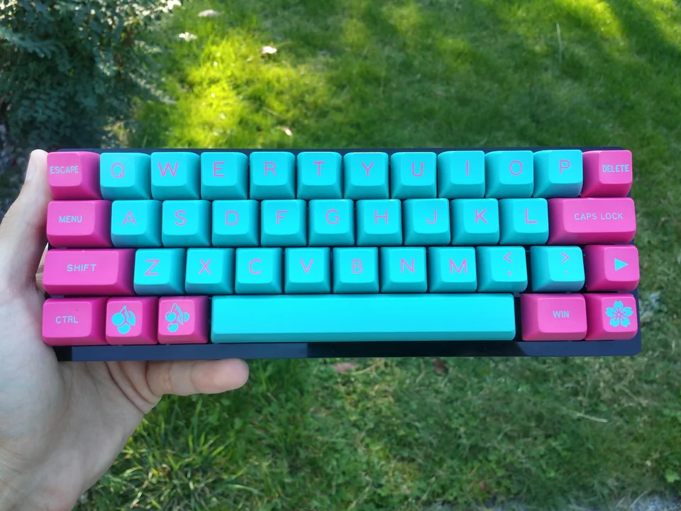

**\*Note**: I started this blog post 06/2023, and finished it 11/2023. A few things changed inbetween in terms of process, employment, etc. The final paragraph is the big addition.\*

Last year, I took an extended break from blog writing after submitting my masters thesis in March 2022. It was an intentional break to figure out a different focus, but not one I had intended to go on quite so long.

When I went silent in December of 2021, my intent was to restart the blog and newsletter with a focus on work spaces. That might still happen, but it isn't my focus right now. Currently, ~~I am running research for a startup called Keel, and got more than my fill of daily interviews about how people work as engineers and operations professionals. I'll be writing about that for Keel, but it isn't where my "hobby heart" is right now.~~

What I do want to write about is personal project work. There has been a few things I've been fiddling with: in electronics, in software, and to a lesser extent with music. I'll get to all that eventually.

## A New Type

Right now, I want to tell you about the absurdity of learning to type again.

In mid 2021, I was solidly down the rabbit hole of mechanical keyboards and shifting away from the staggered layouts most of us use. My reasons for this were two fold: I had back pain which had resolved mostly when I switched to a split keyboard, and I am really don't think through how disruptive subtle changes to a core tool's ergonomics can be. By the time I DID realize this (having switched to a column-based layout), it was already too late and I could barely use a staggered keyboard anymore. The rabbit hole's entrance firmly blocked by my own hubris, I naturally descended even further.

The custom keyboard world seems divided into a few types: those who are in it for a particular diy or be-netted aesthetic (streamers being a key cohort here). Often these won't have a noticeably different layout, but led lighting, resin or custom keycaps, and themed keys are central here. [image ref](https://www.reddit.com/r/MechanicalKeyboards/comments/740vrm/bubblegum_icecream/)

There are those who see an ergonomic rationale to switching away from staggered qwerty normality. Arguments around dvorak and colemak reign supreme here, as does distinguishing between certain types of layout like ortholinear (a grid of keys) vs columnar (column-based layouts that stagger vertically to match the ergonomics of one's hands). You will hear the term home row (where your fingers sit), movement from the homerow, and invariably hear about [Ergogen](https://docs.ergogen.xyz/), a tool to generate design files for your own totally custom keyboard PCB. [This is a very good essay that reflects this thinking.](https://zealot.hu/absolem/)

and then there are those of us with poor impulse control who just want to try something out, and again, find the rabbit hole blocked behind us.

This leads me to the keyboard I am writing this post on: a 34 key split board I build myself from a kit, called a Ferris Sweep using a layout I've grown to love called [Miryoku](https://github.com/manna-harbour/miryoku) laid out in colemak dh. Oh no.

## Damn it, Andrew

Okay. Yes. I fell down the rabbit hole. I also learned a few interesting things while I was down there, though I would certainly not recommend this for most. Let me share a few things I discovered.

### More with Less

As an interaction designer who works mostly with screens, discovering the power of chords and layers has been revelatory.

**Chords** are combinations of keys that invoke certain actions. The one you likely use most frequently is command-C and V to copy and paste, or Z to undo. But most programs have greater capacities that you can find in their documentation. For example, a research tool I have used frequently called Descript has a highlighting chord of command shift H, which I internalized while transcribing interviews.

Layers are the idea that you can shift your keyboard's state and change the use of certain keys. An example in Miryoku is the numpad layer. Hold down or double tap the layer key and the left half of your keyboard becomes a numberpad.

This feels pretty clunky in theory: why have memorize these different layers when you can have a dedicated numpad or numbers running above the alphabetic row. Except it isn't about memorization. When using layers, you really do just come to internalize them by muscle memory, to the point where after some initial failures and needing a reference like the image above, you just type. And you type faster with less movement. It also opens the door to adding more functionality as you internalize things. I've read about folk adding gaming layers or shortcut layers to accomplish automation tasks or use a particular program like final cut or ableton more effectively, but I digress.

**The point is that these concepts of chording and layering dramatically increase the potential for a single device with a limited interactive surface area.** The best device type that I can think of that mimics this is the Elektron style of electronic groove box. They have a relatively small screen and few interface elements, yet are lauded as one of the most 'instrument like' of all the electronic music tools. Being a user of the Octatrack myself, I personally believe this comes from Elektron's use of chords and layers as a conceptual frame for music making and performance.

Right now, using 34 keys I personally believe I am at the edge of reasonable when it comes to this principle. I, for example, don't have an escape button: but chord together my two buttons to create the escape key press. I also can't hold down backspace to delete words, and so had to learn to internalize character (backspace), word (command+backspace), and line (command+shift+backspace) deletion. This has ended up being a lot faster, but that wasn't immediately a great experience.

### Lock-in

Skill-based Tool lockin is nothing new. We've seen this in the design world where a lot of senior or director level designers were slow to take up Figma (myself included) because of all the time we had spent in other programs. The web dev world experienced the same thing with the rise of VS Code in the past years, with a few firm holdouts sticking with Sublime or IntelliJ depending on their focus.

Keyboards, mice, and our various peripherals have the same effect: we learn to use a particular thing early on and we don't end up questioning it as we move along a path towards whatever we are trying to do. This applies when we write software, edit a spreadsheet, write an essay.

This path dependence has ended up making designing peripherals for lock-in obvious. If you're designing a laptop and need to sell X units to justify the cost of development, then you're obviously going to go the way of a staggered qwerty layout.

Now, [this is starting to change](https://www.theregister.com/2021/07/06/ortholinear_keyboard_laptop/), but only because laptops are becoming a bit more modular on the periphery. Companies like Framework and MNT are doing some interesting things in this space, but imo we won't ever see an alternative keyboard for a mac laptop. Not without a broader cultural change around how we interact with computers.

This might come if mixed reality ever gets off the ground, but it will be competing with voice as an interaction paradigm for text input. Experiments around the wrist-based MR keyboard, with muscle movements being mapped on to a virtual interface localized around our wrists’ movement, for example, mean that the physicality of the interface maps on to our own. Ultimately having interfaces that match our ergonomic needs is better, and so the principles inherent in columnar based keyboards [(as well as other ergonomically oriented key configurations like this monstrosity](https://store.azeron.eu) or [this one](https://svalboard.com/)) are “better for us” even if we’ve fit our typing patterns to a mechanically-initiated, and now market driven norm.

### Skill Trees

Another piece that was interesting experience wise was the layers of skill required to actually use this thing successfully and fluidly. Like, being able to tap type on a tiny keyboard you made yourself is great, but how do you get there? Like in a video game, getting to the big move requires unlocking some other things first and making some decisions, and that skill tree metaphor maps well to this kind of custom keyboard.

The minimal layer is jumping from laptop keys to mechanical, because you can’t functionally diy a laptop keyboard (though someone is working on one for the framework laptop). Then when you’ve acclimated to that, reducing the number of keys you use into layers tends to take place. For me, getting the Planck board and using layers to access number keys was that bit transition. You might also try a split keyboard: which tends to shift your posture and require you to separate your visual model of the keyboard from the repetitive act of typing. That split route is its own tree. From there, you might explore details around mechanical keyboards: the sound, what kind of switch, etc. I didn’t really care that much about that to be honest, and skipped that whole step.

The biggest leap is going from qwerty to a different keyboard layout, which ends up unlocking different patterns of typing but also introduces a lot of noise.

## UPDATE: Blocking the Entrance to the Rabbit Hole

There's a lot to write about all this. Since writing this originally (while my blog lay somewhat fallow), I've actually jumped back to qwerty out of the sheer necessity of needing to type on a laptop. Also, working with different shortcuts for technical programs like Figma, Fusion, Plasticity, KiCad, etc. is absolutely impossible with a non traditional keyboard. It just presents as a massive pain and yet one more thing to learn. Ad

I HAVE discovered that I can shift between the keyboard types pretty quickly, and that this ability to shift ends up killing any of the pain that I had developed wrist/hand wise anyway. So there you go.

I love this ability to jump between these different modes though. I end up thinking a bit differently, and particularly with the the colemak dh 34 key setup which I've landed on, I can get into a bit of a flow with that writing that I really enjoy. It means that I have to go back and edit later, but there is something there. I am also now very accustom to the block level keyboard only text editing that the colemak format encourages, but I don't yet feel good using that on qwerty mode.

Hopefully this can be an interesting glimpse into a rabbit hole I encountered with my
