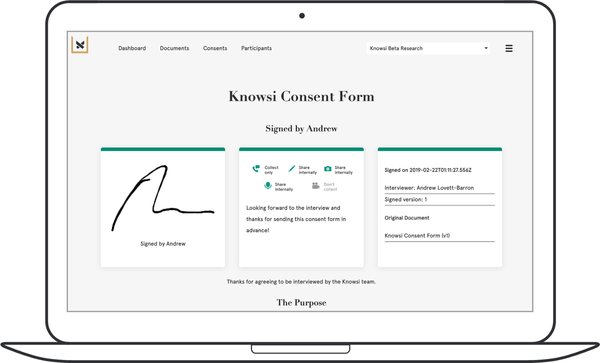

Like our bodies need oxygen, our businesses need a constant supply of knowledge and understanding to fuel our work. But accessing that knowledge isn’t always as intuitive as breathing.

Understanding the* why* of your research is the difference between wasted time (and budget), and absorbing previously untapped knowledge and opportunity. You want to be in the latter camp: taking a deep breath to fuel your next move. To do that, you need to be able to articulate your research objective and have some sense of what it is you want to uncover.

## **But Why?**

Great research starts with a question. An itch that needs to be scratched. Sometimes, this question actually comes from an assertion that something is the case, and we need to validate that assertion to really invest in it. Other times, it comes from an anxiety: that the knowledge we have is insufficient, and there is something over the horizon.

The nature of the knowledge sought dictates the nature of the research itself.

Let’s take the example of a hypothetical TODO App, **“Nudge Nudge TODO Calculator,”** to frame the problem.

Nudge Nudge has big growth opportunities:

1. Seeing if its existing solution might have some crossover in a different market **(diverging, exploring)**

2. adding to its existing TODO application for small teams **(converging, validating)**

These are two very different research questions.

## **Diverge**

If we’re stepping into the unknown, then we want to take a **GENERATIVE** research approach. For Nudge Nudge, if we were to ask “How do people structure their time at home?” we would be starting a broad exploration into areas that may or may not overlap with Nudge Nudge’s existing offering. And that is the point.

We don’t yet have a solution, but rather the idea that there might be an opportunity for our expertise in an adjacent space. A question like **‘How do people structure their time”** opens up the opportunity to stumble upon new knowledge.

For Nudge Nudge, we might interview an engineer who is juggling her responsibilities as a mom with her need to keep up to date in her field. We’d talk to a policy analyst, whose real passion lies in outdoor rock climbing, requiring considerable organization to get out to the rock frequently. Or we might chat with that junior account manager, who is 23, trying to impress at a new job, and just wants to figure out dating in a new city.

Each might discuss their own strategies for dealing with the complexity of their day-to-day. The engineer might have learned from her experience leading agile teams and use Trello to manage her home life. From her, we’d learn how she translated those skills from her work to her home life and adapted to her changing experience. We might also learn where her work toolkit falls short in helping her keep up at home.

The policy analyst might be a lot less structured: simply booking it to the mountains on Friday at 5, and bringing along everything they need to read for the next week. We might learn something about estimation and priorities here, as well as the borders between work and personal time that are seen as sacred.

The account manager might not have any strategies whatsoever, but he runs a constant sleep and attention deficit. Here, we might learn about the customer needs and what we’d do if we DID have all the time in the world. We might also notice budding strategies and shifts in priority that might help us understand how someone comes to understand a need for greater structure.

By tapping the abstract frame of “structured time” from the more specific functionality that Nudge Nudge uses to direct its research, they’ve unlocked a set of directions for future product exploration and just maybe, a future for the Nudge Nudge Team.

## **Converge**

But what if we think we know something but need to make sure? This is where **EVALUATIVE** research comes into play. An engineer at Nudge Nudge might have developed a proof of concept that automatically prioritizes and estimates tasks for design teams. The engineer is quite certain this belongs in the future of the product, but needs to convince his colleagues that this is the way forward.

Here, the research question becomes much more specific, but still broad enough for new knowledge to emerge. Instead of asking overly broad “How might we prioritize tasks?” type of questions, the prudent research-minded engineer instead asks **“How do you prioritize and estimate your design tasks today?”** Followed by “Can I show you an idea I had?” later on in the interview.

These types of validation-focused activities help us narrow down the scope and needs of our creations, and address the nuances of creation that keep a good idea from gaining traction. But they also present a risk.

In interviewing a designer friend from another company, the engineer poses the question “What do you think of this automatic scheduler I made?” The engineer is posing a leading question, one that would likely be answered with “Oh wow, that’s great” and not lead to a satisfactory outcome.

Instead, the engineer could ask “Okay, so let’s say you have four days worth of work to do in two days. Tell me how you’d deal with that, starting from the second you sit down at your desk. Was there a time like this recently? Tell me about it.” After the designer had explained their experience, only then would the engineer introduce their solution, exploring where that solution fits into the experience the designer had just described.

Most likely, the engineer will be off. They might come to understand that the act of prioritizing a design is actually part of the design process itself, leading to better outcomes for the product. Or that the act of estimation is more complicated than the engineer had initially thought, and requires a revisit in how it was implemented.

However, the engineer will also come away with some great validating insights: quotes that can be used to reinforce his argument for including it in the product, a roadmap derived from a potential customer’s experience, and photos of real people interacting with the prototype.

## **Bringing it Together**

These two forms of research can be used together almost like breathing in and out. **Generative** research is a process of absorbing information broadly, breathing in deep from a world of knowledge. **Evaluative** research takes that new knowledge, and filters it down: directing it in a focused way to where it is needed most to accomplish an objective like the vascular system directs oxygen, and expelling the waste in the process.

The trick is always to know what phase you’re in, and never starve your work of knowledge.

## **Do better research with the right admin tools**

Of course, when it comes to research, there’s some important administration. Before, I always found this to be a chore. [Which is is why I built Knowsi.](https://www.knowsi.com/)

Collecting the right consent from participants, scheduling, and organizing the media afterwards, in a GDPR compliant and responsible way, becomes easy. Plus, participants know you value their privacy because they get their own receipt of the consent form with the ability to reach out afterwards.

[Give Knowsi a try with a 1 week trial today](https://www.knowsi.com/join), and [sign up for our mailing list](https://www.knowsi.com/?mail=true) for a discount code and more articles like this every few weeks.

_This article was originally published on [**Medium**](https://medium.com/knowsi/breathing-in-and-out-or-two-approaches-to-design-research-f26e05b0b4a7)._
