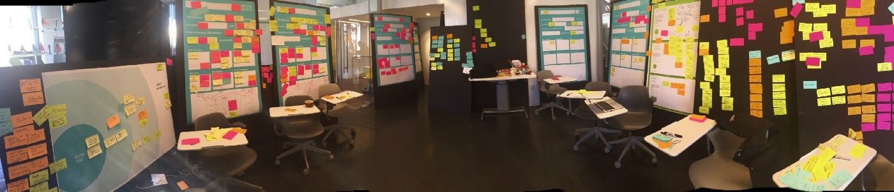
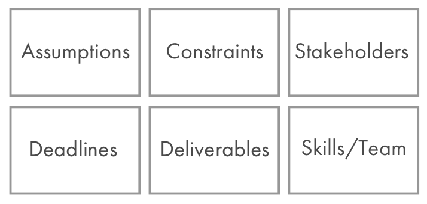
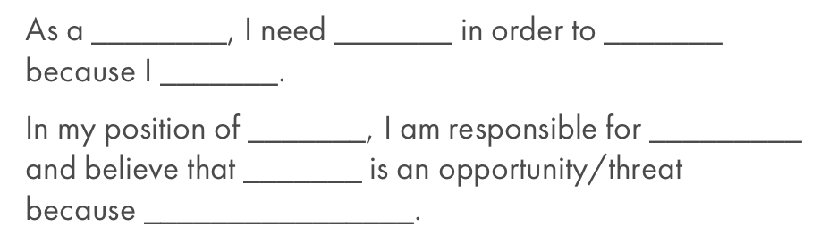
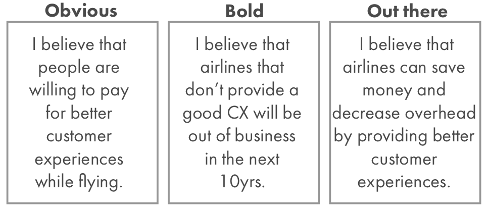
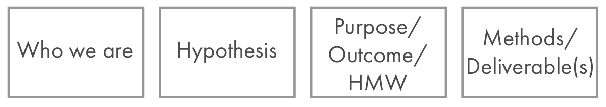
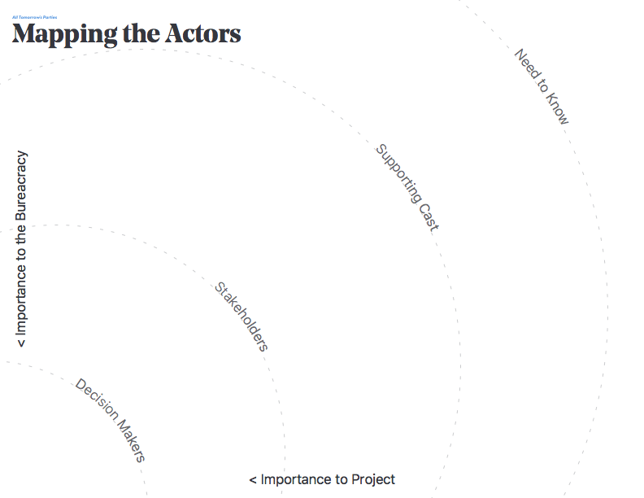

In design teams, the “Brief” is often a shared understanding of the challenge the team is facing. It should include the client or corporate understanding of the need, major stakeholders, deadlines, tangible outcomes to be delivered, and personal needs or constraints for the team. This is the basic checklist for the task at hand, and sets the groundwork for the next weeks or months of work.

But most briefs fail to provide design teams with an adequate structure for moving forward. They might articulate the need, but fail to identify the full breadth of stakeholders needed for a program’s success. Alternatively, they might see a glut of stakeholders whose articulation of the problem muddies the stated objectives: making quality work within the constraints of timeline and deliverables impossible. The design team is responsible for working with the client and between team members to develop an articulation of the problem that can:

- Deliver on the promise of great work
- Maintain a predictable but flexible course
- Maintain team wellbeing and mental health
- Help the client better articulate their goals

## **Structure**

The steps described below are the five (or six) steps you might take in facilitating a workshop with your primary stakeholders/clients to create an effective collaborative brief.

0: Create the environment to create the brief

1: Look for the Hard Constraints (Budget, stakeholders, team, deadlines, regulation, etc)

2: Create lists of beliefs or needs (Our hypothesis is; We’ve found that; etc.)

3: Articulate the project goal in big letters

4: Identify Stakeholders and re-address any of the hard constraints or beliefs

5: Iterate on the project articulation as appropriate.

## **0: Setting the stage**

A strong design process as much about creating the right environment for great work to emerge as it is about creating the work itself. Designing your brief is no different. A great “Brief making” session looks like no more than about 6–8 people. It should include the design team lead, the main client and known major stakeholders. If it’s a technical project, a senior technical team member should also be present. If it’s a venture design project, getting a design-centric MBA who paid attention in their financial seminars is worth including on the team and in this meeting. If you’re lucky enough to have a mentor or advisor who can contribute to/bill time to the project, make sure she’s present as well.

The room should have whiteboards and ideally walls that can hold up postit notes or butcher paper for pinning. Pre-seed some buckets for people to fill with post-its and notes. Some examples might include:

Budget at least 90min to work through everything, and try to have a loose timeline in place to get through everything that needs getting through. If you get everything but key stakeholders, for example, the brief will be incomplete.

## **1: Hard Constraints**

Surfacing the initial constraints is often the easiest part. Your client might be working towards a public launch date, or perhaps you’re working towards something that has to be completed before the end of the fiscal year. Sometimes there are only two others designers who can contribute to the team, or in-house engineering is unavailable. Perhaps there isn’t a timeline at all, but you have a capped budget to play with inclusive of expenses.

Surfacing these kinds of constraints early on helps limit the field of play, and helps give form to the project. Design activity is like a liquid that fills up whatever space it is provided, so knowing the size and shape of the vessel in question is vital, and a bigger vessel isn’t always better.

## **2: Beliefs and Needs**

Human activity starts from a place of beliefs about a problem or opportunity, and a need that drives an investment of time and capital. Surfacing these beliefs and assumptions becomes a vital activity to direct the early investigations within a project, and form the initial hypotheses to be surfaced. If the team becomes stuck at any point, revisiting these beliefs and needs can help identify important next steps.

There’s a number of facilitation tools you can apply in this section. A solid go-to is the Ad-Lib approach:

Alternatively, a “spectrum” of Obvious to Far Out hypotheses can be a fun activity for users

##

**3: The Project Goal**

Effectively articulating the project goal includes two things: clear directions to the design team in terms of constraints and hard requirements, and providing flexibility in forging a creative path forward. In the best case scenario, a well-articulated project goal empowers the design team to represent the program’s intent in every decision, even in advocating for risky or contentious directions to the client.

Once again, an ad-lib approach when facilitating this section can be effective for focusing participants. Taking the example of **designing experiments**, I might put four buckets on the wall:

After filling these buckets with content from the team and voting on them, you should be able to form a sentence:

“**As** Airline customer experience designers, **we want to explore** DECREASING service costs by providing a better customer experience to users. **This will enable us to** INCREASE revenue and extend our network. **We believe we can accomplish this by** ethnographic research within the air travel experience and co-designing with flight attendants.”

## **4: Stakeholders and Constraints again**

Once you’ve decided on your Project Goal, it’s time to revisit your stakeholders and hard constraints. Often the extended stakeholder network for the first idea isn’t the same as the decided upon brief, or occupy different levels of importance to the activity. A good exercise is to do a simple radial stakeholder mapping activity like this:

Make sure to revisit the constraints. Maybe one of them is no longer a hard constraint, but is instead has become flexible or a guideline. Perhaps the previous deadlines weren’t as important now that the Project Goal has been more effectively articulated.

## **5: Repeat/Reframe**

This whole process is meant to be iterative. Don’t hesitate to revisit different sections, or go through the whole activity again if you haven’t locked everything down. Sleeping on the decisions made and coming back for a day two can help in taking things that extra step to a really excellent brief. It can take an extended team up to a week and multiple sessions to align on some more complicated endeavors, so don’t second guess the feelings that something “might not be quite right.”

## **What’s Next?**

The next step is to clarify and synthesize everything for the broader design time and stakeholder network. Sharing the outcomes of this workshop can take the form of a board, a deck, or a one-pager describing the project. It’s really up to how the client consumes and disseminates information. After the team gets started though, you’ll need to MAINTAIN this great starting point, which is what we describe in the next post.

Thanks to [Ayla Newhouse](https://medium.com/u/d3670aea1173?source=post_page-----e7570400299c--------------------------------) for collaborating on this post!

_This article was originally published in [**Medium**](https://medium.com/knowsi/building-co-operative-design-briefs-e7570400299c)._
