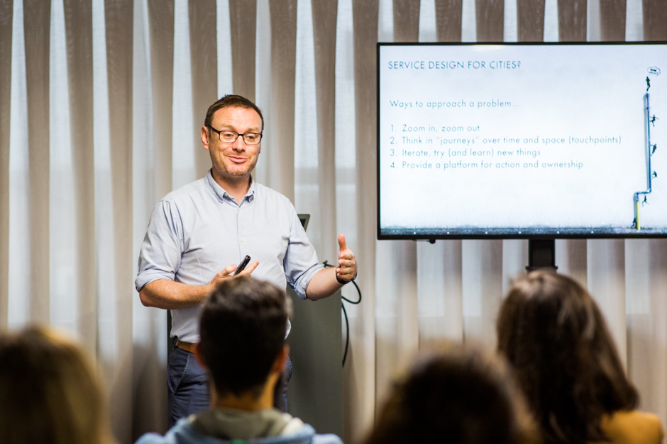
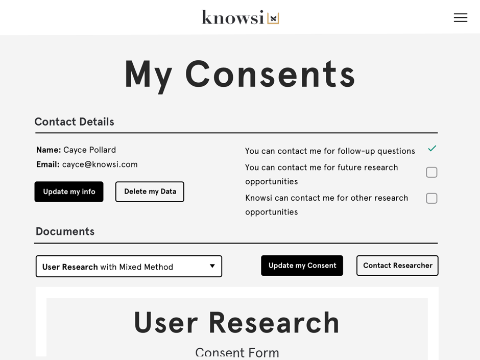
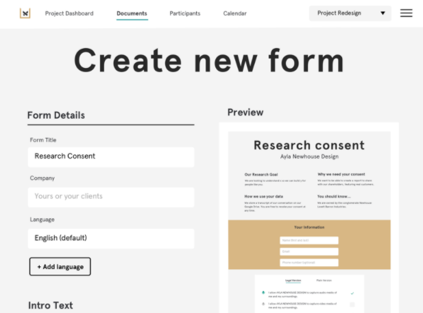
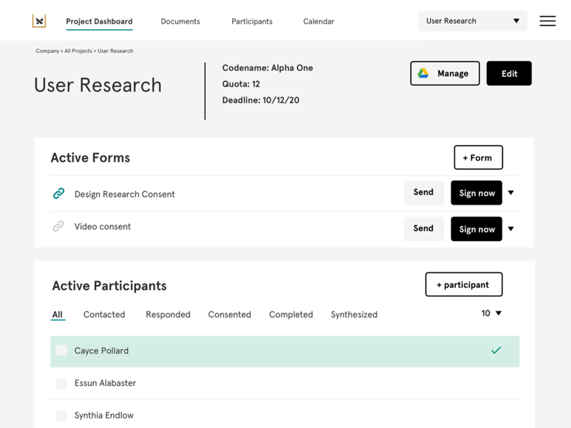

_Originally published as a guest blog on [**Sage Ocean**](https://ocean.sagepub.com/blog/tools-and-tech/coordinating-global-cities-research-knowsi-case-study)._

## **“We haven’t met yet. Do you trust me?”**

This is the dilemma that any researcher faces at the outset of their recruiting process — to find people who are willing to share their stories, experiences, frustrations, and victories with a total stranger. The secret to building trust often comes down to explaining in person while performing the interview — creating a rapport with the research participant and listening deeply and critically to their stories.

But there’s a trust-building step which happens before that.

The formality of research consent serves as a strong signal to your participants that their needs and information will be respected and protected. That signal, and the processes which underpin it, not only set the foundation for high quality interviews; it also serves to protect you and the participant through an agreement on process and procedure. With research travel constrained by budgets and now additionally by a global pandemic, we find ourselves building trust and rapport without the benefit of face-to-face contact. These formalities build strong foundations and stronger research.

This is what John Lynch discovered when his company, [Context Studio](http://getincontext.ie/), worked with the [Open and Agile Smart Cities ](https://oascities.org/)network (OASC) to better understand the needs of the global member cities. Founded in 2015, OASC was built on the idea that interoperability in technology and policy was a fundamental gap in the smart cities market. The network structured itself to provide guidance as well as the sharing of best practices and mechanisms to address that need.

In 2019, [Context Studio](http://getincontext.ie/) was hired to provide Service Design consulting to OASC — making sure that the services provided by OASC’s were grounded in the needs of the public servants providing across the globe who are helping with the digital transformation of municipalities.

Service design is a discipline grounded in using person-centered qualitative research to map and intervene in complex systems — in this case, an international network of cities composed of bureaucrats, elected officials, technologists, and activists. For a multi-month project interviewing dozens of individual contributors across a dozen different municipalities around the world, [Context Studio](http://getincontext.ie/) needed a way to bring to not only build trust from afar but also keep organized.

This is where [Context Studio](http://getincontext.ie/) chose to work with [Knowsi](https://www.knowsi.com/).

Since many of the participants were Chief Information Officers, Data Officers, Data Protection Officers, and others across the different municipalities; their work demanded that the tool not just _signal_ that privacy was being protected, but actually show the research participants that privacy was being taken very seriously. Knowsi helped [Context Studio](http://getincontext.ie/) in a few ways:

First, Knowsi provided a participant dashboard and accountability system for each of the research participants. It puts participants in control of their consent and their data and facilitated an automated GDPR deletion process.

Second, John was able to customize his consent forms to both the needs of Context Studio, for the research process, and those of OASC, his client By being descriptive and specific about what consent he needed from his participants, there weren’t any surprises and everyone was covered.

Finally, as participants completed their consent forms, John was able to track where people were in the recruitment process in real team — getting updates directly to his dashboard as the consent forms were signed. This made it easy to keep track of interviews and make sure that he could send interview schedule reminders as he progressed.

**“I think people were impressed. They thought it was a handy tool.”**

John described the experience of using Knowsi as a way to build better relationships with his participants, and ultimately conduct better research. He suggested a future where one could **“Just send a Knowsi for our conversation tomorrow.”** and participants would know exactly what that meant, in the same way some of us use “Doodle” or “Zoom Invitations” today.

As Knowsi is in its early stages, we’re still learning quickly. John helped us discover that while “Sending a Knowsi” is the ideal future state, we’re not there yet. We consistently found that when Knowsi users [wrote their own emails and included the appropriate link](https://medium.com/knowsi/research-recruitment-email-b862186ef3ba) to the consent form from Knowsi, then response rates were about 30% greater.

Research administration is difficult, and the complexity of trust requirements and respondent/client expectations in research just makes it even more so. Knowsi helps you deliver a great privacy experience for your research participants while automating as much admin as possible. You and your research participants can focus on building a great rapport and conducting great research.
