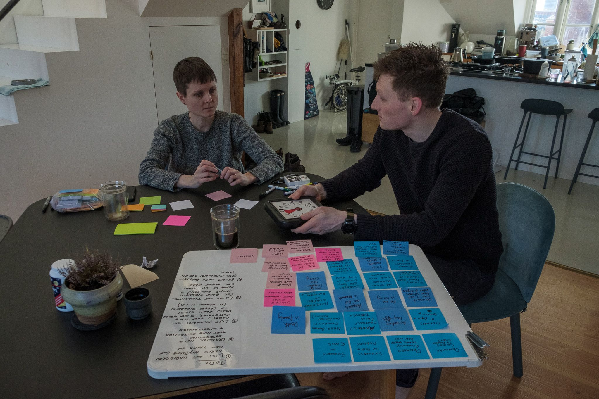
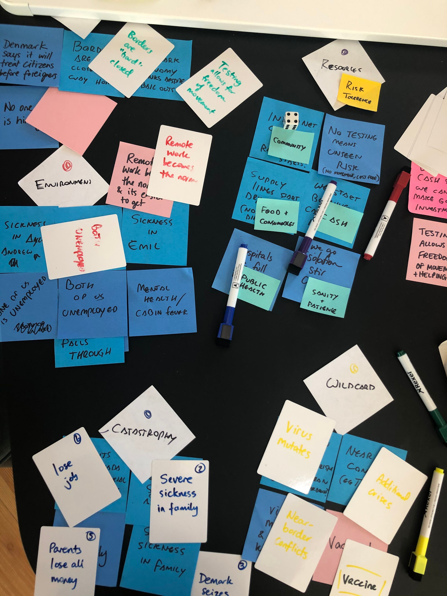
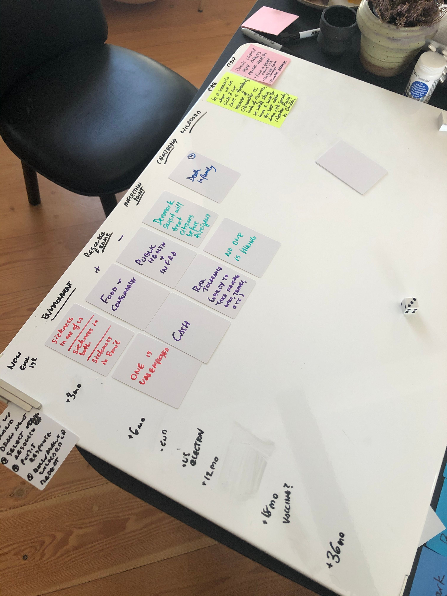
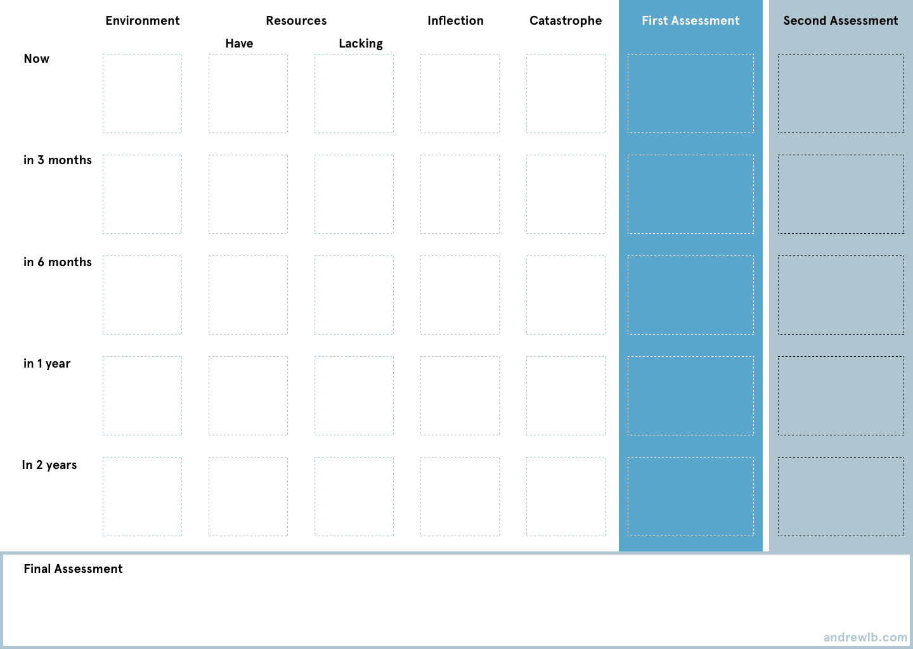
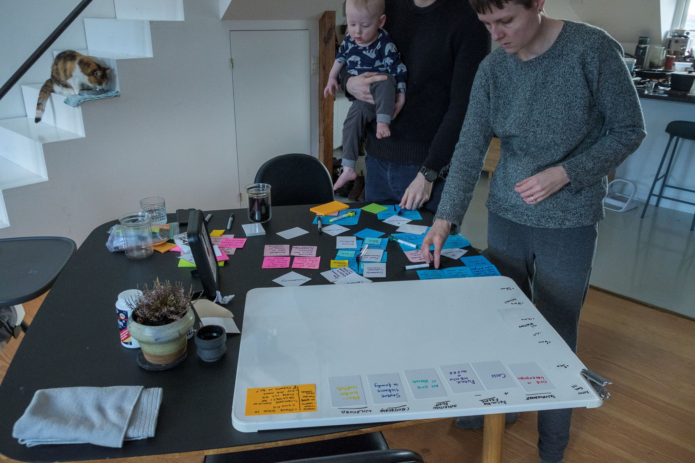
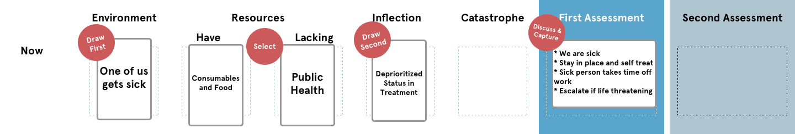
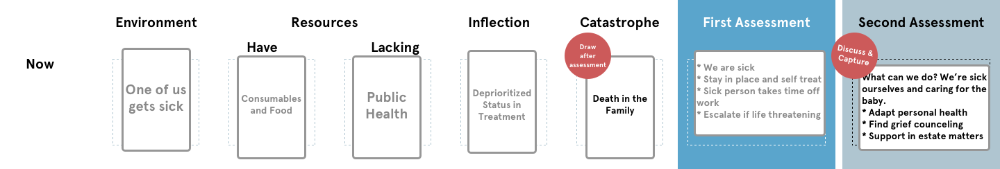
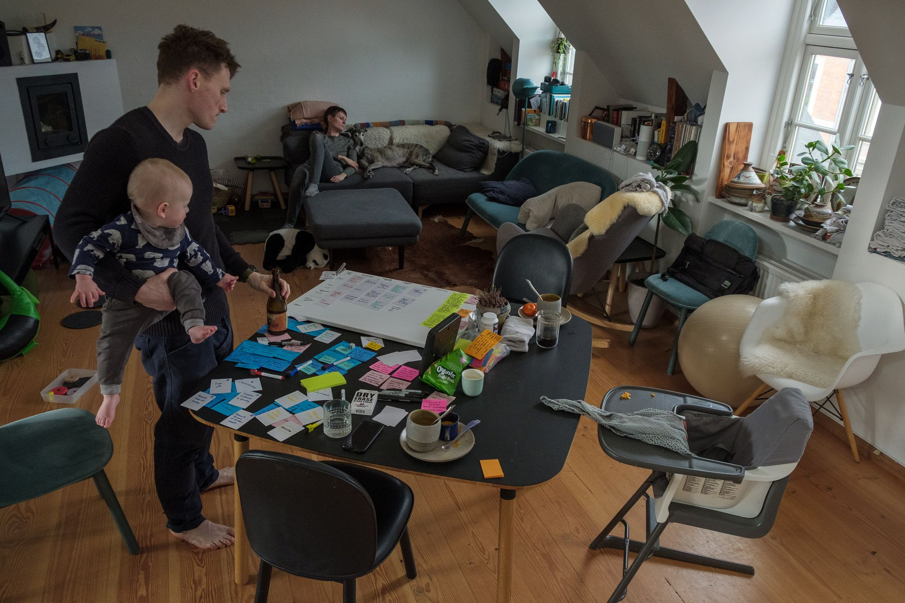

_(Originally written March 23, 2020)_

Why is it that we can see something coming and still not prepare? I’ve been asking myself this question over the past 10 days that we’ve been on lock-down here in Denmark. While we set ourselves up pretty well (how is besides the point here), we set ourselves up in a very general way. We have some medical supplies and training, we have food, we can keep ourselves and our son protected… we think. But what if we could be more specific?

It was this question that spurred my wife [Ayla](http://www.aylanewhousedesign.com/) (a design director at Fjord) and I (design all-arounder and co-design consultant) to do what we have consistently done in our relationship: turn to goddamn post-it notes.

We realized that we needed a different tool to deal with this complexity, and so we created a game. It’s not — strictly speaking — a particularly fun game. It’s not dealing with a particularly fun topic. But it follows that structure and it was (and is) useful to us. **This is a long post: if you want to jump to the rules and the tools we created, just head to the end.**

## Anxiety, Collected

Our first task was to enumerate our anxieties. That was fun.

We started off just listing everything we could think of

Sickness and death in our family (all on another continent), our son Emil getting sick, losing our job(s), overwhelmed public health systems, closed borders, and economic bailouts failing were the obvious near-term concerns. Greater extremes came quickly after: governments focusing on their citizens above foreigners (we’re foreign workers in Denmark), seized assets. Even broader: what of a European Union unable to fulfill its “union” mandate? What of existing fragility and its fallout, such as armed conflict between Turkey and Russia?

These anxieties are overwhelming when taken together, and can quickly spiral. I’d argue they are effectively the same as reaching out frantically in the dark from one's current position. What we needed is a way to tackle these anxieties in sequence.

In the past, we’ve often used a tool like [backcasting](https://en.wikipedia.org/wiki/Backcasting): looking at a future or point in time that we WANTED to get to, and figuring out the steps required to get there. But we aren’t in that kind of situation. **We aren’t defining a strategy so much as developing a posture from which to engage whatever the world is throwing at us in a time of extreme uncertainty.**

We want to build our resilience. We know (insomuch as one can) where we are right now: so what does it mean to scout forwards in time?

## Anxiety, Organized

Our next step was to simply cluster the anxieties where they seem to make sense. A few obvious ones emerged:

Some very initial clustering

### Environment

These were things like “One of us gets sick”, “Emil gets sick”, or “One of us loses our job.” Events that we are living with, in a time of change or decision making. Something that is probably traumatic, but also something that frankly most of us will be experiencing in some way over the coming months.

### Resources

These started as inflection points, things like “Hospitals get filled to capacity”, “No testing means no idea of actual risk”, and “Internet rationing or curfews.” But these clusters could be simplified down to “Public Health”, “Risk Appetite”, and “Community and Connection” respectively. Either private or public resources that shape outcomes. There’s a cluster of other ones as well, including Cash, Consumables and Food, Sanity, etc. Ultimately, anything that is a resource in balance.

### Inflection Point

Inflection Points are specifically in tension with the Environment category and have a lot of overlap. These are mostly framed as a CHANGE that we will have to make a decision around. An example we listed is that “Denmark starts emphasizing Danish citizens over foreigners for medical care” (unlikely but possible), “Indefinite lockdown is announced”, and “No one is hiring.” In each of these cases, it requires a non-obvious response given the reality we find ourselves in.

### Catastrophe

Finally, we have a “Catastrophe” category, which is something that throws an already vulnerable situation into complete chaos. This might be the death of a parent or partner, assets being frozen (for whatever reason), a national or international crisis, or — most likely — a full recession. Significantly, these are things that might actually be quite probable: but their likelihood doesn’t dilute the extreme emotional, financial, physical, and psychological impact of the event.

## Anxieties, Iterated

This is the part where things started to come together. Ayla and I were trying to figure out how to actually approach the forecasting part. We landed on a grid that looked a bit like this:

The initial canvas

First, one axis became time extending from now, +3mo, +6mo, +12mo, + 18mo, and +36 months. Then the other axis became the “order” of decision: environment to resources, resources to inflection point, inflection to catastrophe, with the two assessments beside it.

### Setting the Scene

First, **Environment** cards were chosen based on what we were facing right now. (We started with one of us being sick, though hopefully, we aren’t). Then looked at the **resources** that we had access to and what we were lacking. In the above scenario, we’re well set up for supplies and consumables, but honestly, don’t feel well covered by the public health system. This is an entirely subjective judgement: we might actually be well covered, but it’s just the feel there.

Next, we move on to the **Inflection Point**, which in this case is the made-up “Denmark explicitly emphasises Danish citizen wellbeing over foreign residents.” This being purely speculative, we wanted to explore what would happen.

Looking at the first scenario

### The First Assessment

The first assessment canvas

After we laid out these four cards, along the “Now” time, we asked ourselves: “Okay, what would we do?” And at this first assessment, there actually wasn’t much. Even in a scenario where we were sick and our health as foreign workers was being devalued, we’re healthy, have resources, and have a community. So we decided that we’d simply stay home, and try to weather this sickness as best we can.

### The Second Assessment

The second assessment canvas

Then we rolled a dice. We had each of our catastrophy cards labeled with a number, since for this initial exercise we only had a few. And it rolled a 4: “A Death In the Family.” **This was the moment where the game hit home and we both said “Fuck” in unison.**

In a scenario where our own health was at risk and we had made the decision to shelter in place, suddenly our sibling or our parent calls us with crushing news. We’re between an 8 and 12-hour flight back — itself a multiple of risks to ourselves, our loved ones, and those whose paths are simply coincident with our own.

This is where the second assessment took place. We listed what would likely have to happen: hunker in place. Look after our physical health. Look after our mental health. Find a grief councillor who can work with us remotely. Redouble our efforts to stay connected with family. Take on the responsibility of planning and estate considerations, or support the family member who does.

### The Next Turn

Exhausted by this, we drew the next card: 3 months from now, in June. Suddenly, one of us is unemployed. We select our resources: we have good savings, but in such a situation our risk tolerance is going to drop (meaning we might not be able to jump on opportunities like we had in the past). Then a corresponding inflection point: “No one is hiring.”

We laid out our first assessment, which actually did not look too different from what we would do outside of a pandemic and looming recession. But the catastrophe card threw this into stark relief: the borders were fully locked down. Suddenly, even though we had not been planning a move, the scope of potential forward actions dramatically shrunk. Maybe the embassy? What do we do?

## Anxieties, Acknowledged

We played several rounds of this, seeing another family member pass, seeing cabin fever set in, and finally seeing both of us face unemployment. Each of these turns as they marched forward in time prompted stark decision making and discussions on what might come.

Ultimately, we looked at our decisions and took stock — what comes next? If these things might happen, what can we do now to offset the risk? If joblessness is a likelihood (or at least a distinct possibility), can we plan our capital and budget accordingly now as though we anticipate that? If the death of a family member is possible in the near term instead of the indeterminate future, what needs to happen?

**This wasn’t a fun game.** It was upsetting, painful, and anxiety-inducing. But though crudely simulating what might come, it helped map out many of the blindspots and fragilities we’ve had all along. And maybe, if we run through a few more times, it’ll mean we’re in a better posture when the time to act comes.

Dealing with the first game required a beer and serious decompression

## Rules of Play

Okay. The above was a long diatribe about why we made this. Here’s the TL;DR on the rules and how to play.

### Setup the Board

1. List out everything you’re thinking about on post-its or small squares of paper.
2.

Organize into:

- Environment (something ongoing, like sickness or unemployment)
- Resources (cash, community, etc)
- Inflection (an event that forces a decision)
- Catastrophe (something big and unexpected)
- Wildcard (Something possible but very unlikely, like a shooting war between Russia and Turkey or the EU collapsing)

1.

Create two axis:

- one of time starting from now,
- one with environment, positive resource, negative resource, inflection, catastrophe, wildcard. Then two more columns: Assessment 1, Assessment 2

[You can download the canvas here](undefined). We didn’t play with the wildcards initially, so didn’t include that on the canvas.

### First Round

1. Select an “Environment,” either what you’re most worried about now or what is already the case. Put that on “Now” and “Environment”. Then select two resource cards for what you have access to (positive) and what you are missing (negative). Then select a random inflection card.
2. Think about what you would do in this scenario and discuss. What do you hope you’d have? What kind of decision would you make? Write it down on a post-it and put it in assessment #1.
3. Then roll a dice or select a catastrophe card at random. Put it in the catastrophe slot.
4. Reflect on and discuss the new scenario given your previous decision. What changes? What can you do? How bad are things? What opportunities might exist? Write down your reflection and put it in assessment 2.
5. Normally the round is over, but if you want to add something, add an additional wildcard and an assessment #3.

### Subsequent Rounds

Each round builds on the last, so if your next time slot is three months from now, then it is following the decisions you made in the “Now” timeslot. Simply follow the same steps as the first round and see where it takes you.

### Reflection

Play until you feel like you have an idea of what might come. Before wrapping up, look at your assessments. What can you learn in terms of preparing for some of these worst cases now? Is there anything you need? Decisions you need to make? Processes to put in place?

And then if you like, play another round with a different starting point. Who knows what different decisions you might make, and what you might discover you’ll need on the other side.

### Resources

- [List of topics to help get started.](https://docs.google.com/spreadsheets/d/1kxSbkwnDXJZfGT_-6vx8Yu8Xa4zb8taRV3CGYYlHy5E/edit?usp=sharing)
- [Template canvas to print out](https://andrewlb.com/f87d372c75f53c5a605f786953391152/canvas.pdf)
