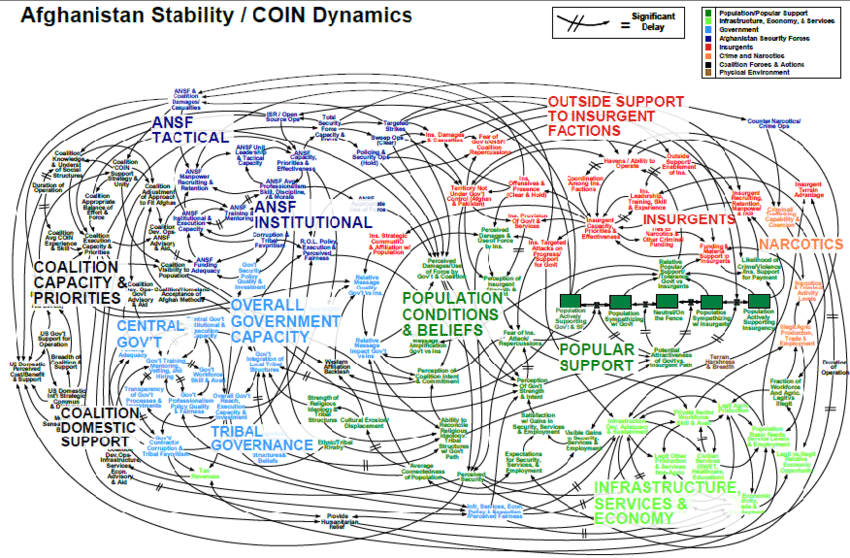
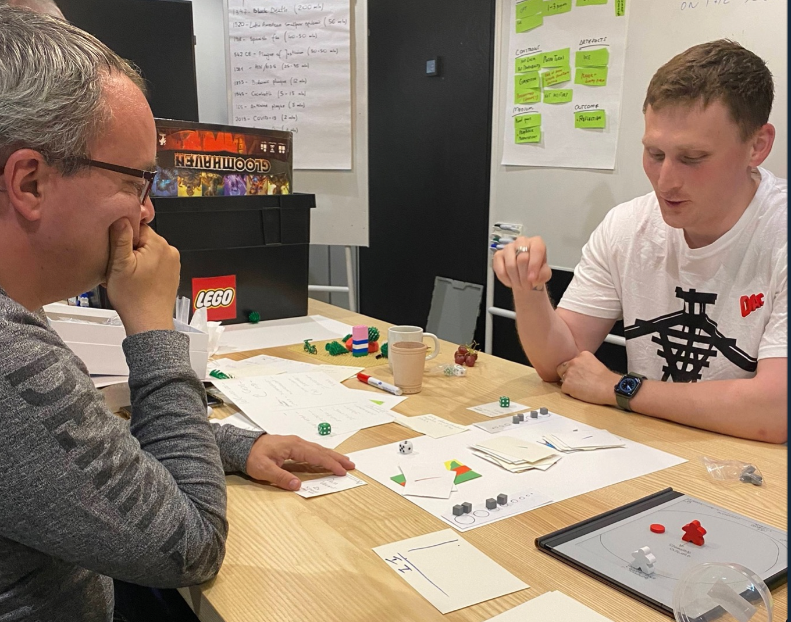
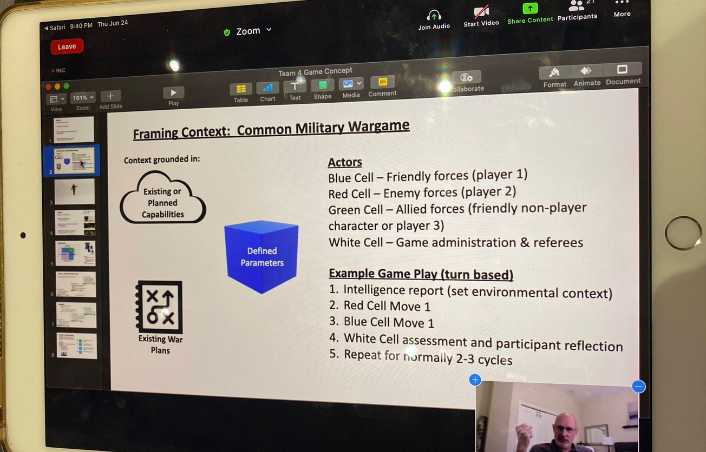

What does it mean to design for the propagation of security? In a way, this is one of the grand questions of international relations and its sub field, security studies. Exploring what contexts (events, regimes, situations, etc) create or compromise our understanding of security, how security is constructed through foresight and hindsight on these contexts, and who experiences — or sees a loss of — security given those contexts (and whether it’s equitable, uneven, or even mutually exclusive).

I’ve been slowly working my way through a masters program in security studies, prompted by my earlier experience working as a product and service designer in the Pentagon. The experience there left me with some great experiences, and some humbling realizations. Some of this came from the pretty early realization that even before stepping foot in a defence facility, part of my own understanding of strategic design had actually emerged from a military context. The thinking of [John Boyd](https://bookshop.org/a/19778/9780316796880) — best known for his role as the designer of the F-16 fighter plane and the originator of the OODA loop construct — has had a pretty distinct influence on my thinking; not just for the OODA loop as a way to think about cognition and competition, but also for Boyd’s writing on the ideas of grand strategy and tactics in situating ones work and design. Other theorists — from [Clausewitz](https://www.foreignaffairs.com/reviews/capsule-review/1997-03-01/clausewitzian-friction-and-future-war) (I really recommend the book reviewed here, actually) to [McCrystal](https://www.theguardian.com/news/datablog/2010/apr/29/mcchrystal-afghanistan-powerpoint-slide), [Jomini](https://warroom.armywarcollege.edu/special-series/great-strategists/scientific-approach-to-war-jomini/) to [Naveh](https://www.publicspace.org/multimedia/-/post/walking-through-walls-soldiers-as-architects-in-the-israeli-palestinian-conflict) — have also served to decorate the language that I use to transition the ambiguous into the impactful, and the intangible into the real.

While I was drawing inspiration from the military strategy and theory realm to inform my thinking about design, however, there were a broad swath of military planners, strategists, and thinkers who were doing the same from my chosen discipline. A year or so ago, I attended a seminar at the University of Copenhagen on [design thinking and the military](https://cms.polsci.ku.dk/events/regaining-the-advantage-the-promises-of-design-and-innovation-methodologies-for-civil--military-organisations/), after being hilariously targeted by Instagram ads for the same. There, I met a professor at the Canadian Forces College, Dr. Philippe Beaulieu-Brossard, who turned out to be my neighbour, and we got to chatting. He then served to introduce me and graciously welcome me into a [community of military and design practitioners](https://aodnetwork.ca/) he was forming around this question of using design as a lever for reflexivity and foresight within the defence community.

I spent the past week participating in one of the key outcomes of Philippe’s time in Copenhagen, [a design and security workshop](https://aodnetwork.ca/the-albatross-playbook/) looking at how a well established pillar of the military planning community — games and game design — could be used as a wedge into teaching design skills to security practitioners. Fully vaccinated and frankly somewhat starved for in-person collaboration after emerging from our most recent lock down, it was an opportune space to doff my usual facilitator or speaker’s cap and join as a participant. I’m incredibly glad I did.

The participants came from academic and defence institutions from across NATO and NATO strategic partners, and most of whom had some existing connection to — or at least disposition for — military design thinking. But only a handful of us were design practitioners in the traditional sense of using design to create objects and experiences — a game designer, a hacker/maker, and myself as a service designer and prototyper. I had some trepidation around this, since in general I tend to believe that without the making part, you’re not actually doing design. What I was dismissing with that criticism was that while most of the participants weren’t engaged in design in their day-to-day, they were perfectly willing to make things tangible with whatever they had access to.

Given the constraints of Covid, only a limited number of folk were able to make it to the workshop in Copenhagen. In the two weeks preceding the event, a few online workshops were hosted to help seed initial thinking and also “soften” the participants to co-creative and iterative processes. These ranged from small lectures with breakout sessions, wherein teams would quickly run through a series of concepts and filter down to ideas that fit the scope (or at least tried to fit the scope) of the in person workshop.

For the main body of the workshop, our goal was to create a functional game mechanic that could serve to “teach” a facet of the design process. We were guided through a pretty standard cycle of activities that reflected the [double-diamond framework](https://www.designcouncil.org.uk/news-opinion/what-framework-innovation-design-councils-evolved-double-diamond), lightly but effectively moderated by Philippe and Ilan. In the background, other members of the University of Copenhagen Center for Military Studies were hustling around making sure things ran smoothly — wrangling resources and testing schedules via Discord, pushing for documentation of processes, and facilitating connections with remote participants.

Unfortunately, that latter point is likely one big failing — and I think is more a quality of remote collaboration than it is the design of this workshop. Event inclusivity when potential participants can’t travel (either because of economic means or for the Covid of it all) is the right idea in principle, but I’ve yet to see an event actually pull it off. Whereas established conferences have all been going the learning archive route, until they can host in person events again — most newcomers have been struggling with flagging attention, poorer learning results, and a generally less engaged community with fewer meaningful connections formed.

We saw that result with some of the remote participants in the workshop on two levels — those who were paired as remote contributors to in-person teams, and an entirely remote team. For the mixed remote/in-person teams, the on-off cadence of participation made it difficult for those participants to get the whole picture, and as a result, ended up primarily adding value through “on-demand crits.” In the best scenarios, they helped us speed up our iterative cycles and get to results that we wouldn’t have seen without that on-demand external eye. In the worst cases, it actually served to disrupt the relatively tightly packed working sessions as we struggled with Discord and connections. But ultimately for each of the in-person teams (who, I’ll remind you, were packed full of senior NATO officers, academics, and strategists), we got to a prototype that one could understand, if not directly play.

For the entirely remote team, they struggled a bit more to get to something tangible. Instead of drilling down to something that was playable, they mostly stayed at the theory and principle levels. Though it didn’t get us to the goal of the workshop, as an outsider I found this part to be pretty useful as a frame on the way that design-curious strategists and theorists frame the work of design. Put somewhat pessimistically, **design thinking is one of the best sales tools available to the practicing designer.** If you can access a “design thinker” who is bought into the value of a design process, then the process of selling through and executing on good design work becomes infinitely easier — and often more impactful.

After experiencing the work and collaborations that emerged during this workshop, it’s hard not to see a lot of value in these types of challenges to the fundamentals of design practice and strategic thinking in the military. First, **the scope that defence practitioners are working within is substantially broader than that which most designers find themselves** **working in** as defined by our job titles — but we SHOULD be working at these more strategic levels to properly consider the equities at play in assessing and implementing design decisions. Understanding the skills that senior defence practitioners bring to bear in managing stakeholders and their equities is a skill that can dramatically improve the outcomes and impact of any design work. We have a few of these already — mapping tools, facilitation, immersive research — but I think there’s a lot more to learn there.

Second, **defence practitioners are rarely empowered to make and break like designers — but they find other effective ways to critically iterate on problems.** I think part of the appeal that design practice presents to defence practitioners is the dogmatic belief in critically failing your way to success by way of a foam core strewn trail of discarded prototypes. Those practices just don’t appear in the military context as frequently as tools for ideation (though it does for sales and persuasion, as demonstrated by the movie Pentagon Wars). But things like drills, war games, red teaming, quantitative and action-based simulation, and similar things DO exist in a military context, and these are tools that frankly the design community could learn a bit more from. Especially red teaming.

Finally, **Security is more than bombs and war.** Defence practitioners aren’t just dealing with the core material of conflict — which is a reasonable thing to object to and ultimately ones politics are ones own. When I worked DOD, we were quite careful not to work on weapons systems as part of the US Digital Service, BUT we also worked on systems that were just that, given a different lens and context. A more efficient and better designed recruiting system in peace time can be a tool of social mobility, and in war time can be a ticket to the front for the most vulnerable. But “security” encompasses topics of migration, international institutions, climate, economics, ecological, logistic, epidemiological 🦠, and all sorts of different challenges that make for a wildly interesting problem space for designers. Today’s defence practitioners are working actively and energetically in these domains because they are vital and affect all of us. Security never becomes so pressing as when it disappears, so designing for a security context is — by its nature — designing for better human outcomes. Now, I’ll also say that we need to take a critical eye to all of that since you’re also designing within the context of a state existing in an anarchic system if you listen to some folk, but I’d suggest finding the topic that interests you, and then engaging in the theoretical literature that helps you engage that topic critically.

So. This workshop was great, and huge congrats to Philippe and his team at the Archipelago of Design for pulling off a meaningful convening under great stress and logistic challenges. I can’t wait for more.

I’d definitely recommend subscribing to the [Archipelago of Design’s newsletter](https://aodnetwork.ca/) for future such events, and can’t wait to see what comes next.
