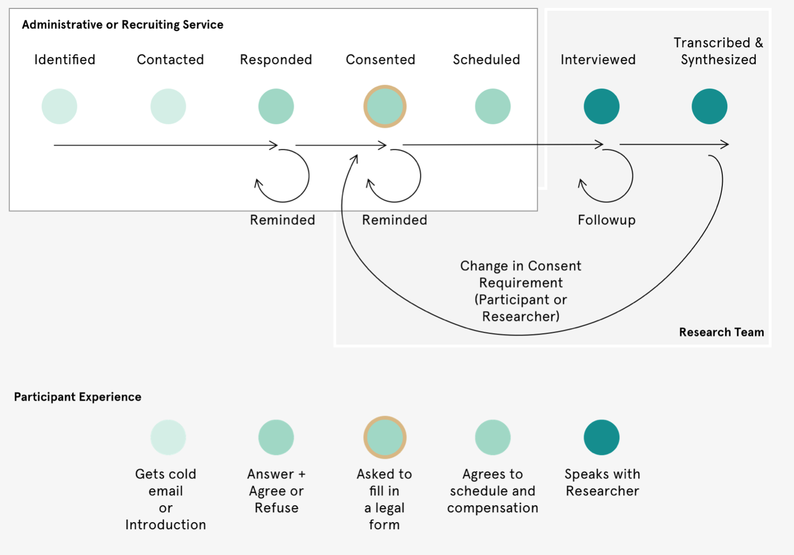

Designing a research program is a pretty difficult task. It requires a level of introspection and reflection on knowledge and knowledge creation that makes for both considerable rigour in defining the study’s parameters, but also a disposition that is — by default — maximally extractive of data gathering opportunities. So it comes as no surprise that in qualitative studies involving direct engagement with research participants, often the participant experience gets diminished in favour of focusing time and resources on increasing value to the researcher: improving your interview guide, recruiting more participants, wrangling your IRB, and broadly establishing the framework for extracting as much value from a research process as one's resources allow.

Sadly, we miss that participant experience can be the key to great data and great research outcomes. By investing in the trust relationship you have with your research participants, you invest in their willingness to engage openly and comfortably with your research and its objectives. A good participant experience frees participants from the emotional and cognitive toll of being responsible for their own wellbeing and privacy, by providing a tangible demonstration for your care of the same.

I gave a talk last fall on Designing Trust Relationships in Research and proposed a structure for applying the front-stage/back-stage model, articulated in Service Design, to designing the participant experience. Service Design is a practice that mandates designing not just objects and experiences, but looking holistically at the experience that users have around a given service. So in the banking sector, a service designer would consider not just the banking app, but the ATM, the physical bank itself, the training of the customer support staff, the anxiety and concerns of the banking customer, and the different phases an individual might go through while engaging with banking as a holistic experience.

From my own experience, and in interviewing academic and private-sector researchers for Knowsi, a fairly common linear path emerges when designing the operational side of research. There’s plenty of variation within this, but broadly speaking we:

1. Identify who we want to talk to based on the research question, budget, access, and other constraints. Often the recruitment strategy and requirements are established here.

2. Recruit and contact those people, either on the team or through a recruiting firm.

3. Deal with the responses and concerns of the participant. Often this part would involve a screener or some other filtering mechanism.

4. Manage consent and any legal requirements for engaging with the study.

5. Schedule the participants and the team, with any final checks or discussions around incentives.

6. Engage in the interview or experience with the participant. Basically data collection.

7. Process the data from the interview: transcribing, synthesizing, and storing.

Often, some variation on this path is presented as a linear funnel, whereby participants are screened and filtered until a sufficient pool has been recruited, interviewed, and included in the study. But with the advent of the GDPR and a more aggressive focus on protecting the privacy rights and integrity of research participants, we’re coming to need a set of necessary looping loops and continuation of the participant experience, beyond the linear and extractive mode of the past. In a scenario where participants can change their consent, own their data, and ultimately have a legal right to reclaim that which was extracted — the research process becomes less of a funnel and more of a system.

## **The Participant Experience**

How does the participant experience map onto the idealized path that researchers have described? Ultimately, we tend to see that participants lack insight into the “what comes next” part of a research program. There is a mutual (albeit asymmetric) understanding of value between the researcher and the participant. At the very least, the participant understands that someone wants to talk to them and potentially pay them for it. But they don’t often have insight into the research, rather, the majority of their experience is around managing contact and anxiety over trust.

This management of trust cascades into a fairly substantial amount of effort and energy asked of the participants — a tax of their energy for their involvement in this exchange of data and value. Effectively, at each point of contact with the researcher, something is asked of the participant in terms of comprehension and trust-building towards that point in the process, where maximum trust and information is asked of the participant.

By applying a service design and design-thinking approach to the participant experience, we’re empowered to see some of the core concerns that participants might have about each phase of what, to a researcher, appears to be a simple and rote experience — the constituent parts of that tax. These concerns might manifest in any number of ways — from anxiety, evasion, and cancelation on the far end; or even slower response times, self-protective questioning, and a hesitation to explore certain topics too deeply.

## **What Lies Beneath**

Designing a better participant experience is ultimately the road to designing a more effective and less exploitive research relationship. Unfortunately, this is kinda hard. Each research project has its own needs to design for. I’d always recommend spending at least a few hours with your team, carefully considering the participant experience, and addressing those needs with as empathetic a lens as possible. It requires a fair bit of structure and reflection.

Using some of the tools for service design can offer deeper insight into your participant’s experience. The metaphor of **front stage/backstage** provides a useful framework — allowing the researcher to identify some of the individual components of a participant experience, such as that first introduction, the type of information included in a scheduling link, or the structure of a consent form. These are touchpoints (artefacts and instances of interaction between your research apparatus and the participant) that can be improved.

By understanding the participant touchpoint into the research experience, you can reflect on how your own operations impact those experiences in positive or negative ways — such as data storage infrastructure impacting one's consent form approach or understaffing impacting the speed of response to individual participants. One example might be the speed at which a researcher responds to participant queries for more information. An intermediary might need to get more information from the principal investigator before they can properly answer a question, but by the same token, a PI might become inundated with requests, if they were also the primary point of contact during recruiting. Balancing these operational realities according to the design of any particular study becomes a powerful tool for improving the participant experience.

Finally, the administration of the research exists within a framework of norms and rules. This might be direct legislation, like the GDPR requiring the withdrawal of participant consent to be an easy process, which requires certain administrative implementations, which in turn affects the participant experience around consent. (Ahem — [Knowsi](https://knowsi.com)).

The unwritten norms are just as striking. An interview may end before it begins, if the gender, linguistic, or group identity is outside of the participant’s expectations, or if the appropriate gatekeepers aren’t engaged with as stakeholders. How one engages with these norms (or whether one even acknowledges them as real, much less legitimate) is defined by the ontological, epistemological, and methodological stance taken by the researcher. These beliefs are the starting point for any research design. So of course it has powerful implications for operations and the participant experiences that follow.

## **Designing the Participant Experience**

Designing for the participant experience is ultimately something that many researchers can’t do because they’re already working under incredible constraints. And more broadly, many will say that adherence to research ethics already accounts for those participant needs sufficiently. However, by designing a better participant experience in your research, the opportunity is created for higher quality, richer, and more valuable data to emerge in a way that is less exploitive to your participants.

What this takes is an iterative process across participants and studies to learn where different aspects of that participant’s experience are working and not working, and doing the work to fix that. One way to approach this is through follow-up questions or surveys with participants — reflecting not just on the subject matter of the study, but on the experience of the study itself. Another is to stagger the field research schedule so that opportunities are made to iterate and improve on operations and participant experience over time. However one approaches it, it won’t be right the first time.

So I hope this is useful. There are so many ways for qualitative research outcomes to be improved, but I hope this frame on participant experiences provides a useful toolkit for thinking about how we do our work.
