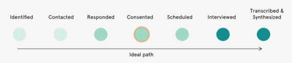
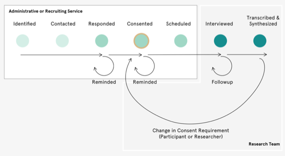
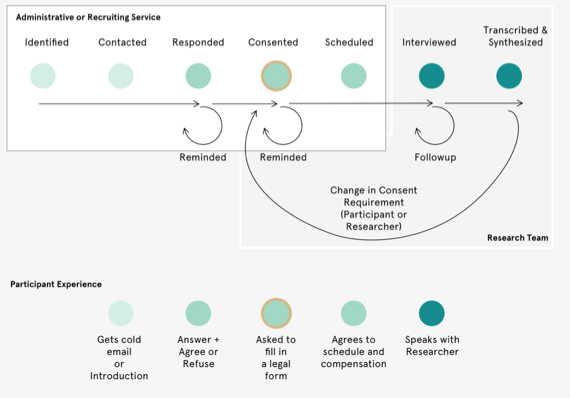
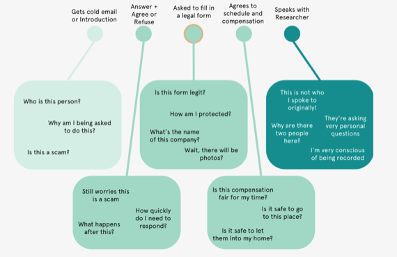
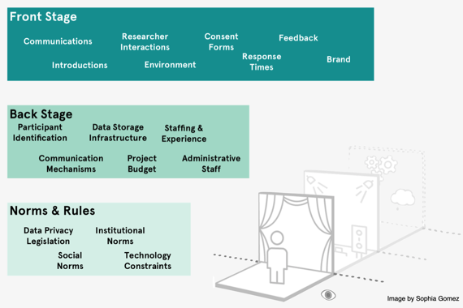

_Originally published on [**Sage Ocean**](https://ocean.sagepub.com/blog/designing-trust-relationships-in-research-with-knowsi) on October 9, 2020._

##

## Webinar recording

SAGE hosted a webinar with our [SAGE 2020 Concept Grant winner](https://ocean.sagepub.com/concept-grants), Andrew Lovett-Barron, on how to design trust relationships with participants in research using Knowsi. [**Knowsi **](https://www.knowsi.com/)is a portal to manage research participant consent in compliance with data privacy regulations.

In this post, we share the webinar recording and Andrew Lovett-Barron writes up the key points he discussed in the webinar in a guest blog, as well as answers your questions that he didn’t have time to cover on the day. Enjoy the post and get started with Knowsi today by **[signing up for a free account](https://www.knowsi.com/join).** If you want to upgrade to the paid-for version, use the code **SAGE **to get two months free.

[**Watch the webinar recording.**](https://www.youtube.com/watch?v=XJrqP_XM4SQ&ab_channel=SAGEOcean)

## Guest blog from Andrew Lovett-Barron

Designing a research program is a difficult task. So, it comes as no surprise that often the participant experience gets cut in favor of focusing time and resources on refining your interview guide, recruiting more participants, or wrangling your Research Ethics Board.

But participant experience can be the key to great data and great research outcomes. By investing in the trust relationship you have with your research participants, you invest in their willingness to engage openly and comfortably with your research and its objectives by freeing participants from the emotional and cognitive toll of being responsible for their own wellbeing and privacy.

In a webinar I gave last week, [Designing Trust Relationships in Research](https://www.youtube.com/watch?v=XJrqP_XM4SQ) — I proposed a structure for applying the front-stage/back-stage model articulated in Service Design to designing the participant experience. Service Design is a design practice which looks at designing not just objects and experiences, but looking at the holistic experience that users have around a given service. So in the banking sector, a service designer would consider not just the banking app, but ATM, the physical bank itself, the training of the customer support staff, the anxiety and concerns of the banking customer, and the different phases a banked individual might go through as a holistic experience.

In the past, a research project was often defined linearly.

But with the advent of the GDPR and a more aggressive focus on protecting the privacy rights, a necessary feedback cycle and continuation of the participant experience has emerged. What originally appeared to be a relatively linear experience with a clear endpoint suddenly becomes a longer relationship between researcher and participant that requires deeper consideration.

### THE PARTICIPANT EXPERIENCE

It’s easy for us to empathize with the researcher experience, but how does that map to the participant experience?

Participants don’t have insight into the research per se, but rather the majority of their experience is around managing contact and anxiety over trust. While a researcher is focusing on maximizing the value that a participant brings to the research project, the participant is often focused on minimizing potential harm while maximizing potential gains from their participation.

This management of trust cascades into a fairly substantial amount of effort and energy asked of the participants — a tax on energy for their involvement.

By applying a service design and design thinking approach to the participant experience, we are empowered to see some of the core concerns that participants might have about each phase of the research. The power here is that while a researcher might believe this is a simple and rote experience, to the participant it might come with a considerable cost to their attention and anxiety.

###

### DESIGNING THE PARTICIPANT EXPERIENCE

How do we design a better participant experience?

Each research project has its own needs to design for. I’d recommend spending at least a few hours with your team carefully considering the participant experience and addressing those needs with as empathetic a lens as possible — perhaps going so far as contacting past participants to interview them about their experience directly.

Then, use the tools for service design to break down that experience!

To start, the metaphor of front stage/back stage provides a useful framework — allowing the researcher to identify some of the individual components of a participant experience such as that first introduction, or the consent form. From there, a researcher can consider how their own operations impact those experiences — such as data storage infrastructure impacting ones consent form approach, or understaffing impacting the speed of response to individual participants.

Finally, these operational realities can be considered in light of existing norms and rules: such as the GDPR requiring the withdrawal of participant consent to be an easy process, which in turn requires certain administrative concerns, which in turn affects the participant experience around consent.

Of course, [Knowsi](https://knowsi.com/) makes that a lot easier for you.

Over the next few weeks, SAGE Ocean and I will be publishing some of the specific ways that we can design around this, some of which we reviewed in my webinar.

If you’re interested, [sign up for Knowsi and our newsletter](https://knowsi.com/) to learn more. We’ll be addressing a different part of the participant experience with each post and how you can design better experiences around it.

**Get started with Knowsi today by [signing up for a free account](https://www.knowsi.com/join). If you want to upgrade to the paid-for version, use the code SAGE to get two months free.**

##

## Q&A

**Does Knowsi work with all computer platforms?**

Yes. Knowsi is a progressive web application, so it lives in your browser like a normal site. You can also add Knowsi as an “app” on your mobile device by clicking the Add to Homescreen link on IOS or Android.

**Can you generate consent forms in different languages?**

There is a still beta version of form translation in the system right now. When you are editing a form, there is a tab for Translations that allow you to create a duplicate but linked version of that form in a different language. You’re ultimately responsible for providing the proper translations for your documents, but we try to support as much as possible with headers and similar. Currently, this feature is incomplete — but if it’s something that you’d like to use in the near term, please get in touch and we can move it up on the roadmap.

**What are the key benefits of Knowsi in building a trust relationship in research?**

Knowsi provides a consistent platform for participants to manage their consent and relationship with the researcher — respecting their agency in the process and putting actions behind the privacy rights and expectations they have under law and social norms. Perhaps most importantly, Knowsi also takes the guesswork out of good privacy practice in a research team. Forgotten forms, unclear communication, and complexity of regulatory compliance make for considerable liability concerns that any research team needs to navigate. Knowsi automates the complexity of compliance, and helps you and your team focus on the content and the research.

**Does the Knowsi platform come with detailed instructions/guidelines on how to use it?**

For the most part, Knowsi relies on a clear user experience to guide both researchers and participants through the application. However, there is a growing set of documentation that lives in the question mark icon on the bottom of the screen. You can also use this feature to directly contact the Knowsi team for any kind of assistance.

**Sometimes we need to use deceptive strategies in research so participants do not change their behaviour. Is it always necessary to obtain full consent from participants while doing research on them?**

Knowsi allows you to collect consent both remotely and in person - but it is incumbent on you to not be deceptive in how you collect that consent. Basically, consent needs to be informed, freely given, and generally unambiguous when it comes to data collection about individuals. You can update consent after data has been provided though, and send users the appropriate consent form to use the gathered data in this new way. I’d suggest engaging with your REB to specifically workshop the language of your form before sharing it with your participants, as frequently you can gather specific consents while also maintaining the integrity of the study.

**Does Knowsi work directly with any Ethics Review Boards at universities? As Knowsi is GDPR-compliant, I think it could make getting approval through Ethics Review Boards easier.**

Absolutely. Please contact [andrew@knowsi.com](mailto:andrew@knowsi.com) to arrange a meeting.

**The excel tracker template shown in the webinar was great! If I sign up to Knowsi can I download this?**

You can download the template [here](https://ocean.sagepub.com/s/knowsi-research-guide.xlsx). I share templates like this and other handy assets in my newsletter. You can sign up to the newsletter by registering for Knowsi or simply from the form at the bottom of [our website](https://www.knowsi.com/).
