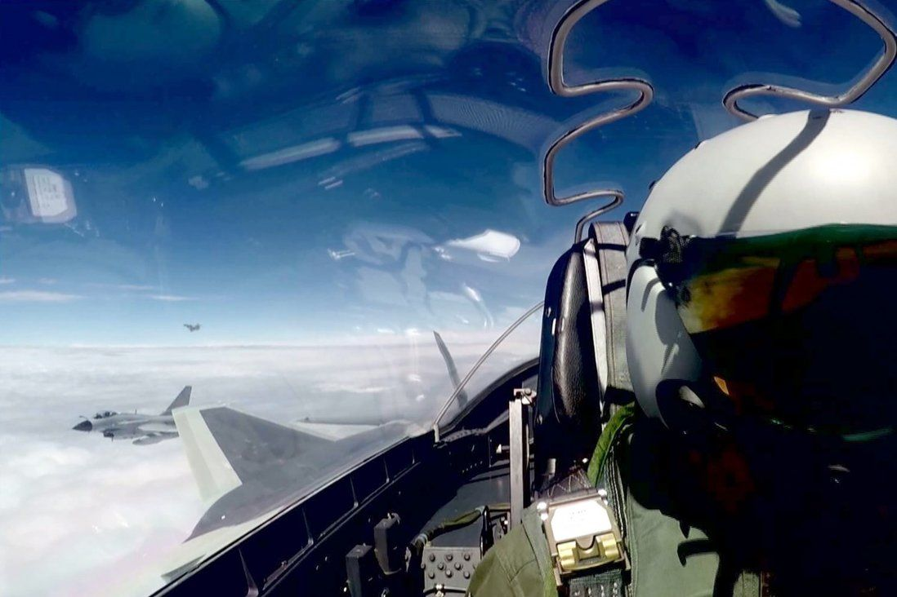

For most of my adult life, my country (one of them anyway, being a dual citizen between the US and Canada) [has been at war somewhere else in the world](https://www.aljazeera.com/indepth/interactive/2020/02/war-afghanistan-2001-invasion-2020-taliban-deal-200229142658305.html). But the experience of that war for American civilians was often ambiguous or bureaucratic, not tactile or kinetic.

Recently, the announced agreement between the Taliban and the US has been a sign that this defining conflict is drawing to a close, [but many unknowns remain](https://www.brookings.edu/blog/order-from-chaos/2020/03/04/on-afghanistan-give-peace-a-chance-but-be-wary-of-the-taliban/). Foremost amongst these concerns is how negotiations with the existing Afghan government will go (as they are not part of the US/Taliban negotiations). And the bigger question: what will happen to the rights and access that many Afghans have fought to establish amongst conflict, but outside of the Taliban’s day-to-day control.

Afghan women have particularly led these social changes, and have a lot to worry about with an unshackled Taliban. [While impressive strides have been made in women’s leadership](https://giwps.georgetown.edu/a-new-generation-of-afghan-women-leaders/), it’s often overlooked that the [status of women in Afghanistan had been progressive](https://www.amnesty.org.uk/womens-rights-afghanistan-history) prior to the Soviet-led coup in 1978. This event sparked the formation of an insurgent Mujihadeen and the eventual rise of the Taliban in the 1990s, and with their rise, the persecution of and restrictions on women they enforced. A rehydrated Taliban power in Afghanistan might mean that much of what women have fought for in the past decades will be repressed again, and those women and men who have led that fight will face retaliation.

Consider this in the context of the impressive design work emerging from Afghanistan — both tangible products and services supporting people. I want to draw attention to [The Anabah Maternity Center](https://aquietrevolution.emergency.it/#/introduction) as a bright spot in how vital service delivery — in this case reproductive care — in Afghanistan is meeting both the health and cultural needs of those it serves. Originally created and supported by the Italian nonprofit Emergency, [the site has really grown into something led and operated by women serving the needs of their own community](https://brightthemag.com/health-women-maternity-afghanistan-security-da7a37b8e0bd). In a country where the female working population is (and will be) recovering from years of repression, we can celebrate the design and implementation of a healthcare system led and staffed solely by women. They support other women who otherwise wouldn’t have any healthcare options because of patriarchal and religious barriers.

Good design doesn’t always come from those trained in design practices, but rather can emerge where a human-centered disposition comes together with a systems-oriented mindset and an inclination to make something tangible. Design training and a tested process certainly facilitate and make repeatable that emergence, but as designers, we can take a lot of inspiration from instances like Anabah: where its planners and operators performed great service design in the absence of a service designer.

That’s it for this week. As always, I’d encourage you to subscribe if you haven’t and [send me a note](mailto:alb@andrewlb.com) if you have questions or feedback!

## Security Blanket

[**Google denies link to China’s military over touch-screen tools that may help PLA pilots**](https://www.scmp.com/news/china/science/article/3017141/google-denies-link-chinas-military-over-touch-screen-tools-may)

An interesting look at how consumer UX expectations bleed into critical military and defense applications. Having been a product designer at the Pentagon myself, I can generally say that the state of military UX is pretty dismal EXCEPT for when it is mission-critical. In a culture obsessed with Job Boyd’s OODA loop, speed and efficiency for warfighters is a strong argument. Seeing how that is playing out in other militaries, I wonder if UX will become yet another front in great power competition.
