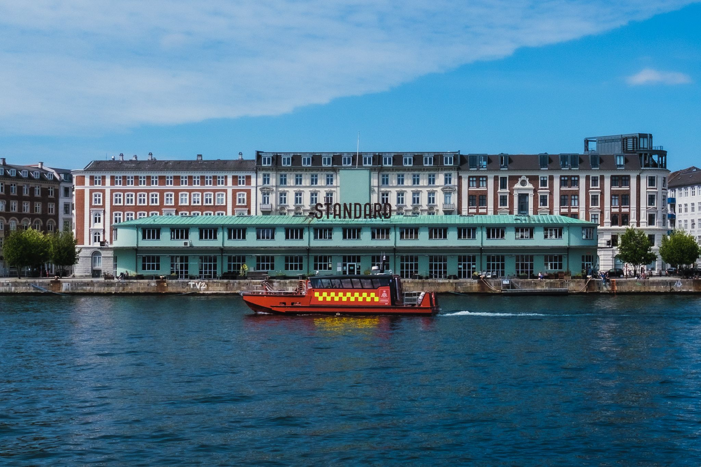
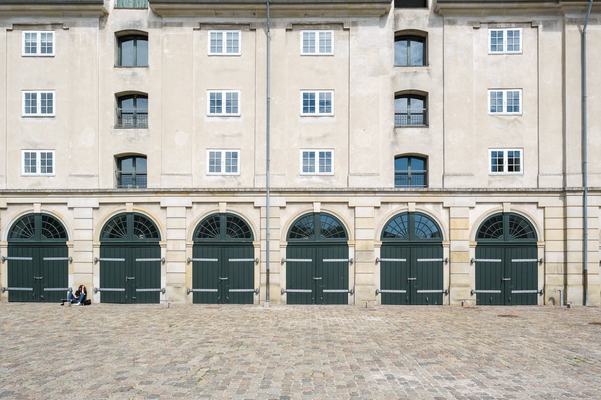
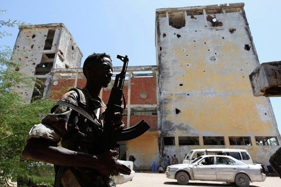

First, I want to share a point of gratitude. My small business, [Knowsi](https://knowsi.com/), was awarded the [Sage Ocean Concept Grant](https://ocean.sagepub.com/blog/tools-and-tech/concept-grant-winner-knowsi-interview) this week by Sage Publishing. Knowsi is a solo project I’ve been slowly developing over the past year with the goal of improving informed consent practices in user research. It still has a long way to go, but I’m incredibly grateful for the help of the Sage Ocean team as well as all the friends, colleagues, research participants, and customers who have helped Knowsi in its first year. The goal over the next bit will be to extend it to support social science research needs as well (as well as generally get it out of public beta, whatever that means).

Anyway, onwards.

There’s a certain flatness to things recently.

Being in a lockdown with a tenuous end date makes for the psychological equivalent of sitting in the back seat, asking “Are we there yet” to an equally puzzled parent. For most of us living in liberal democracies, this is the most sweeping form of state control many of us have experienced — barring incarceration and military service. While we strained against that control in different ways —from [right-wing protests in California](https://www.theguardian.com/us-news/2020/may/01/california-coronavirus-protests-huntington-beach-sacramento?CMP=Share_iOSApp_Other) to [pro-democracy rallies in Lebanon](https://www.voanews.com/covid-19-pandemic/lebanese-protesters-back-streets-despite-covid-19-lockdown) — the reality is that our leaders and institutions are as perplexed as we are: they can only read the signs on the road and actuate the vehicle of state incrementally along its existing path.

Decision making against the moving goalposts of economic and public health is at its core a challenge of perspective with existential consequences. I wrote an essay this weekend for a strategic studies course — the kind with nuclear weapons, hybrid warfare, and Prussian generals — and the only thing I felt I could write about was how narrow the idea of strategy can feel. Taken to an almost unhelpful level, strategy attempts to impose a kind of will or intent on complex systems that — by their very nature — resist such control. One example was in the lead up to the Iraq invasion in 2003 [which Robert Jervis describes in detail](https://onlinelibrary.wiley.com/doi/abs/10.1002/j.1538-165X.2010.tb00672.x). In his account exploring policymaker use of intelligence analysis, the central challenge was not that the Bush administration didn’t have intelligence and awareness about Saddam’s regime: but rather they so convinced themselves of a procedural solution to that complexity, that the only obvious choice was to invade Iraq — no other option would do. Strategy became a lens through which details faded and flattened into an utterly catastrophic decision. Perspective is a function of how refracting and reflecting light eventually hits our eye: it is situational, subjective, and temporal.

The other part of this is the lens through which your particular perspective is consumed. My friend Scott Young [wrote a piece for the Canadian magazine Macleans on Sweden’s response to the Coronavirus](https://www.macleans.ca/news/world/lessons-from-kronavirus-is-swedens-anti-lockdown-approach-more-strategic-than-it-seems/) this week, and he makes the point “No one would predict the winner of the Stanley Cup on the basis of Game 1 in the first round, so why do so many feel comfortable excoriating Sweden so early in this pandemic?” This is a distinctly Canadian metaphor, but it’s on point. From my vantage point in Denmark, I’ve looked at Sweden’s response with shock and concern (especially with close friends in Stockholm and Malmö, Scott included). But I also got a haircut last week as Denmark opened, and I shared the [numb terror](https://andrewlb.com/diverge-weekly-issue-7-the-gradual-opening-issue/) associated with sending my son to daycare earlier this month. In Scott’s article, he acknowledges that the Swedish stance is perhaps reckless, but how wide or narrow a lens we take dramatically affects the returned image.

A narrow [focal length](https://en.wikipedia.org/wiki/Focal_length) surfaces details further off and with greater specificity. It also might make different objects appear RELATIVELY closer than they actually are. Narrowing one's focus on a subject (to the exclusion of others) might pull a background object into the foreground as well, as tourists in Italy do as they use [forced perspective](https://en.wikipedia.org/wiki/Forced_perspective) to hold up the leaning tower of Pisa. The effect of this is to [distort the data](<https://en.wikipedia.org/wiki/Perspective_distortion_(photography)#/media/File:Nybldgs.jpg>) and force a differing interpretation of outcomes. The Bush administration fell victim to distortion by simplifying the complexity of Saddam’s regional defence, sectarian, and political posture in Iraq (and if this is of interest, honestly, read Kim Ghattas’ [Black Wave](https://www.amazon.com/dp/B07X4CK1FF). I’ve mentioned it a few times now, but it is brilliant). The inability to manage this unforeseen complexity, including [disbanding Saddam’s Republican Guard](https://www.theguardian.com/world/2003/may/23/iraq) and the guerrilla violence that followed, came in part from this narrowed scope. Of course, a wide lens can present its own problems. Too much information, ill-defined subjects, and distortion can leave the viewer unsure where to look and how to act. Same perspective, different lenses, different story, different strategy.

So back to this flatness I’ve been wondering about.

I think most of us have taken a very narrow view to this pandemic, albeit from a multitude of different vantage points. The result is conflicting narratives about what falls between our present and a distant object. [Everyone fears the second wave of infection](https://www.politico.eu/article/as-europeans-dream-about-beach-holidays-experts-worry-about-next-virus-wave/), but the vantage from Copenhagen with the Danish government feathering the economic breaks vs. Sweden with its potentially newly resilient population ([or potentially not](https://nymag.com/intelligencer/2020/04/we-still-dont-know-how-the-coronavirus-is-killing-us.html)) will present a very different story — even focused on the same object. It might also mean that the next few months will look incredibly different for the two countries, and certainly for every country around the world. While states may shape the outer bounds of our day-to-day experience, we still have great agency to “set up the shot.” And perhaps together — sharing our different experiences and perspectives — we can lend a bit of dimensionality to the unknown looming in the background.

## Security Blanket

[**The problem with militias in Somalia: Almost everyone wants them despite their dangers**](https://www.brookings.edu/research/the-problem-with-militias-in-somalia-almost-everyone-wants-them-despite-their-dangers/)

I thought this was pretty interesting. It’s not too often that articles like this recommend the acceptance and embrace of complexity. This article explores an important way to consider multilateral engagement in the context of vulnerable states: working with and collaborating with militant groups. Somalia has had a difficult ride. From the civil wars in the early 1990s, a popular kritocratic governing coalition — the Islamic Court Union — emerged but was undermined through foreign support for the weaker (and secular) Somali government. Of course, aspects of this were reasonable: al-Shabaab, a violent Jihadi group, was allied with the ICU, but its dissolution has further fragmented the Somali political landscape. Part of the issue at hand is that navigating the Somali political landscape comes down to negotiating with disparate forces whose power and position are incredibly fluid. For anyone looking to do work in Somalia —neighbouring regimes, an NGO, a superpower, or a terrorist group — that work comes at the cost of navigating a deeply complex web of relationships and power structures. But, it isn’t impossible.
