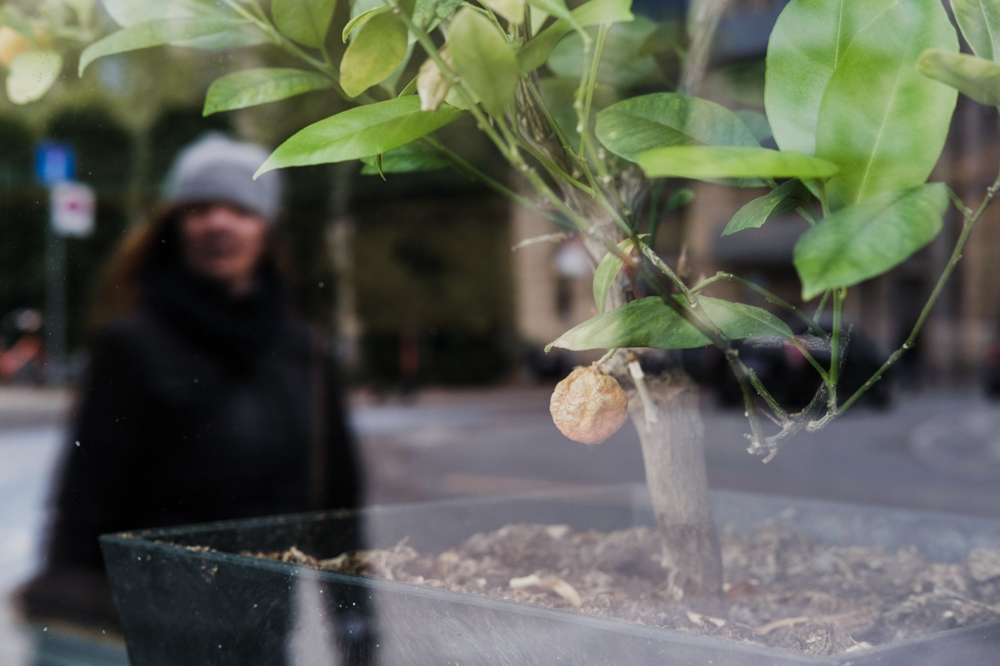
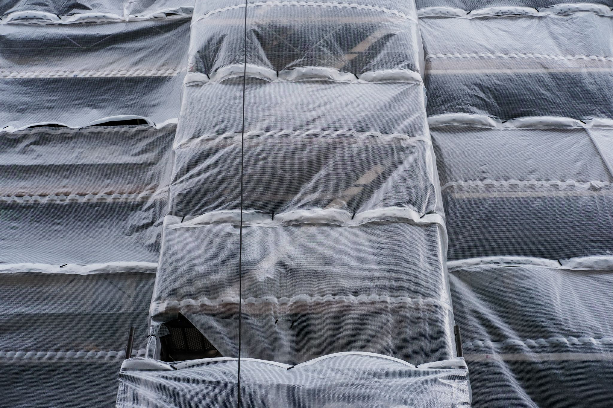
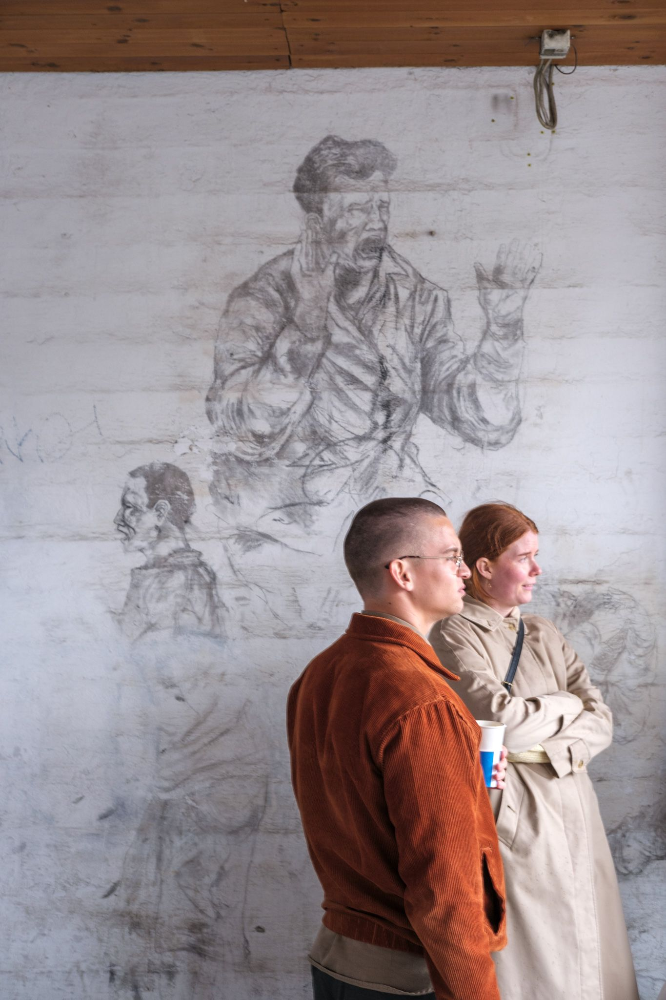
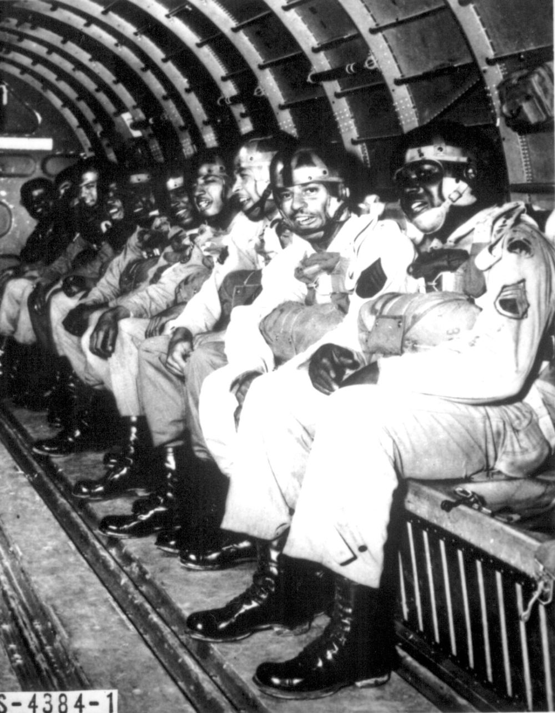

It’s been 70 days since my family and I hit “go” on our particular lockdown, only preceding the overall lockdown in Denmark by a few days. In that time period, a lot has happened for us and for everyone else, but it’s been consistently encapsulated anticipation — that we’re waiting to understand the road we’ll be on tomorrow. I’ve heard a lot of folk describe our current state as a kind of limbo.

A year and a half ago, I interviewed a number of people who worked with refugees and displaced peoples. One of these was Nick Hayes, who [wrote this article](https://www.theguardian.com/books/2016/mar/12/nick-hayes-graphic-artist-pictures-refugees-calais-camp-jungle?CMP=Share_iOSApp_Other) on his time volunteering at the Calais camps (colloquially known as The Jungle) in Normandy, France. Nick’s article comes to mind right now as I think about the cause and effect of anticipation.

For a refugee who finds themselves at the Calais camp, waiting is the imposition of a system against you. Many things can drive someone to migrate — war, hunger, opportunity, persecution — but that act of migrating suddenly situates you within a system that is both outside of what you can tacitly navigate, and often actively hostile to your social interface with it. Nick’s description of the Calais experience becomes one of waiting: for an opportunity to continue onwards, for something to happen, for strength to return, for a system to open. This is a limbo where you KNOW something is on the other side, and for reasons outside of your control, you don’t have access.

We are all experiencing a different kind of waiting. Instead of transitioning between systems and social contexts, we are instead seeing a system reshaped around us. The flash of anger when someone gets too close in a grocery store, the anxiety around consuming what was a few weeks ago a basic service, or even the recognition of “essential” labour within a society (and what that actually means) — all manifestations of our orbits being changed relative to some new and sudden phenomenon.

In Hyper Objects, Tim Morton describes a class of objects that are almost larger than we can understand, possessing a complexity that we can’t wrangle, aggregate, multidimensional, atemporal, etc. Climate change is one such example: a phenomenon that transcends time, space, and location yet is descending on us like a bomb (but we don’t know when). [Styrofoam is another](https://www.hcn.org/issues/47.1/introducing-the-idea-of-hyperobjects): physical, but lasting forever and accumulated beyond our control. Coronavirus is too, which [Morton pointed out on ](https://twitter.com/the_eco_thought/status/1234828156449759232?s=20)Twitter. In fact, one could argue that a pandemic as an abstract thing, and THIS pandemic are now independent — covid-19 having presented itself to society.

One quality of hyper objects is that they exert their own gravity: pulling other things with lesser weight off-kilter and transforming the world around them. We’ve already seen this with the refugee crisis of the past decade— for all the horrible dynamics of the Syrian civil war, there’s a strong argument that [climate change served as a primary factor](https://daily.jstor.org/climate-change-and-syrias-civil-war/). A friend of mine, Britt Wray, has spoken about this in her [research around climate change and anxiety](https://www.ted.com/talks/britt_wray_how_climate_change_affects_your_mental_health/transcript?language=en). We collectively sense what’s coming for us: whether we respond to that with denial, activism, or just slowly increasing blood pressure. That same force has hit us with Covid-19, which projects its own gravitational force today— bending existing plans and shifting our orbits towards previously unknown axes.

I’ve personally found that projecting a degree of objectivity overtop of the current existential threat helps. Not because I can do anything about It with a capital I, but rather because those things that I can affect are often highlighted against its surface, and likewise pulled into its orbit. We’re all waiting to see what our new orbit will be.

_A quick request!_ There’s a lot more of you than there used to be, and I would love to get some feedback. *If you have a few minutes, please* *[fill out this short survey](https://andrewlb.typeform.com/to/aQPfsG), and let me know what you think of Diverge.*

## Security Blanket

[**Of Course the U.S. Military Has A White Supremacy Problem. It’s Baked In. - War on the Rocks**](https://warontherocks.com/2020/05/of-course-the-u-s-military-has-a-white-supremacy-problem-its-baked-in/)

On the theme of waiting, this caught my attention. War on the Rocks is an interesting professional publication. It’s well respected in the American national security establishment, and many of its writers are colonels, generals officers, and senior officials currently or previously within the US Department of Defense. So when an article explicitly criticizing the long-term cancer of racism and white supremacy within the American armed forces, it’s a preliminary signal that perhaps things are moving in a better direction.

America has never really reconciled with its history of slavery and systematic oppression of black Americans. The result has been generations of potential undermined through active and passive discrimination, and a society that still bears an open, festering wound. But the military can — in principle — serve as an exemplar for a kind of cultural and historical healing. Through its hierarchal structure, the education of its officer corps, and the dispositional towards historical awareness of its members, I’d argue that it has symbolically and actually greater power than American federalism allows outside of the federal armed forces. With the role that the military plays as an employer and opportunity-creator for millions of Americans (there are currently 18 million veterans in the US), that change in who is celebrated in bases, statues, ship names, and heroics has the potential to create an enduring impact and perhaps shorten the wait for some kind of healing.
