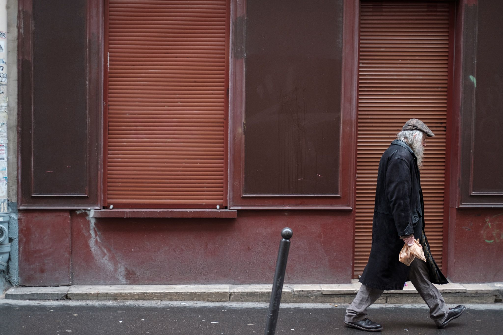
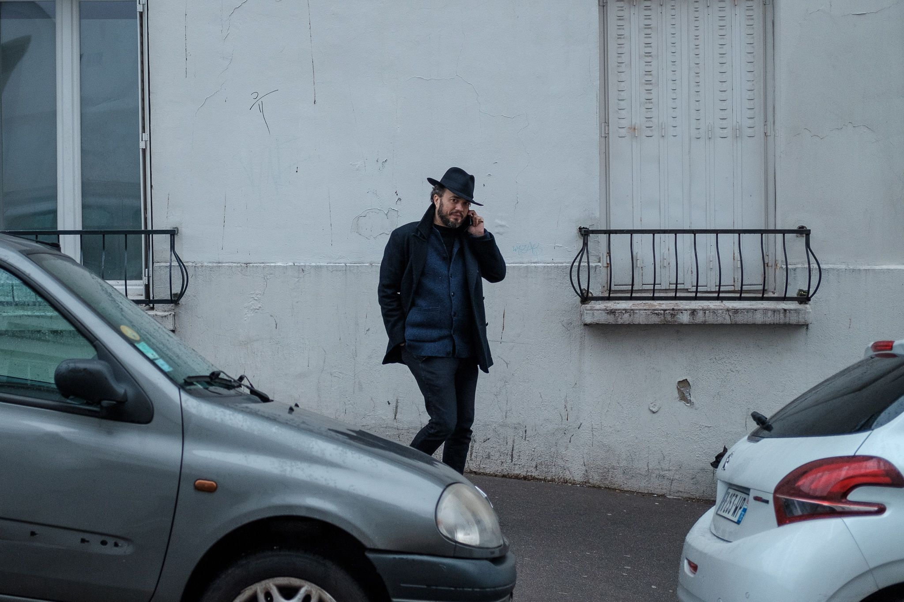
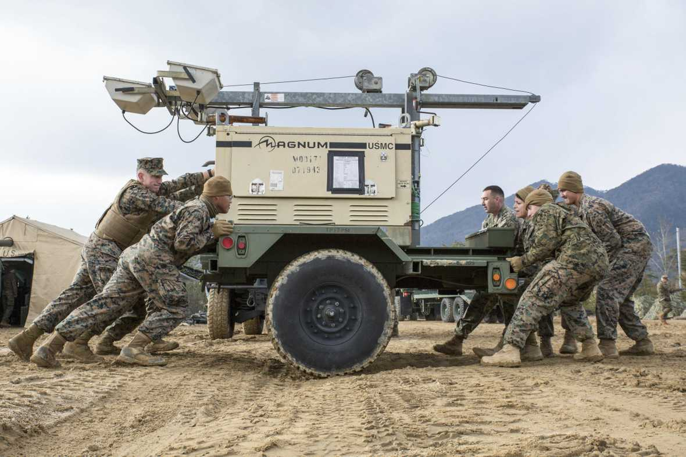

Being a creator of things — software, products, services, policy, etc — means navigating a world of constraints. There were two stories of constraints that I encountered in the past week which I wanted to share.

The first is about constraints on a geopolitical scale. My friend Chris introduced me to a new podcast called [Wind of Change](https://crooked.com/podcast-series/wind-of-change/), which explores the potential CIA sponsorship of a popular eighties power ballad pushing for European unification. It's an absolute trip (the type that starts with a reluctant listen followed by binging most of it), but it tells an interesting story of constraint.

Given the competition between American and Soviet blocs during the Cold War, many different mechanisms for influence spun out for lack of the more direct military one. Instead of the two nuclear-armed powers going toe-to-toe, competition occurred through proxy conflicts as with the Soviet engagement in Afghanistan vs. the CIA-backed Jihadis, and through foreign interventions in the domestic politics of polities across Africa, MENA, and LATAM. It also occurred through weaponized culture like posturing in chess and the Olympics, [smuggling banned literature](https://www.cia.gov/library/readingroom/collection/doctor-zhivago), and perhaps this particular power ballad. As justifiably divisive as the CIA can be, that such an innovation might have emerged from the constraints presented by the Cold War and the bureaucracy of the CIA is itself a fascinating mystery to explore.

Constraints create context, and context begets emergence. The speculation about the CIA’s involvement in a heavy metal band has some credibility partially because these clandestine agencies were scrambling to find ways of exerting influence when the old methods were no longer tenable options. The whole violent history of humanity skidded to a stop in the twentieth century when the nuclear sword of Damocles was strung up, but as far as states were concerned, that looming threat didn’t stop them from attempting to exert power and influence. Just… without cutting the string.

There are also those structural constraints that simply close options to individuals. As I mentioned last week, [Our Women on the Ground](https://amzn.to/36y6yOr) is a focused survey of those systematic constraints. A collection of essays by Arab female reporters, the book recounts many different experiences of becoming professional journalists in societal conditions that create incredible —sometimes violent— friction towards those identities.

A favourite was the essay by Amira Al-Sharif, a Saudi photo journalist who grew up in Yemen. One of her stories recounts being stopped and detained because she wasn’t traveling with male relatives — and was forced to sign a statement acknowledging that doing so was considered “shameful” in the eyes of the state, or at least the eyes of that agent of the state. Because of her interwoven identities — as a someone who grew up in Yemen, as a woman, as a reporter, and as someone against whom an armed authority figure projected a paternalistic power structure — the scope of what and where she can report, and ultimately who she is able to be, becomes inexorably constrained. And yet, reading her essay and her included photography, these constraints have also given her a lens and sensitivity that empowers her to tell stories and capture photos no one else could.

Amira and her fellow authors in Our Women on the Ground expressed and created as fervently as they could — each encountering different and overlapping constraints in their individual countries, cultures, and communities. Lina Attalah, founder of [Mada Masr](https://madamasr.com/en), writes of her evolving relationship with her father, relative to her identity as a feminist, an activist, a journalist, and an entrepreneur in Egypt. That consideration helped her find a point of connection as well: wondering how the constrained expectations the state had imposed on her father trickled down to her experience with him and the construction of her own identity.

All of this to say that some strange, terrible, and wonderful things can emerge from constraints. People become who they become; designs resolve with the needs, resources, and context at hand; and sometimes a particular geopolitical strategic context begets some chart-topping power ballads. Thinking about the constraints from which something or someone emerges IS ultimately the story.

## Security Blanket

[**Women in Combat: Five-Year Status Update | Center for a New American Security**](https://www.cnas.org/publications/commentary/women-in-combat-five-year-status-update)

Very American centric, but an interesting survey on the role of women in the combat arms of the US military. Structurally there remains a huge number of barriers, and the military does appear to be making steps towards opening up those roles.

The section on the special forces community is worth considering. Women have always worked with special forces teams, but often as outsiders or support personnel. In the US military, SOF has its own procurement and healthcare system that supports the increased risk its members face, and many of those support roles which can face the same risk don’t get the same level of care if they get hurt, or quality of equipment to prevent injury in the first place.

So. This is worth keeping an eye on. Countries like Norway and Israel both include women in compulsory conscription, Russia has historically seen considerable female participation in combat roles, and Canada opened up all roles to women in the eighties with our charter of rights and freedoms. As the largest military in the world slowly catches up, it will be interesting to see how it navigates that evolution and how that trickles down into society as a whole.
