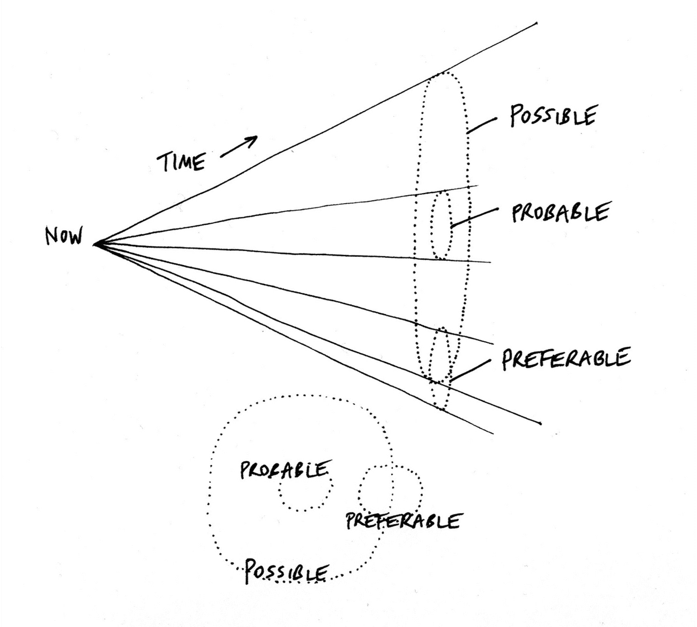
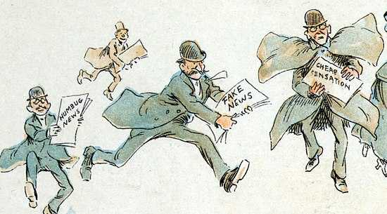

Last week, [I wrote about the balance of intervention and foresight](https://andrewlb.com/diverge-weekly-issue-2-the-global-pandemic-issue/) in a design-based response to the coronavirus pandemic, and closed with the William Gibson quote “The future is already here — it’s just not very evenly distributed.” We are all experiencing Covid-19 on different schedules and scales, with Italy being the most egregious case and with [America marching blindly into its wake](https://www.politico.com/news/2020/03/24/trump-wants-to-restart-economy-by-mid-april-146398). _This means that our individual construction of the future in this pandemic is relative to our own experience and belief about the future_ and that relativism is the focus of this week.

Here are three ways that I see this being constructed:

**1. An act of Apprehension**

I’m in Denmark right now and writing this on Saturday, March 21st. My wife, my one-year-old son, and I have been self-isolating for 10 days, as have many of our friends. We were early in preparing for this lockdown, and this apprehension is a judgement of risk relative to the array of possible futures at the point of decision, and making a “best guess” for which set of possibilities we should prepare. We might have felt pretty dumb pulling our son from daycare a few days early if things had turned out fine, but since [I’ve worked remotely for two years now](https://andrewlb.com/writing/remotework/) we had the right tools and support set up so that the cost of being wrong was effectively my son joining a few video meetings and my exhaustion. Ultimately, an act of apprehension can go either way and is a gamble on trying to position oneself along a more preferable future.

**2. An act of Mitigation**

Only yesterday, my university in the UK announced that they were closing the school and modifying distance courses: despite the fact that by percentage of the population, [the UK has a higher rate of cases than Denmark](https://cream.io/?m=tcpp&r=United%20States%2C-45&r=Italy%2C-35&r=South%20Korea%2C-31&r=Denmark%2C-45&r=United%20Kingdom%2C-45&s=log&z=3) – even with Denmark being in lockdown for over a week. As cases and deaths grow, [PM Johnson’s reactions have been compared to that of the Mayor in Jaws](https://www.theguardian.com/commentisfree/2020/mar/20/coronavirus-myth-economy-uk-business-life-death), keeping the beach open for tourist season despite a murderous shark in its waters. Here then, our action and judgement is responsive to independent variables and driven by the same. Apprehension may drive our consumption of information, but the action of mitigation is only to offset the damage that is already being done.

**3. An act of Ignorance**

The most worrisome trends are where no action is being taken at all or the threat is seen as negligible. In Denmark, I was shocked to see folk pushing past each other while grocery shopping and the school closure being seen as an excuse to party, not shelter. This aligns with the stories of [American students congregating on beaches for spring break](https://www.bbc.com/news/av/world-us-canada-51955362/us-students-party-on-spring-break-despite-coronavirus), or worse, [exposure by those attending the rallies of Brazilian president Bolsonaro](https://politica.estadao.com.br/noticias/geral,bolsonaro-tem-contato-direto-com-ao-menos-272-pessoas-durante-ato-mostra-video,70003234397). This route is either willful or unintended: resulting from a dearth of information or — worst of all — given the information available, doing nothing or doing harm.

The problem with these three actions is that they reflect an inflection point that is being considered by everyone: informed by their lived experience, their state of mind, societal pressures, and access to resources. My decision to self-isolate 10 days ago might have occurred at the same moment in time as someone’s decision that spring break was a great idea.

But these decisions and actions have a vital influence on our future and the outcomes we march towards. Design futurist Stuart Candy is well known for his Cone of Possibility, a rendering of the present squeezing a series of potential futures through its aperture. The question is: when does the future catch up and which set of actions lead us to what is preferable?

If we’re looking at the longer tail of this crisis, apprehension, mitigation, and ignorance might not be all that different in terms of collective outcomes, but they ARE decisions that we make. This pandemic is a collective action problem: individual actions might offset or buffer one from the worst (or in the case of the spring breakers, drastically increase their own and others’ risk), the aggregate outcome is still likely to be the same. But then the question is, at what scale?

If individual action is smoothed over from the lens of the aggregate action or inaction of others, then I would argue that the route to designing an intervention is to _identify the scale and scope of intervention_ so that one's actions have an outsized effect. Is it the country? The state? The community? The family?

Consider [the open source community’s effort to expand access to life-saving ventilators](https://github.com/PubInv/covid19-vent-list). We don’t actually know yet if this work will do anything particularly productive, but it is a fervent and well-organized effort to try and do something with the scope that one has. [There are dangers and risks](https://www.vice.com/en_us/article/5dm4mb/people-are-trying-to-make-diy-ventilators-to-meet-coronavirus-demand), but perhaps the communal contribution at the appropriate scope can cover that, and perhaps this can multiply the impact at a local level in communities with maker spaces or universities.

While we may be trapped at a point in a cone hurtling towards a future we can’t really comprehend, I’d argue that we — designers and design-adjacent creators engaged in a practice that is fundamentally participatory — are incredibly well situated to identify our scope of impact and organize around it. Design might not have a “seat at the table” (I hate this term so, so much) when it comes to policy-decisions right now, but we can contribute and organize locally.

Look to [Zahra Ebrahim’s Covid-19 Toronto app](https://covidto.glideapp.io/) and the [google doc that she coordinated to bring it all together](https://docs.google.com/spreadsheets/d/18IAn2bwZeYj2Oy9TdGCO8wB3w3lv3wnLMpyzEYFfWDI/edit). As a leader in Toronto’s design community, she turned to her network to identify the needs and resources of her home, but with a designer’s person-centered bias created something of real value.

Zahra’s work might shift Toronto’s future in a particular way, and if that process can be replicated ten thousand fold around the world, our family, community, state, country, and civilizational outcomes will be so much better.

If the future isn’t evenly distributed, how might we distribute the right future more evenly?

On that note, my wife and I [created a very bleak, no-fun game to try and predict and prepare for potential futures](https://andrewlb.com/covid-anxiety/) this past weekend. It’s a **simulator and scenario generator for what might come —for you, specifically— in this pandemic**. Despite being a game, as my description of our first play-through indicates, the results were exhausting (but useful). I encourage you to give it a try.

## Security Blanket

[**How Coronavirus Scammers Hide On Facebook And YouTube**](https://www.bellingcat.com/news/rest-of-world/2020/03/19/how-coronavirus-scammers-hide-on-facebook-and-youtube/)

The rise of large scale, low cost, multi-actor, and wildly decentralized disinformation campaigns is one of the greatest security threats of our present era. Why? They frustrate meaningful engagement in collective action problems like a national political process or — just by way of example — global pandemics. They do this to the point of paralysis. Bellingcat paints a striking picture of what I believe is **one of the greatest design failures of the 21st century**: the capacity for contemporary disinformation campaigns (and individual actors) to permeate and diffuse the major social networking platforms that so eagerly embraced human-centered design in their inception and growth. I’m inclined to believe that the various platforms _are_ trying to do better (perhaps not so far as good), but assuming this, their inability to effectively combat disinformation is telling.
