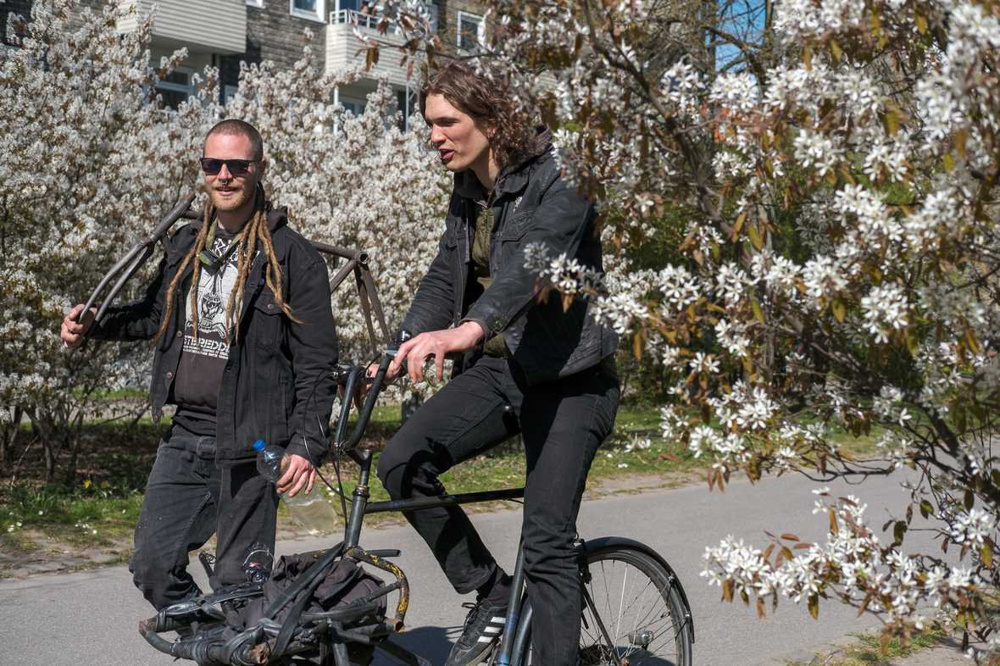
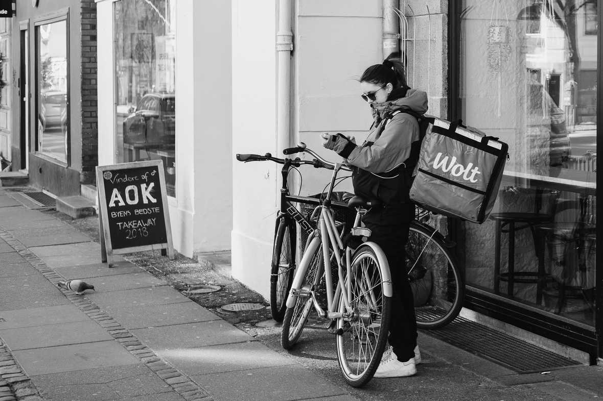
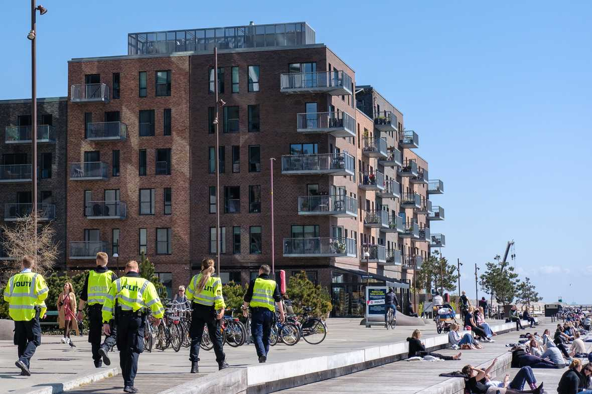
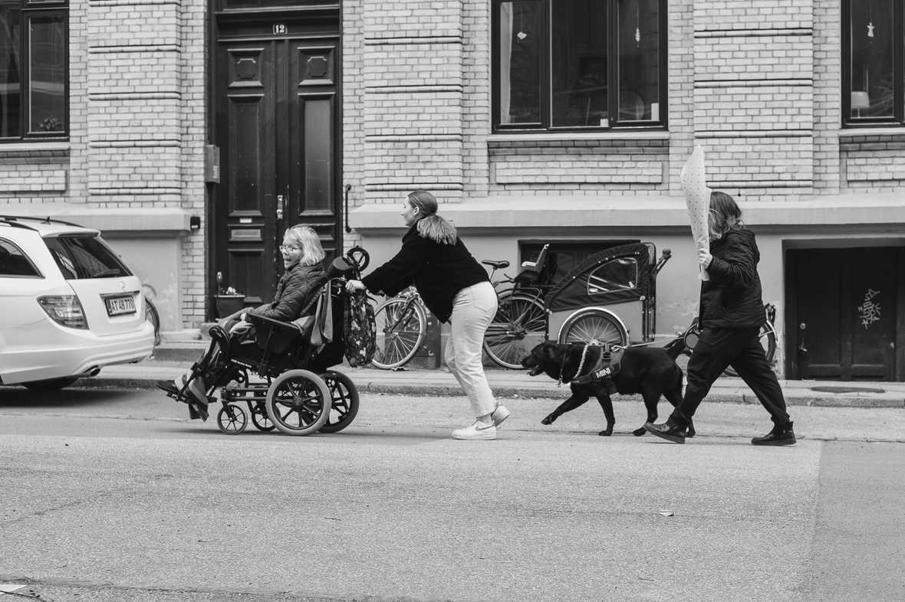
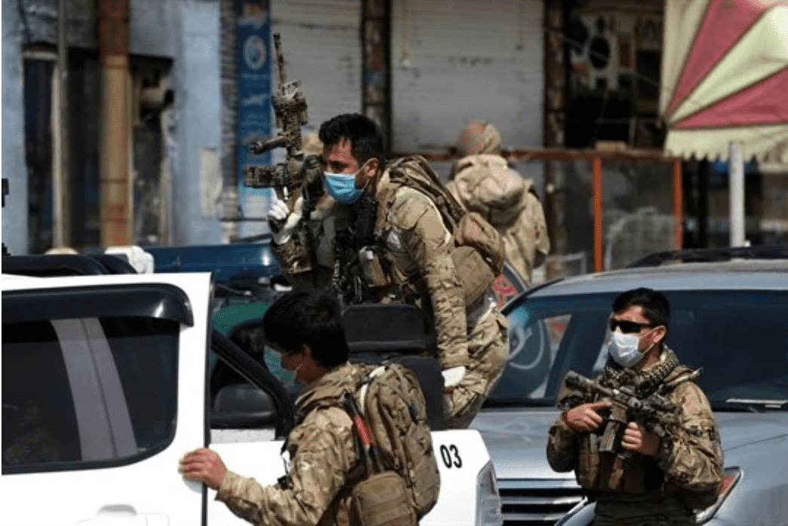

First, thank you and welcome to all the new subscribers, and to [Hillary Predko](http://hillarypredko.com/) for sharing Diverge in [The Prepared](https://theprepared.org/). This is a weird newsletter that aspires to be about design and global affairs — but I take some latitudes.

The pattern of my day-to-day life is mostly contingent. It rests on the physical infrastructure that makes urban living possible. It is attuned to the temporal and interpersonal nature of knowledge work. It is capillary to the logistics of on-demand consumerism and [platform capitalism](https://amzn.to/3b5wjGt). And it sets tempo to the increasingly stressed network of labour that empowers my own specialization.

Over the past months, those dependencies have started to show their cracks. I recently had my Gore-Tex jacket fail, and so the weird properties of Gore-Tex have been on my mind.

As designed, the multiple layers of Gore-Tex work together to keep you dry and climate-controlled in some pretty grim conditions. It has the remarkable property of being both waterproof and breathable — allowing moisture to pass away from your body while also preventing water from entering. Also durable, light, etc etc. It’s magic. Having been trapped for hours in a mid-May downpour while bike camping in Sweden, I love Gore-Tex.

But it’s also a fragile fabric. After only a few wears, the body’s oils and dirt will start to permeate the fabric, causing the laminate of different materials that provide for these unique properties to shear off — [bubbling up and giving the garment an almost organic appearance](http://tectahoe.com/delamination/) as it delaminates. Repeated use and friction can cause the tape that prevents seams from leaking to peel away, while improper care will undermine the jacket’s first line of defence — a hydrophobic coating called [Durable Water Repellant](https://en.wikipedia.org/wiki/Durable_water_repellent) — and cause the entire garment to soak through.

Taken together, Gore-Tex is a pretty complex material that relies on and leverages multiple systems to perform its function of keeping its wearer dry, INCLUDING the labour and consciousness of its wearer. Failing to wash the jacket, or to properly care for its DWR coating leads to a systemic failure and a wet inhabitant.

The past few months have taught me about the fragility and interdependence of so many of our systems — especially those systems that underpin our own identities. Part of my identity is being a bit frenetic — constantly reading, writing, making, exploring. Not necessarily anything good, or particularly long-lasting (my short-lived foray into woodworking being an example of this), but it’s part of who I am.

However, the liberty to be that frenetic comes with an absurd web of dependencies. It’s facilitated by leisure time that comes from position, job expectations, and a certain earning power — itself constructed of a lucky mix of skills and interests within a market, and the cultural narratives around their value. It’s purchased with the labour of others: those who deliver groceries and meals when my wife and I are too exhausted to cook; the incredible childcare workers who care for and teach our son during our workday; the front-line retail and service workers whose work supports the enterprises who end up being my clients — this list can go for a while.

When the coronavirus hit and things shut down, it was like that taped seam ripped or the DWR failed: the bubble built around me wetted through and suddenly the contingent identity was compromised. For me, the dependence on childcare and absolutely catastrophic impact of working full time while caring for a one-year-old was my untaped seam. The fatigue and stress undermined everything else. With daycares now open, I think about this weakness every single day.

In many ways though, I like having these dependencies. I love what I do (whatever it is that I do), and am massively grateful for the repeated opportunities to do it (whatever that might be). Having someone to thank, to be connected with, and to follow the trail of their experiences as well — these are wonderful things. As is having someone else think about where I get my water 99.9% of the time. Human and physical infrastructure facilitates that opportunity. But the current global crisis — in its utterly tragic and freakishly muted way — is surfacing the stories of where those dependencies suddenly end. [When we played our catastrophe forecasting game](https://andrewlb.com/covid-anxiety/) last month, it also gave my wife and I the chance to game out how that disappearance of resources and infrastructure might transform our own lives.

So. I’m not quite sure what to do with this anxiety. But the thing that came to mind was perhaps how to be comfortable in dependency but resilient to insecurity. Kind of like a prepper with good healthcare — building resilience where it makes sense to build resilience, and reinforcing dependencies where it makes to reinforce those dependencies.

Stockpiles that lend resilience might be an appropriate amount of food, a medical kit (and the knowledge to use it) for your family and your neighbour, some liquid assets wherever possible, and contractual relationships (rent, subscriptions, debts) within whatever means might be possible. Dependencies to cultivate might be a good relationship with a family doctor, friendships built on shared labour and goals, the maintenance of a shared building or public space, and healthy engagement in local political institutions.

Of course, all of the above is itself contingent. A meaningful relationship with your doctor is unlikely to develop if a single medical professional is covering an impossibly large community. [Contractual relationships like employment are difficult to navigate when power asymmetries undermine one's options](https://www.tbray.org/ongoing/When/202x/2020/04/29/Leaving-Amazon). Liquid assets can scarcely be accumulated without a market that values your labour, or fails to compensate you fairly for it.

A Gore-Tex jacket properly cared for will last you a long time. But getting that jacket in the first place —with the protection it affords and the opportunity to care for it— is a lucky and privileged thing. I do think about the weakness that the coronavirus exposed daily, but I also think about the strengths and imbalance that it surfaced. After all, a failing motor that sputters to a halt still takes you a bit further down the road through simple momentum. And so I think we’ll see that the catastrophic failure of a business will still facilitate opportunities and networks that can cushion its beneficiaries from absolute destitution. Hopefully too, a tragically undermined social safety net in the US will still provide citizens with a small economic buffer — [even if it comes with the mad king’s signature](https://www.nytimes.com/2020/04/14/us/politics/stimulus-check-trump-signature.html). If nothing else, this crisis has taught us that having access to and wearing the right protective gear saves lives.

So I’ll continue to build dependencies even with their fragility: My life has been richer and stronger for it. But within that web, I’ll strive to [at least see those dependencies for what they are](https://amzn.to/2LaUKYd), to adjust those relationships as they evolve, and to build in the redundancies that support my community, my family, and my ability to be who I am.

## Security Blanket

[**Making Sure Peace Isn’t a Casualty of COVID-19 in Fragile States**](https://www.worldpoliticsreview.com/articles/28734/making-sure-peace-isn-t-a-casualty-of-covid-19-in-fragile-states)

This article is a great overview of where dependencies are suddenly failing, leaving weakened communities and threatening the central institutions of peace. From day-labourers cut out of vital work in Afghanistan to East Timor seeing its financial safety-net pulled out from under it — fragile and developing states around the world are seeing their citizens’ most fundamental expectations about government and their lives tested in ways that are unfair and could have been at least buffered. Not working for a day without any savings leave you hungry and weak, not working for a few days leave you desperate. A weakened community and a weakened state are unable to fill the gap, and we might see desperate people do desperate things.

This article has a number of recommendations and principles about how the international community can help avoid the worst outcomes — with all sectors having a part to play from commercial services to religious communities to public sector entities. Dependencies often go both ways: debt holders don’t want to see countries bearing the debt default; nor do they want to see the humans who constitute those nations thrown into even greater chaos (one hopes, anyway). And so discussions of debt relief on the national scale could be a vital pressure valve for otherwise terribly leveraged developing economies.
