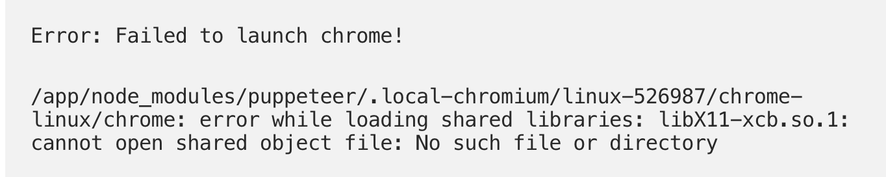
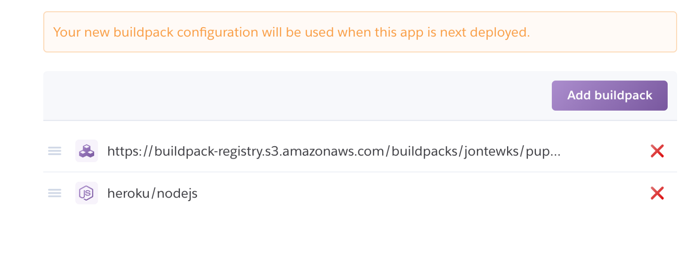

Get your modern CSS rendered right with Heroku, Puppeteer, and Styled-Components.

Sometimes, you really just need a nice PDF.

As I’ve been developing [Knowsi](https://www.knowsi.com/), one of the things that emerged from my research with design researchers is that **hard copies are a necessity**. Sometimes it’s a legal policy within the company to keep hard copies, sometimes it’s a lack of trust in digital systems. There were enough reasons that for the Knowsi launch, I needed to have an easy PDF export.

Knowsi is a NextJS SSR application, and follows a model where you wrap your components and application so that it can be rendered server-side before being served to the user.

I figured that given this server-side rendering, simply rendering that stream to a PDF file would be pretty easy. I was both right and wrong.

I started by looking at [this post by Stanley Folk](https://medium.com/@stanleyfok/pdf-generation-with-react-componenets-using-next-js-at-server-side-ee9c2dea06a7) as a launching point, and tried this function he shared that uses html-pdf as the PDF rendering solution:

```
> import { renderToStaticMarkup } from 'react-dom/server';
> import pdf from 'html-pdf';

> const componentToPDFBuffer = (component) => {

> return new Promise((resolve, reject) => {
> const html = renderToStaticMarkup(component);
> const options = {
> format: 'A4',
> orientation: 'portrait',
> border: '10mm',
> footer: {
> height: '10mm',
> },
> type: 'pdf',
> timeout: 30000,
> };const buffer = pdf.create(html, options).toBuffer((err, buffer) => {
> if (err) {
> return reject(err);
> }
> return resolve(buffer);
> });
> });
> }

> export default {
> componentToPDFBuffer
> }
```

I ran into a number of issues with his approach though.

1. I wanted to create something application wide, vs. specific to a single page or component as described in his example.

2. CSS styles wouldn’t render easily.

3. When I did eventually get them render (see below), it failed to render flexbox and grid layouts.

So something had to be done, but I had to slog through each party to figure out what.

## **Getting the HTML**

When I tried to implement this in my \_document.js component (which is the override for the default rendering wrapper in NextJS), it choked and wouldn’t return either the compiled document or really anything else. I could get the demo to work, but not in my application.

This ultimately ended up being a good thing, forcing me to dig into the meat of how Document, Head, Main, and NextScript actually work, which got me to my eventual solution.

I settled on this approach for rendering out a PDF of the entire page by setting up the render in getInitialProps on the \_document component:

```
> static async getInitialProps(ctx) {
> const { req, res, query, renderPage } = ctx;
> // Setup
> const sheet = new ServerStyleSheet();
> const page = !pdf
> ? renderPage(App => props => sheet.collectStyles(<App {…props} />))
> : renderPage({
> enhanceApp: App => props => sheet.collectStyles(<App {…props} />)
> });
> const styleTags = sheet.getStyleElement();
> // Setup PDF
> const pdf = query.pdf === “true”;
> const server = !!req;
> if (server && pdf) {
> const initialProps = await Document.getInitialProps(ctx);
> const css = sheet
> .getStyleElement()
> .map(e => e.props.dangerouslySetInnerHTML.\_\_html)
> .join();
> const buffer = await pdfHelper
> .componentToPDFBuffer(
```

```
<html
lang=“en”
dangerouslySetInnerHTML={{
__html: `
<head><style>${renderToString(css)}</style></head>
<body>
<div id=“__next”>
${page.html}
</div>
</body>
`
}}
/>
)
.catch(function(err) {
console.log(“Error generating pdf”, err);
});
res.setHeader(
“Content-disposition”,
`attachment; filename="test.pdf`
);
res.setHeader(“Content-Type”, “application/pdf”);
res.end(buffer);
}
return { …page, renderPage, styleTags, pdf, server, query };
}
```

In this case, my big challenge was how to render out the CSS. Because I’m using Styled Components, I had to get the style elements, retrieve the rendered CSS itself from the styleTags element, and then put it in a format that would render as plain CSS. Then I could insert it into a head tag, and simply serve the static HTML to my PDF function. Ultimately, this will let me manipulate the PDF document structure down the road a bit if I decide to add footers or similar styles.

Great. This works, I’m ready to move on.

## **Getting the PDF**

Immediately, I ran into trouble with html-pdf.

It uses an older library called PhantomJS to render the HTML and export the actual PDF. It’s part of a set of headless browser-based testing tools, of which Selenium and Headless Chrome are also members.

Because phantomJS is an older tool, it didn’t include support for more modern CSS tools like Flexbox and Grid, both of which are used throughout the application. So what to do?

PhantomJS was a non-option, but I kept the shell of the application and explored Headless-Chrome and Puppeteer instead. After a bit of experimentation, I landed on this revised version of Stanley Folk’s original function.

```
import { renderToStaticMarkup } from “react-dom/server”;
import { devfrontend, prodfrontend } from “../config”;
import puppeteer from “puppeteer”;const componentToPDFBuffer = async component => {
const html = renderToStaticMarkup(component);
const browser = await puppeteer.launch({
headless: true,
args: [“—no-sandbox”, “—disable-setuid-sandbox”]
});
const page = await browser.newPage();
await page.goto(
process.env.NODE_ENV !== “production” ? devfrontend : prodfrontend
);
await page.setContent(html, { waitUntil: “networkidle0”, timeout: 30000 });
const pdf = await page.pdf({
format: “A4”,
scale: 0.75,
printBackground: true
});await browser.close();
return pdf;
};export default {
componentToPDFBuffer
};
```

Let’s quickly walk through what’s going on here.

1. We receive the raw html from \_document.

2. We spin up an instance of puppeteer, with the arguments of no-sandbox passed. (This is not great, see below)

3. Set up a new page with newPage() and navigate to your root with goto(). This is necessary for any relative links (like images) to get fetches.

4. Pass the content to the page to be rendered with setContent and make sure it WAITS for the images to be downloaded appropriately.

5. Render the PDF

6. Close the browser

7. Return the buffer to the requesting client.

Simple and quick.

One point on the no-sandbox side. This is the fix that comes recommended by most of the internet for dealing with Puppeteer’s weirdness when deploying alongside a node instance. It’s also pretty obviously a big security hole, which [puppeteer itself identified](https://github.com/GoogleChrome/puppeteer/blob/master/docs/troubleshooting.md).

Because this is taking place 100% with owned content the buffer is being rendered and served by the node server itself), and I’m not rendering any external content, it seems like a viable option for my purposes, but I would strongly recommend not trying this if you’re going to use Puppeteer to render an external site, as with a link resolver or if you’re building a responsiveness checker, those kinds of things. [Here’s some more discussion that I’d suggest exploring.](https://stackoverflow.com/questions/50662388/running-headless-chrome-puppeteer-with-no-sandbox)

##

## **Getting it Deployed**

The next hurdle was getting this thing deployed on Heroku. When I went to deploy staging, it uploaded nice and fine and thennnnn rendered nothing. Shit. Turns out that the whole puppeteer library was missing.



Thankfully, there was an easy fix for this. Jon Tewksbury had put together a Heroku build pack to address this particular challenge.

An important thing here: **DO NOT USE** **heroku buildpacks:set** **(like I did) to install this thing.** Use buildpacks:add instead. Set overwrites what you already have, and in this particular case, will usually prevent node from being detected. [There’s a long and tragic thread to this effect](https://buildpack-registry.s3.amazonaws.com/buildpacks/jontewks/puppeteer.tgz) so just be forewarned. It will cause the puppeteer library to be built, and your node app won’t be built in this case.

Here’s what worked for me in my package.json:

```
> "buildpacks": [
> {
> "url": "[https://buildpack-registry.s3.amazonaws.com/buildpacks/jontewks/puppeteer.tgz](https://buildpack-registry.s3.amazonaws.com/buildpacks/jontewks/puppeteer.tgz)"
> },
> {
> "url": "[https://codon-buildpacks.s3.amazonaws.com/buildpacks/heroku/nodejs.tgz](https://codon-buildpacks.s3.amazonaws.com/buildpacks/heroku/nodejs.tgz)"
> }
> ],
```

You can also easily set this up in the Heroku UI by navigating to your app → Settings file, going to build packs, and adding the above build packs manually (her latter is just heroku/nodejs)



This order ensures that the puppeteer library builds first, and then your app builds second. I suspect that a Procfile would work here as well, but I prefer to keep all my build info in package.json.

After that, everything worked and I can now build any pdf file by simply add ing pdf=true to a query string.

My solution is far from perfect, but this method is a great way to do things like individual exports, and in Knowsi’s case, we need to be able to export all consent forms and media information in the event of a GDPR request or the closure of an account. This provides an easy and secure way to accomplish that.

**Speaking of, are you doing user research? Why not give** [**Knowsi**](https://www.knowsi.com/) **a try. Knowsi is the best way to manage the relationship between researchers and participants.**


_This article was originally published in [**Medium**](https://medium.com/knowsi/exporting-pdfs-with-next-js-714735f0a473)._
a
