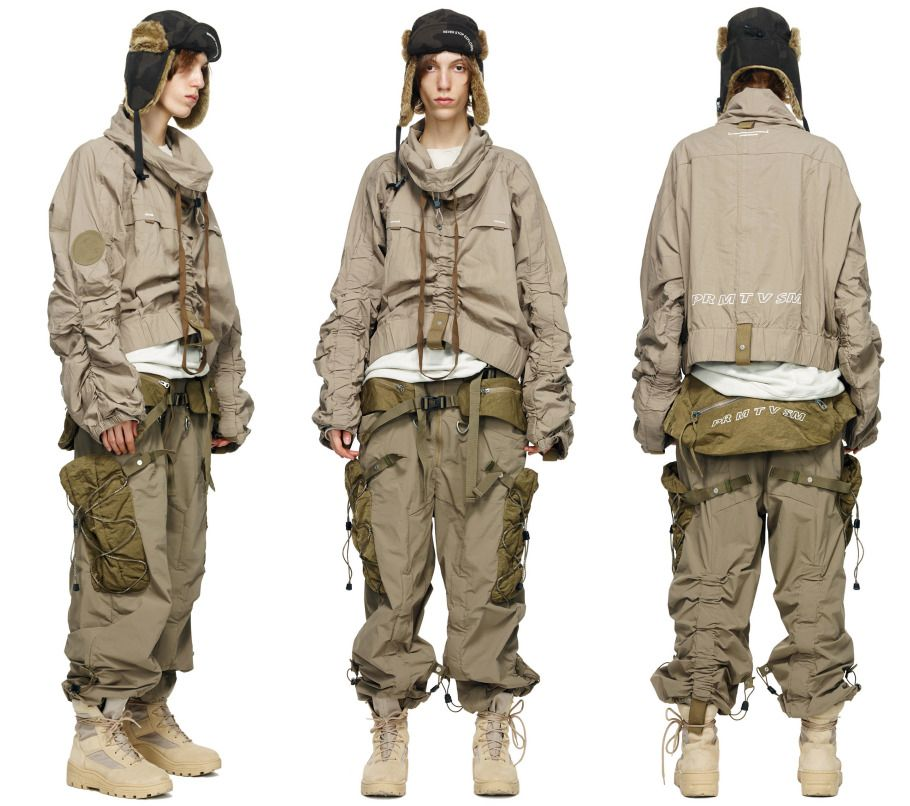

This essay was originally published on the** [TCHWR blog](https://www.tchwr.com/2021/01/03/full-hamcus-finding-the-spark-in-scifi-workwear/).**

[Hamcus](http://hamc.us/) is not a techwear brand in the traditional sense. Rather, it is a science fiction workwear clothing brand based out of Guangzhou, China that has embarked on a particular type of world creation. To wear my bias on my ([insanely constructed, multi-paneled, and enormous) sleeve](https://stupidfits.com/group/4/hamcus): I love Hamcus. As a consumer and follower of Hamcus, and as a designer myself, I feel as though I’m seeing the kindling of a fire that’s just starting to catch — at the threshold between spark and cultivation, with a million perils. So this is a short essay about hope.

N.K. Jemisin’s novel [_The Fifth Season_](https://bookshop.org/books/the-fifth-season/9780316229296) begins with two endings: the end of an individual’s story and the end for a continent and its people. This introduction is predicated on a reality for that continent: that every few decades or centuries, the world ends. When the world has ended before, and will end again before too long, society ends up looking quite different.

## World-building

Designer Tuff Leung founded Hamcus in 2015, and as I’m writing this, at the end of 2020, its primary line PRMTVSM is built on a concept similar to Jemisin’s. The story is situated in the universe of Primus, and [Tuff and his team have been exploring their design work through a world-building system called the “Cosmo Character Style System”](https://drive.google.com/file/d/1dhPYh4jR4KxRinx00q_qDq2HTb1swYS3/view) which grants them two great benefits. It provides a system of constraints to design a faction around with its own rituals, symbolism, and back story. Further, it provides for the creation of a hero character for whom the flagship pieces are designed and around whom the story ticks forward. The recently released [DarkSeer ](https://hamc.us/collections/20_02_aw/products/om01220-1-bk)jumpsuit is an example of this.

In _The Fifth Season_, Jemisin tells the story of a world where an environmental apocalypse is always around the corner, and so its societies and traditions are built accordingly. In times of plenty, trade and tolerance flourish, whereas during the fifth season, surviving communities and individuals take to the road, fleeing calamity and surviving as best they can. By way of example, the backpack features prominently in the book as an artefact which so much depends on.

While less complex of a story, Hamcus takes a similar track. They look to the PRMTVSM universe and start to flush out what factions, characters, and lore might exist within it to create tensions and contrast.

Examples include the nominally fascistic Prime Military Unit (PMU) with industrial takes on military uniform;

The nomadic ADAM faction with more radical colours and frayed edges;

The mysterious RVEN and their collaborators;

The Atheist faction;

And various other groups along the way, from Arctic Mantas to Space Cowboys.

Each year, Leung and his team expand the universe some more, using the constraints of the existing world to incrementally extend forward. [This most recent season](https://hamc.us/collections/20_02_aw) — just wrapped up with Tier 6 that was released mid-December — proves the point, showing an extension of the Adam universe and a refinement of the PMU characters.

From a design perspective, it’s a refreshingly honest take on an inductive design process. Designers often justify inductive design leaps through a deductive process: claiming that users want X, behave in Y way, and therefore we have created Z. (I am writing this as an interaction designer myself.)

More frequently, design actually works something like this: “Well, we’ve been exposed to X and Y, and I hold prior belief P, and then I happened to be reading A, D, and L but my partner was telling me about T recently. But really, we have to hold to F, G, and Æ constraint, so I created Ø. It felt right.”

Design synthesis occurs through this kind of confluence of influences. It is past experience, managing new influences and inputs, and structuring constraints — with ample iteration in-between — that leads to great design.

When designers talk about process, frequently it is in reference to a system that manages and regulates the inputs and constraints part — and the Cosmo Character Style System feels like just that.

## It’s not techwear

I got introduced to Hamcus through the techwear fashion world (where we use progressive layers of DWR to protect ourselves from the drip), so the somewhat out-there stylings of the PRMTVSM line had an established beachhead with which to invade my closet. But I quickly realized that Hamcus isn’t really techwear — even though it gets conflated with that.

The Hamcus team leverages some technical features in their design work — extensive use of components like fidlocks, windbreaker fabrics and similar — but much of this feels like it is in the spirit of taking the basic Acronym ninja look, and dropping said ninja in the desert some 400 miles (years?) from the nearest city with the contents of their techwear fitpic, a cotton blanket, and a sewing kit. Hamcus looks like a climate catastrophe happened (it’s inevitable at this point) and 200 years later, the descendants of survivors emerged from the Acronym studio in the tattered remains of pieces once identified with Js and Ps — long since delaminated Gore-Tex and faded Stotz.

The real “tech” in Hamcus is their process and the incredible construction of their garments. Two things stick out — their extensive use of dying techniques and their access to manufacturing. The former defines their aesthetic with garments that look like they’ve been through a deep frier or a nomadic decade in the desert, while the latter facilitates their rapid prototyping process and absolutely massive number of items in any given collection. These qualities provide a kind of constraint and opportunity for the brand that ultimately sets it apart from others.

## The Hamcus story arc

Looking at where Hamcus is right now is to have just watched the pilot of a really good show or read the first book in a series, and to be completely hooked. Interesting characters have made their appearances, an aesthetic reference point has metastasized in my world view, and my wife is seriously confused by my sudden collection of garment-dyed apocalypse pants.

But I don’t know whether to be confident or pessimistic about Hamcus’ future going forward. The PRMTVSM line feels like it could either be the first universe for Hamcus, or the only one. Either way, the constraints imposed by that universe’s story will eventually start to seriously challenge the team’s aesthetic sensibility — as well as that of their market.

Already, there have been small signs of that universe fraying, an example being the Neo Geo Akira Riders limited edition jackets. They’re cool jackets, based off of their PMU Field Jacket blocks but pulling in visual references from the _Akira_ movie and Neo Geo games like _Garou: Mark of the Wolves_, but they feel incongruous to the rest of the Hamcus universe. And while I somehow doubt that Hamcus worked with either Neo Geo or Toho to create the jacket, they feel a bit too much like the superficial aspects of collaboration culture elsewhere in the streetwear and fashion universe — marketing gimmicks instead of genuine creative collaboration (although this sometimes results in genius).

The other side of the coin is the frequent use of Hamcus gear in the most recent season of [Star Trek Discovery](https://en.wikipedia.org/wiki/Star_Trek:_Discovery). This is fantastic for a burgeoning brand like Hamcus because it gets their name and aesthetic out there, probably fills some depleted coffers, and frankly works really well for that universe. It can also work really well for existing followers of the brand. I remember being thrilled to see one of my favourite designers (and a fellow Canadian) show up in Hobbs & Shaw, though I spent the rest of the movie stressing out about Statham ripping his J73-WS.

## Cosplay dangers

But Acronym is a 25-year-old brand at this point — and Hamcus is just getting started. Such movie and television placements, especially ones tied to a brand like Star Trek, situate Hamcus _more_ deeply in the realm of costume and cosplay. This can be great for small brands building an audience, but for those looking to expand their market, it can be limiting.

As people like [Quantius](https://www.instagram.com/_quantius/), [Tyler Wood](https://www.instagram.com/tylrwood/), and hopefully [me on my better days](https://www.instagram.com/stupidfits/) demonstrate, Hamcus can fit in brilliantly with day-to-day fits. It’s different, it’s out there and it’s designed for a world other than our own, but it’s also a brand you can make your own. It’s well made, it’s creative like few others out there, and it’s actually wearable. But veer too far into the realm of cosplay, and the desirability for individual pieces — much less the “full Hamcus” — will likely diminish. That in turn would place a stressor on a business that is currently a vehicle for some really brilliant work.

So I’m going to continue to watch that spark. Maybe Hamcus will miss its mark, and I’ll just have a few garments that will inspire me in my own work. Maybe Hamcus will have its interesting edges sanded off to fit a wildly competitive fashion marketplace — one that demands both banality and wild creativity. But maybe Hamcus will keep reinventing itself, deepening and broadening the Hamcus universe through videos like their [Scavengers series](https://vimeo.com/467551197), their [Duszeneration show](https://www.facebook.com/hamcus.official/posts/3709091069109288), and beyond.

Regardless, I’ll be wearing Hamcus and looking for it to catch on. I’d encourage you to bring a bit of the Hamcus spark into your life too.

_  
Head over to [TCHWR](https://www.tchwr.com/2021/01/03/full-hamcus-finding-the-spark-in-scifi-workwear/) for the original essay and more on high-tech, functional, utilitarian fashion._
