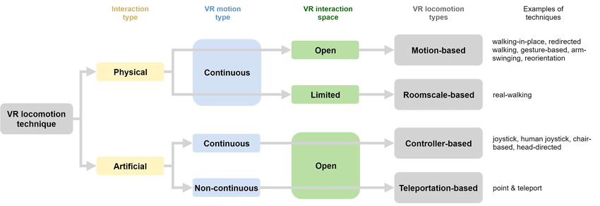
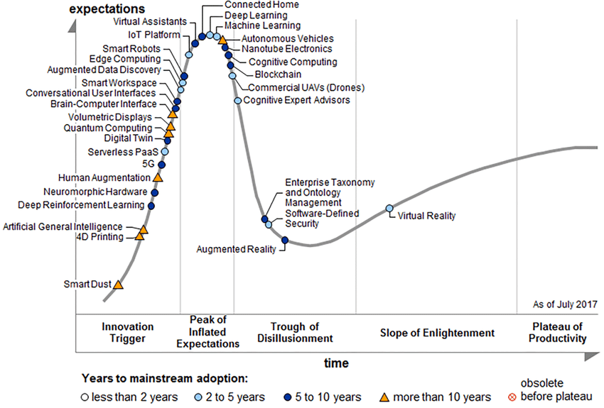
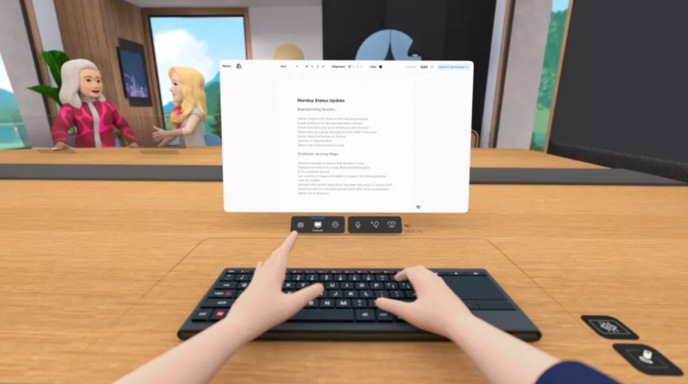
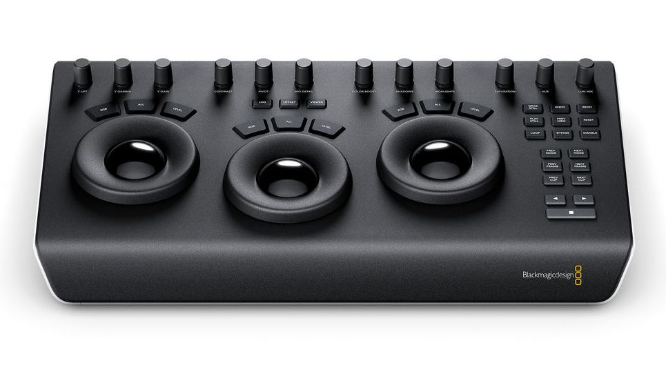
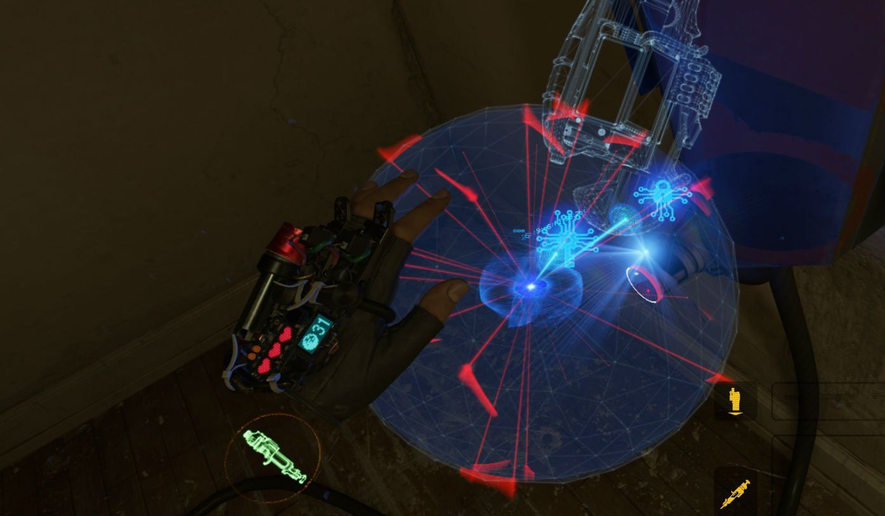
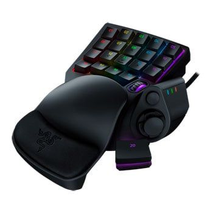
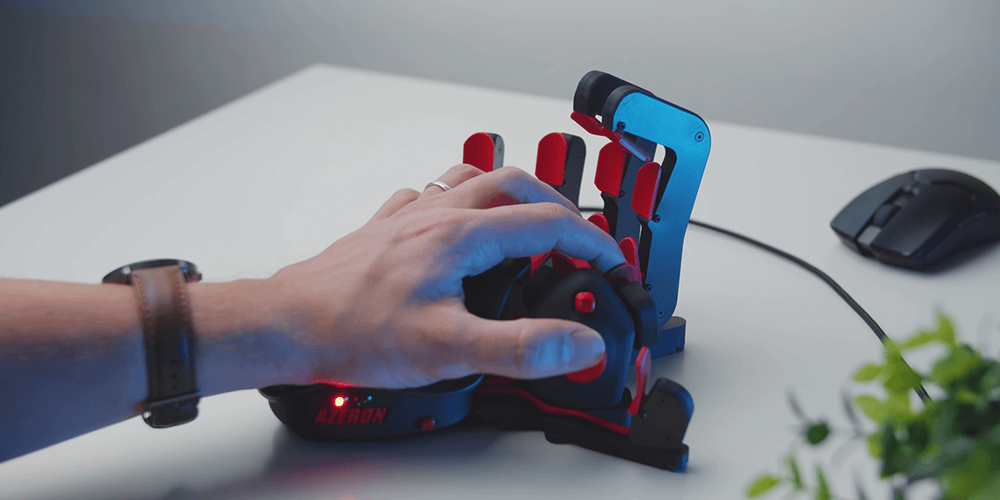

I’ve fairly recently changed my mind about virtual reality.

Much of my sensibility as an interaction designer has been tempered by the writings of authors like Neal Stephenson and William Gibson for whom VR was almost a foregone conclusion. In Stephenson’s case, Diamond Age presents the vision I found most compelling (vs. say the golems of Snow Crash) — with engineers manipulating auto-assembling nano machines through fully-interactive haptic controllers, and that mechanism of engineering and design only made possible through immersion in a different — much smaller workspace. One could imagine the interface of a Photoshop or Blender becoming ever deeper and more physical as we get closer, closer, closer to our work.

On the other side of that spectrum, you have the Ractives — imagine some combination of a first person interactive game and [Sleep No More](https://www.youtube.com/watch?v=k12NZLh_Xvg) — which see whole economies built around content creation and realization in the virtual. [I’m sure this is what Zuckerberg is imagining](https://www.newyorker.com/culture/infinite-scroll/facebook-wants-us-to-live-in-the-metaverse) — constant, unending entertainment over which Facebook provides the infrastructure utility and collects its fee (there’s a whole separate discussion around what happens to the FAANG companies if advertising becomes undermined — one strategy is to become the utility provider).

The thing is, we don’t have immersive virtual reality, and perhaps until we’re experiencing the jacked-in [overloading](https://en.wikipedia.org/wiki/Function_overloading) of our own sensory network — like Case experiences while riding along in Molly’s brain in Neuromancer — we won’t. We might never, it might just not be a “this lifetime” kind of thing. That is what it is. That might keep us from the world of Ractives, which isn’t so bad. We may be time-delaying a truly new art form from emerging in that case, but then, new art will always emerge with what we’ve got, so I don’t really believe we’re missing out there.

What I’m curious about is what we might get if we had “functional” immersion, that former vision of the engineer or designer manipulating tiny things to create something emergent. Right now, we have a pretty substantive control gap in VR. The controllers that most of us have access to are pretty limited — crudely track hand position through IR broadcast picked up by some fixed or relative sensor. This limits what we can do pretty heavily, [though things are changing pretty quickly](https://www.researchgate.net/publication/320089681_The_New_Era_of_Virtual_Reality_Locomotion_A_Systematic_Literature_Review_of_Techniques_and_a_Proposed_Typology). And, of course, [there’s this](https://www.cybershoes.com/us/). ([Seriously](https://cybershoescom.wpengine.com/wp-content/uploads/sites/2/2019/10/Features_1_3.mp4))

Take a game like Half Life Alyx. It’s limited by its controllers, and so from a movement standpoint, we use a “teleportation” mechanism to navigate through the world. You point your controller, press a button, judge where you will “cast” yourself forward, and move. In some ways, it’s almost like Myst ([which is now also in VR?](https://www.youtube.com/watch?v=8UhHAsEdEKg)), in that your positioning and problem solving is fixed. One would think this is a problem, but then, Alyx also providers [one of the most harrowing and immersive video game experiences I’ve ever encountered in the form of “Jeff.”](https://www.youtube.com/watch?v=fd34m1ovR4Y)

What’s fascinating about Alyx is that you're very quickly settling into your limitations — accepting the constraints of the game as a given and learning to navigate the world from there. So while the game is immersive, its immersion is in the context of the body and our projection of those limitations of the tool being wielded. A very non-tech example might be using a hand plane on wood — used to flatten and “smooth” (by removing rough surfaces) a piece of wood. The first thing one encounters with a plane is that one works through the constraints of the tool itself — situating the manipulation of the material along a singular axis, using the grain of the wood to one's advantage, exerting force, etc.

Current VR is incredibly similar to that tactile feeling of constraints, in a way that most visual and keyboard/mouse style computing isn’t. When we’re engaging with a flat, mouse and keyboard-controlled UI interface to create complex things, we’re forced to engage with constraints at a much less natural and more intellectual level. Moving a UI representation of a slider to affect highlights is very different to moving a physical slider in physical space — hence the popularity of such peripherals amongst musicians and visual artists who are, ultimately, trying to leverage every tool they can to craft high dimensional sensory experiences. As I mentioned before, [a simple waveform is a very complex thing](https://andrewlb.com/peripherals/). Of course, we still manage to make things. [Watching the “speed runs” of people modelling complex objects in Blender](https://www.youtube.com/watch?v=Ts-7YnQEe3A) with just mouse and keyboard has become a pandemic pastime for me.

So, we’re good at intuiting constraints. We are quick and natural to find our way in the world that way. But so much of our ability to navigate these constraints is tied to our ability to sense and test those constraints in consistent and predictable ways. Just watching my son, for example, try to fit something (or himself) through a space is an example of that. He tried, fails, manipulates, maybe finds a tool, possibly makes an engine revving sound, and then eventually — through sheer force of will and the power of low-consequence iteration — makes his way through.

In VR as it stands now, our sensory feedback is so much less, and so the ability to navigate those spaces and iterate meaningfully in those spaces is also deadened. Alyx manages that by providing an absolutely brilliant universe of cues and triggers to help us navigate those spaces, but what about a game like DCS or an experience like Blender?

Having tried DCS in VR, I was both confronted with the immersive quality of it (the flight feels incredibly natural) and the complete disjointedness of it (where the hell is my keyboard?). And this, in my usual ramble-prone way, is where I think there’s some reallllly interesting opportunities to design **functional immersion.**

If you had asked me a year or two ago my thoughts on VR, I’d have projected back to my experience at IDEO (in 2014 or 2015) trying on the early Oculus headset and feeling sick for the rest of the day. It was pretty awful. Right now, that experience has changed. With a powerful enough computer and software programmed with the user’s experience (especially when nausea is a risk for this particular UX) in mind, there’s none of that effect. It’s accessible and good. Also not that expensive if you’re willing to [take the Facebook risk](https://onezero.medium.com/facebooks-oculus-quest-2-has-some-serious-privacy-issues-c64ffd3aef76) with the Occulus Quest 2 (I’m not personally).

With this accessibility and overall smooth platform experience, suddenly a lot of functional things become possible. From the Gartner perspective, VR and AR were both well on their way towards productivity as experience platforms a few years ago, and we’re seeing how that manifests today.

For example, most VR headsets today have pretty decent passthru capabilities — meaning that you can leverage the camera sensor at the front to get an image of where you are in real space vs. virtual space.

<blockquote class="twitter-tweet">
Tried the new <a href="https://twitter.com/hashtag/OculusQuest2?src=hash&amp;ref_src=twsrc%5Etfw">#OculusQuest2</a> passthrough API in Gravity Lab<a href="https://twitter.com/hashtag/VR?src=hash&amp;ref_src=twsrc%5Etfw">#VR</a> <a href="https://twitter.com/hashtag/AR?src=hash&amp;ref_src=twsrc%5Etfw">#AR</a> <a href="https://t.co/rrONObVubC">pic.twitter.com/rrONObVubC</a>
&mdash; Mark Schramm 🕹️ #VR #AR (@MarkSchrammVR) <a href="https://twitter.com/MarkSchrammVR/status/1426813781624066057?ref_src=twsrc%5Etfw">August 15, 2021</a></blockquote> 

[https://mobile.twitter.com/MarkSchrammVR/status/1426813781624066057](https://mobile.twitter.com/MarkSchrammVR/status/1426813781624066057)

This means that we get a bit closer to that mixed reality or augmented reality world that we keep seeing visualized in science fiction — think Ghost in the Shell or the [more recent BladeRunner movie](https://youtu.be/iblP_m4zd3s) through holograms. It’s the kind of world that Malcolm McCullough describes in [Digital Ground](https://mitpress.mit.edu/books/digital-ground) — pervasive, invasive data spaces.

Where this comes together with VR is in the social and work spaces that we end up occupying as creators. Ultimately, the thing that I find most compelling about VR is that it gets us closer to a particular model of creativity through computation that just hasn’t reallllly existed before. I can mess with as many peripherals as I want, but I’m still just manipulating the control system for some digital space — I’m not occupying it in that way that real functional immersion might allow me to. And while I can get closer to occupying that space through an air-cooled brick on my face — good luck trying to interact with others through that medium. Facebook’s recent remote collaboration demo highlights how weird the experience is (I will say: Zoom is also a nightmare. But this isn’t a real change IMO).

<iframe width="560" height="315" src="https://www.youtube.com/embed/lgj50IxRrKQ" title="YouTube video player" frameborder="0" allow="accelerometer; autoplay; clipboard-write; encrypted-media; gyroscope; picture-in-picture" allowfullscreen></iframe>

[YouTube](https://youtu.be/lgj50IxRrKQ)

What’s MORE interesting for me is a demo like this:

<iframe width="560" height="315" src="https://www.youtube.com/embed/FnDgry7xBo0" title="YouTube video player" frameborder="0" allow="accelerometer; autoplay; clipboard-write; encrypted-media; gyroscope; picture-in-picture" allowfullscreen></iframe>

[YouTube](https://www.youtube.com/watch?v=FnDgry7xBo0&t=3s)

In this case, Metalnwood showed an example of using a phone as a “button box”, situating an interactive object in both physical and digital space relative to their position in this driving simulator. One could easily imagine doing the same with an Elgato stream deck (which I use literally all day long) — mirroring the geometry and logic of the Streamdeck display inside a virtual environment.

While VR is finding a lot of its purchase in the gaming space (and this demo doesn’t deviate from that mold), we start to see some interesting possibilities when passthru cameras and virtual mirrors to real objects become more tangible. The Facebook demo situates the user at their desk with a laptop in front of them, and so provides a certain amount of analog between your situated and virtual experience. It does this via that passthru functionality mentioned before ([good explainer here](https://www.roadtovr.com/valve-index-passthrough-camera-room-view-3d/)).

In principle, I do think this is the right direction and a good overall approach, even if we’re just recreating a generally dysfunctional mechanism for collaboration in a virtual realm. The question is then, why do we need the keyboard except for a certain amount of muscle memory and path dependence?

What if we had peripherals meant to be interacted with in both virtual and physical space — with that virtual one layering more information?

The above colour grading tool by BlackMagic Design is an interesting tool to frame this around. Equipped with three trackballs, it provides the user (a video editor) a variety of axes around which to navigate a colour space and realize the intent of a given scene. It’s physical, intuitive, and immersive.

What else might such an interface provide? There’s some interesting clues out there. The holographic interfaces of Prometheus and Alien: Covenant provide an interesting technology gap between humans and the mysterious Engineers. The former interacting with 3D space mostly through 2D dashboards, while the Engineers’ interfaces project both physically and virtually into the user’s space.

The puzzles in Half Life Alyx also present an interesting option, encouraging the player to (albeit somewhat clumsily) interact with a spherical space around whose surface you need to navigate a key through certain obstacles.

Other alternatives might be, say, a chording-style key controller like the Razer Tartarus combined with a dimensional controller like the 3D Connexion space mouse. Today’s 3D editors mostly use key combinations to nudge form from 3D primitives anyway — developing a certain amount of skill with such a device would permit.

Or, my personal favourite prototype and something I’m almost too scared to try, is an [Azeron](https://www.azeron.eu/) keypad. Here, the interface elements are situated around the hand, giving a kind of feedback for movement of the hand in 3D space.

It’s pretty easy to imagine such a controller (perhaps merged with a 6dof space mouse-like interface) being used to control something complex that is moving through 3D space.

In these scenarios, VR becomes the medium around which our interactions are defined and our interfaces are situated. Virtual environments with depth require controllers with greater depth, and a mix of physical and digital interface design to not only situate the user in their virtual environments, but also keep their work grounded in the kind of fine-grained, detailed work required of most functional professions. **A functionally immersive virtual design environment would be pretty seamless between virtual and physical because the immersion isn’t in the virtual world, but rather the construction of the form itself.**

Anyway, there’s more to explore here, but would be curious if you have some other examples of these bridging interfaces like I shared above!
