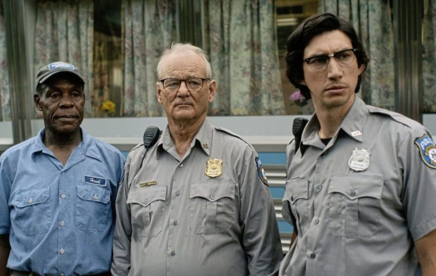
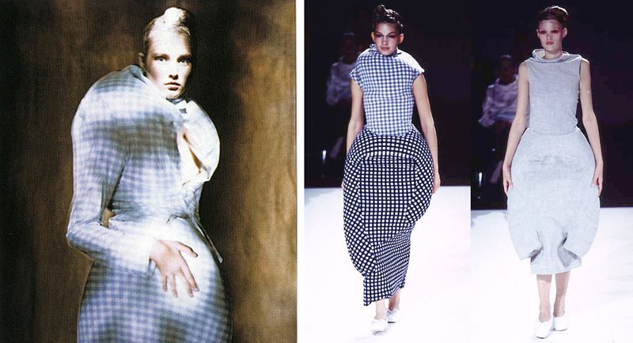
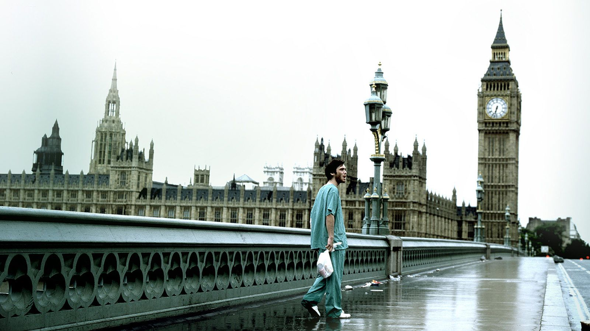

The zombie genre is a compelling lens on the world despite its bleak premise. The dead rise and mindlessly go about adding to their numbers. Faced with what’s basically an environmental force, individuals and society proceed to break down, come together, reform, or get overwhelmed — ultimately becoming zombies themselves and adding to the threat to others. It’s such a simple and shallow premise — of course, it would become a vector for something more.

With its roots in slavery and colonialism, the idea of the zombie is nothing new. Crassly TL’DRing this [excellent explainer from Vox](https://www.vox.com/policy-and-politics/2016/10/31/13440402/zombie-political-history), the image of the zombie that we’ve come to know, originates in Haitian religious and slavery practices, toxically intermingled with white American fears of punishment for systemic practices of racial injustice and dehumanization of Americans not coded as white. This cascaded into projections of fear overtop of the zombie — the Cold War, invasion, contagion, capitalism. The zombie became a manifestation of our fears that was both deeply critical, and also permissive of an incredible **lack** of criticality.

This idea that a genre can be so near-the-surface on both sides of the coin when it comes to criticism (shallow, let’s say) is worth consideration. The Dead Don’t Die is notable in that way. It’s a cheesy, entertaining zombie flick situated in the sleepiest town, with the sleepiest people, as the world ends. Imagine the Japanese zombie film [Wild Zero](https://www.youtube.com/watch?v=YQ_D9OjDoQ0) set to the [opening theme of Twin Peaks](https://www.youtube.com/watch?v=X2lkvrMa27c), and you get the overall vibe of The Dead Don’t Die.

The film plays with the shallowness of the zombie genre by both taking it incredibly literally — “We the consumers are zombies to consumption” and atmospherically — demonstrating how the lurch and moans of the undead remarkably follow the same patterns and predilections of life. That the quotidian is its own kind of death, maybe.

There’s other genres of media like this. Fashion is an interesting one — it goes deep into reference, message, and structure at times. Elsewhere, it’s really just about the body at its most material, or most carnal, or whatever. Sometimes, it’s both incredibly horny and incredibly thoughtful. Alexander McQueen’s stuff often had that air to it — Rick Owens definitely does. To quote him [speaking of the Ramones](https://www.gq.com/story/rick-owens-aggression-fall-2021): “LOUD AND DUMB CAN ALSO BE CONCISE AND ELEGANT.” (He apparently only writes emails in caps lock because — of course he does)

Rei Kawakubo’s [Body Meets Dress, Dress Meets Body](https://www.vogue.com/fashion-shows/spring-1997-ready-to-wear/comme-des-garcons) (everyone calls it the Lumps and Bumps collection) is an example of this. At its surface, it's accessible and entertaining — drawing you in with the unfamiliar visually, but also setting the observer as somehow expecting such a thing from Commes des Garçon’s founder, as a rebellious and reclusive designer. But that accessible and uncritical interpretation serves to mask a critical intent lying just below the surface — that the forms that fashion takes, are dictated by the interface of the body, and interrogating the supposed uniformity of that interface frees both, body and dress, to explore new horizons.

At its best, the zombie genre is like that. Entertaining, exciting, and quietly stalking our subconscious just below that surface. A message does not need to be overt and loud to be meaningful. Nor does it need to be quiet and muddy to be poignant. I still count Cillian Murphy’s rising anxiety and desperation in an emptied London — overlaid with the cascading guitar of Godspeed! You Black Emperor — as one of the most impactful scenes I’ve encountered in film. There wasn’t a zombie in sight, but the desolation was visceral. And during the peak of Denmark’s lockdown this winter, I’ve reflected on this scene from 28 Days Later pretty often.

I’m curious to see what they’ll become in our post-pandemic world. Maybe claustrophobia will be evoked by shuffling feet (maybe already in Dawn of the Dead though), or the injustice and helplessness of wealth inequality (okay, the less interesting Land of the Dead), or our societal inability to grapple with impending threats like climate change (wait, Max Brooks’ World War Z).

With so many of our existential fears exemplified by a shambling fantasy threat, zombies will keep getting reinvented to meet the fears of today. They’re such efficient vessels for stories around the ambient and the abstract, why not spice up a story of desertification with the undead? To quote an antagonist in World War Z — “Fear sells.” And it seems easy to make a sale lately.
