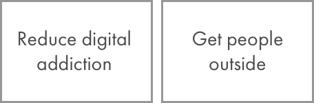
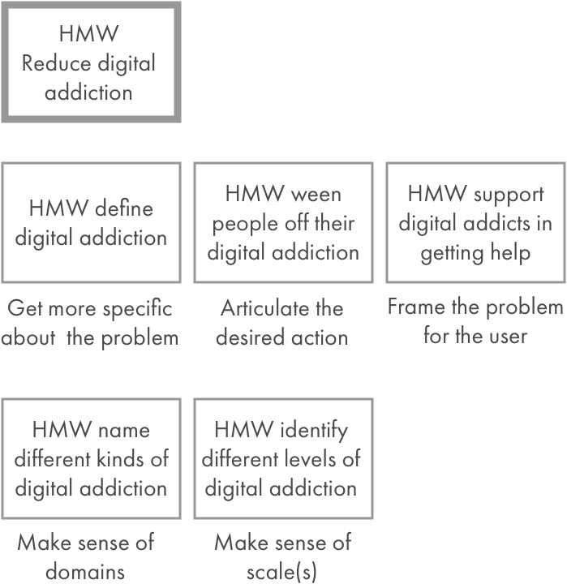
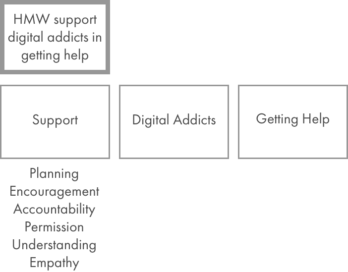
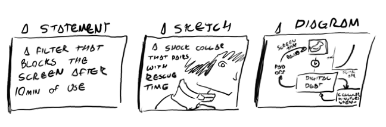

If you’ve ever worked with a designer facilitating a workshop, or a supplicant of design thinking, you’ve probably heard the words “How Might We” spoken as though they were capitalized.

How Might We’s (HMWs) are one of many tools in the designer's toolkit to think about a problem space within an intentionally expansive (or divergent) mentality, instead of in a reductive (or convergent) one. It’s a tool that you can use to facilitate a discovery process, structure your own ideation process, or force an expansive way of thinking — especially if that isn’t your path.

At the end of an HMW process, you’re often looking at a wall or sketchbook filled with different, reasonable, bizarre, obvious, unlikely, or bang-on-right ideas. These ideas can be discarded, recycled into the process, or explored in more detail. But the question is how do you get there? With a team of designers acclimated to the process, you’ll usually rip through 100+ ideas in a 15 minute session and get on to exploring the one or two standouts in more detail. For others, it might take a few tries before you really get use to and feel comfortable with the process.

## **Steps in the HMW Process**

0: Prep

1: Identify a general brief or “mission statement”

2: Break that down into “How Might We” statements

3: Breakdown and enumerate components of HMWs

4: Brainstorm solutions on individual HMWs

5: Repeat/Recycle/Research

**0: Prep**

Make sure there are enough 3x5 and 3x3 Postits for everyone at the table, as well as large format Sharpies (which take up more of the post-it, forcing brevity). Having a sense of what the project purpose is (see “The Cooperative Brief”) will help, as well as knowing exactly how much time you have. Assign a single facilitator to keep time, assign speaking rights, and serve as a live-synthesizer.

**1: The Brief**

A succinct brief is vital, and the fuel for this process. That brief can come from anywhere: the mission statement of your client or business; the opportunity you’ve identified in a customer base; or a policy that needs to be implemented. Let’s make up a mission statement, say: Our goal is to reduce digital addiction and get people outside.

So, that has two parts:

**2: Creating HMW statements**

Creating the HMW statement is tied to how you break down the brief. Reduce Digital Addiction is a good starting point, as you can already frame it as _HMW Reduce digital addiction_?

Consider your timing — you might want to vote at this stage, and only pick a few HMWs to focus on.

**3: Breaking apart an HMW statement (optional)**

This isn’t usually necessary for experienced design teams, but it’s a good way to push past confusion when facilitating.

Repeat this step for each of the main HMWs you’ve selected.

**4: Brainstorming Solutions**

This is where we bring together the different steps into ideas. Focus on a single HMW, and put it in a distinct place where all the participants can see.

Then set a time limit and possibly a goal. 5 minutes and 5 ideas is usually easy for any team. Everyone goes heads down for 5 minutes and sketches out their ideas. The facilitator keeps time and reminds people to switch up every minute. The ideas can look like any of these:

After 5 minutes, ask everyone to go around and put their sketches up on the board, describing them as they go. Ask others to sketch new ideas or changes as they are inspired by what they see. Spend a few minutes talking about the ideas after everyone has had their turn.

**5: Repeat/Recycle/Research**

Turning these ideas into a clear next step is the hardest part. You have 3 non-mutually-exclusive options:

**Repeat:** Go through another HMW and generate new ideas. Just repeat steps 3–4 with the HMWs you have, as many times as you can within your time limit. Or, if you discovered new things about the mission statement or have new ideas for HMWs, you can even add on a step 1 and 2 if you want.

**Recycle:** Take what you’ve learned and iterate on the HMWs you’ve developed. This is where voting might help you focus as a team on the most representative ideas. Are there new directions or more specificity that emerged? Spend some time brainstorming new HMWs around new solutions to dig deeper.

**Research:** Take the solutions that your team selected, and vote on the best ones — probably the top 3–5 solutions. Split those solutions out into teams from the group, and spend some more time on them. This can be anywhere from 30min to a few days.

You’ll learn about the solution you identified, build prototypes and more in-depth sketches, find ways of testing it with users, and build a more comprehensive ideas understanding of the feasibility, viability, and desirability of the solution. Come back together and share what you’ve discovered.

### **What’s Next?**

This is one of many techniques that you can throw at a problem, but it’s particularly effective for focusing a team on the “think broadly” part of a problem without going crazy and getting lost. It also gives you a clear and repeatable way of going from a broad statement with many unknowns to a variety of starting points that challenge assumptions and surface  
new opportunities.

Always though, the next step should be getting real. Prototype your ideas, test your assumptions, and be willing to change course or start over.

## Do the better research with the right admin tools

Of course, when it comes to research, there’s some important administration. Before, I always found this to be a chore. [Which is is why I built Knowsi.](https://www.knowsi.com/)

Collecting the right consent from participants, scheduling, and organizing the media afterwards in a GDPR compliant and responsible way becomes easy. Plus, participants know you value their privacy because they get their own receipt of the consent form with the ability to reach out afterwards.

[Give Knowsi a try with a 1 week trial today](https://www.knowsi.com/join), and [sign up for our mailing list](https://www.knowsi.com/?mail=true) for a discount code and more articles like this every few weeks.

*Note: Thanks to* [_Ayla Newhouse_](https://medium.com/u/d3670aea1173?source=post_page-----c04423a4437d--------------------------------) *for co-developing this tool for a workshop we taught together.*

_This article was originally published on [**Medium**](https://medium.com/knowsi/hmw-how-might-we-c04423a4437d)._
**Medium**](https://medium.com/knowsi/hmw-how-might-we-c04423a4437d).\_
