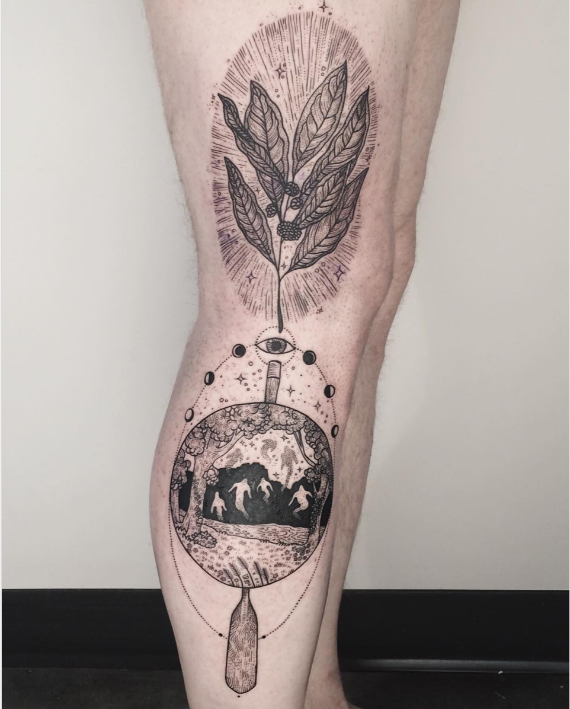
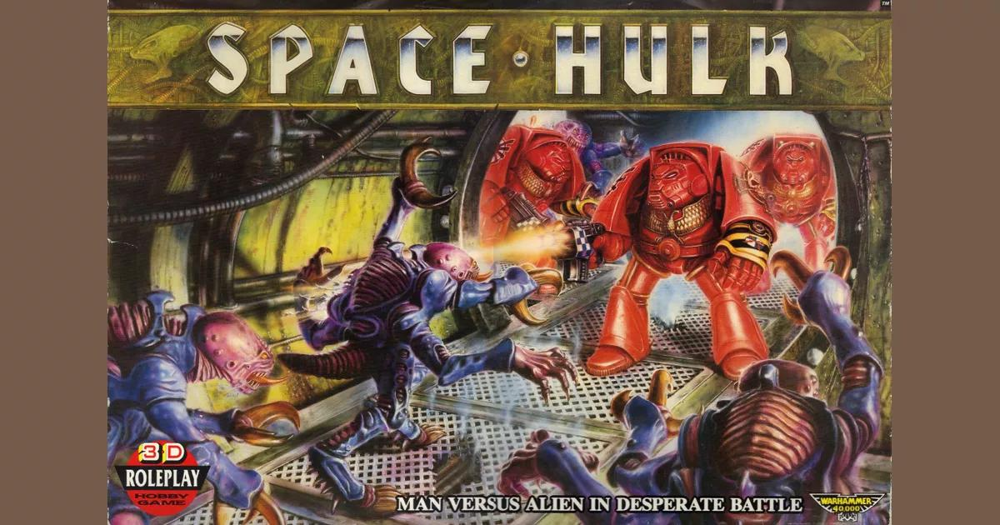

I was one course away from a minor in Classics when I graduated from the University of Toronto. It was a weird rabbit hole that I fell down — utterly engrossed by the overlapping systems of symbol and myth that had wrapped itself around the Greco-Roman psyche. It got to the point that years later, I’d get [a pretty large tattoo](https://www.instagram.com/p/BCJ3W5dStd-/?taken-by=freeorgy&hl=en) depicting the Golden Bough scenes from the Aeneid on my leg where the titular character descends into the underworld to commune with his past and learn of his future (really a bald-faced Imperial puff piece by Virgil, the poet come propagandist).

The storytelling and symbolism of the Greco-Roman classics are quite casually affecting us today. We associate vain individuals with the cautionary tale of [Narcissus](<https://en.wikipedia.org/wiki/Narcissus_(mythology)>), we visualize entrapment and confusion with the [Minotaur](https://en.wikipedia.org/wiki/Minotaur) holding Labyrinth of Crete, or one’s contradictory nature with the “two-face” preface — referencing the Roman deity [Janus](https://en.wikipedia.org/wiki/Janus). The sticking power of these concepts is frankly incredible given how quickly language changes, but it's also unsurprising. References build up over time — becoming networked in their own way to one original source. So the oral tales of Narcissus become tied to individuals, places, curricula, stories, and things (like flowers) — and perpetuate themselves over time despite individual references being pruned from time to time.

The Greco-Roman classics are the founding lore of the Romance languages, in the same way, that much of the Norse lore is tied to the Germanic languages of Northern Europe. And that lore has incredible staying power. Generated both individually and collectively, the early stories of entertainment and moralistic pedagogy were shared by the [many bards we call Homer](https://en.wikipedia.org/wiki/Homer) and became a many-thousand-year frame of reference for two billion English speakers globally — whether they know it or not.

What’s somewhat scary and fascinating is that lore is kind of easy. We excrete and accrete lore automatically. One of my personal strategy consultant tricks, when I start working with a new organization, is to pay super close attention to repeated words, phrases, and jargon in the context of process work, decision making, and tension points. These frames of reference almost always harken back to some past experience the team or company has — either positive or negative. A file format like JSON might accumulate meaning associated with individuals or factions, with past history and decisions, with firings or promotions, and with cautionary or elevating frames of reference.

In 2021, most of you have probably heard of the legendary design sprint — a mythical tactic where an intrepid but divided team forces themselves into a wedge area, following a series of purification and summoning rituals to elicit direction and guidance from the gods of 3M and Prototyping. Codified by the shamanistic designer Jake Knapp, many try the design sprint but few do it with sacrifice and intention — the necessary steps to see that guidance emerge. Still, upon the lips of designers and leaders around the world, we constantly hear a ward against the unknown uttered — design sprint.

Lore emerges by default, but it can be a bit difficult to manufacture. We see this a lot with different companies attempting to imbue their products with a narrative “special sauce.” It often works. Apple’s history of filled with tales of genius, individual heroism, loss, and redemption. Individuals come to play very specific narrative roles, even if their own contributions were much more complex than that role would describe. Steve Wozniak, by way of example, might be compared to the [Hephaestus](https://en.wikipedia.org/wiki/Hephaestus) character in Greek myth — the craftsperson and blacksmith, content to create the vital armour and weapons that the more bombastic gods. He is also one of the few gods with a physical impediment. Hephaestus becomes an allegorical figure depicting humility and deference despite great competence; a figure who is focused, dedicated, but ultimately in the background. This is pretty objectively not Wozniak, yet in a lot of media he is depicted as the quiet and focused inventor — part of the computer club that was happy to Tinker while the Great God Jobs went out to share the true value of that invention. The truth is that their roles were much more overlapping and complex. Apple has done a brilliant job shifting and simplifying their lore, such that one of the wealthiest companies there is becomes somehow personable.

Sometimes, companies specifically manufacture lore. Games Workshop emerged as a tabletop gaming company in the mid 1970s, but only really started to gain traction with the advent of its Warhammer games and the dense layers of storytelling associated with them. The now wildly popular universe of Warhammer 40k emerged from a small boardgames and story called Rogue Traders, which sets the scene with the following paragraph:

> “For more than a hundred centuries the Emperor has sat immobile on the Golden Throne of Earth. He is the Master of Mankind by the will of the gods and the master of a million worlds by the will of his inexhaustible armies. He is a rotting carcass writhing invisibly with power from the Dark Age of Technology. He is Carrion Lord of the Imperium to whom a thousand souls are sacrificed each day, and for whom blood is drunk and flesh is eaten. Human blood and human flesh- the stuff which the Imperium is made.

> To be a man in such times is to be one amongst untold billions. It is to live the cruellest and most bloody regime imaginable. This is the tale of these times. It is a universe that you can live today if you dare- for this is a dark and terrible era where you will find little comfort of hope. If you want to take part in the adventure then prepare yourself now. Forget the power of technology, science and common humanity. Forget the promise of progress and understanding, for there is no peace amongst the stars, only an eternity of carnage and slaughter and the laughter of thirsting gods. But the universe is a big place and, whatever happens, you will not be missed….”

>

([My source for all of this is here](https://www.reddit.com/r/40kLore/comments/62o27b/history_lesson_where_does_warhammer_40000_come/), as an aside)

Here’s the 90 second version of the “Grim Dark”:

<iframe width="560" height="315" src="https://www.youtube.com/embed/-MeVxKZBOfM" title="YouTube video player" frameborder="0" allow="accelerometer; autoplay; clipboard-write; encrypted-media; gyroscope; picture-in-picture" allowfullscreen></iframe>

This open and loosely defined universe planted a seed that 30-some years later is one of the most successful narrative franchises of all time. So much of this success isn’t in the expensive plastics and paints the company sells (though those are certainly the profitable endpoints of the enterprise), but through their Black Library enterprise — hundreds of books that weave together the histories and references of the universe and serve to establish the “lore” of that universe — and the critiques of fascism and dogma that are the dystopic setting for the universe. That lore, in turn, finds its way into countless pop culture references: from the visual aesthetic of the Starship Troopers movie (itself a more overt critique of fascistic creep in society) to the weirdly ubiquitous [“BLANK for the BLANK god!”](https://knowyourmeme.com/memes/blood-for-the-blood-god) meme, and beyond. Personally, I accidentally fell down the rabbit hole on the narrative side with the Horus Heresy books — [Horus Rising](https://bookshop.org/a/19778/9781849707435) in particular (_send help_).

What’s fascinating about this is that as much as we might try to shape “Lore”, it has a life of its own. Games Workshop does so with an iron fist, but is constantly running afoul its fans who becomes frustrated by the monetization of a universe they feel ownership over 40 years down the line. Apple does so through secrecy and careful media releases, but quarterly deals with the fear that their prestige and genius narrative will slip with the release of weaker products or things that lack a market fit. Now, Musk’s Space X is doing so with [its brilliant but somewhat flawed Inspiration 4 show](https://www.technologyreview.com/2021/09/08/1035219/netflix-spacex-docuseries-inspiration4-countdown/)), attempting to reignite popular interest in space flight and give an accessible-but-still-heroic face to extraterrestrial travel — as a direct competitive counter to Bezos’ cowboy-hat wielding Blue Origin, and Branson’s playboy stylings of Virgin Galactic. All three of these companies are taking civilians to space, and all are crafting lore around their endeavours whether they intend it (like Space X) or not (like Blue Origin’s phallactic launch).

I’m always on the lookout for the lore. It’s everywhere, it’s exciting, and it can become the hook that might make an otherwise banal experience or body of work compelling. It can also explain so much about the dysfunction you find yourself in. The lore provides those clues and cues for deeper exploration, and whether you’re diving into a decades-old game universe or a 160k+ person company (like I experienced with Ikea), the lore becomes the hook, the map, and the troubleshooting guide for your own small contribution to that universe.
