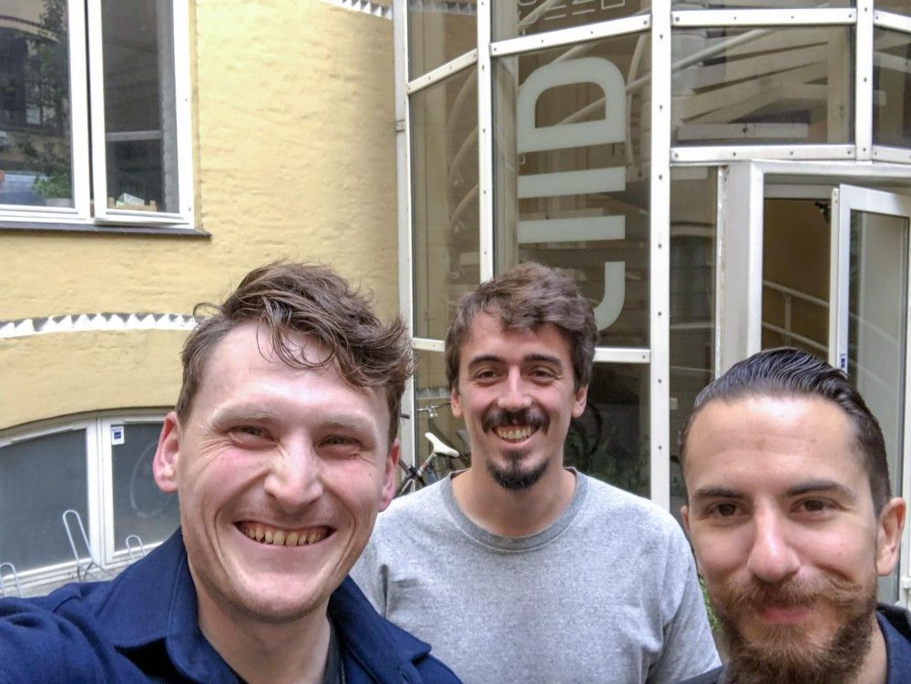
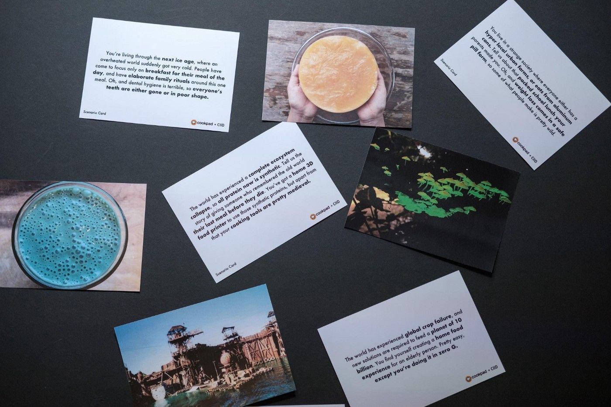
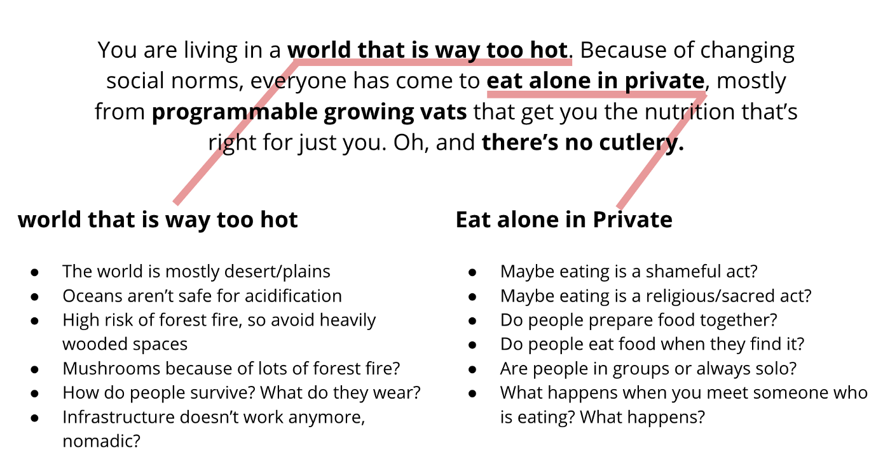
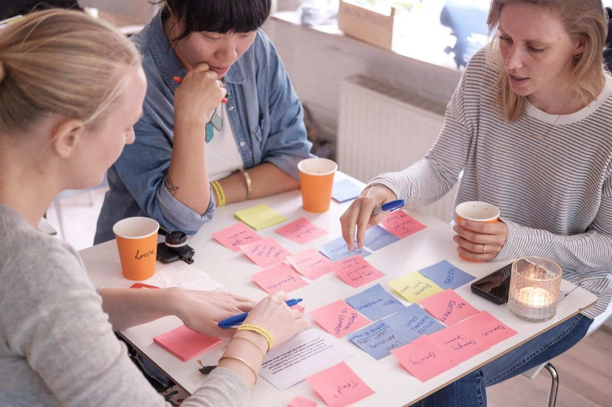
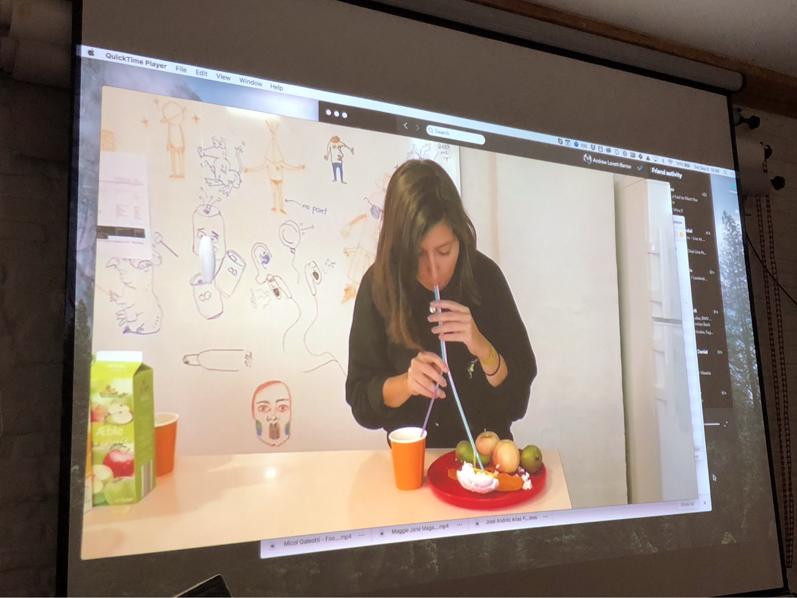
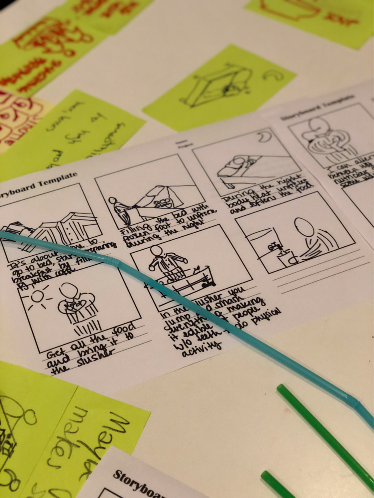
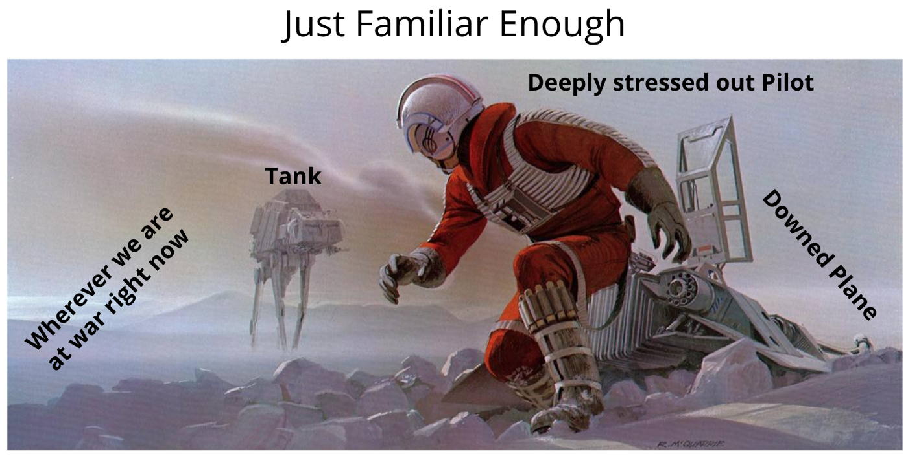
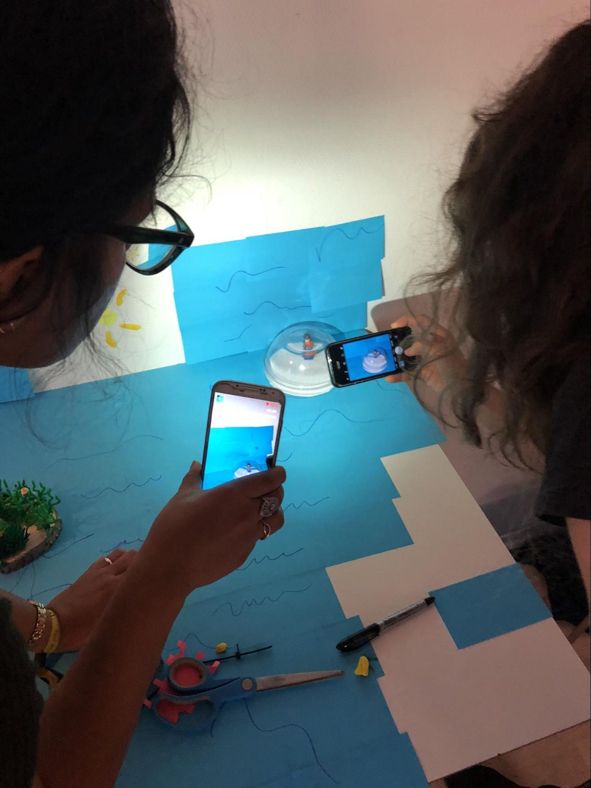
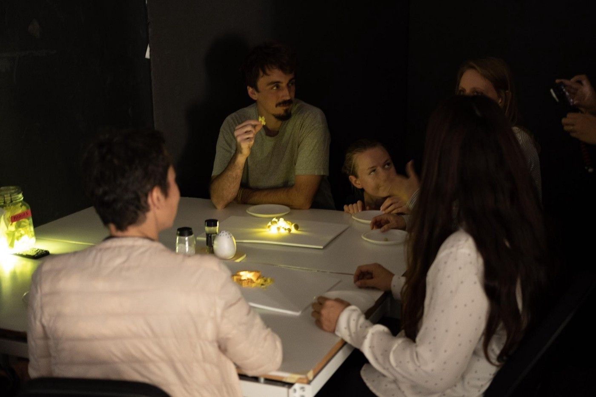

We can’t predict the future, but that shouldn’t stop us from designing for it!

Designers today have a responsibility for designing tomorrow, especially when it comes to human health and well-being. Futurecasting (the practice of trying to envision the future) is challenging so to help we can use design thinking and rapid prototyping to explore the world of tomorrow in creative and divergent ways. This was the idea behind this first collaboration between Cookpad and the [Copenhagen Institute of Interaction Design](http://ciid.dk/) (CIID). Our plan was to bring speculative design and home cooking together into a fun day for attendees of the Copenhagen [TechFestival](https://techfestival.co/). Our challenge: design the future of food in four hours!

Cookpad is a food technology company started in Japan, but now in almost 70 countries from UK to Jakarta to Beirut. The company is best known for their recipe-sharing platform, but are also building technologies, perspectives, and communities with the goal of making everyday cooking fun. Ultimately, the goal of our design jam was to change the way we think about food, specifically problems around access to ingredients and the knowledge of what to cook with them. Cookpad is partnering with CIID (a design school and innovation platform) to solve a global problem: that people are cooking less and this has a negative impact on our individual and collective health and well-being, our community, and our environment.

Our Design Jam brought together over 20 global designers and foodies from countries like Taiwan, India, Copenhagen, Germany, Brazil, and beyond with three facilitators: from Copenhagen (Andrew Lovett-Barron from CIID), Shanghai (Simone Rebaudengo from [YEAST](https://medium.com/yeastlab)), and Bristol, UK (Philip Pantelides from Cookpad). Our challenge was to create a rapid-fire prototype and video exploring future scenarios. As the future is so unpredictable, the scenarios were created with a [random generator google spreadsheet](https://docs.google.com/spreadsheets/d/1DZBf9pJohb3O3a8g54oUr-kuzEyLop6Lwnk4f7CBMmA/edit?usp=sharing), and then massaged into ten scenario cards. (If you want to learn more about using scenario generation for design brainstorming, Andrew digs into the details here)

Within three hours and thirty minutes, all the groups had created a short video and prototypes to share with the rest of the group. The videos included stop motion with lego and characters, acted scenes and rituals, and improvised dinner scenes. How did they get this finished so quickly? We guided the teams through a structured churning of information into ideas, a process that you can also adopt when designing for the future or around complex problems:

## **Break it down**

We provided some guidelines for brainstorming, including breaking the concepts down into smaller, more manageable chunks. We provided this example for how to bring down one of the prompts.

## How Might We?

Once the problem was broken down, teams pulled out the Post-It notes to cluster themes. We asked each of the students to write one idea or one interpretation per Post-It, so that observations and interpretations can shift into understanding. How Might We (HMW) is a technique that allows you to flip the problem into an opportunity by rephrasing challenges into questions. For example: _There’s no cutlery_ becomes… _How Might We eat without cutlery_ which may result in a range of ideas including:

1. Hands
2. Straws
3. Robot arms
4. Food troughs
5. Food catapults

The goal is to find a design opportunity that results in divergent thinking. This means the possibility for solutions is increased. You can read a bit more about how to [use this technique yourself here.](https://medium.com/@readywater/hmw-how-might-we-c04423a4437d)

## Draw, draw, draw

After identifying a design opportunity, the teams took to pen and paper to sketch out ideas, thinking both about the environment they were designing for and people living these speculative realities. Visuals are a great way to share the context of an idea, and you don’t have to be a designer to create a simple sketch. In this example, the students created a multi-pronged straw and pneumatic food device to extract nutrients in a world without cutlery.

## Storyboard time

Before prototyping, it’s is a good idea to map out the story you are trying to tell. This builds empathy with those experiencing an environment, and creates a cohesive narrative around the objects and services being designed: answering the question of what happens before, after, and during an interaction with the product or service you are designing. One way to do this is storyboarding, where participants draw out what they Imagine, and then act out what they think will happen to test their idea.

## Build

When testing futuristic design ideas without actually building potentially impossible futuristic technology, the most important thing to remember is:

> **Context > believe-ability > feasibility**

The context in which the people in our stories will interact with the prototype is key. Where they sitting down? Are they using their hands? Is it dark? Are they underwater? Then comes believe-ability: this is where you draw from real world experience. In this example, a futuristic scene from _Star Wars_ is made familiar through the scenario of a grounded pilot at war.

##

Shoot a video

Finally, the teams used their phones to make short clips to communicate their solutions. Video prototypes help with explaining the concept, and also, importantly, with user empathy as you act out the interactions with the prototype. This forces the designer into the role of the person living that life, and forces a deeper interrogation of the ideas being developed. The teams explored how to interact with food and each other in a range of scenarios: in the dark, without cutlery, with no teeth, etc.

Pro tip for video prototyping: use Instagram stories or [Apple’s Clips App](https://www.apple.com/clips/)

One innovative team even used their photo library to make stop motion clips ( one filming the other as they flicked through their photo library)!

We were super-grateful to everyone who came and threw themselves into these food “what ifs”. And we can’t wait to see what’s next for Cookpad and CIID’s creative partnership going forward.

_This article was originally published in [**Medium**](https://medium.com/ciid-stories/how-to-design-the-future-of-food-in-4-hours-feb3de598cbb)._
