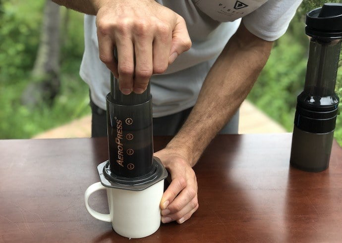
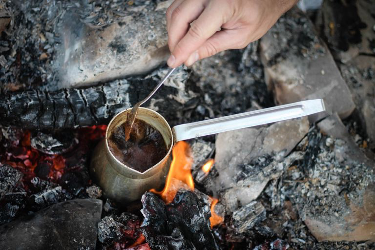

Since moving to Copenhagen, one of the things I’ve been experimenting with has been how to learn very new (or functionally new) things effectively — especially given all the constraints of the job, family, and existing commitments and passions.

The past few posts have been about this idea of amateurism and getting into new areas of expertise and interest, but I have something of a professional interest in this too. Because I teach a fair number of workshops and facilitations each year (usually around design, navigating systems, research methods, etc), I’ve also wanted to understand, how to empower the folk in my workshops, not just to “go to a workshop”, but actually fit it into some kind of broader arc of understanding.

Anyway, for my own purposes, I’ve tried a bunch of different things, but there’s three modes that seem to “work“ for me (and work is a multidimensional property here): learning under pressure (or sprints), learning over time (grinding and practice), and learning via “surface area”, i.e. through osmosis or repeated exposure.

The thing that I’ve really learned here is that an enduring form of learning — continuing to evolve past a surface level or functional understanding, not to mention retaining what you learned in the first place — requires more of an ensemble of these techniques.

First, **learning under pressure** is what most of us experience when we’re doing a retreat, studying for a test, or getting a certification. It’s a dedicated and focused period of time when we are absorbing some predetermined block of knowledge — often with some kind of test at the end. I personally LOVE this mode of learning and almost think of it as a vacation. I actually did do a “vacation” in this way with my American Wilderness EMT certification in 2018 — flying from Copenhagen to Conway, New Hampshire to spend a few weeks learning the trade and getting certified as an EMT-B. This is a really fun and focused way of learning. It’s a great way to rapidly get into something new, and develop shortcuts for growing from there. It also has some disadvantages: it’s usually expensive in time and treasure, it precludes other activities (mostly), and it’s pretty inaccessible if you have family or community commitments. More importantly, it’s impermanent unless cultivated over time. For me with the EMT-B work, while I’ve done plenty of continued education courses (especially paediatrics because of Emil), the knowledge fades pretty quickly without use. Things like drug interactions, detailed measurements, etc. are all things that slipped from my mind now, long after leaving the workshop, but are rote knowledge to those classmates who went on to work as EMTs. Finally, because the curricula is usually predetermined, we’re less likely to really discover new things about the practice during this time. It’s less a time of synthesis and more a time of focused absorption towards a known outcome.

This brings us to l**earning over time**, which is what most of us experience with traditional education, in our work, and in the hobbies we stick with. This is a less prescriptive, but often still guided learning process, where we aren’t just shaped by our teachers, but also shape our own education. Learning over time is the foundation of competency in any given topic, and while it can be augmented by other learning modes, there’s realistically not much of a substitute — we really do just need time to experience things. Craft-based disciplines (art, design, engineering) are perfect examples of this because of the fundamental gap that exists between theory and working with physical things. Slumming your way over to Hacker News, you’ll find plenty of good examples of this: one of my favourite is the example of the Terminal which got hacked together by an experienced engineer in a few days, vs. the supposed theoretical development over years. Or, if you’ve ever tried to throw a pot, the red mist of frustration that descends, as you attempt to replicate the practiced ease with which your instructor manipulates clay.

Learning over time works so well because we learn from failure. We fret over our inabilities, we strategize how to overcome them, we adapt to our missteps and the way we visualize our success changes with those experiences. It also has the fantastic advantage of facilitating synthesis in a way that pressure-based learning doesn’t. But it has its disadvantages as well. We can easily slip into repetition if we fail to be critical of our practice. This in turn leads to plateaus in our learning — forward progress sputters and stops, and the next step is not always obvious. It can also be demoralizing. Time moves differently for all of us when it comes to learning: some of us have aptitudes that speed things up; or are differently advantaged physically and cognitively to acquire a particular learning goal. We don’t always grant ourselves the flexibility and time to really learn as we need to, and so fall short in our learning journey.

Finally, there’s what I tend to think of as **learning via “surface area.”** This is a kind of passive but protracted information absorption that educates, interests, and changes us over time. Spend an extended period of time in nature, or the city, or a company, and you’ll develop a sensitivity to the spaces you’re inhabiting. These passive forms of learning are critical for navigating and inhabiting the systems that have formed around us and are very, very difficult to teach. It’s a type of learning that comes from inhabiting a space over time. This is different (though overlapping) from the time-based mode, in that the time-based version is often somewhat guided by goal and intent, whereas this surface area model is primarily passive in nature. It’s the situation where you take a job to improve your engineering skills, and accidentally end up learning a lot about managing people. It’s the expectation that no matter how good you are, you won’t be effective in a new job for months (if not years) because it takes that long to build muscle memory for the institution.

Unfortunately, this can be a bit of a pernicious mode of learning because of its passive quality. This is often the mode that instills and entrenches biases within particular environments, such as stereotypes around gender in engineering and management. This is also often where things like radicalization or ideological shifts happen — repeated, protracted, and multimodal exposure to concepts lead to an internalization and adoption of these views. The journey from Joe Rogan to Infowars to QAnon to January 6 is one example of this. Just as moisture left unattended between materials can lead to their delamination and dissolution, constant exposure to information and argumentation that constructs a particular worldview will indoctrinate one into that worldview. This (usually overlapping and reinforcing) passive exposure then serves to reinforce one's learning goals against which the other modes — time and pressure — come to be applied.

In principle, you can also use this to your advantage. If you’re interested in a topic that is pretty difficult to access (eg. International relations), you can increase the surface area of your exposure by signing up for newsletters, listening to podcasts, following the news, and signing up for notifications about events (eg. Treaties, summits, etc). It’s no substitute for either pressure-based learning (eg. Attending the NATO field school) or time-based learning (eg. Doing a degree or doing an internship), but it creates a larger area for ideas, concepts, and more formal learning to stick to. It also creates interesting (albeit somewhat questionable) opportunities for synthesis as your previous experiences overlap with this new knowledge.

Naturally, **these different modes of learning work best in an ensemble.** I’ve mentioned different ways they overlap naturally, but when it comes to planning your own or another’s learning journey, how would you best combine these modes to facilitate your learning outcome?

One personal example I can give is from building [Knowsi](https://knowsi.com), which was the first non-prototype, non-experiment app I’d built. I already knew how to code, but all my coding skills had been applied as a designer building prototypes and proofs of concepts to communicate ideas, not things for others to use. So I needed to learn how to build apps. To do this, I started with **pressure** by doing two fairly intensive online courses in a short period of time by [Wes Bos](https://wesbos.com), which took me through building a few simple web apps and introduced me to many of the frameworks (and how to make decisions around them) that I would end up using to build Knowsi. For **Time**, I had already been programming in Python, C, C++, Javascript, and even Java (via processing) for years, so was familiar with the idioms and techniques of software development, but not necessarily that of application development. This was knowledge acquired over years, albeit with its share of plateaus whenever I lacked for a specific project. Finally, for **surface area**, I listened to a LOT of podcasts and audiobooks about app development, which perhaps didn’t serve me as well as I thought. Beyond consuming plenty of podcasts around programming and javascript, I listened to things about the business of app development (eg. The Undercover podcast, Indiehackers, the Side Hustle Show), and made sure I was signed up for things around privacy, the GDPR, and various other topics related to the Knowsi concept.

Reflecting on this, there’s a few things I would have done differently: I wouldn’t have listened to quite as much about the business side, because ultimately, I think it entrenched some ideas on the business model and expectations of self that were unhelpful at various points along the way. It created a certain cognitive dissonance around what I wanted this tool to be that became difficult to control and reconcile. I also believe that I over-indexed the early pressure learning through courses, and should have scheduled specific intervals or times for revisiting and taking new courses, to keep my own knowledge and infrastructure decisions current. Much of last year was spend updating and securing the existing Knowsi infrastructure, for example, but I should have taken some courses to perhaps even migrate to new infrastructure entirely. The new vs. maintain argument is always difficult though.

Anyway, this turned into a longer post than I had anticipated, but hopefully, it’s useful. I’m applying the above thinking pretty explicitly in my current side project (I’ve mentioned learning Unity before), and then ultimately the challenge becomes managing different and overlapping interests — and how they all come together to create something cohesive (or at least interesting).
