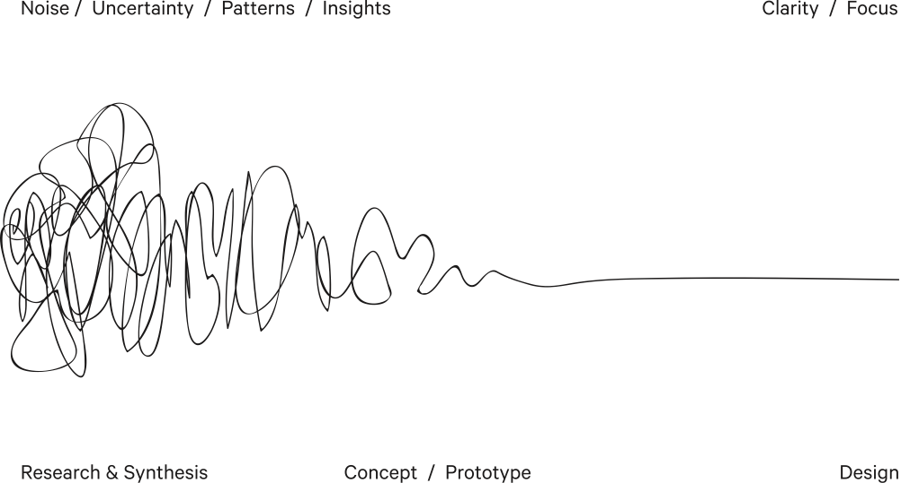
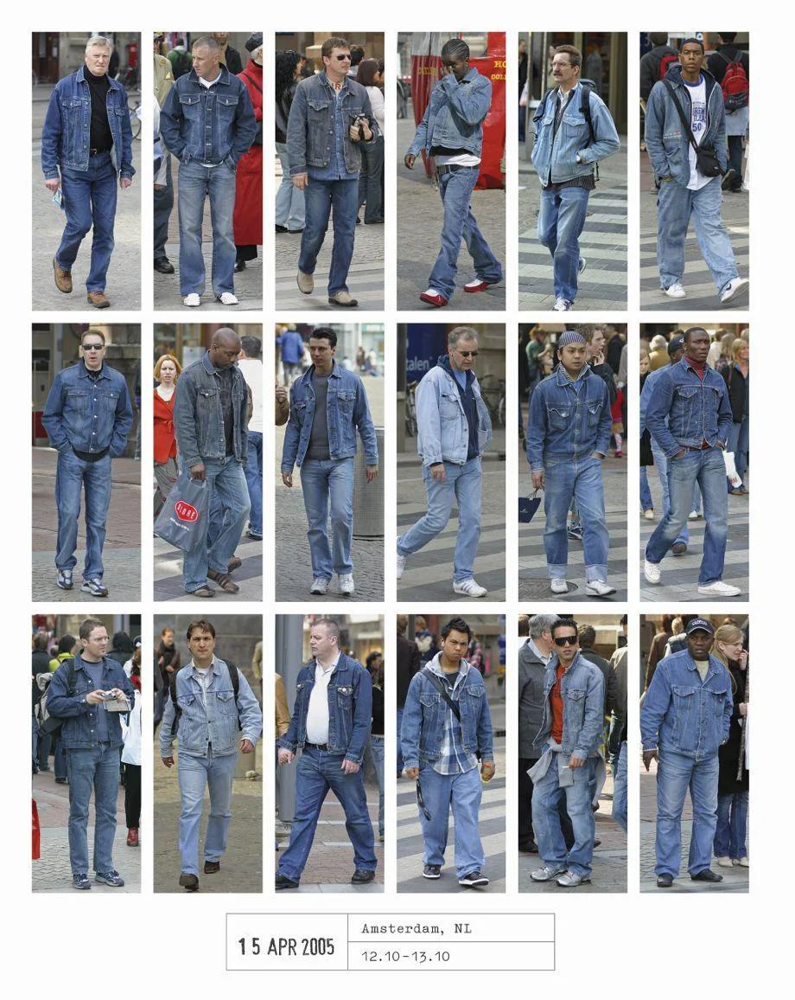

Design is a weird drug, and at least in the software world, we’re collectively high. Since I got started in this world, there’s been a huge amount of work done to democratize design — and I’m an outcome of that. Educated in political science, my gateway drug to design was the building of hardware and software instruments and installation art in my non-academic time. The thing that made me a good designer (whatever that means) was the systems thinking and research rigour that I learned in political science. However, the thing that’s kept me interested in design — apart from the hedonistic joy of making — is the process.

This idea for this post actually came while writing the Reconstructive Design Process essay two weeks ago and reading this quote from Rick Owens:

_“I’m always looking at the arc of my work and thinking about the next logical step. The fabric comes first: I usually start with 50 fabrics and edit them down to a dozen. Then I’ll work with black-and-white copies of archive looks, cutting up and manipulating them, or redrawing lines with a marker. I can plan a whole collection that way. I’ll ask my factory in Bologna to make toiles and, over one weekend, when there’s nobody else around, I’ll be in there working on them.” ([Interview w/ Rick Owens](https://www.matchesfashion.com/intl/mens/the-style-report/2017/01/the-paris-fashion-week-issue/my-desk-rick-owens-designer-interview))_

First, on process, this statement reflects a comfort in their own skin that is not seen frequently outside of independent design practice. It reflects an honesty of getting from **Here** to **There** that tends to frustrate those, who believe they are paying more for the process than they are paying for the end result. A consulting designer — or more generally, any designer working within a non-design institution — ends up wasting a certain amount of energy in the dramatization of process with the goal of trust-building. You end up with a three-body problem type of unpredictability in this scenario: the **process**, the **communication**, and the (imagined and then realized) **outcome** are in unpredictable tension with each other.

Often, this is communicated like this: _“Our design process is chaotic, but over time we narrow into something concise, legible, and ordered.”_ But the act of communicating this process externally, for the purposes of trust-building, narrows the scope of the possible process. The imperative of communication whips the process away from the outcome, changing both as a result. Since the act of communication serves as a forcing function for creating prototypes and concepts, this is sometimes for the better, but never what it might have been if process and outcome had greater freedom.

That design process is in one moment foreseen and unpredictable in the next, is the joy of being a designer. When I’m trying to explain my design process — and my confidence in the outcomes we’ll see at the end of it — I’m not telling you anything with certainty. I’m communicating that I’ve been down a path before, have seen the outcomes on the other end, and have a wall of elegantly [knolled](https://en.wikipedia.org/wiki/Tom_Sachs#Knolling) tools to get me out of dead ends. Because fundamentally, **design is about doing the work to explore those dead ends.** Getting something right initially is fundamentally not what design does. Design isn’t a prescription for a pattern, but it's an interrogation of patterns to generate a form.

[Hans Eijkelboom’s book People of the 21st Century](https://www.theguardian.com/artanddesign/2014/oct/23/hans-eijkelboom-street-photography-tribes-people-twenty-first-century) is one of my favourite examples of this frame on design. Each individual expresses their style, tastes, constraints through dress, and Eijkelboom takes the time to organize those into likes — which in turn says something about the essence of the thing being observed. When we get to the essence of multiple “dead ends”, then we’re equipping ourselves with the tools to select within a domain of probability — one containing dozens, hundreds, even thousands of options — the specifics that make it into our tangible outputs as a designer.

Whereas Eijkelboom might engage in this task as a photographer observing the world and its patterns, designers have the additional benefit of observing their creations and iterating on those. A dozen prototypes might emerge one next step — an outcome of those different fragments. A dozen photos might not create the photo one wants, but it informs the photographer what to look for. The legibility one finds in design isn’t that outcomes are scrutable, but rather that the road becomes more legible through the interrogations a designer does on their own path.

Ultimately, this is also where the democratization of design practice through design thinking has done a bit of a disservice to design as a form-based, legible process. Understanding a process is not the same as experiencing it, and the experience of a design process ends up emerging naturally in any field where new things are arrived at through iteration. The Wright Brothers aren’t called “designers” often, but theirs was a quintessential design process — observation, insight, prototyping, failure, iteration. The [Netflix show Self-Made](https://www.netflix.com/title/80202462) about C.J. Walker reflects this too — a designer and businesswoman who designed a product to meet demand, and then designed her business and experiences as her scope expanded.

**The design is ultimately only legible from the outside when the work is done, and the process can be reflected upon.** Until then, it’s simply process — and process is not a monolith. The role of process is to provide us shortcuts to move quickly and to be redesigned completely if it doesn’t serve its purpose. If you’re seeking legibility in design before an outcome, then ask about what one has done in the past. If the journey is treated with the same iteration and reflection that the outcome is, then you’re talking to a designer.
