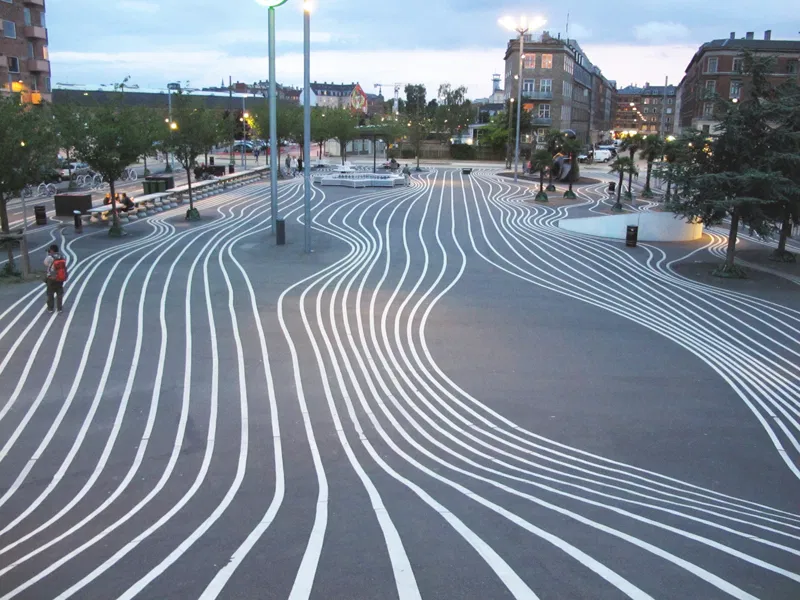
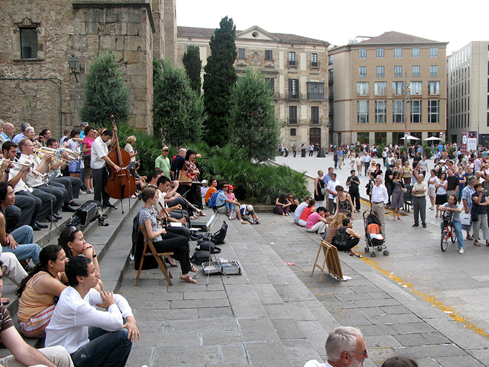
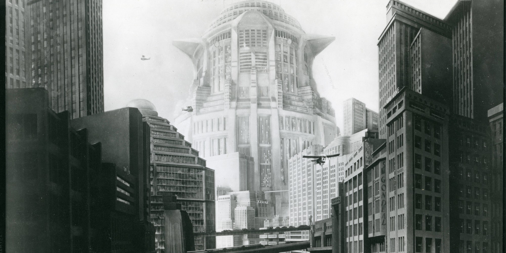

_As a forewarning, this is one of those “I’m working through something” posts and trying to wrangle my own thinking. I might come back and add to it as my thinking evolves._

About a decade go (oh man), I led a “walk shop” (a walking workshop) through Toronto that was focused on the exposed digital infrastructure of the city. Cell towers perched on the sides of buildings, early camera-based access control for cars, retracting bollards, and glitching digital ads. Toronto was a haven for this kind of stuff — something that Sidewalk Labs noticed and unfortunately squandered in its own exploration of the smart city. But reflecting on that workshop this week, I feel like I was missing a more fundamental network that made that city vibrant: that convening a group of interested urbanists and technologists to take time out of their days to explore was easy. That Toronto, a city of five million at the time, was a place where the creative, frustrated and aspirational flocked from around the world.

The fact that cities are frequently loci for a certain emergent quality is nothing new. In her book The Dot-Com City, Alexandra Lange explores how many of the leaders of the current Silicon Valley rise are looking to these emergent qualities of urbanism to fuel their own growth — going so far as to replicate ideas of the agora in cafeterias and meeting spaces, and organizing similar work units into neighbourhoods, both to keep workers focused, but also make these spaces legible to other units. Of course, this often ends up backfiring, as imposed order — even if its mimicking emergent qualities — rarely behaves as we might like. Jane Jacobs is probably the most famous commentator on this quality — speaking of the spontaneity of gathering and solution discovery in diverse urban environments that withers when overly organized. Much of this was [in opposition to figures like Le Corbusier and Robert Moses](https://www.metropolismag.com/cities/jane-jacobs-le-corbusier-new-york-city/), whose vision of New York as something ordered and elevated flew in the face of Jacobs’ view that the emergent New York WAS elevated. Ultimately, we got a little of both — a “perfectly ordered” New York would never be New York, and so it continues to draw the creative, frustrated, and aspirational.

I left Toronto in 2013 to move to San Francisco, after having a move to New York change somewhat last minute about eighteen months earlier. I reflect on this periodically since I have a deep love for New York and a more conflicted view of San Francisco, but I think of them as almost different countries. And this is sort of where I’m beginning to rethink my own identity as a migrant.

Currently, I live in Copenhagen with my wife, son, and two pets. We’ve pretty regularly moved cities every 2-3 years since 2013. Our dog, a greyhound, joined us in Washington DC. Our son joined us here in Copenhagen. I don’t know if this city hopping will continue (pretty sure it will tbh), but as I’ve been thinking about it, that idea that migration in my (admittedly hyper privileged) context is city-focused, instead of nation-focused, is pretty interesting to me. I still always say “I’m from Toronto” before catching myself.

Migration means a LOT of things to a lot of people. Forced migration can happen because of conflict, threat of violence, intolerable living situations. Seeing your children go without, when there’s an opportunity elsewhere, is often an imperative to migrate. With climate change, we’re going to see a LOT more of this. For others, it's a threat — those who don’t look to move outside their own environments fear those moving into their existing bubbles. Denmark is very much like this — engaging in a somewhat painful calculus with pulling in talent and investment from abroad, while being reticent to provide that talent with the tools they need to thrive. America has a vision of itself that does the same — an immigrant nation looking to stem the flows of immigration.

For others (like myself), I’m still trying to decide what’s going on. Unlike the “digital nomad” who hops from visa-to-visa, immigration becomes a part of the experience of working and living in a tightly interconnected economic and cultural system. Working in technology (at this point in time, anyway) is kind of a perfect example of this. Technology workers tend to be highly educated, highly mobile, generally younger, and have relatively high incomes. In a geopolitical context where many countries encourage or force English language education (and when English language media is so dominant that even if they didn’t, it would have a role), technology workers are uniquely advantaged to be mobile. But it’s not mobile in the nomadic sense — rather mobile in the “options” sense.

When I was living in Toronto, the idea of moving to another city felt somehow crazy. When I was living in San Francisco, the idea of living outside of the US or Canada felt crazy (having dual citizenship between Canada and the US). But when I moved to DC, something about the nature of that city and the people I was surrounded by made the idea of living internationally seem somehow obvious. Some of that was wrapped up in people’s economic and educational backgrounds; or folks who served in the military, or in diplomatic contexts; but broadly hearing people’s stories and lives outside of the comfort of “being a citizen” made for an expansion of my own view on this. But the way everyone spoke of those experiences differed considerably.

I spoke with someone recently who described having _Lived in Japan_, but then also having _Lived in Rome_. Where in Japan? But then, for that matter, where in Rome? Why did they say Japan instead of Tokyo? Kyoto? Osaka? For that matter, why do I constantly change my frame of reference when talking about social policies and dispositions within Denmark and within Copenhagen? I know an American who moved to the suburbs of Copenhagen recently with his family — not speaking any Danish. When we spoke recently, his sense of isolation was visceral, and yet he hadn’t felt the same in the city. Copenhagen is effusive, social, and vibrant; but maybe Denmark is protective, insular, and just a little bit suspicious. Or maybe there’s a bit of both? I love Copenhagen — and I think I love Denmark. Many Danish policies I found reprehensible, like [its poor treatment of Syrian refugees](https://www.bbc.com/news/world-europe-57156835) or the recent [narrowing of English language education opportunities](https://cphpost.dk/?p=125909), but the city I love couldn’t exist without the national context shaping it. But then, would Denmark be the same country without Copenhagen as its hub?

Reflecting on the walk shop I hosted, the thing that came to me was the collection of people around me. Only a few were actually native to Toronto. Most had come from other parts of Canada, the US, and Europe on their own journeys, and I was lucky to have them join me to explore the city together.

We’re seeing some interesting stressors on the idea of the nation state right now. Some are progressive experiments like the European Union and the Schengen Agreement, which has facilitated so much of the richness that is European cities today, peoples, cultures, and languages intermingle freely on a continent that is barely a lifetime away from being one of the more blood-soaked places on the planet. Others are maybe more destructive, from the United States dealing with increasingly polarized theories of America; or in the Ukraine as post-Soviet ethnic identities come into conflict. Elsewhere, the legacies of western colonialism are being both challenged and reinforced by shifting norms around identity and enfranchisement (the Middle East and Africa being key spaces to watch here, of course, but frankly also Canada).

What I’m curious to see is how the city continues to serve as the focal point for this change, or whether the city might not be powerful enough? And then what happens to identifying with ones city when the country fails you? Those from Beirut always seem to speak of the beauty of their city, and never of the state. Canada might not have the most architecturally beautiful cities, but natural beauty is only a short drive or bike ride away. But always from (and back to) the city.

Anyway. I’m finding myself thinking about the city vs state dynamic a lot. Part of this is the fiction I’ve read — the crumbling America depicted in _Snow Crash_ and _the Parable of the Sower_; or the dealing urbanisms of _The City and The City_ or _Embassy Town_; or N.K. Jemisin’s _Killing Moon_ series of books, or for that matter her book _The City We Become,_ which I have yet to read and sounds fascinating. _Ministry of the Future_ also had a distinctly non-national quality to it as the nation state as a unit seemed to be dissolved into other structures: urban, intergovernmental, subnational-yet-international. I am actually inclined to believe the nation state as an entity type still has a lot going for it. Part of my privilege has been being born to parents of two countries that carry flexible passports and the opportunity to travel, and that’s before even discussing the dual citizen part of it.

Still not quite sure what to do about this, but it has helped my thinking on the “What’s Next” question. Still not sure what that is, but this framing has helped shift the discussion around where, how, and why we move for my family and I. And if that’s our disposition, then understanding that is at least helpful.

Also, as a side note, I’m very, very curious to talk about this stuff and get your perspective on it. Please send me a note.
