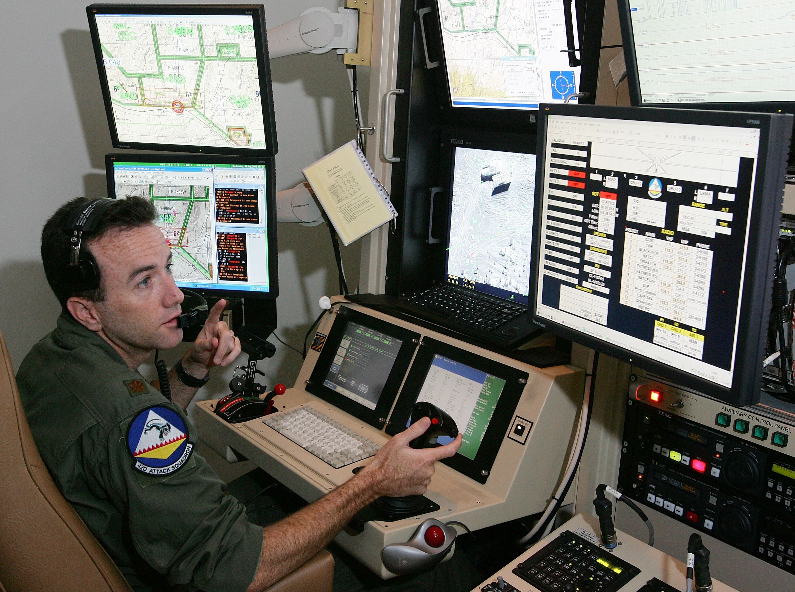
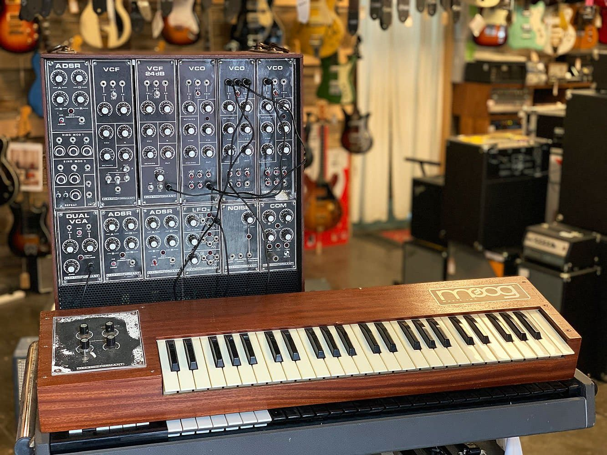

I’ve had a long term obsession with peripherals. Peripherals are objects (usually interaction mechanisms) that connect to computers to extend their capability. Today, a usable computer is now the size of our thumb ([or smaller, if you want to be pedantic about it](https://sudonull.com/post/11594-The-smallest-Linux-computers)), and so we’re pretty quickly reaching that point where computation (though maybe not connection) is functionally ubiquitous — in other words, we connect as much to our environment as any given computer. Similarly, peripherals range in form and function from arrays of tiny LCD buttons like the brilliant [Elgato Stream Deck](https://www.elgato.com/en/stream-deck-xl) (I own two and use them manically), to [eye tracking bars](https://gaming.tobii.com/product/eye-tracker-5/) that sits under our monitor, to the six degree of freedom [Space Mouse](https://3dconnexion.com/uk/product/spacemouse-wireless/) that — while initially counterintuitive — facilitates navigation through 3D space that’s incredibly natural. There are countless others — these are just a handful of the ones that I know. For this post’s purposes, we’re interested in peripherals that facilitate interaction with computers. A joystick, not a printer.

I’ve been [writing a lot](https://andrewlb.com/automating-research-recruiting/) [about automation recently](https://andrewlb.com/thinking-through-automation/), and peripherals play a big part in the conceptual universe surrounding automation. Automation facilitates a set of actions that we don’t need to worry about as a user — we provide instructions to the computer, and the computer proceeds to implement those instructions. If we’re using the example from my [Automating Research Recruiting](https://andrewlb.com/automating-research-recruiting/) post, we’re actually providing a wild number of instructions for the computer to execute — building a pyramid of automated tasks by further automating already automated steps with the different services we’ve glued together to get the job done.

Peripherals come into play when automation presents a gap. Perhaps a step is too complex, and requires critical thinking and manipulation. You might need to write something that you [can’t trust to a computer](https://www.nature.com/articles/d41586-021-02134-0) (yet), or you might explicitly be building a system with the human in the loop. The [disgruntled drone pilots](https://slate.com/news-and-politics/2015/07/air-force-drone-pilot-recruiting-struggling.html) locked in shipping containers outside Las Vegas are the classic example of this phenomenon. We COULD fully automate those things — I’m grateful that we don’t.

Peripherals also play a role in creativity, and this is the part that I’m most drawn to. To take a non-peripheral example, Adobe Lightroom has a pretty competent “Auto Retouch” feature. It can take a washed out or underexposed image from your camera and — by applying some good heuristics and a touch of machine learning — can make a pretty nice photo. Alternatively, you as the editor could jump in and make your own creative decisions. Bringing up the blacks and highlights, adding some localized gradients or colour masking, and an image taken with one tool becomes transformed by another through an interface reacting to the users’ creative intent. The problem is that many of those intentions are arduous to execute through the default peripherals we’re equipped with. Memorizing keyboard shortcuts, clicking through menus, and navigating deeply nested interfaces means that a huge amount of power can be packed into something very generalized, but is also restrictive when it comes to exploration.

The right peripheral can shake us free of that, at least in theory. When I first got into design work, I was blazing fast in Adobe Illustrator and Sketch with my Wacom tablet — much faster than I’ve ever been with a mouse. The focused utility of the peripheral, combined with practice and the right application, made for a workflow that permitted a LOT of experimentation and creativity. But it’s not a panacea. Today, I still have a Wacom tablet (albeit a pretty old one) sitting by my keyboard. Mostly, it’s used as a mouse pad, and gets pulled out from time to time when I need to do things like photo touchups and similar. But I no longer use it very often for interface design. Not that I haven’t tried, but the practice and skill of using it for THAT specific use has gone away.

This is the curse and blessing of peripherals. Peripherals allow us to open different pathways towards more natural interactions with computers. What natural means in my example with the Wacom tablet is:

- Familiar affordances — such as a the form factor of a pen being used to draw
- Learned behaviours — in my case, using the pen as a quicker mouse to navigate interfaces via the Wacom tablet
- Amendable Use Case — Interface layout and design was “just close enough” to drawing that a bridge presented itself

This is why a Wacom tablet is able to transition as a tool for certain interfaces that require the kind of precise interactions that the pen form factor presents, vs. that of the mouse. But then, if we try to use a Wacom tablet and pen in a word processor, we dive headfirst into a slightly more unnatural pairing.

In William Gibson’s sci-fi thriller The Peripheral, the idea of a peripheral is taken a step further to encompass a person’s whole self as the peripheral object to the machine. In the book, a Peripheral is a bio cyborg (I think?) agent that a user controls through a brain-computer interface (BCI). In this case, the BCI becomes a kind of omega peripheral: immediately and directly rendering intent into computation into action on the part of the peripheral agent. In the book’s sequel The Agency, a non-humanoid military robot (I interpreted it as something kin to [Tachikoma](https://en.wikipedia.org/wiki/Tachikoma) from Ghost in the Shell) is controlled via BCI as well, which would have seen the user forced to learn and visualize how this non-humanoid robot moved accurately enough (I can’t help but think of the [GoatMan performance piece](https://www.thomasthwaites.com/a-holiday-from-being-human-goatman/) here) AND rely on a layer of computation to translate human BCI movement intent into military robot movement intent. But, once mastered, that movement might be wonderful, fluid, natural, freeing.

Part of why I’ve been thinking about this recently is my own foray into flight simulation — both as someone making a simulation experience for VR and as someone who has been playing a very, very weird flight simulator called [DCS World](https://www.digitalcombatsimulator.com/en/). In this game, you often start on the ground, and armed with your 600 page PDF manual, you eventually figure out how to turn on nose steering and taxi your plane down the runway. This video is maybe the single best representation I’ve seen of the DCS experience.

<iframe width="560" height="315" src="https://www.youtube.com/embed/xb1u_hnlliY" title="YouTube video player" frameborder="0" allow="accelerometer; autoplay; clipboard-write; encrypted-media; gyroscope; picture-in-picture" allowfullscreen></iframe>

[YouTube](https://www.youtube.com/watch?v=xb1u_hnlliY)

This game is fantastic for a variety of reasons (though definitely niche), and part of this is because the whole thing is very carefully physically modelled — [this document goes into it a bit](https://www.digitalcombatsimulator.com/upload/iblock/dcc/DCS%20FM%20principles%20plus%20MiG-29%20P-47%20F-16.pdf). So when you’re interacting with the game through a joystick and throttle ([HOTAS](https://en.wikipedia.org/wiki/HOTAS) controllers), you’re interacting with a physical model of an aircraft interacting with a physical model of space. And what I’ve been fascinated by is _how quickly my intuition for that physical model has developed._

The physical quality of the whole experience makes learning it fascinatingly quick, and somehow the immersion from this model of control and flight becomes that much deeper than a game controller, a keyboard, anything really. In a weird way, it’s what connected me with the Wacom tablet and pen over a mouse for those right interactions.

The right peripheral frees you to experience computation as creativity. I got into design in the first place because I was building DIY synthesizers and instruments in Max/MSP, and was fortunate enough that a mentor saw a connection between that and design work. While I was never all that competent when it came to music, the idea that you can control something as complex as a waveform and shape it into compelling sounds, let alone music, has always seemed a miracle to me, and is probably where interaction design is at its strongest — or at least its most beautiful. Keyboards and strings; button grids and accelerometers; these kinds of peripherals were all built to facilitate creativity through computers, just as the patchboards and keys of analog synthesizers were created to control and shape something as filled with potential as an electrical signal.

Anyway! This was a somewhat ramble-filled post, but it gives some good cues to what’s on my mind lately. Curious to get thoughts on this — you can always [send me a note on Twitter](https://twitter.com/readywater) or [find a time to chat during office hours!](https://calendly.com/alb/officehours)
