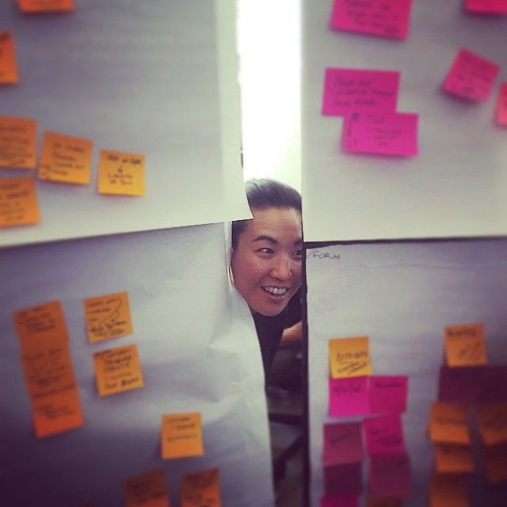

One of my more traumatic design research moments is something I barely remember. I had flown from Palo Alto to London to lead two weeks of field research, and had made a mistake. I had scheduled the first interview for about three hours after I stepped off the plane. As a result, I found myself with zero sleep in a new city, about to perform an expert interview. On someone who is a bit of a hero to me, none the less.

Well, I barely remember the interview, though thankfully I had a recording. It actually went alright, but it was ultimately a wasted opportunity by not being in top form. And so after I staggered my way to the hotel and slept for 12-some hours, I vowed never to so poorly plan my research again.

## **Pre-Planning**

Planning out the who, where, and how of your research necessarily comes from the Why and What that you should identify at the outset.

I like to begin recruiting for a research program between 3 and 6 weeks out from landing, depending on locality and complexity. Where possible, I have loved working with a professional recruiter. These recruiters can help you develop an effective screener, manage the “where,” and serve as a kind of soft fixer for the research itself. They let you focus on the content, in other words.

If you don’t have access to a recruiter though, then get started yesterday. Identify what you’re looking for, make sure you set realistic expectations around access. Do the leg work to recruit the right individuals, or if you’re working within organizations or communities, work to understand what stakeholders act as gatekeepers to those communities. This sometimes means developing relationships that might take months to mature into access.

In many cases you won’t know those barriers until you actually encounter them. So start now, and talk to those who have come before you. [Here are some tools](https://medium.com/knowsi/bureaucratic-mysteries-design-tools-for-government-9842decdf9fa) that might help from a workshop I taught for Code For Canada.

## **Making the Plan**

Alright, so you’ve done as much as you can to map out the unknowns and have started the recruit people. You have a sense of your Who and maybe Where from the recruitment. Now you must identify the How.

I like to have 3 key artifacts for the “how” beyond the standard interview guide: the trip schedule, the daily schedule, and the interview schedule.

### **My Whole-Trip Schedule**

This is a calendar that shows who I’m talking to, what time I need to be up each day, and in broad strokes, where I need to be. It lets me build in relaxation and breaks for myself and the team. It gives me an overall sense of our goals, and it tells me at a glance when the hardest days are going to be.

Usually this is a Google calendar or a foam core board covered in post-it notes. With each interview listed as a post-it with the participant’s details, it becomes easy to translate that into a daily schedule.

### **Daily Schedule**

My Daily Schedule, describing who we’re talking to, where they are, and importantly, when we get to take a breather. It accounts for travel time, it will often cover how we get there, and it lays out the specific goals for each part of the day.

If you’re working locally, I recommend sticking to a 9–4 schedule where possible. This gives your team a break if things are going smoothly, and it gives you breathing room if things go over or if participants are late.

If you’re doing remote research, then you work within the realities of what you need to accomplish. A budget pressed trip that won’t burn the team out (from my experience) might look like this:

### **The Interview Schedule**

Finally, you have your actual interview schedule. This will vary depending on the subject, the timing, and what you are trying to accomplish (the why). It shouldn’t be too prescriptive, but should give you cues to shift topics and stay on track. Respecting the timing for the interview is a way of showing respect for your participant as well.

Here’s an example of what an interview exploring a new feature or design might look like:

## **Loose Tolerances**

The best research trips I’ve been on are heavily planned with loose tolerances. That means that we’ve covered a lot of contingencies, while still leaving room for serendipity, discovery, and rapid response.

If you get an introduction through an expert interviewee to another potential research participant, you should have the flexibility to respond and act on that introduction. Similarily, if you find that the research is moving in a different direction than expected, you should be able to cancel or reschedule with participants where appropriate.

Good research trips are about drifting between known unknowns and unknown unknowns (This Rumsfeld quote gets way too much play).

Your job is to make sure that a riptide in the Unknown Unknowns pool doesn’t derail your research. Make yourself open to new knowledge and understanding, while staying focused on why you’re doing the research. Tragically, poorly organized research can lead to teams thinking they have a deeper understanding than they do, when they’ve really just allowed their previous perspective to echo back at them.

Stay open, stay focused, explore deeply.

## **Oh, and get the admin right**

Of course, when it comes to research, there’s some important administration. Before, I always found this to be a chore. [Which is is why I built Knowsi.](https://www.knowsi.com/)

Collecting the right consent from participants, scheduling, and organizing the media afterwards in a GDPR compliant and responsible way becomes easy. Plus, participants know you value their privacy because they get their own receipt of the consent form with the ability to reach out afterwards.

[Give Knowsi a try with a 1 week trial today](https://www.knowsi.com/join), and [sign up for our mailing list](https://www.knowsi.com/?mail=true) for a discount code and more articles like this every few weeks.

_This article was originally published on **[Medium](https://medium.com/knowsi/planning-your-design-research-trip-5eef90710026).**_
