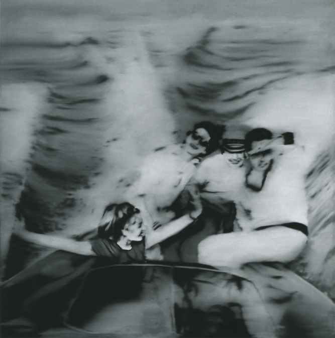

There are professional Cassandras out there and their curse isn't coming from Apollo this time — but from the institutions they serve under.

Warning intelligence is a function of the intelligence community that manifests in different ways, but at its best tends to come about as a small and senior team filled with experienced professionals with the ears of decision makers. The problem is, that while this structure emerges with some frequency (the CIA's National Intelligence Officer for Warning, or NIO/W is an example of this), these offices tend to pretty quickly get a reputation for crying wolf.

9/11 tends to be the most widely known failure in warning intelligence that many think of — a coordinated strike on American domestic targets, both civilian and military, by a well established terrorist network, whose rhetoric and actions forwarding a religiously-framed war against the United States were known to the American IC. But actually, you could argue this wasn't a failure in warning intelligence — whose purview fits the six month to several year timeline according to one of its great practitioners and thinkers, Cynthia Grabo — but rather a failure in tactical intelligence and interagency coordination (which is one of the arguments put forward in the [9/11 commission report)](https://www.9-11commission.gov/report/911Report.pdf). Warning intelligence had actually done its job. In the chapter "The System was Blinking Red," the commission outlines how many of the warning functions were operating well — sharing indications that major attacks were in the works — but the different security functions of state were not. In many ways, Cassandra was being ignored.

Most of us operate less in the present, and more as a kind of smear between past and future — with our present moments coalescing like a Gerhard Richter painting. Strategic thinking at its best orders this natural chaos: providing the structure and tools to look ahead, look behind, and actually make decisions in the moment that support futures. Ladder that up to decision making for not just oneself but others' time, resources, etc. and you get some pretty clear examples of strategic decision making. Taken up even further — with thousands and millions (the American Department of Defense has about 1.4 million employees when considering both civilian and uniformed personnel) people relying on different tiers of strategic decision making — and the impulse is to embed those sensory and analytical functions within specific teams and career paths. This is what makes it possible for an elected official with a four to eight year mandate to move into the chief executive role and actually do anything coherently.

Warning intelligence is one such analytical organ within the outsourced and institutionalized cognition of a chief executive. But like the weird pain or feeling of apprehension that we might easily ignore, warning intelligence isn't the thing driving the ship. Rather, it might try to influence at best — but often gets ignored.

During his presidency, Bill Clinton didn't have a great relationship with the security establishment. This was during a period when the somewhat bloated American military was being reduced following the close of the Cold War, and American engagement in overseas adventurism was manifesting in some weird ways. Amongst these was a loss of the "great enemy" of the Cold War, around which national security interests in America had swirled — which in turn shifted how the American public saw foreign wars. America's engagement in the UN mission in Somalia during the Somalian civil war, for example, was initially seen as a natural extension of American hegemony, but the Battle of Mogadishu (Black Hawk Down) in 1993 put a pretty stark end to that with the resulting death of 19 servicemen.

These events led to a kind of souring on intelligence and foreign engagements by the Clinton administration, who felt like they were being pulled into these engagements, less because America should be involved, but rather because it had the strongest capabilities — part of what drove the multilateralism that was dominant during his presidency. But this view also served to block out the warnings that the Clinton admin was receiving about other regional conflicts. Following the Battle of Mogadishu, Clinton was said to have an explicitly pessimistic view on further military engagements in Africa. He didn't want to know. But the point of warning intelligence is that things happen ANYWAY, irrespective of whether or not you want it to or not. So despite warning intelligence indicating that stockpiling and ethnic tension were occurring in Rwanda, the Clinton government [didn't do a thing](https://qz.com/384228/the-clinton-foundation-is-atoning-for-bills-failure-on-rwanda/) as a million Rwandans of Tutsi ethnicity were massacred by fellow Rwandans of the majority Hutu ethnic group.

Warning intelligence doesn't make the decision, but rather serves as a function in intelligence with two primary roles: **to track uncertainty and threats, and communicate effectively to decision makers when those threats manifest into risk**. When driving, our eyes move constantly: flicking across our vehicle's status indicators, the road (and its external status indicators, like dividing lines and shoulder), other cars and their trajectory and the mirror, to alert us about things from behind. If we see something that's a threat (like a big truck pulling up alongside, or one that we're trying to pass), we're a lot less anxious if we see it coming. The risk is small and we have contingencies (maybe pulling onto the shoulder, maybe deciding not to drive between two trucks, etc). But if we're reeling from a near miss moments earlier, or are caught unaware by its speed, then the potential risk we're taking in responding to this new threat is substantially greater.

Later, the Clinton admin had acknowledged that many, many Rwandans could had been saved with a relatively small American deployment of just a single division (around 10,000 soldiers). But the proximity to the Battle of Mogadishu meant that even though warning intelligence was serving its function with its analytic output, it had been systematically locked out from its communication function. Apollo's curse manifested in cancelled meetings, edited documents, and shifted priorities.

These days, there's more of a structure that John Gentry calls "Every Analyst a Warning Analyst" in his book [Strategic Warning Intelligence](https://bookshop.org/a/19778/9781626166554), which basically tries to diffuse this warning function across many different analysts. The problem is that perceiving threats from the miasma of risks and uncertainties out there requires a particular disposition and is frankly a job. Thinking about something really, really hard — worrying about it until something emerges and then validating that what emerged isn't just in your head — that's a full time thing.

In a lot of orgs, designers and researchers can play this kind of role by serving in a kind of foresight and prototyping function. While not attuned to decision making per se, the designer and researcher surfaces the right context for product decision makers to move effectively. In others, product owners do this type of work, looking ahead to where something needs to be and gaming out the risks to the product and the business surrounding it. These risks are surfaced incrementally in roadmaps and are responded to and acted upon by decisions makers.

I'm personally curious to learn a lot more about these kinds of institutionalized foresight functions within organizations (though I'll say that I think warning is different from foresight in specific ways — both in lens and communication), so expect some more writing like this.

However, if you're interested in warning specifically, take a look at some of the links spread throughout, as well as some of these resources below. Cynthia Grabo's book is free and was recently declassified after decades of service as a key resource in strategic warning training. I also wrote about Gentry's Strategic Warning Intelligence book, which is fascinating and very much worth your time.

## Some further reading

[National Intelligence Warning: The Alert Memorandum (U)](https://www.nsa.gov/Portals/70/documents/news-features/declassified-documents/cryptologic-spectrum/national_intell_warning.pdf)

[Cynthia Grabo's Anticipating Surprise](https://www.ni-u.edu/ni_press/pdf/Anticipating_Surprise_Analysis.pdf)

[Strategic Warning Intelligence](https://andrewlb.com/reading/strategic-warning-intelligence/)
