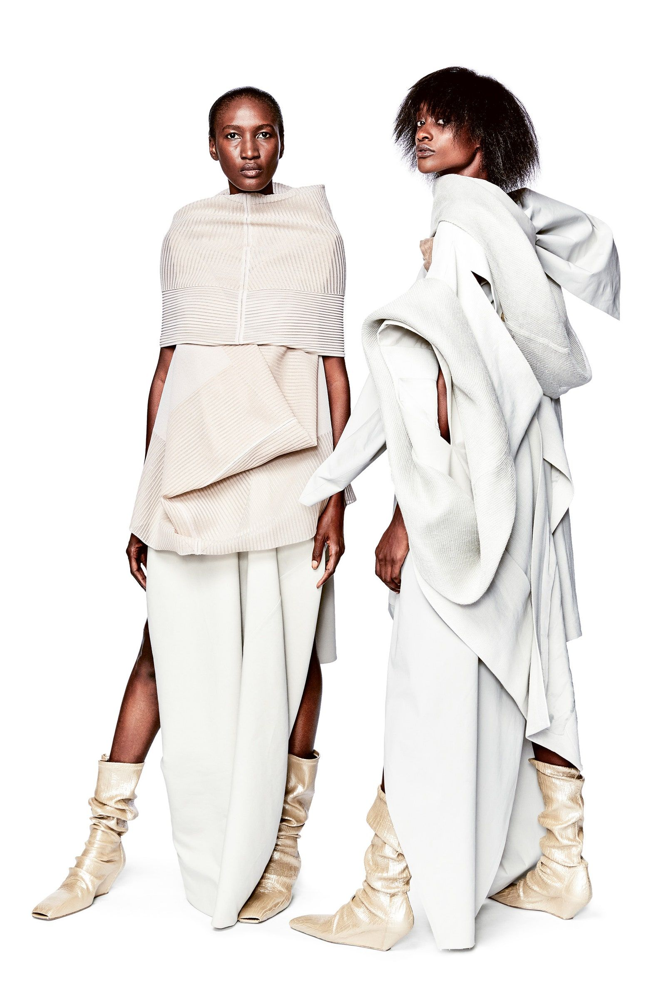
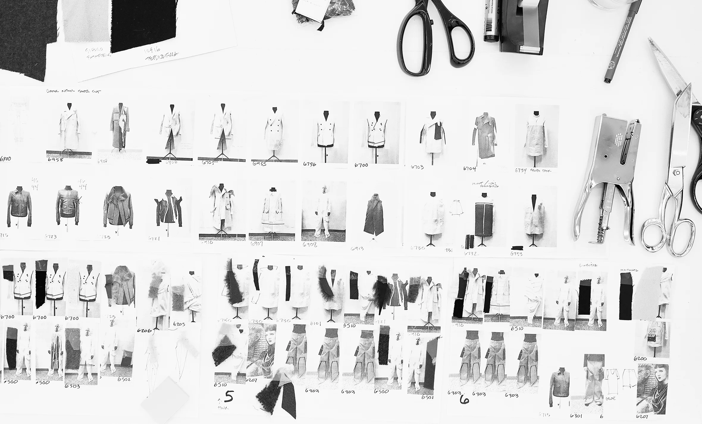
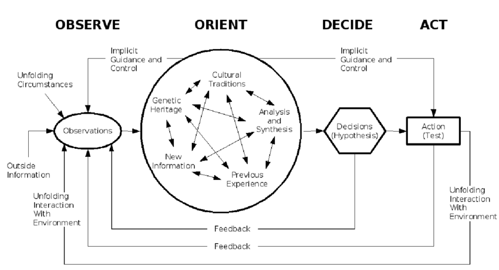
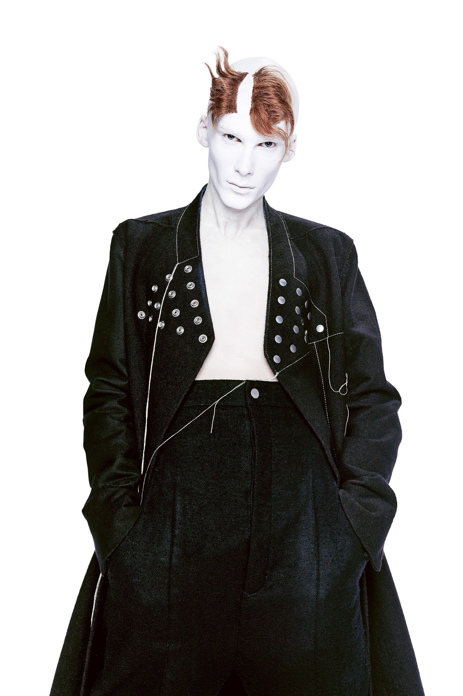
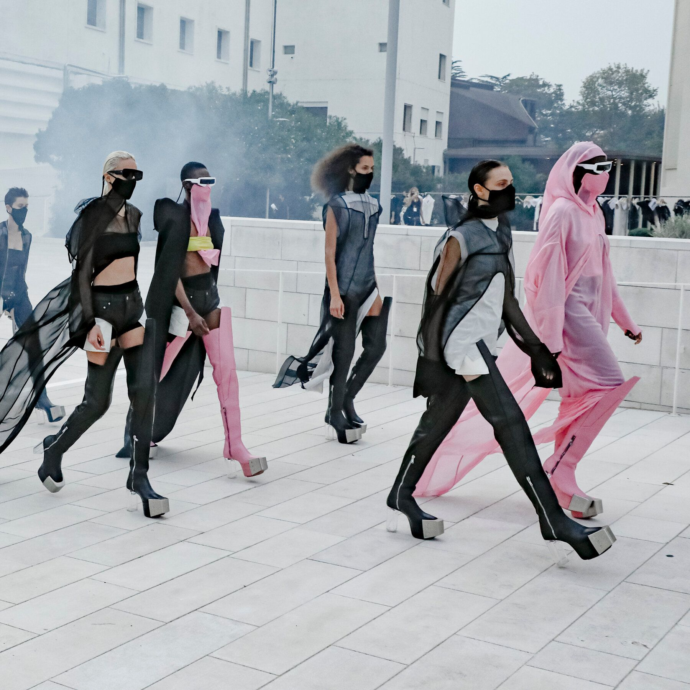

I love Rick Owens’ runway shows. They’re a consistent (and he is remarkably consistent) source of visual inspiration that I find bleeds into a few different sources of cultural and creative output. And as a designer consuming design work from a different material context, it’s almost inevitable that I get drawn into investigating process.

Across a few interviews that I’ve been reading, one of the things that stood out was the way Owens engages with the trajectory of his work.

_“I’m always looking at the arc of my work and thinking about the next logical step. The fabric comes first: I usually start with 50 fabrics and edit them down to a dozen. Then I’ll work with black-and-white copies of archive looks, cutting up and manipulating them, or redrawing lines with a marker. I can plan a whole collection that way. I’ll ask my factory in Bologna to make toiles and, over one weekend, when there’s nobody else around, I’ll be in there working on them.” ([Interview w/ Rick Owens](https://www.matchesfashion.com/intl/mens/the-style-report/2017/01/the-paris-fashion-week-issue/my-desk-rick-owens-designer-interview))_

A toile is a mockup of a garment made in cheap cotton fabrics, called muslin or calico. It’s a way to test the construction, drape, and fit of a garment in a fabric similar to the weight of the end garment, without taking on the costs of finer fabrics — which can get incredibly expensive. In the earliest stages of designing a garment, draping muslin on a dress form means cutting, pinning, and manipulating that fabric into the forms that map onto the vision that the designer is bringing to their work. He’s taking his previous refined works as prototypes to interrogate and remake in a new collection.

By working in this way (and Rick isn’t unique here), he is actively weaving the trajectory of his previous work into the demand for something new, with an upcoming collection. A silhouette might become accentuated or diminished through paneling; or a shoulder made more extreme or muted when unpicked on a toile — all incrementally moving towards the output that is ultimately communicated through polished forms and the communication medium of runways and lookbooks.

At its simplest, design is a perfusion of inputs into a process that results in an output. The work of design is the discipline of structuring and metabolizing those inputs into a form that — broadly — reflects those inputs. Perhaps more than most, designers are what they eat. But neither are designers distinct in this.

The OODA loop — articulated by the F16 designer and military strategist John Boyd — is a good example of how these actions are actually fairly banal. The OODA loop represents an observation, orientation, decision, and action loop that everyone is going through all the time, as we consume new information and decide on what it is that we’re going to engage with. Boyd’s idea was, that by shortening a pilot’s OODA loop, it would make them more competitive in a combat situation. For most of the rest of us, the OODA loop serves to frame how many of our actions are defined by rote response (jumping from orientation to action without engaging with it critically), analysis (jumping from orientation, to decision, back to observation without acting), instead of the full loop — conscious engagement with our influences as we move from decision to action.

Boyd’s model does an interesting job of balancing between the introspective and critical lens when engaging with decision making, as well as the more animalistic and reflexive lens — the action that bypasses critical consideration. In Boyd’s model, this bypass lends speed to action, by short-circuiting the decision step with instinct and directly leaping into action. What we maybe don’t discuss enough, is how that same tension exists in the quotidian grind of design work.

Rick Owens' work is incredibly emotional and physical. It’s intuitively and perhaps natively evocative of fantasy, sensuality, violence, and a kind of fragile calm that initially belies the intellectual underpinning of his approach. But that only makes sense as a tension, if we believe that the reflexive and intuitive is in contrast to a more intellectual stance, instead of complementary to it.

One of the things that Rick Owens’ work has taught me so far, is that the critical and the intuitive flow from the same source. But frequently, we’re so wrapped up in suppressing one or elevating the other that we don’t make space for the two to intermingle effectively. My sense is that Rick’s process of catabolizing his own work is at the core of this creative process — and a key to focusing on his instincts. His process critically engages with the more intuitive and emotional aspects of his identity and process — using that short circuit as a tool of predictable creativity that others might dismiss as irrational or undesirable.

The metaphor of metabolism is really at the centre of a reconstructive design process — old material is broken down for energy through catabolism, and new work emerges from its predecessors through an anabolic process. Repeated over and over, and the form that emerges is new, yet not. Structured, yet emergent. Consistent, but novel. A reconstructive design process emerges over a lifetime and, properly fuelled, creates a legacy.
