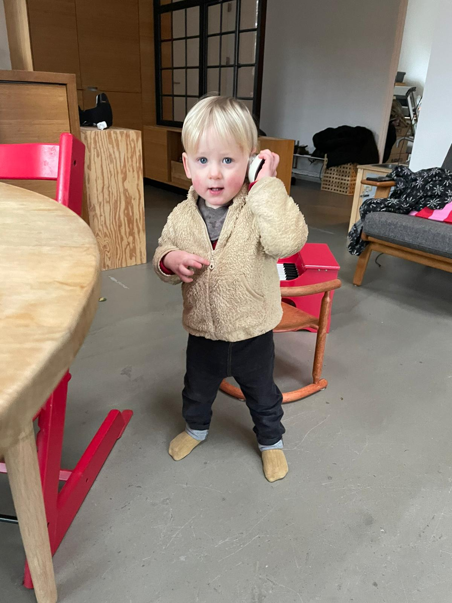
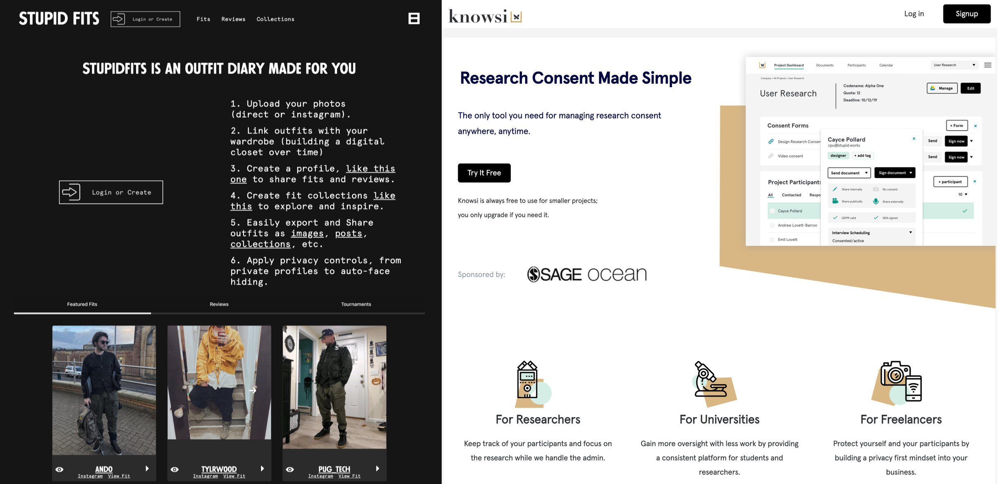
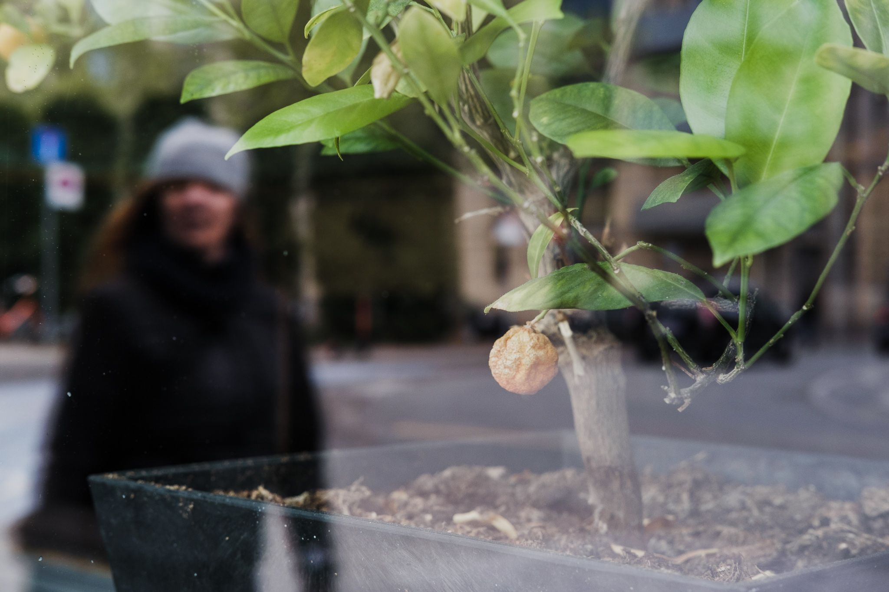

Well, that was a year. My family and I were more fortunate than most, but not as fortunate as some when it came to navigating the weirdness that was 2020. It felt a bit like we rounded a bend in an already turbulent river — only to encounter a flock of black swans and Nassim Taleb chortling on the banks.

I have a weird relationship to risk, and this year forced me to confront that relationship in a way, that I hope benefits me in 2021. But I’m not sure. Regardless, [like last year](https://andrewlb.com/reflecting-on-2019/), I want to look at the four big things in my life. Last year, it was all about change: having a child, starting a product, starting a master's degree, and surviving it all. This year was more about maintenance and sometimes growth. At times that growth meant holding on long enough to see the sun again — a skill I’ve honed in Copenhagen with its short nights giving way to too short days. In some cases, I’m still holding on.

## **Family**

Writing this, my son Emil is almost 21 months old. He talks in a pidgin of English and Danish, is fascinated with motor vehicles of all kinds (“Daddy TRUCK wee woo wee woo” as fire truck passes by), and loves the family greyhound, Moon.

Keeping up with Emil’s growth this year has been a joy and a challenge, amplified by the restrictions that the coronavirus put on travel this year. It’s now been some time since he’s seen his grandparents in person, and while the near-daily video calls this year have done wonders for maintaining and building their relationship — it’s been hard. Going into this, I don’t think I had understood what happens when you don’t have the infrastructure of family near at hand. My father put it best to me, saying “We looked down on those suckers moving to the suburbs until you and your brothers started sprinting.” This whole year has been a slow reveal of perhaps a reverse Rumsfeldian “known-knowns” chart. A kind of “known known unknowing” as the territory I thought I understood became undone.

What I do know is that the Danish government’s prioritization of keeping daycares open, and the thoughtfulness, with which his school worked to nurture and protect their wards this year, made for a 2020 that wasn’t so bad for my little family. My wife was able to start a new job, becoming a Design Director at a major Nordic bank. I was able to extend a consulting contract by a few months, lending an invaluable runway for my own business. We were able to structure a routine and experiment with it during a global catastrophe, specifically because there was the societal infrastructure in place to support families like ours.

Last year I wrote a bit about the idea that parenthood is a craft — but most crafts rely on a supply chain in their propagation. Whether it’s the luthier supporting a guitarist or the sewing machine manufacturer supporting a garment maker. Ultimately, [getting a bit to James Scott’s thinking in Seeing Like a State,](https://bookshop.org/a/19778/9780300246759) I feel like I’ve been learning how to see the craft of parenthood as something that extends well beyond my small crew — 14 legs total counting the cat and dog — and into a broader network both local and global.

## **Craft and Creations**

Work was a weird one this year. In theory, I had a really good year — but it didn’t go as I had planned. I started the year with the intention of wrapping up some consulting work I was doing with IKEA’s co-creation team: a brilliant crew building innovation tools and practices to spread to the 160k-plus employees of the Ingka group. I had initially been brought on to get some things unstuck and ended up leading a small team to launch and grow an internal innovation platform.

In May, I was awarded a [grant by Sage Publishing](https://ocean.sagepub.com/blog/tools-and-tech/concept-grant-winner-knowsi-interview) to translate Knowsi into a consent management tool for social science research boards. Knowsi itself was in a weird place — languishing a bit, while I was working full-time on my consulting practice. I had customers and interest, but I was spinning my wheels a bit, not understanding how to sell the tool. The funding from Sage helped boost Knowsi out of that hole, and in the new year we’ll be launching some features to support academic researchers better, and hopefully make data retention overall a lot easier.

New features aside, the Sage team helped me understand a bit more of the marketing and sales picture that I had been missing. I love building. I love making. It’s been the animating force for my career and hobbies. Whether it’s [been large scale installation art like Stoke](https://vimeo.com/80308354) or [hobby-reinforcing technology explorations like Stupid Fits](http://stupidfits.com/), I completely lose myself in the exploration, planning, testing, and iteration of a creative design process.

Where I hadn’t connected the dots (even though I, similar to the reverse Rumsfeld idea before, knew it in theory), was that the sales process was part of that creative cycle…. and I had to learn it in order for Knowsi to succeed. So over the past few months, instead of trying to sell Knowsi to customers with the intention of selling subscriptions, I’ve been working on selling Knowsi to customers with the goal of iterating on its business model and value proposition. Basically stumbling my way down someone else’s decision tree.

For all the business model canvases that I’ve both done and taught to others, nothing has been as visceral and immediate, as working with my customers directly. It’s been deeply humbling, as someone who has taught this stuff, and frankly scary.

Also, I did a lot of sewing.

## **Learning**

##

Last year, I started a distance master's degree in the UK. I had worked at the [Pentagon](https://dds.mil) for a while as part of the [US Digital Service](https://usds.gov), and that brief glimpse into the defence (though I suppose that should be defense with an S there) establishment left me fascinated and humbled. So… I decided to learn more and pursued a master's in Security Studies and International Relations. However, learning how to study again in a way that facilitates creating a good academic product, has been a real challenge, especially with so many other anxieties flitting around. I’m just starting my thesis now — exploring innovation processes in terror groups — and I’ll admit that after 18 months of study, it feels both accessible and terrifying.

For one thing, I had set myself a goal of submitting an article to a publication before graduating, like [War on the Rocks](https://warontherocks.com/) or [Divergent Options](https://divergentoptions.org/). I haven’t done that yet and in fact, keep wondering what it is that I want to submit on. What I did do, however, is to start writing a weekly newsletter called [Diverge Weekly](https://andrewlb.com/category/diverge/), which was my attempt to fuse what I was learning from an international relations perspective, with my background in design and foresight. I don’t know that it worked, but it took me down a pretty interesting path and has had a direct impact on my thesis direction. It also made me realize how much I enjoyed writing a weekly newsletter, so that’s restarting this year. [You should subscribe.](https://andrewlb.ck.page/bff8b858c5)

## **Holding On**

Last year, a big thing for me was recognizing unfairness in what I thought was some happy equilibrium, and the steps to resolve it. My wife and I have been using an (at this point, heavily modified) toolkit called [Fair Play](https://bookshop.org/a/19778/9780593231661) to work through a lot of this thinking, and it has proven a good weekly cadence for us to come together to deal with constant change and the often shrouded quotidian.

But there were also bigger cycles to consider, and so [we came up with a foresight game at the beginning of the pandemic that really impacted our decision making](https://andrewlb.com/covid-anxiety/). In some ways, it’s why we’re still in Denmark instead of in Canada.

The game helped us map out some of the potential scenarios that we might face — either directly resulting from the coronavirus or exacerbated by it. We gamed out each of these scenarios and what might compound from them, and then made decisions. Counterfactuals are difficult, but approaching our plan-of-attack for weathering the first year of the pandemic, saved us tens of thousands of dollars, likely reduced our chance of exposure to the virus by quite a bit, and facilitated some pretty significant opportunities.

It’s also not over yet. My wife and I have been fortunate, in that both of our families have not suffered a loss from Covid. Nor have we had to wrestle with the isolation that the dying and their families have felt during the global lockdown. I can’t imagine it. I hope never to imagine it. But I’ve seen colleagues and friends experience it, and I know that the world on the other side of this will be very different.

## **What Worked**

So ultimately, the goal of this is to reflect a bit on what worked and what didn’t this year. There are a few significant things that stand out:

- **Asking for help.** I didn’t realize how terrible I was at this. I’ve had a number of really incredible mentors throughout my life, and so I somehow got it into my head that I was good at this. Maybe I was, once. Either way, I started asking for and accepting offers of help more this year. Advice from friends about Knowsi, support and help in my business, babysitting, or running errands with my son. I’m still terrible at it, but … well, I am actively practicing.
- **Being strategic about learning.** This has been a game-changer for me when it came to language learning. I had admittedly started learning Arabic with the conviction that if I just put myself in the way of the language enough, it’ll absorb. This didn’t work. What DID work, was thinking about when and how I absorbed the knowledge most effectively and reorienting my learning around that. My teacher and I experimented with a few different times of the day and homework volumes until we found something that has been working now for most of the year. By thinking of things like alertness, hunger, distraction, and volume of sleep as variables in my language learning outcomes, it’s made the outcome to effort mix feel a lot more immediate.
- **Ergonomic-y investments.** This literally killed me. I made the shift this year to a split keyboard, vertical mouse, ergo chair, and tools like screen raisers and such. It’s all terribly ugly, but I haven’t had wrist pain or unexplained back pain since making the shift.
- **Remote work.** I had this pretty dialed in over the past few years, and it’s continued to work well this year. I have a good set up, a good approach to communication, and [even wrote about it as things started to shut down back in March.](https://andrewlb.com/on-remote-work-and-the-coronavirus/)

## **What Didn’t Work**

- **Remote work.** This didn’t work for a lot of people, and when it doesn’t work for someone on the team, it can undermine everyone. Forcing remote on people has been a nightmare, and my hope is that moving forward, in-person and remote is built into the teams and tasks from day one.
- **Remote communication.** I think communication during the pandemic lost a level of fidelity that was incredibly important. I won’t elegize the water cooler (because it’s horrible), but rather I might write one for the coffee house or the walk to the station before and after the workday. Conversations in those liminal third spaces are — for me anyway — some of the richest ground for inspiration and excitement. And they’ve been missing in some ways for me this year. WhatsApp groups and even Discord have taken on that role to some extent, but it definitely has not been the same. The experiment on this that I like the most is by Matt Webb, [who has started pulling free-form office hours](http://interconnected.org/home/2020/09/24/unoffice_hours). It was a fun, free form chat. I’ve had a few similar ones since, and I think [I’m going to copy Matt in this regard](https://calendly.com/alb/officehours).
- **Overcommitted to structured learning activities.** This year has been pretty fruitfully busy overall, but I overcommitted to the point where it’s actually quite hard to just be happy about it. I’ve been keeping up with my master's work and generally getting high grades, but each essay still feels like a mad dash to finish. Working full time while pursuing the masters has then made that run-up to a due date a bit of an emotional nightmare — even when managed effectively. Language learning plus maintaining existing certifications (my EMT certification expires in a few months) and studying for new ones (like getting certified as a CIPP for Knowsi) has been a major stressor. I simply didn’t think it through, and it caused me (is causing me) a lot of grief.
- **Taking on the wrong home responsibility.** One big failure this year was taking on the early morning daycare drop-off duties. Totally reasonable responsibility, but it torpedoed my work and sleep rhythms for a month. It took my wife pointing out my level of sleep deprivation was making me a horrible person to be around, for me to admit defeat and trade morning drop-off for another childcare responsibility that she was finding annoying. So not a long-term failure, but it was a good example of me not recognizing when I needed help.
- **Gyms closing** completely torpedoed my fitness routine, and when they reopened in Denmark, the anxiety I felt going made it impossible. I’ve stayed in a semblance of shape during the pandemic, but I haven’t found a home routine yet that works for me. I miss the squat rack dearly.

## **Miscellany**

- **Photography became a driver for getting outside.** [I posted a bunch of it on my main ](https://www.instagram.com/lovettbarron)Instagram. A lot of it was used in research and consulting. Got a lot of inspiration from Jane’s [Thoughtless Acts](https://www.goodreads.com/book/show/580270.Thoughtless_Acts_) as well as Hans Eijkelboom’s incredible [People of the Twenty-First Century.](https://bookshop.org/a/19778/9780714867151)
- **Lockdown was a terrarium for my wardrobe.** I made a pretty fun prototype in Notion for a digital closet, [which I wrote about here](https://andrewlb.com/a-more-intentional-wardrobe/). This eventually led to [Stupid Fits](http://stupidfits.com/) and [its Instagram account](https://instagram.com/stupidfits). Somehow social isolation made me a lot more open about my fashion habits. [I’m the first to admit that it is a bit out there.](https://stupidfits.com/u/stupidfits)
- **I started working with a business coach** and should have done it a lot sooner. But finding a good coach is very, very tough.
- **I discovered an internet community** for the first time, and really enjoy it. It was initially narrowly around Stupid Fits, but quickly became more — driving writing, sewing projects, and more. It’s also very vehemently inclusive and anti-troll.

## **Going into 2021**

For me, I’ll continue to work on Knowsi. I’m practicing the requests for help. I’m planning on experimenting with my consulting practice more this year, and have been working through December to restart Diverge Weekly and my mailing list. [You can subscribe here.](https://andrewlb.ck.page/bff8b858c5) I have someone helping me with that as well, to keep it consistent over the year. And most importantly, I’m going to continue to learn with my son. Confidence without understanding isn’t always the best trait (speaking as someone who left Washington DC in 2018), but confidence in exploring understanding is.

In [The Ministry for the Future](https://bookshop.org/books/the-ministry-for-the-future/9780316300131), there’s a line about one of the protagonists — a survivor of a heatwave in India: “He was having panic attacks whenever he got hot, and then the panic attacks made him hotter still. Feedback loop for sure.” I fear that the often low, sometimes high-grade trauma of the past year is going to eat away at us. It might be subtle sometimes — a friendship no longer what it was when you need it most; an anxiety around socializing or speaking where there wasn’t one before; a cushion of wealth absorbed by the economic chaos of 2020. I fear that taking risks and exploring the unknown is going to become a lot harder for a lot of people.
