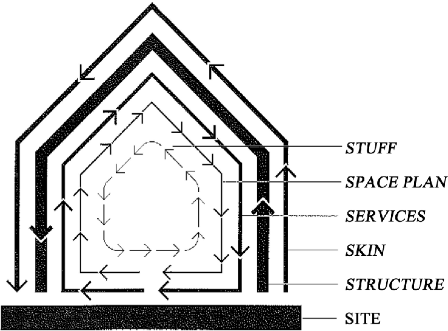

Every few months, my wife and I change around our apartments configuration. The way this manifests is always a bit different. On the extreme end, we might move the bed into a different room, discard or donate a beloved piece of furniture, or engage in something vaguely reminiscent of a Konmari via scorched earth campaign.

The spirit of this activity is three fold:

- Sometimes we might feel in a rut, and any spatial change is good. It’s cheaper than a vacation or moving house,
- Some activity or ambition might not be happening, and a possible cause is the space being non-amenable to the ambition,
- or we are just ambiently and non-specifically annoyed with our space.

So, when this happens, we have a few techniques to (usually with a weekend’s effort) test whether a significant change is needed (like moving house) or whether we’re just bored.

## **The Shuffle**

The shuffle is used when you have a pretty good idea of a problem, but aren’t sure how exactly to go about fixing it. We’ve had a “shuffle” moment a few times in the past two years: first when our son got the one closed bedroom in our house (moving my wife and I into the space that had once been my office), and more recently when a number of robots and workshop spaces invaded our home. You’d be amazed at how few spaces in a toddler inhabited home don’t work for 3D printing.

In each of these cases, the was a function-first need that necessitated the movement. Reducing clutter, creating a workspace, creating a quiet space for reflection and retreat, etc. This is also what most think of when approaching a renewal of their space. Unfortunately, functional primacy rarely makes for a home that reflects the nuance of the word, and so while the shuffle might make for a good start to things, it’s rarely the end.

## **The Add**

The next step, and usually the most fraught, is trying to add something. I personally fall prey to this constantly – as anyone who has seen my desk can attest. In these situations, a shuffle may have extraneous materials in its drive for addressing a functional need, but these things need their own home. Well, clearly a home most be procured to address these orphaned fragments of home. Though not always a bad idea, the Additive approach to renewal rarely provides for the outcomes we want. Instead, the usable space within our home (or workspace) becomes constrained, and our options around reconfiguration even more so.

Instead, a strategy might be applied to question the newly orphaned items, and — in a Marie Kondo fashion — ask if they really are necessary and as emotionally central as we think they are. I’ve gone through this process with my instruments, which I used to play often yet haven’t really found space for in years. Each time we reshuffle, I go to my one remaining synthesizer and ask the question. I’ve always made it a home, but I’ve resisted the urge to add so far.

## **The Rotate**

Sometimes your space just doesn’t feel right though. This can be because something else isn’t working, because you yourself have changed and evolved past what the space provides, or maybe it just really didn’t work in the first place. Regardless, a quick and truncated spin can sometimes address these quandaries.

Rotating ones space 90 degrees forces a change in aspect and perspective that can open up a room, or create a comfortable nook. It changes the way light plays across your work and relaxation spaces, it shifts the textures that make up the backdrop of your focus, and it can change the view for your video chat companions as well.

A few months after I lost my office and was relegated to the living room (I’m not actually complaining, though I would dearly love a proper workshop), things hadn’t quite felt right. And so we just up and tried a 90 degree rotation, not really being all that confident about what might fix things. I’m still not sure why it did. Maybe it’s something to do with the views from our entrances, but somehow the space opened up. And the rest was relatively slow and steady iteration.

## **The Mirror**

Like the rotation, the mirror is a direct flip of your existing space. What’s interesting about mirroring an existing layout is that the bits you’ve acclimated to which perhaps causing problems suddenly stand in relief: ready for you to make the more intentional changes that will get you to a space that feels right to you.

This is basically a trick I was taught in graphic design (a discipline where my skill are fairly pathetic) when it comes to logo design and typography: flipping and mirroring your design; casting it in greyscale; and generally applying different techniques to make the familiar unfamiliar enough for effective self critique and correct. Because our homes are so intimate and complex, yet banal — we are often the ones best equipped to intuit an effective layout for us. That intuition just needs to be triggered.

## **Iteration and Living**

I’m a very firm believer in rapid, bordering on frantic iteration with the belief in something emergent. In a project or product, that’s a good way to get to something that one refines; but in a home, we’re often provided the baseline that we then need to work our way around.

If we take Stuart Brand’s (who I got to meet once, supremely cool human) idea of shearing layers as a map of personal agency over a space, most of us at best affect the stuff and space plan layer. Some of us have the foresight and capital to organize aspects of the others, but even then the pace of change is dramatically slower, measures in years, decades, even centuries. By focusing on and valuing the quick, rapidly changing layers in our home, we have the opportunity to visit a new place in an old space time and time again — celebrating something loved with renewal and helping it grow alongside us.
