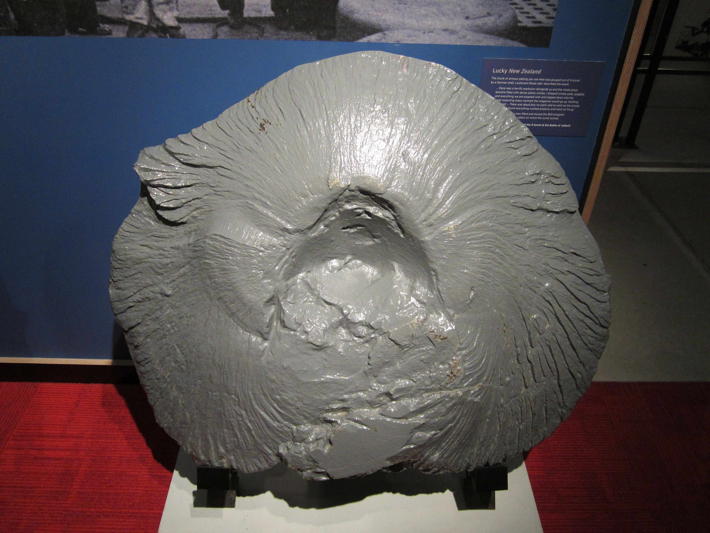

The skills we develop aren’t permanent. They’re things that develop within a particular context — education, a workspace, a team, etc. — that accrete and slough off over time unless continuously reinforced. The now aged youth who studied piano might retain their ear for beat and pitch, but can’t find the chords or read the music without placing themselves in a place to reacquire that skill. The lapsed skateboarder might struggle with their new body upon return to the practice to teach their child a former passion — centre of gravity, mobility, and forgotten detail hampering their efforts.

I tend to think of this process as a kind of spalling to our identities and our interests. We’re moving time collecting experiences and skills that contribute to our understanding and realization of selves (especially as makers), and the realization and manifestation of those skills contribute to our construction of self. But the reality of life creates friction — through labour (whatever that labour might be) under a capitalist society, through the responsibilities to family and community, through the remaining responsibility to one's self. Under this friction and heat, little bits of these skills start to spall off — fragmenting and spinning away as we continue on.

This probably isn’t too bad of a thing. For one thing, skill maintenance always includes skill acquisition. It can’t be helped. Practising a favourite song will inevitably introduce something new; reviewing old vocabulary will expose new idioms or trigger a forgotten conversation. Basically, [mindless practice often begets synthesis](https://www.scientificamerican.com/article/sometimes-mindlessness-is-better-than-mindfulness/). And that synthesis might unlock something special. Running is one of the most accessible examples of this — to the point that many artists, designers, and engineers understand that the practice of these endurance sports is not just a hobby, but absolutely critical to their creative work.

Other skills require similar perseverance. Painting is a great example of this, where understanding of technique and form must go hand-in-hand with muscle memory, conscious practice (usually in the form of a study), and a certain amount of risk when engaging in the creation of a new piece. A lapsed painter trying to get back into the practice is a pretty unpleasant person to be around while they reacquire their confidence — surrounded by the evidence of their past skills, they simply can’t get the paint to move like it used to.

What’s worse, sometimes the skill is a moving target as well. Software engineering is a quixotic example that an increasingly large cohort is familiar with. Here, the knowledge of a language, common engineering patterns, and mental flexibility to apply them, makes someone a good programmer — BUT the communal baseline is constantly shifting under their feet. I’ve experienced this plenty myself as someone who is more of a hobby programmer. I’m frequently making something, but every time I start on a new “big project,” I find myself in a new country with a whole new culture to learn.

So. Is it worth trying to stop this spalling process? I don’t really think so, though I think a lot can be done to retard its process. In material spalling with concrete, rebar (the crosshatched metal bars that form the frame of a safe concrete structure) is one of the core mechanisms used to increase the strength of something made with concrete and accounts for one of the foundational weaknesses of the material. If we accept that our skills will naturally spall, then by extension, what can we use to increase its strength and reduce its susceptibility to life?

The habit developed through regular practice and continued applicability of the skill is ultimately the best route forward. Lifelong musicians often have two familiar traits: a regular and joyful practice of practising and playing with the instrument, and the presence of that instrument in countless other aspects of their life — in school, bands, religious community, etc. For me, I’ve been programming since I was in high school, and the constant through-line has been making the things I dream up real. It started with a book writing platform for Nanowrimo, went to synthesizers and music, then installation art, then apps, and now simulation. It’s a hobby skill that’s been maintained now for almost twenty years, and never stops being a struggle and a joy.

The rebar analogue is pretty clear: the example musician has the core of habit and community; my example is projects and explorations through making. These two qualities make for skillsets that spall (please don’t ask me to write a MySQL statement), but retain a core of resilience that allows for the skillset itself to be maintained over time (I could figure out how to write those MySQL statements pretty quickly and effectively). The problem is, resilience is not permanence, as anyone who has seen rusted rebar and crumpled walls can attest. A habit is easy to maintain when your quotidian infrastructure supports it — less so when it becomes disrupted. I’ve personally had a pretty hard time pursuing larger hobby projects since my son was born — the demands of being a parent kinda supersede everything else, and frankly, the many little projects as a parent are their own discrete and wonderful thing. A new job, living situation, or romantic interest (i.e. the infrastructure of others) can just as easily disrupt if you don’t know what to look for.

The other side to permanence is accepting and embracing the process of mending. Japanese boro mending (as artistically rendered above with a Kapital boro jacket) is a great example of this — layering patches of old material overtop of tears, abrasions, and holes to construct and retain a well-loved piece of clothing over decades (though in the above photo’s case, Kapital is heavily leveraging a belt sander). True skill maintained applies exactly this process: the layering and mending of experience over time, as our past selves spall off; fixed before the core of our skillsets get a chance to decay. Over years and decades, the form is retained and recognizable, but with a diversity of texture and colour that represents something original.

As a hobby coder, my foundation is having regular projects (a few each year) that keep me stimulated, aware, and in practice. But my process of continuous mending is the diversity of projects that I approach: creating a synthesizer, developing a web app, contributing to an open-source project, or writing a game in Unity (the greatest trick the Devil ever played on humanity was using C# in Unity). A painter might develop their foundational skillset in a formal art school, then move across different mediums at different points in their life: digital illustration, miniature or sculptural painting, a return to canvas, then onto murals. Each of these experiences layers and accentuates the core skillset and experience. While returning to one frame on the skill (let’s say a return to oil on canvas) might be arduous, the form remains — richer and more textured than before.
