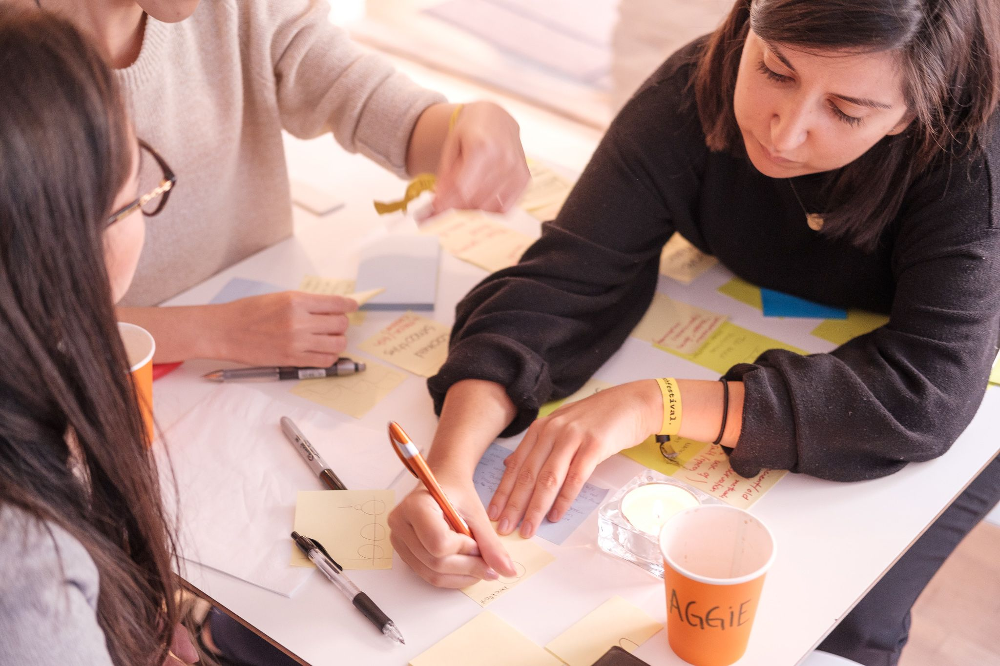
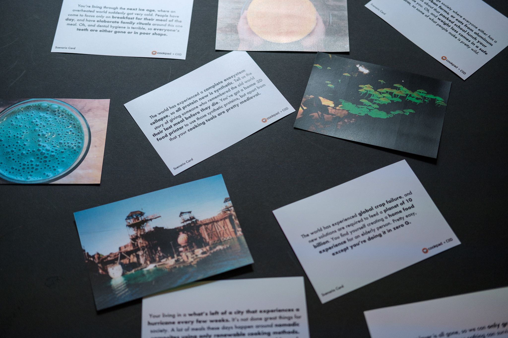
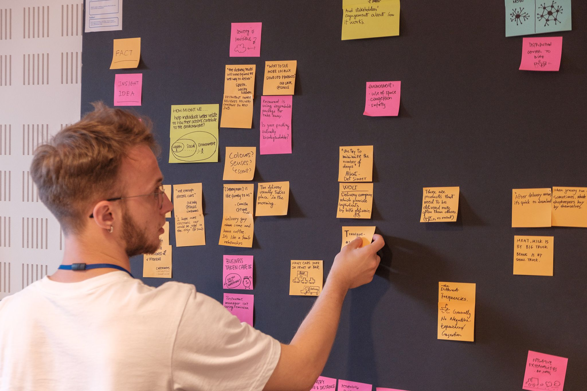

Since I run an app that has its roots in the world of Design Research, I spend a fair bit of time either doing research myself or speaking with researchers. I'm in the process of writing a research skills class (that'll be free for [Knowsi](https://www.knowsi.com/) subscribers), so I've been a bit underwater on thinking in terms of specifics, instead of more broadly on what skills and dispositions I believe a researcher should bring to the table.

At its core, good applied research is the critical refuelling station in any design process. Whether you're making usable software or figuring out the ergonomics of a soft-goods product (which, side note, is why I suspect brands like Acronym have such appeal to many tech folk), the research phase is where new influences are introduced — then filtered down and synthesized into a coherent map going forward. Without research, you're relying on instinct (which can be valid) and existing biases (which you may or may not be aware of). With research, these qualities still exist but are tempered by other influences and impulses.

Anyway. That part is a broader conversation, but I want to describe some principles that I think make for good interpretive qualitative research (mostly interviews) in an applied environment.

##

##

**Celebrate Your Participant's Experience**

You’re interviewing this person because of their lived experience. They may have come from a particular economic background, or have experience with a particular kind of work, or perhaps seek a service that is otherwise rarely available.

Elevating the humanity and experience of your participants is central to doing good research: when people feel respected and acknowledged, they are also more inclined to share the details of their observations. Best case scenario: they become collaborators in creating a better interview than you could have possibly planned.

##

**Your Experiences Can Build Trust And Create Rifts**

Knowing when to share and when to stay opaque, is a vital part of the research process. A shared experience or background can unlock a trust between interviewer and interviewee that had been absent, but the same experience or belief shared with another can close down the whole conversation. Take the time to learn about your participants, before sharing anything personal of your own history, and always do so in the service of the dual goals of great research and maintaining the dignity of your interview participant.

##

**Unlocking Lived Experiences**

When creating products and services, we are automatically inclined towards generalities. We think “How can this solve it in the best way, for the most people?” The reality is that our assumptions and beliefs on a problem often hold hidden nuance, and so we turn to the lived experiences of others to fill in the gaps in our own.

The trick here is to ask for specifics, rather than generalities. Instead of asking research participants “What do you think of _? How does _ work?”, we want to understand their experience with the subject matter as they experienced it. So to unlock those lived experiences, we ask instead “Tell me about a time” or “Okay, so you’ve done \_. What comes next? Can you give me an example for the last week?” to get to specifics. It’s those specifics that let us dig deeper.

##

**Keep It Open**

We’re laser-focused on our work, and so it’s incredibly easy to dive right into the specifics of our problem. Best case, this looks like an interviewer asking narrower questions than necessary, not creating the space for new ideas or experiences to emerge. Worst case: leading questions “How _much_ did you enjoy this experience?” and binary yes-no questions “And did you enjoy the experience?” can give the researcher a false sense of confidence, or outright lead them down the wrong path. So avoid these pitfalls by asking open-ended questions: “Tell me about your experience with ...” and “What about that experience felt good? What felt bad? What could have been improved?”

Asking open-ended questions may unlock fruitful tangents and ideas that you’d never thought of, or surface a customer need that was always present, but never articulated. So keep it open, and always be open to the unexpected.

##

**Have A Backup**

Sometimes an interview just isn’t going well. It happens. So what do you do? Experienced researchers have a grab bag of techniques, conversations, and prompts that they can draw from, but as you’re getting started, refocusing can seem like an impossible task. Always keep one or two backup activities or lines of questioning in play, so that you can still get something valuable if an interview subject is suddenly silent or perhaps doesn’t have the experience you expected.

This can look like a sorting exercise (such as gesture and word mapping), a sketching activity (warming up with 30 circles, and then focusing on something related to the research goals), or simply a more generalized line of questioning. But always have the backup. And if the backup fails, then you can always end the interview early.

A great resource for these kinds of tools is [the Hyper Island Toolbox](https://toolbox.hyperisland.com/) (assembled by my friend Alex while he was at HI). Give it a look!

##

**Research Is Work**

Having a fun and engaged interview subject is the best. Sometimes, the interview can flow like an easy conversation, and it becomes easy to forget that you’re speaking to this person for a reason and with an objective. Ultimately, research is work, and as much as we can be caught up in the joy of a great conversation, always return to your notes and the goals of the research to guide the conversation back to your research objective.

And then, once the project is done, if you and the interview subject hit it off (and professional ethics permit), grab a coffee or beer down the road and continue the conversation you had to cut short - though to be honest, I've never done this and kind of wouldn't recommend it.

##

**Research Practice Doesn’t Just Happen At Work**

Practicing design research skills doesn’t just happen at work. Great interview techniques like asking open-ended questions, empowering the other party to speak 80% of the time (at least), and asking questions that dig deeper into their lived experience: these are great principles for your personal and professional lives as well.

If you’re just getting started in design research and wondering how to practice, try learning about the experience of your taxi or uber drive. What kind of tools or techniques do they use to manage their finances? What kind of challenges do they face in that style of work? How did they learn to navigate the city and where do they avoid or recommend? You can practice your skills anywhere: just remember to be discrete, respectful, and trustworthy as you would be doing research professionally.

##

**The Interview Is Only The First Step**

You’ve done some planning, you’ve had a great conversation, now what? Well, hopefully, you have some notes or recordings that you can use. If you have a recording, I recommend using a transcription service to turn it into written form.

These notes and quotes become the basis of your synthesis: the process of bringing together multiple points of information into a coherent outcome from the research goal. This process isn’t easy: it can take days to get everything up on a wall and translate it into sketches, user stories, and insights. But that work and the advocacy for user needs that comes from doing the interview: it’s the heart of why design research is effective.

This is also a domain that has its own fairly intensive depth. Learning to code, categorize, and layer different types of analysis over the same data in order to structure an effective synthesis, can "feel" easy sometimes (especially when you have a team supporting you), but a rigorous process is required to make sure you're not simply reading your own biases into the data.

##

**Your Users Do Not Dictate**

Your user is not the designer, nor are they your boss. Unfortunately, it’s often the case that new researchers will hear a need articulated that resonates with their own experience of the problem, and will be taken as a demand or requirement for the product or service being created.

Celebrating the lived experiences of users also means acknowledging the limits of their experience. Sometimes, a user might represent an edge case, or their articulated need is not their actual need, or they are speaking for a hypothetical scenario instead of their lived experience. All of these inputs are valuable for research but should be treated as data points to be synthesized into an opinion and direction that comes from the research team, NOT direct from the user's mouth.

##

**Always Do The Paperwork**

This is where I got the idea for [Knowsi](https://www.knowsi.com/). The paperwork of design research is multifaceted, ranging from great interview guides, to great notes, to great synthesis. But the logistics of research also involve collecting consent across multiple levels, to orchestrate a finished design product. What happens when someone consents to be interviewed, but not to be photographed? Or to be photographed, but not allowing your client to collect or use that media? What happens to the media afterwards, and at what point is it appropriate to delete it?

[Knowsi](https://www.knowsi.com/) makes it easy to respect your subject’s consents and collect all your permissions in a single place. It also empowers communication with your participants for additional consent, if required (such as in a video), and helps you organize your interview, so you never go into an interview missing a critical form. You’ll have a single place to handle all the consents, requests for deletion, and permissions around media: meaning that your liability in a world with GDPR and improved privacy legislation is less.

## Storing And Evolving Data

Setting up effective research databases is vital for an ongoing research process. This is where taking the time to effectively transcribe, code, categorize, and record the different facets of an interview becomes critical. Not only does going through this process help with your own synthesis of the information, but it becomes an artefact for others to reflect on and learn from the research process.

There's lots of ways to do that. I've used Notion and Github extensively for this, but as I've been digging into Airtable, I'm beginning to think it might be an effective tool. The main thing is, you want to be accessible, backed up, easy for others to access, and resilient to misinterpretation. Usually, you need to be careful about anonymization and effective coding as well, so that if something changes (be it consent or categorization), changes can cascade down across the data set.

Anyway! I hope this was helpful. It's a bit of a personal list to reflect on as I build this course content, but I would love to hear what you think or if you have any feedback. Please send me a note on any of the social networks (or email) listed on the site!

Note: all images here are from the service design workshop I taught at the UNOPS building in Copenhagen and the Future of Food workshop taught at CIID.
