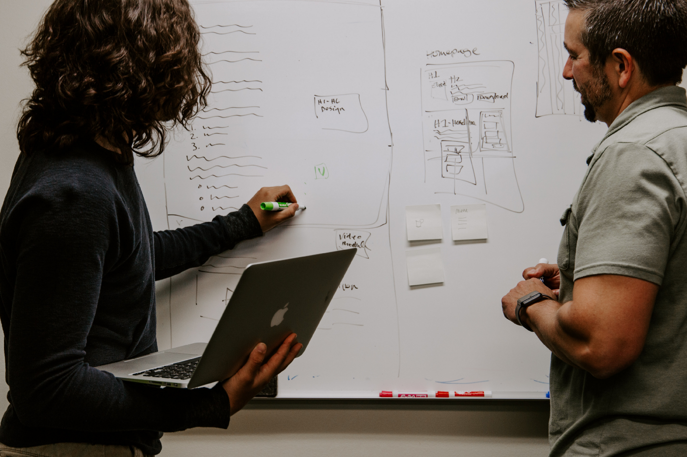
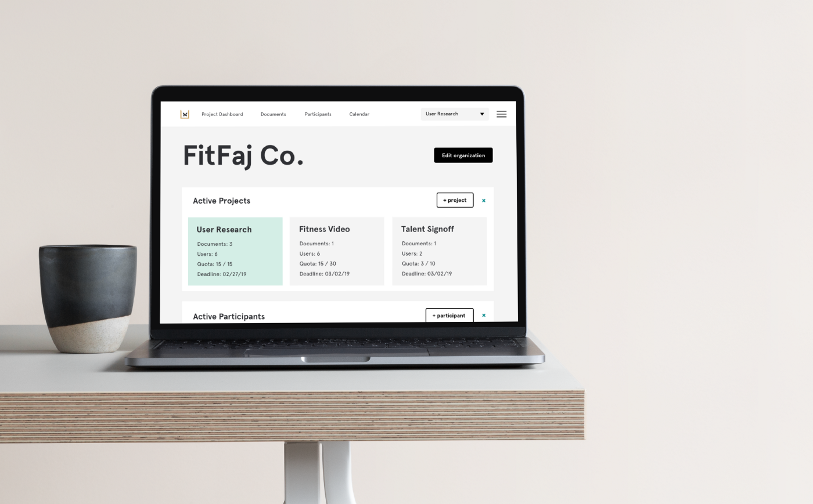

A new research project has come along and you need to recruit some research participants.

Castiron Coffee is exploring how to use their waste coffee grinds in low-cost dumbbells for CrossFit gyms. They think there’s a market, since the weights will be physically larger and will make it look like people are lifting a lot more than they are, but they’ve hired you to explore whether this is actually something people want and need. You’ve got a plan and you have a sense of who you want to talk to: **so time to find some recruits for your study.**

There are two main types of research recruiting emails that you might send out. The first is a cold email, and the second comes with an introduction or recommendation. We’ll focus on the first since this requires the most work — the same lessons from the cold email apply, but you have the benefit of including your reference.

In this scenario, let’s say we’ve found someone posting on the local CrossFit gym’s Facebook and we are sending them a cold email with the hope that they’ll respond.

##

## One Goal, Two Emails

Dividing your recruitment email into two steps can help with conversion. First, an initial “low commitment” introduction can introduce the idea, the request, and the parameters for your conversation. If the recruit agrees to speak, then you can follow up with administrative details like scheduling and consent. It might go something like this:

From: andrew@stupidsystems.com  
To: duanne1880@cfmail.com  
Subject: Chatting about fitness equipment re: Vertebreak forum

> _Hi Duanne,  
> Pleasure to meet you and apologies for the cold email. I’m a researcher with Stupid Systems, a product design studio based in Copenhagen. We’re working with a sustainable food company to explore using their waste products in fitness equipment. I was reading your posts on the Vertabreak CrossFit Facebook group about kettlebells and was intrigued!_

> _As a contributor to your CrossFit community, I was hoping we could connect to discuss fitness, how you use equipment, and where you think fitness equipment might improve in the future._

> _We would need between 60 and 90 minutes of your time, and ideally would like to meet in person at Vertabreak Crossfit. There would be two of us coming from the team, and we can provide a small stipend as a thank you following the interview._

> _Is that something you’d like to participate in? Let me know and we’ll schedule a time._

> _Thanks —_

> _Andrew and the Stupid Systems team  
> 415–555–5555 | andrew@stupidsystems.com_

And then, if Duanne agrees to speak with the team, we need to cover the details.

> \_Hi Duanne,

Thanks for agreeing to chat!

If possible, please use this link to schedule a time! We’ve accounted for travel time in the available slots, so whatever works for you.  
[https://calendly.com/alb/knowsi](https://calendly.com/alb/knowsi)

If none of those times work though, just let me know and we can figure something out!

Finally, we’ll be taking notes during the interview, as well as audio recording for note taking purposes. We’d also like to take photos in order to tell the story of what makes a great fitness product to our client. Your name and information would be anonymized before sharing it with the client.

Before we can speak, we’ll need you to sign a consent form, indicating that you agree to these details. You can withdraw your consent at any time.

[Sign our Interview Consent Form](https://www.knowsi.com/sign/remote?id=ckblzkgn8009o0774uu1g5mlc)

Let me know if you have any questions and thank you in advance for the consideration!

Andrew and the Stupid Systems team  
415–555–5555 | andrew@stupidsystems.com\_

Let’s break this down a bit into the core components.

## The Metadata

> From: andrew@stupidsystems.com  
> To: duanne1880@cfmail.com  
> Subject: Chatting about fitness equipment re: Vertebreak forum

This unfortunately can make or break an introduction email, since potential recruits can simply delete your email before they read the content.

People are busy and frequently inundated with email, so **getting something unexpected or unknown can prompt a dismissive response**. Many also have spam filters that might re-route your carefully crafted email to the dustbin.

**Make sure that the subject is personalized and specific**, that you’re using their correct email (check LinkedIn or personal pages, or send via a platform like Facebook or Reddit), and that your email is also personal and not a faceless corporate account.

##

The Introduction

> Hi Duanne,  
> Pleasure to meet you and apologies for the cold email. I’m a researcher with Stupid Systems, a product design studio based in Copenhagen. We’re working with a sustainable food company to explore using their waste products in fitness equipment. I was reading your posts on the Vertabreak Crossfit Facebook group about kettle bells and was intrigued!

The introduction is key, especially in a cold email. You’re setting the initial context for a conversation and this is the second stage where you might be summarily dismissed to the deleted messages category.

Use their name and immediately introduce yourself and the context around your request. I will sometimes bold personalized information or things that will trigger recognition, like Duanne’s posting about kettlebells to draw their eye. **Don’t ask too much, and also don’t be creepy.** Mentioning a post in a public forum is fine; but discussing their visit to Disneyland in a Facebook photo they posted 5 years ago — not cool.

Finally, **be specific and concise while respecting your or your client’s privacy.** You don’t need to reveal your client's name or the specifics of the project, but you do need to provide enough detail both to be honest and to trigger your recruit’s interest.

##

The Ask

> As a contributor to your CrossFit community, I was hoping we could connect to discuss fitness, how you use equipment, and where you think fitness equipment might improve in the future.

First, **contextualize WHY you’re asking this recruit over someone else**. “As a prominent member of the community” or “as an expert in medicine” or “as someone who is no longer part of the community” can all be great foundations to discuss.

**Mention a few specifics** about WHY you want to talk to them. I personally list these out before reaching out to recruit, in order to validate for myself why this person might be interesting. They can be as high level or specific as you need, and this will often be dictated by where you are in the research.

##

## Defining Details

> We would need between 60 and 90 minutes of your time, and ideally would like to meet in person at Vertabreak Crossfit. There would be two of us coming from the team, and we can provide a small stipend as a thank you following the interview.

After you’ve caught the recruit’s interest, include details about what to expect. From my experience, the most important details that you define are:

**Where** will the interview take place (or where you would like it to),  
**Who** will be attending (yourself and a secondary researcher)  
**Timing** how long will the interview take (I aim for a minimum of 60min, but schedule 90min to allow for overage)  
**Compensation** is whether there is some form of compensation for the interview (either a stipend, gift certificate, donation, or similar).

These details can be brief but must be specific. **Deviating from these things can break the recruit’s trust, which is the foundation of getting to great research outcomes.**

##

## Scheduling

> If possible, please use this link to schedule a time to chat! We’ve accounted for travel time in the available slots, so whatever works for you.  
> [https://calendly.com/alb/knowsi](https://calendly.com/alb/knowsi)

If none of those times work though, just let me know and we can figure something out!

This section will usually come in the second email after the recruit has agreed to speak. There are a few ways to manage scheduling. Either providing a few times directly in the email, using a scheduling service like [Calendly](https://calendly.com/), or leaving this to a follow-up email after the user has agreed to the interview. These all require different levels of commitment and responsibility on the team.

Personally, I use Calendly to manage many of my interviews: depending on the number of participants and the nature of the recruiting strategy (at-risk communities, experts, etc). However, Calendly can occasionally be impersonal and presupposes a certain familiarity with contemporary tools to use. Often it’s worth spending the extra time to schedule participants individually and build the foundation of trust and consideration.

##

Requesting Consent

> Finally, we’ll be taking notes during the interview, as well as audio recording for note taking purposes. We’d also like to take photos in order to tell the story of what makes a great fitness product to our client. Your name and information would be anonymized before sharing it with the client.

Before we can speak, we’ll need you to sign a consent form indicating that you agree to these details. You can withdraw your consent at any time.

[Sign our Interview Consent Form](https://www.knowsi.com/sign/remote?id=ckblzkgn8009o0774uu1g5mlc)

**All of this hinges on you getting consent from the participant, and that is a matter of setting expectations.** I like to briefly describe what the recruit should expect, and then let them know that the consent form is mandatory for moving forward.

In general, **you are required to have a record of your participant’s informed consent, and you need to provide an easy mechanism for your participants to withdraw their consent.** You also need to provide evidence that they were informed of those expectations and what media was being collected about them.

[**_Knowsi_**](https://knowsi.com/) **_does all of this for you._** It is free to use for smaller projects and provides a consent management dashboard for participants. All the hard parts of gathering and managing consent are done for you.

[Knowsi](https://knowsi.com/) does have a feature to send out these kinds of emails for you, but **I generally recommend that you write a personalized email and just include a link,** as the response rate is quite a bit higher.

##

Wrapping up

> Let me know if you have any questions and thank you in advance for the consideration!

Andrew and the Stupid Systems team  
415–555–5555 | andrew@stupidsystems.com

Wrap up in a light and open way. Invite questions and be gracious. Also **make sure your contact information is clear.** Almost always a user will simply reply to the email, but some groups may wish to contact you by phone or similar for questions.

##

## Final Thoughts

Sending cold recruitment emails can be really tough. They can often be ignored. Reflecting on a research project I did last year, we reached out “cold” to over a hundred practitioners in the data science and open source communities in Europe, and only got 28 participants. Our response rate was about 50% (which is decent), but only about 60% of those fully converted into completed interviews.

That said, **using friends and family to recruit presents a substantial bias in your study**. For example, a technique that can make this easier is snowball sampling, but the anchoring and non-random nature of that type of recruiting can completely invalidate your research depending on the nature of the project.

Ultimately, **it is part of the research design to decide on what type of recruiting is most likely to get you to the desired results,** but by starting with this structure for an introduction email, by being open and honest about your goals in the study, by being intentional about who you reach out to, and **by using** [**Knowsi**](https://knowsi.com/) **to manage the consent process for that stud**y, you’ll have a strong head start on going to the fun part: the actual interviews and the insights that follow.

Happy recruiting, and **if you have any questions or want a second eye on your recruiting email, drop me a line at andrew@knowsi.com**

Thank you to [Jewel of 33 Sparks](https://www.33sparks.com/) and [Nina Alter](http://bigwheel.net/) for the early review and feedback!

_This article was originally published on [**Medium**](https://medium.com/knowsi/research-recruitment-email-b862186ef3ba)._
