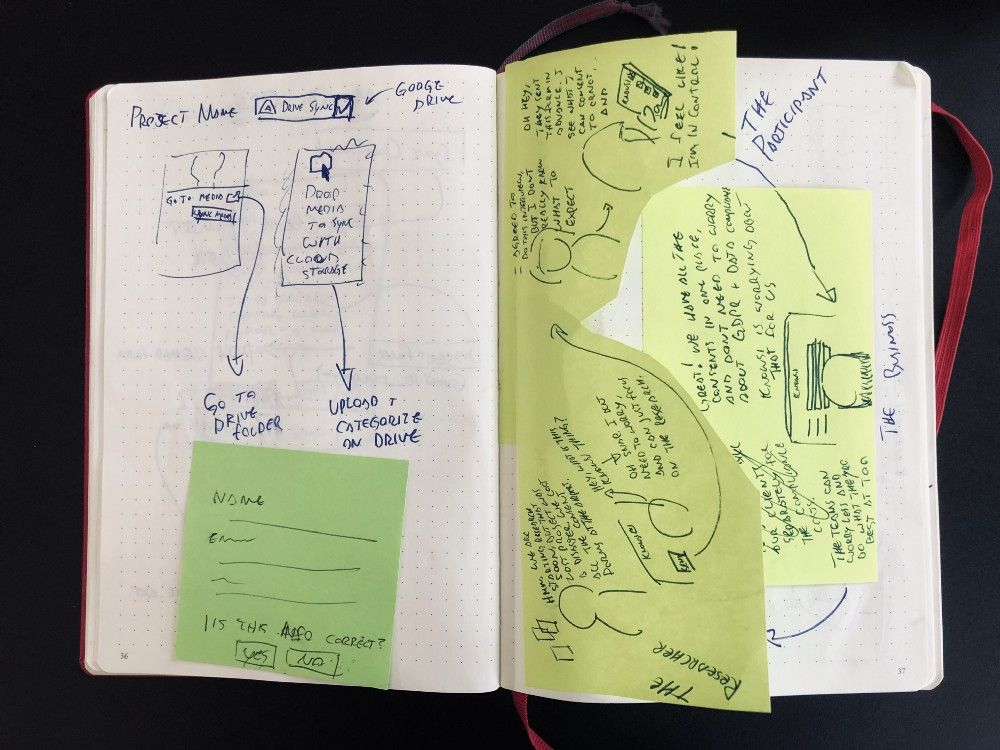
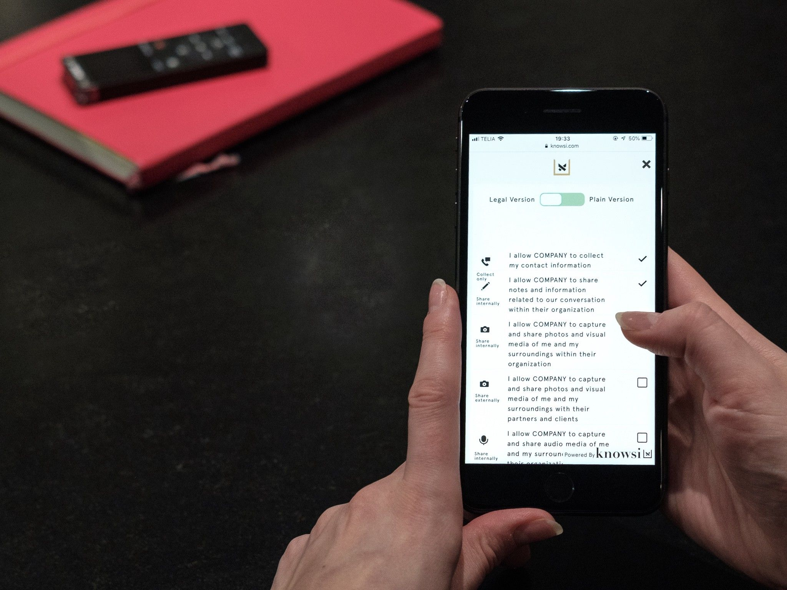

Design research is about sensing and synthesizing the needs of your stakeholders: a fundamentally human task. But we’re tool-using mammals, and it’s worth spending some time thinking about the design researcher’s Everyday Carry (EDC). [While a quick google of EDC](https://www.google.com/search?tbm=isch&q=everyday+carry) will usually surface photos of knives and paracord ([with William Gibson giving one of my favorite offhand critiques of it in Zero History](https://www.goodreads.com/quotes/tag/gear-queer)), I think we can make a strong argument for a softer and more open collection. Maybe it’s time for an EDC that isn’t all about self-defense and survival, and instead one that celebrates the vulnerability and open listening necessary to do good design research.

## **The Obvious**

### A Good Pack

No self-respecting EDC aficionado will go into the world without a good backpack. Whether it’s a fancy Peak Design bag, a 1000d Cordura knowledge worker special covered in molle straps (guilty), or an unassuming Fjällräven pack, the bag is the starting point.

Personally, I’ve been happiest with a 40L Goruck GR2 if I’m traveling for more than a week or so, and a decently modified 21L Goruck GR1 for home stuff. Both bags are unobtrusive and clean, and have survived everything I’ve thrown at them.

### **Audio Recorder**

I am a big proponent of recording interviews when you can. There’s always the risk of presenting a barrier to the participant for honesty and openness. but clear conversations about goals and consent can usually resolve this hurdle. Also having a small and unobtrusive recorder that disappears as the conversation picks up can make all the difference.

I personally use the Sony ICD-UX560 if I’m purely using it for transcription, and an older Zoom H5 if I’ll be using the audio in a production capacity. Using your phone is always a good option as well, but for file management purposes, I like the convenience of wiping the SD card after a research project.

### **Dedicated Camera with Video**

A good camera, either a DSLR or high quality mirrorless camera like anything in the Fujifilm X series of cameras will take you a very long way. Capturing portraits and environment photos can make the difference in communicating your research findings, not to mention sparking a new realization during synthesis.

For user tests, having a GoPro on a clamp mount is often a great approach with its wider field of view and ability to disappear.

### **Dedicated Notebooks**

I used to have a single notebook for everything, but more recently I’ve been creating dedicated notebooks for projects. For larger projects (like Knowsi), I’ve been using a hard cover A5 Leuchtturm 1917 with a dot grid for everything from sketching design elements and flows, to capturing interview notes, and exploring business models.

For a recent consulting project, I used a 40 page A5 Moleskine that I was able to fill up with participant quotes, and then date and archive it afterwards.

Multiple and specialized notebooks help you avoid some of the potential privacy pitfalls that you can encounter during the research process. Knowsi can wrangle the digital side for you, but having a good solution for the physical is also necessary.

### **Post-it Notes**

Almost always, I’ll take an interview and transcribe what I heard onto post-it notes, even if I’m using a transcription service. This forces me to think through and review what the participant said, and I get quotes and insights that I can move around and cluster during synthesis.

But I like to bring post-its with me during the interviews as well, since they are handy for quick prototyping and co-creation.

### **Extra pens**

Honestly, I’ve found myself without a good pen so frequently, it’s inexcusable.

I have two tricks: keeping a pocket filled with random pens in my backpack at all times, or selecting one or two expensive pens that I’m more likely to keep track of because I don’t want to lose them.

### **Sketching material (for interview participant)**

Depending on the purpose of the interview, having a good tool for sketching out a concept goes a long way. The quicker you can focus the participant on the co-creative act, the more time you have together to get to a good outcome.

### **Gathering Consent (i.e. use** **Knowsi)**

Most importantly, always have a consent form with you. If you are using the research data for commercial purposes (like building an app), then you have to collect participant consent. This also goes for collecting media and similar activities. Not sure why? Check out [this article](https://medium.com/design-research-matters/general-data-protection-regulation-gdpr-and-user-research-e00a5b29338e).

I think [Knowsi](http://www.knowsi.com/) is the best way to manage consent as a design researcher — that’s why I built it. You can also use paper consent forms, though be sure to keep them in a secure place, destroy the data after an agreed upon point, and provide a mechanism for your participants to change their consent going forward.

Or you could just use Knowsi!

## **The Less Obvious**

### **You Don’t Necessary Need the Laptop (but if you do, bring a charger)**

Think critically about whether or not you need a laptop. If you are recording and later transcribing the interview, I would argue that a stronger relationship can be formed with the participant if you don’t have a screen between you. Jotting down highlights or things that you want to return to in your notebook while focusing on what the participant says can be a much more effective strategy.

That said, if I am not recording audio or video and others will be consuming the interview transcript, I will always bring a small laptop or tablet with a keyboard to make sure my notes are accurate and complete. I type a lot faster than I write.

### **“Return-To” Information and Reward**

For all your research info, make sure there is a return-to address with a reward. Losing a client or participant’s confidential information is a massive liability, and it can set your work back weeks.

### **Medical Kit (and someone who knows how to use it)**

Having done research in situations where injury was a real possibility (one that in hindsight I should have predicted), I started to get nervous about my inability to do anything about it for either myself or my team. As a team lead, you’re ultimately responsible for your team’s wellbeing.

Last year, I did my wilderness first responder and EMT training with [SOLO wilderness medicine](https://www.soloschools.com/), and would recommend that in every team, at least one person has basic first aid training. A small medical kit with basics like nitrile gloves for body-substance isolation, benadryl for allergic reactions, small triangular slings for securing a break, ibuprofen, and other items like an epipen if a team member has a known extreme allergy. These can make the difference between a minor hiccup in the research trip and the whole thing going wrong.

### **Hidden Cash for Transit**

Always have some extra cash hidden away, especially if you’re doing field work. A lost wallet is bad enough, but having to walk back to your hotel to deal with it is even worse.

### **Water. Always Water.**

Stay hydrated. I usually have a litre of water with me wherever I go. I recently shifted to a [32oz Earthwell® Kewler](https://earthwell.com/products/32oz-earthwell-vacuum-bottle-kewler-cap) after about three years with the [CamelBak Chute](https://www.rei.com/product/866080/camelbak-chute-water-bottle-1-liter).

### **Snacks**

Bring whatever you need. I’m a big fan of almonds. I try to avoid sugary things, since losing the sugar high during an interview is a truly terrible experience.

## **Bring more snacks by bringing fewer loose papers**

Having a backpack full of consent forms used to be a necessary but annoying part of the design research process. [But now there’s Knowsi.](https://www.knowsi.com/)

Collecting the right consent from participants, scheduling, and organizing the media afterwards in a GDPR compliant and responsible way is easy. Plus, participants know you value their privacy because they get their own receipt of the consent form, and the ability to reach out afterwards.

[Give Knowsi a try with a 1 week trial today](https://www.knowsi.com/join), and [sign up for our mailing list](https://www.knowsi.com/?mail=true) for a discount code and more articles like this every few weeks.

_This article was originally published on **[Medium](https://medium.com/knowsi/the-design-researchers-everyday-carry-799b4c44aaa7).**_
