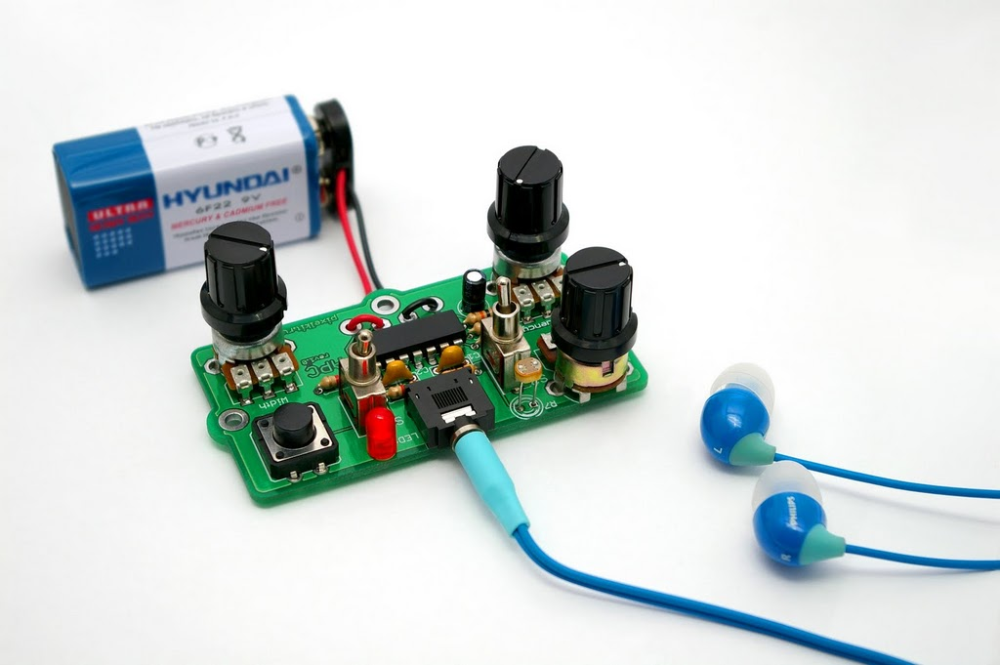

_(This is part 1 of several posts describing research automation. The following posts will describe specific case studies, tools, and mechanisms for automation relavent to researchers)_

Doing research is pretty hard and gruelling work. Because many of us love the sense of discovery that accompanies the research process, it can be easy to gloss over these aspects of the process as just the necessary pain of getting things done. And they are. But we don’t necessarily need to feel that pain.

We’re in a Cambrian era of software services spawning to address our different needs. We have software services that do jobs like collect signatures between parties, that check if websites are up or have changed, that share your calendar for others to schedule, or — in the case of my own product — manage consent forms for you.

This is all well and good, but so what? With so many different tools to use, it can be a bit difficult to string them all together — and orchestrating those different services into something that gets anything more than the most rudimentary task finished, can be more frustrating than just doing the work yourself. This is doubly true for those who don’t have strong technical and engineering backgrounds, which lend a degree of familiarity to the way that software works (and doesn’t work) to simplify or automate tasks.

My goal with this post isn’t to teach you everything you need to know, but I am going to try and share some strategies that you can use to make this automation thinking a little easier. There are two metaphors that have served me well in automating a lot of my own tasks: thinking in jobs, and thinking in “signals”.

## **Thinking in Jobs**

Most of us have a job to do which is — in reality — an amalgam of many smaller jobs, instincts, and competencies. As a designer, my jobs include **problem discovery** (facilitation, visualization, communication, stakeholder management), **simplifying problems** (project management, resourcing, scoping), **user research** (research design, survey design, recruiting, research admin, interviewing, transcription, synthesizing, communication, visualization, etc), and this is all before we get into the weeds of designing the thing through **concept development**, **iterative prototyping**, **refinement**, **validation**, **documentation**, and **stewardship**. Design is a particularly nebulous discipline, but I bet your work looks something similar. With so many jobs to do, it’s a wonder we get anything done at all. But then, we can always hire others to do some of that work.

In design and product management, the “Jobs to be done” framework has been a powerful way of thinking about value and investment relative to work that needs to be accomplished. Let’s say you have a camera. A camera captures moments from a particular perspective. From a mechanical perspective, you might say the camera’s job is to capture light onto a medium that stores that light. But if that’s the job to be done, how do you decide between a phone camera, a vintage TLR camera, a high end Leica, or an Olympus point and shoot?

Ultimately, the person wielding the camera isn’t thinking in terms of capturing light onto a medium — that’s the mechanic. They’re thinking in terms of what they need to accomplish themselves. This is why a wedding photographer's needs are different (though overlapping) from those of a social media influencer, whose needs also differ from that of a field researcher. A wedding photographer hires their camera to be reliable, durable, and discrete. To have redundancies, while also being manually adjustable to capture different scenes. To take a variety of different lenses to accommodate different needs. Conversely, a social media influencer might need a camera to be easily integrated into other systems; to be light and easily mounted to portable equipment; to have features like a shot timer and remote control.

When thinking in terms of a product, we can focus the design decisions on what the job is and for who the product is being hired? This lens helps us create a realistic and focused product. It also helps us when thinking about automation.

Automating aspects of our work involves being disciplined about the jobs that we need to accomplish. I can’t automate the synthesis process. It’s too complex, and I wouldn’t know where to begin. Hell, I have trouble teaching it sometimes.

But I can automate scheduling. Scheduling might include steps like: deciding on a date range, deciding on available times, creating a public calendar, sharing that public calendar, checking participant availability against my own availability, blocking time on my calendar, blocking time on the participant calendar, providing information about where and when we will discuss, following up, and providing for options to reschedule. Looking at the landscape of scheduling tools, I might just choose something like Calendly to “hire” for that job of scheduling. It doesn’t do everything for me: I still need to decide on date ranges and available times, and manage communication with my participant, but for the low cost of $5-10 a month, I’ve suddenly hired a service that otherwise might have taken me 4-8 hours. That seems like a pretty good return.

When thinking about your own jobs, think about the work that you do every day, and just list out the tasks. Everything from email to scheduling to transcribing to admin. Then take some time thinking about complexity (is this time consuming but mindless?), pleasure (how much do I enjoy this task?), time consumption (how much time a week do I spend on this task), and criticality (how important is this task to my work?). From here, you can get a pretty good sense of what might be a good candidate for automation. Highly complex and critical tasks (interviewing research participants) shouldn’t or can’t be automated, generally. Low complexity but critical tasks might be too vital NOT to automate in some way, to simply make sure they always happen (like paying bills). Low and medium complexity jobs that are time consuming (scheduling, gratuity payment, admin, etc) is usually where we need to make judgement calls on what is worth “hiring” a service to do the work for us. To make that decision, we need to understand how complex that hiring — that automation — process is going to be.

## **Signals and the Orchestra**

Sometimes we want to hire one thing to do multiple jobs — but sometimes that one thing doesn’t exist. Whereas we might have hired Calendly previously to manage our scheduling for us, but Calendly can’t manage our recruiting pipeline for us. Maybe we hired Loomly to manage our social media scheduling, but Loomly can’t create or validate our social media content for us. Coordinating between multiple services to accomplish a sophisticated job can be really difficult — not unlike coordinating multiple employees working towards a common task.

Unfortunately, unlike working with people, you can’t expect any level of initiative or problem solving from the software services you hire. They’re there to do a job and know of nothing else. **This is where I think many automation aspirants get mixed up.**

By framing software services as employees performing a job, we end up quite quickly hitting roadblocks where we might have expected an employee or contractor to “fill in” that gap with their own creativity and experience. When hiring software services to “do a job”, we then end up falling back on contacting customer support — a path that rarely leads to satisfactory outcomes.

Instead, the metaphor I find myself returning to is that of digital signal processing for synthesizers — which is complex, but hear me out.

There’s a lot of different forms of audio synthesis, but we’ll use subtractive synthesis as the most basic. When you’re listening to an interesting electronic or pop song and hear a unique sound, that sound is shaped through manipulating its waveform over time. It might be a recorded sample (crumpling a paper bag), a synthesized waveform (a sine or sawtooth waveform), or whatever. These inputs form what we call the **oscillator**: the initial part of the signal chain that GENERATES a signal for other components to manipulate. These other components are what we might refer to as modifiers — they shape that raw signal into the form that we want. We might add a **low pass filter** to the signal chain — filtering out the higher frequencies to create a bass sound. We’d probably want to add an **envelope** as well, so that we have control over the temporal dimension of the audio, similar to how a piano key press creates an initial loud sound with the ability to sustain a slowly diminishing sound over time. Other qualities can be added as well: a filter might be controlled by a low frequency oscillator (LFO), adding movement and dimension to the effect that the filter has. A compressor might be added at the end to normalize and control the final sound, etc.

The important piece to take from this is that each step of the signal chain performs a discrete and focused task as part of automating a complex workflow.

## Examples

Next week, I’ll share a walk through of _how to automate a recruiting process_ when collaborating with a customer service team. I’m guessing this might be a couple of post, so will make sure to update these with s links as we go.
