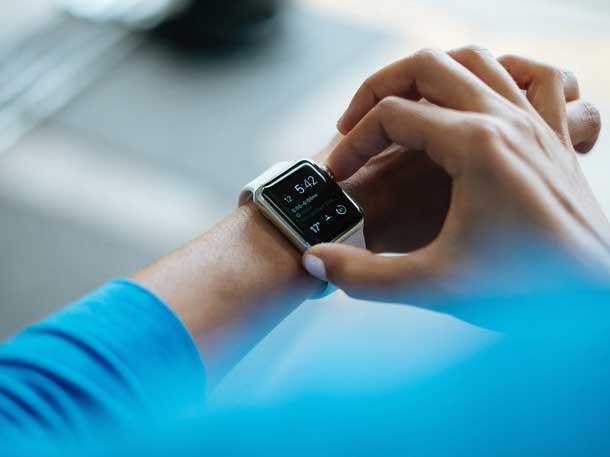
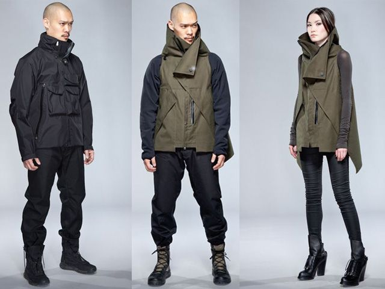

We adorn ourselves in technology. Whether it's the shrunken screens of today's smartwatches or the latest in lightweight, high resistance fabrics, the fact that we're wearing technology is indisputable. In the past decade though, two terms have emerged with considerable sticking power: tech wear and wearable tech. Those familiar can quickly distinguish, but to the uninitiated, it might seem like synonyms or a grammatical mixup. I'm wondering if the uninitiated — as is often the case — might be better equipped to judge the value of the technology we wrap ourselves in.

## **Wearable Tech**

Computation manifests in many ways — as infrastructure ranging from the room-sized mainframes of the cold war to the distributed cloud of Amazon Web Service; as the personal computer sitting on a desk or in a backpack, which serves as a kind of appliance (or platform for appliances); and as the carryable, as manifest by the ubiquity of smartphones knocking about our persons. And then there's the wearable. **Wearable tech** tends to be shortened as a "wearable," and references those units of computation and sensing that we might deploy on our bodies.

Wearables arguably start with the worn watch. Tied to a necklace or strapped to the wrist, this early manifestation of mechanical engineering and automation placed its wearer in constant contact with a technology imparting information and privilege on the wearer.

Jump forward to the modern computational era, and the site of the watch as attached to the body has become something that entangles its wearer with capacity beyond themselves. Garmin Watches and the Apple Watch are perfect examples of this — using the culturally standardized site of placement (on the wrist) as a particular locus for sensing and awareness about the wearer's body as a whole, it connects this information with a broader network that relays its awareness back to its wearer. It's a space where information about health, location, anxiety, and peace exit and enter.

## **Tech Wear**

(Acronym FW2012)

**Techwear** or tech wear, is something I've written about before — but broadly it's a style of dress focused on the urban environment that prioritizes materials and design complimenting physical activity and which protect from the environment. Goretex shells and sneaker culture is a shortcut to imagining it. Techwear is — as a cultural phenomenon — pretty new, despite technical apparel being unbelievably old. As Eva, a co-contributor to the Tchwr blog has pointed out, [wool is in so many ways an original technical material](https://www.tchwr.com/2021/02/24/naturally-supermodern-the-powerful-properties-of-wool/). Leather — also ancient in its use as a fit-for-purpose technical material —[has a place in the "tech wear" world](https://shellzine.net/cyberpunk-and-the-leather-jacket/), though it doesn't make its appearance as frequently.

In many ways, Tech Wear as a genre has been captured by a handful of distinct brands with their own aesthetic vision, and so the language of technical apparel becomes confused with the popularity of these brands. Acronym is probably the most prominent — Errolson Hughs has spent some twenty years developing his distinct style influenced by outdoor apparel, ergonomic sensibilities, military functionality, and an appreciation for meme culture. We've seen mimicry brands like Enfin Leve pop up as well, sensing a market that has space beyond that one brand. And in its wake plenty of worthy contributors to the technical apparel for the urban environment market — from Arcteryx Veilance to Lululemon to Nike.

But as tech wear has become grounded in popular culture as a "style", it begs the question — what makes apparel technical if Techwear™℠®© suddenly has a distinct meaning.

## **Complications**

Clothing has always been technical. It protects us from the weather, facilitates movement and ritual, signals tribe, and facilitates safety. So when we talk about techwear, we're talking about something distinct from just technical fabrics.

Similarly, we've always used the technical advantage of certain materials upon the body. [One of the earliest wearables is likely the tampon](https://www.theatlantic.com/health/archive/2015/06/history-of-the-tampon/394334/) — with suggestions that simultaneous innovation took place around the world as women sought agency over their bodies' cycles. The application of optic technology to improve sight and combat aging, the application of gypsum and cotton to create casts that immobilize and heal broken bones — these are all in their own way examples of the wearable.

From a more contemporary standpoint, the smartwatch presents a problem to this, because it manifests as something only a step or two removed from the phones — our carryables. Returning to our original definition — if a wearable is something that augments and senses the body at a particular site, then a phone might not be so different given the standard of pockets being where they are. Anyone who wears their phone in a chest pocket or knee-height cargo pocket knows that its data collection around movement is less efficient at those sites.

The Oura ring is the wearable that I think presents an interesting challenge to this. The Oura doesn't display any information — save for on the phone once connected. It's a ring that is passively worn and sized to a particular finger. It comes in a variety of finishes to match one's style, is a bit oversized, and is usually forgotten until your phone pops up a reminder that charging is required.

What the Oura ring senses is sleep and what it augments is decision making — and is otherwise invisible. For me, it's been the first utterly passive wearable I've owned, and I think the only piece of real techwear I have.

It's somehow the most futuristic and the most banal object on my person. If I wear an Acronym jacket, I'm wearing a few layers of goretex. A complicated membrane that repels water externally yet permits moisture to escape during activity. The fabric is an incredible technology itself, and then to have it rendered by Acronym into a vision of a technically augmented (and arguably dystopian) future makes it that style "tech wear." But when I wear an Oura ring, I can be wearing a suit, my pajamas, a full Hamcus wastelander outfit, or nothing at all save the Oura ring — and I'm augmented and participating in a modality of networked technology that didn't exist before the 1970s.

This is all to say that, in its own way, I think using the language of "techwear" to describe a particular vision of apparel is unnecessarily reductive. I love Acronym outfits and style, but it's a particular vision that came about in a particular time with a particular vision of the future — influenced by the writing of William Gibson, the advent of technical fabrics, and during its critical years, the post-9/11 malaise that's come to shape conflict and culture globally (Acronym's Techsys being a key example).

Rather, I think we're more likely to see a kind of freer formal style (I'm very specifically thinking of [Virgil Abloh's FW2021 Louis Vuitton show](https://www.youtube.com/watch?v=vV_QoQD_nrA) with this, to be honest) emerge — comfortable and classy, and filled with a cultural substance that is accessible and inclusive. And I think there will be technology there, but the enduring tech wear (or wearable tech) will look more like the Oura ring than either the Acronym jacket or the Apple Watch. An Apple Watch — for all that its face and band can be changed — is a specifically reductive, specifically closed system. The techwear jacket is the same — hard lines and factory-spec goretex black that homogenizes the wearer to a particular tribe and a particular set of aesthetic constraints (though constraints which can loose some great creativity, [as folk like Bethany Heck consistently demonstrate](https://www.instagram.com/heckhouse)).

The oscillations of global fashion and style are too quick and too chaotic for these limitations, but the value of technical augmentation is also too powerful. If an Apple Watch can help drive better sleep, help detect Covid infection, or warn of health concerns, then those with means will wear it. But if an Oura Ring can do the same and facilitate a certain style — maybe one where the site of our wrists is augmented by a sentimental timepiece or bracelet, instead of an Apple peripheral, or nothing at all — then perhaps that future will be a bit less homogenous than we currently imagine.
