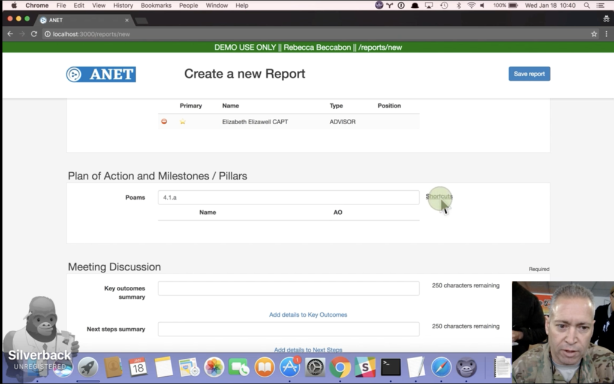
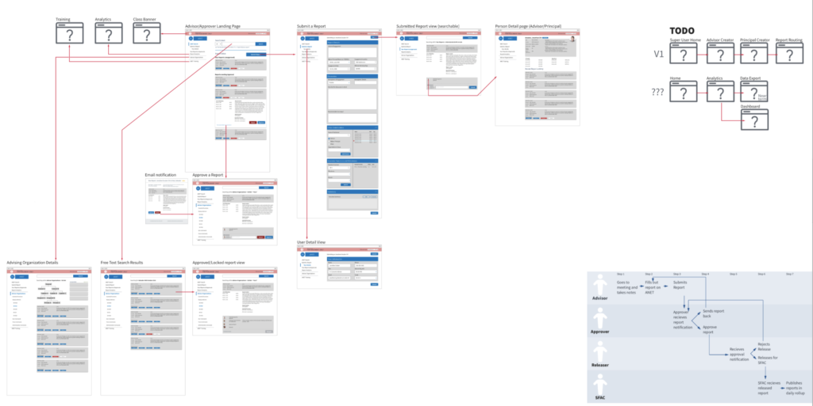

The Advisor Network ("ANET") is a tool to track relationships between advisors and advisees. ANET was built by the Defense Digital Service in support of the the USFOR-A and Resolute Support mission to train, advise, and assist the Afghan government.

Although this tool was built in a very specific context, ANET has many potential applications. At its core, ANET is a way of tracking reports and tying them to authors, organizations, and goals. It also simplifies relationships between members of an organization, and members of different organizations -- like NATO and the Afghan government.

In making this software available to the open source community, it is our hope that other groups are able to use ANET to meet their needs. We would also welcome contributions that help improve functionality, add features, and mature this work.

Press: [OSCON talk on ANET team work by Alvand Salehi](https://www.youtube.com/watch?v=edCj5rjrfe8&feature=youtu.be&t=393)

https://github.com/deptofdefense/anet

