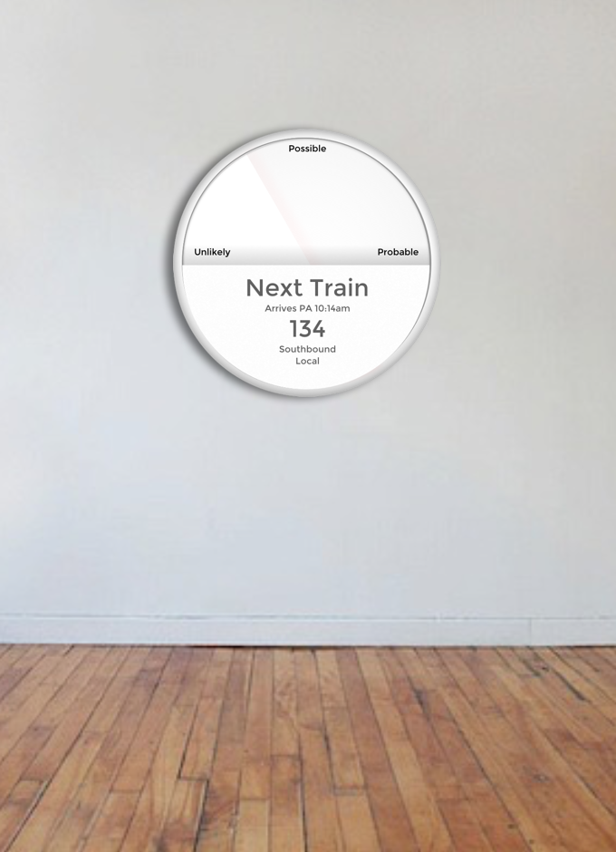

### GA Data Science certificate course

This project is an attempt to analyze twitter (and other) datas to understand whether I can detect disruption within the Caltrain system, and map (with some degree of accuracy) the probability that something will go wrong.

All notebooks available here: https://github.com/lovettbarron/GA-datasci

1. **00getdata** - Download and transform twitter data
2. **01sepEvents** - Separate tweets into unique events
3. **03explore** - Initial poking around
4. **03merge_hand_truth** - Merge in hand truth data, *truth_tweets.csv*
5. **04fill_in_positives** - Take *all_stops_in_pa.csv* and transform into positives data set
6. **05merge_with_positives** - Merge in positives set
7. **06initial_analysis** - Sketchpad for early interprtetive models
8. **07focus_decision_tree** - Complete analysis: Decision trees and gradient boosting, as well as multiple predictive approaches and tuning.
