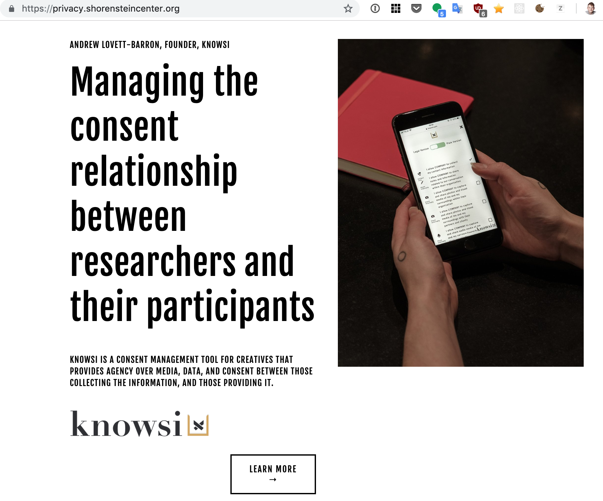

Knowsi was a Consent Management platform built on NextJS and Apollo, stemming from my own experience in design research. I had the opportunity to build a SaaS product from scratch, thanks to that combo of skills both being able to design and build the product. I had wanted to go past the design phase though and explore the full lifecycle of building a business, and so Knowsi became the fulcrum for that.

## The Idea

The core idea with Knowsi is tied to in-person and remote consent forms for research participants, and the need for explicit release permission being stipulated in the GDPR regulations. Knowsi had three key features that made this easy:

1. simple no-account consent forms for participants with the ability to update their consent after the fact;
2. tag-based consent forms that allowed researchers to see at a glance who has agreed to what (eg. 50% of participants agreed to media release, and that list is immediately accessible)
3. project-based and global participant lists, empowering researchers to easily reconnect with past participants for new projects or updated consent requests.

## Knowsi as a product

Designing Knowsi was relatively straightforward. The flow and application idea came together quickly on paper, and made its way into Sketch (and later Figma) shortly thereafter.

From there, I did a few interviews with user researchers in Copenhagen and Canada to validate the need and journey (essentially to make sure I wasn't simply focused on my own workflow), and with that I had the confidence to put together a small prototype.

The initial design included some motion elements that were prototyped using Principle, such as a loading animation and skeleton elements. The earliest version of Knowsi was prototyped directly in code, since I was able to rapidly develop a responsive, component-based design system that let me put something usable in front of potential users quickly.

_(A very early, mostly unstyled protoype)_

The helpful part about prototyping in code was that testers (mostly researchers at CIID, some freelancers, and myself in my own design consulting) were able to use it immediately. This meant that I was immediately seeing how it was being used, and quickly seeing many of my assumptions and beliefs about the need being invalidated.

### An assumption invalidated

One example of this was participant management, seen in the above photo. This aspect of the tool was relatively complex to be build correctly — requiring integration with calendars, transactional emails, etc. But in my early interviews, it was suggested as something folk would want. Instead of building the full thing, I was able to Wizard of Oz most of it by integrating a simply table in the app, and then using some manual and Zapier-based automations to make it look like it existed to my testers.

What I discovered was that most of my users were using combinations of tools to do their recruiting (cold calling, introductions, calendly, paid recruitment panels, etc) that made Knowsi as the "hub" for managing the recruiting flow a chore.

Instead, this test inspired the creation of embedded links and forms, which allowed for easy integration with tools like Qualtrics or a simple "project-level" consent form link that could be included in a calendly link or cold-call email.

_(Screenshot from a later version, where I was wrestling with flexbox)_

Finally, when the bones of the application were sufficiently in place and a complete flow was in place, I did a full redesign of the application to bring it up to something I could be a bit more proud of putting out in the world.

### Knowsi as a Business

I had an existing business open for my consulting practice, and so while the core process of building Knowsi was relatively straightforward — the tooling of building a business was less so.

The biggest leap for me was to developing marketing material and starting to build up brand assets that could be used on social media and elsewhere. I ended up hiring an illustrator to create the initial version of this: a short comic that reflected the overall flow of the application that could

When I was first working on the project, I was very much working in the open, and consequently was asked to have Knowsi included in the Harvard Shorenstein Center's Privacy by Design research.

What I discovered (obviously in retrospect, but I didn't really think this way), attention begot attention, and the Shorenstein writeup helped me land the Sage Concept Grant in 2020, shortly after launching the redesign.

The Sage connection helped massively, as it supported some more dedicated time to build features for Knowsi, and also allowed me to pay for services like an auditor and lawyer to make sure everything I had set up as a 'one man band' indie startup was actually solid.

It also helped me pivot my focus towards academia. What I was discovering with my original target user group (design researchers) was that even when it was easy, most researchers didn't collect consent in a GDPR compliant way — and didn't really care. And because the GDPR was relatively new at the time, most participants and researchers themselves didn't even know to ask.

In academia, however, it was an overriding concern due to their different legislative context. Unfortunately, this also came with different compliance mechanisms that I had a lot of difficulty managing as a solo founder. I managed to land a few small academic users, but ultimately wasn't able to answer some of the compliance questions that larger academic clients needed to roll Knowsi out completely.

By this time, I was working on a full time contract as a UX researcher with a robotics firm, was working on my masters degree, and had a 3 year old running around like a maniac. I wasn't able to devote the attention or funds needed to either higher a more experienced developer to amp up the backend for compliance purposes. The alternative was to seek a bank loan or funding, but I was not convinced of Knowsi's defensibility as a business to take either route: especially as businesses like docusign, dropbox, and consentkit were edging towards what I was providing.

## Closing shop

Knowsi was basically left to sit in 2021, and shut down in 2022 when the revenue was no longer able to cover expenses.

Here's a snapshot of where I was at with it in 2021.

Knowsi was a wonderful and incredibly enlightening project to work on, and a huge confidence boost personally that I could both run. It was also a small idea that required more attention than I was ultimately willing to give it.

Part of my hypothesis with Knowsi was that I would build 1-2 small applications a year, backed by my experience as a "full stack" designer. But what I hadn't accounted for (until running Knowsi) was the effort required to maintain not just the application, but sales, customer relationships, regulatory compliance, managing the occasional freelancer, the CONSTANT marketing requirements (the number of talks I gave at random conferences is astounding), unending pitch deck creation, etc.

**Basically, I ended up doing a lot of work to bring a small idea into the world, and found myself looking for the bigger idea that would be more suited to that effort.**

I'm so grateful for the chance to bring Knowsi into the world, particularly to the fantastic folk at SAGE, friends at CIID and Innofounder, and my lovely wife Ayla who helped me make some better decisions on the graphic design.
