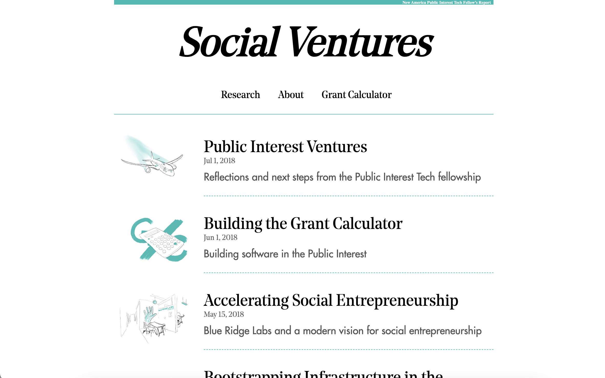

As one of the first Public Interest Tech Fellows, my focus was on sustainable business models for public interest technology. In addition to writing and supporting the projects of other fellows, I created and continue to maintain the Grant Calculator project.

- Collection of writing and interviews I did over the course of the fellowship.
  http://pit.andrewlb.com/
  

- Grant Calculator frontend and server code. [You can read more about it here](https://pit.andrewlb.com/grant-calculator)
  https://github.com/lovettbarron/grant-calculator
  https://github.com/lovettbarron/grant-calculator-server
