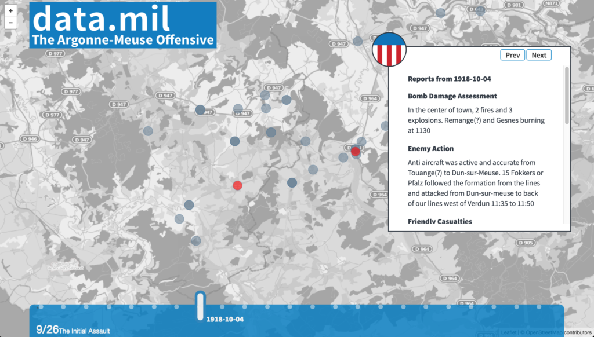

A quick demo of what one might do with the THOR dataset that lives on [Data.mil](http://data.mil/). Andrew and Brandon created the demo as a "hackathon" project to demonstrate a quick data application that might be built over a weekend's worth of time using the THOR WW1 data, Backbone, leaflet, and wikipedia to fill in some of the narrative content.

https://github.com/lovettbarron/data-mil-THOR-example
https://lovettbarron.github.io/data-mil-THOR-example/
