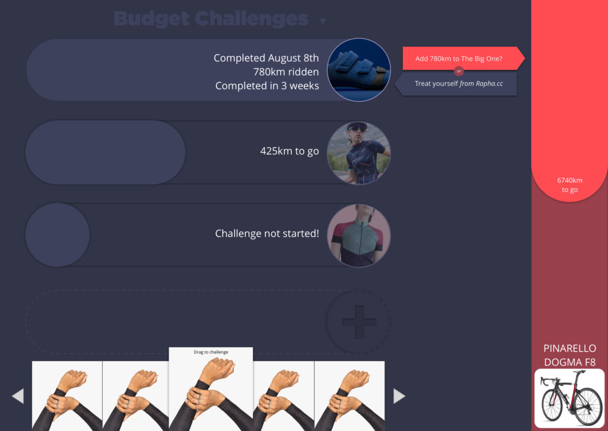

Pedel Pedel Club was a side project developed in 2016 while waiting for my security clearance to go through for the US Department of Defense. It is a cycling app that provides an easy reward and budgeting structure on putting in the miles that leverages two behavioural insights tied to new cyclists:

1. New cyclists buy way more gear than they need at too much expense or;
2. New cyclists don't buy enough of the right gear, creating a bloackage for themselves.

PPC was focused as a desktop app since my goal with it was to explore nice desktop interactions. This ended up being a big mistake, since an overwhelming number of my users were on mobile.

PPC was featured as a top Strava app in Bicycling magazine, and was selected as one of the top 25 Strava API apps by Strava.

[I made some cool slides here.](../_assets/pedalpedal.pdf)

Here's my writeup from when it was still running:
---l

Pedal Pedal Club is a cycling application and community built for two reasons: to express a point of view about cycling as inclusive and exploratory, and to take develop a product from concept to launch to maturity.

You can try it for yourself at [PedalPedal.club](https://web.archive.org/web/20190125072557/http://pedalpedal.club/).

PPC helps you budget and track your goals while you transition from just having a bike to being a cyclist (whatever that means to you). It uses Strava to keep up with your rides, and provides two ways to set your goals: through curated lists that introduce you to a flavor of cycling, and syncing with your Pinterest boards to turn your inspiration into goals.

### Concept & Research

Pedal Pedal Club started as a request from my wife for a “store” where she could put her efforts on the bike towards treating herself. I think she meant a checklist on our fridge, but I went a bit overboard.

The first prototype was called ‘Peddle’, and was a 48 hour hacked together amalgam of Strava and Pinterest that worked for a very specific use case. You can find the source code here:  
[https://github.com/readywater/peddler](https://web.archive.org/web/20190125072557/https://github.com/readywater/peddler)

After putting that together for her to use, I found myself playing around with it as well, and figured it was worth a bit more investigation. So I spent some time sketching and scheduling exploratory interviews, and from that identified a few concepts and mental models that fit this idea of “earning it” and “treating yourself.”

_Pedal Pedal Club submission video for Strava API contest_

The unstructured “Bucket List” idea (the original one) plays off of this idea of accumulating a pot of earnings, and putting those towards specific items.

The “Stacked Goal” concept is one where you work your way towards small or large goals, and have the satisfaction of claiming them one at a time.

The “One Two Marshmallow” concept was built around the idea of taking your progress and putting it towards a broader goal.

### Design

Between these three, my interviews and research pushed me pretty solidly towards the the “Stacked Goal” concept, and I started building that out in more detail. I had liked the softer aesthetics of the stacked goal concept so decided to stick with that visual style and iterate on that.

I ended up dropping a number of visual conventions (eg. circles) fairly quickly, and experimented with different approaches for navigating and displaying the model around kits and items in particular, and didn’t fully resolve itself until I implemented the kits feature in code (a testament to the value working with live data brings).

From a design process perspective, I spent a lot of time sketching in pen, moving up to sketch wires, porting the sketch wires into invision, and testing the logic and flow that way.

### Coding

Next step was implementation. To get started, I created a quick prototype in Principle to explore the interaction concepts.

Using this as a guide, I created a front-end (Backbone) and backend (Node, Express, Mongo) scaffold, and implemented the basic front-end first using placeholder data. The front end implementation combined with the first Peddler prototype gave me a strong sense of what I needed to implement going forward, and I was able to knock out a backlog of stories and specific implementation needs from there (which continues to live in Trello). No code from the first prototype made it into the current implementation, but without building that throw-away project, I doubt the current application would be where it is.

**The development continues!**

### Launching

Beyond the code work, there was also a lot I had to do in other areas. I’m in the process of defining a visual aesthetic for the brand (some that is not my forte), including iconography, photographic style, and voice. Some examples of that are below:

_Instagram has proven a key place for marketing cycling goods, so I’m exploring [an instagram account](https://web.archive.org/web/20190125072557/http://instagram.com/pedalpedalclub)._

\_\_

  

_Aspirational photography is key in getting new cyclists out and riding. I’ve gone for warmer tones, nature settings, and aim to use a 23mm f/2 lens where possible to emphasize the subject._

_After some mulling, stickers seemed a logical low-cost item to hand out. With luck, they’ll find their way onto bikes, computers, walls, etc._

### Conclusion?

There’s still a lot of work to do, and no end in sight. Frankly, I’m excited about that, and stay tuned for more updates! This is a living project, but I wanted to share a bit of my process here to maybe inspire you to build your own thing.

I’m massively grateful for everyone who’s helped out in this: my wife Ayla for supporting the late nights on a passion project; my friends Ryan, Rio, Mike, Joy, Dafydd, Nadine, and others for testing the janky alpha builds; Strava for creating a developer challenge to push my code deadline up by about two weeks; and the folks who built the tools that I built on: Sketchapp, Principle, and the various code libraries including Node’s Strava API library.
