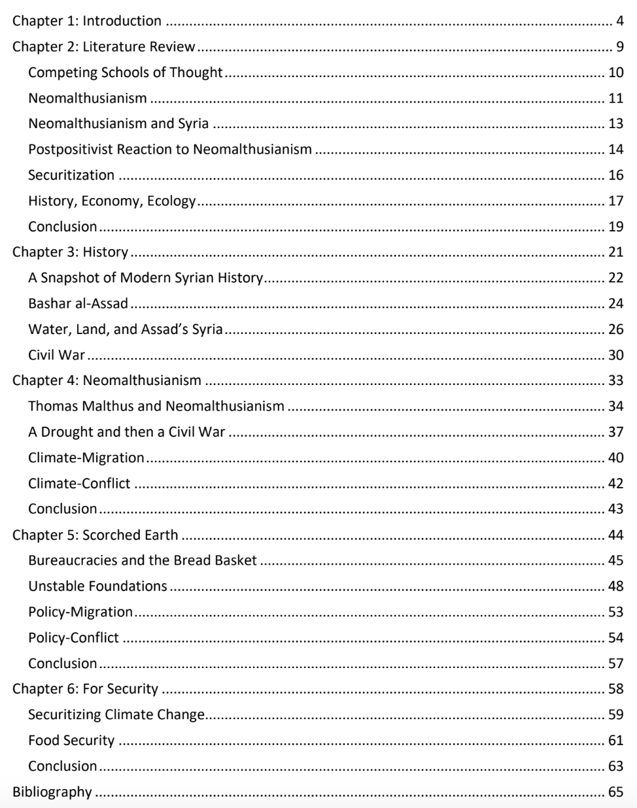

## Dry Wells

**Food Security, Climate Change, and the Syrian Civil War**
I wrote my masters thesis on Syria, climate change, food security, and the early onset of the Syrian Civil War in 2010. I had originally wanted to study technical innovation within terrorist groups. There was a LOT of stories coming out of Syria about DIY-grade tanks, robots, automated gun platforms, etc. This topic interested me because of my design background and some of my experience at the Pentagon.

However, over the course of my masters I became more and more interested in the security aspects of climate change — in its role of complexity-builder, and how it was being used as an excuse or red-herring in some cases to distract from other root causes.

This became the focus of my thesis: exploring the causal narrative that climate change had led to the Syrian civil war. I personally dismissed this assumption. Climate change will become a major cause of conflict and scarcity in the Middle East, but the climate-adjacent roots of Syrian Civil War lie in years of resource mismanagement and corrupt agricultural policies pushed by the Assad regime — not climate change.

My concern is that climate change becomes a mechanism for corrupt or disengenuous policy makers to offset blame; ultimately undermining efforts to create effective remedial or (more likely) adaptive strategies.

As a consequence of this research and writing this, I've become quite focused on food security and climate change as domains for my own "next step" career wise.

Curious to give the thesis a read? [You can find it here.](https://www.dropbox.com/scl/fi/1qik5pvd0enqdshnhbhtq/andrewlovettbarron-thesis-final.pdf?rlkey=0s8mez17ghs7de9lh2hzvkmx0&dl=0)
